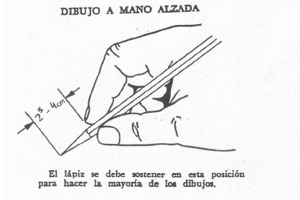
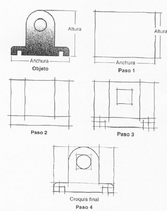
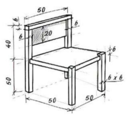

# 1.4 Croquización {#sec-croquizacion .unnumbered}

## Contenido

::: {style="border: 2px solid black; padding: 1em; background-color: #f0f8ff; margin-top: 2em;"}

En este tema se presenta el croquis: el dibujo técnico a mano alzada que permite definir un objeto de forma rápida, sin más instrumentos que papel, lápiz y goma.

<ol>

<li>Qué es un croquis y para qué sirve</li>

<li>La técnica de la mano alzada</li>

<li>Las fases del croquizado y la proporción</li>

<li>Líneas, vistas y acotación del croquis</li>

</ol>

:::

## Apuntes

### Qué es un croquis

Un **croquis** es un tipo de dibujo técnico realizado **a mano alzada** que requiere **proporción, pero no precisión**. Su objetivo es comunicar la geometría y las dimensiones de un objeto de forma sencilla y rápida, aunque sea como esquema preliminar; el objeto debe quedar **completamente definido**, y para ello pueden usarse las vistas normalizadas e incluso una perspectiva.

Quien croquiza debe conocer el objeto y **ponerse en el lugar de quien después tenga que usar el croquis**: un croquis acotado tiene que bastar para fabricar la pieza o levantar el plano definitivo sin volver a ver el original.

Los elementos básicos de un croquis son tres: la **proporción**, el **trazado** y los **datos complementarios** (las cotas y anotaciones que completan la definición).

### La técnica de la mano alzada

Para hacer un croquis solo hacen falta **papel, lápiz y goma**. El trazado debe ser de **trazos rápidos pero claros**: no se persigue la línea perfecta de la lámina delineada, sino un dibujo limpio y legible hecho con soltura.

{#fig-croquis-lapiz width="55%"}

### Las fases del croquizado

Para croquizar una pieza se sigue siempre el mismo proceso:

1.  **Observa y mide el objeto**: antes de dibujar, hay que entender su geometría y tomar sus medidas.
2.  **Dibújalo a mano alzada manteniendo las proporciones**, indicando su forma y características principales.
3.  **Utiliza los tipos de línea normalizados**: línea continua para los contornos, de trazos para las partes ocultas, de puntos y trazos para ejes y simetrías (véase [1.1.3 Tipos de líneas](01-03-03-tipos-linea.qmd)).
4.  **Añade las acotaciones necesarias** siguiendo [las normas de acotación](01-03-05-acotacion.qmd).

La clave de la fase de dibujo es la **proporción**, y el método clásico para conservarla es el del **rectángulo envolvente**: se encaja primero el objeto en un rectángulo a mano alzada que respete la relación anchura/altura real, se subdivide con líneas auxiliares para situar los detalles, y solo al final se remata el contorno definitivo.

{#fig-croquis-fases width="60%"}

### Vistas y acotación del croquis

Cuando el croquis se resuelve por vistas, se aplican los criterios del sistema diédrico que se desarrollan en el Bloque 2:

-   Se toma como **alzado la vista más representativa** de la pieza: la que más información contiene o mejor muestra su geometría de conjunto.
-   Se dibujan las **vistas mínimas** necesarias para que el objeto quede completamente definido.
-   La **correspondencia entre vistas es imprescindible**: alzado, planta y perfil deben quedar alineados para que la pieza pueda interpretarse.

El croquis se remata con la **acotación completa** del objeto. Un buen croquis acotado es un documento de trabajo perfectamente válido: de hecho, es el punto de partida habitual de cualquier plano.

{#fig-croquis-silla width="45%"}

::: callout-tip
## Croquis y campo

En el ejercicio profesional forestal el croquis es la herramienta de la libreta de campo: el esquema de una obra existente, el detalle de una arqueta, el perfil de una pista. Se croquiza in situ y se delinea en gabinete.
:::

## Material complementario

<strong>Recursos digitales</strong>

<a href="https://ibiguridt.wordpress.com/temas/principios-de-representacion/croquizacion/" target="_blank">Croquización — web del profesor Iñaki Biguri</a>

Fundamentos y ejemplos de croquización paso a paso.

<a href="http://piziadas.com/dibujo/dibujo-tecnico/piezas" target="_blank">Galería de piezas para practicar (piziadas.com)</a>

Colección de piezas en 3D para descargar, girar y croquizar como ejercicio.

