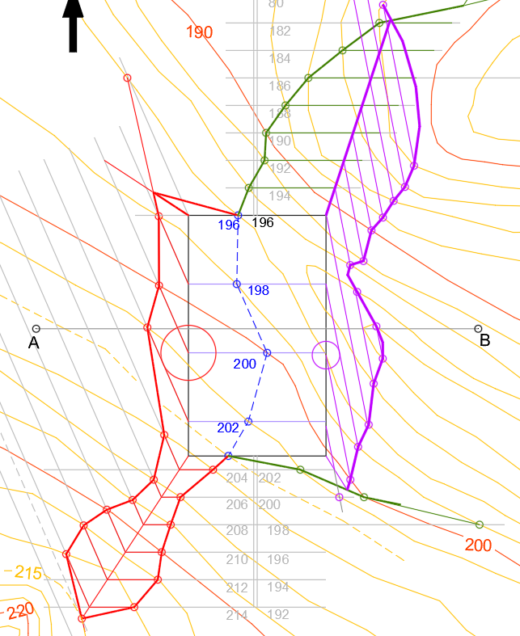

# 4.9 Explanaciones con pendiente {#sec-explanaciones-pendiente .unnumbered}

## Contenido

::: {style="border: 2px solid black; padding: 1em; background-color: #f0f8ff; margin-top: 2em;"}

<ol>

<li>Diferencias con la explanación horizontal</li>

<li>El método de los conos</li>

<li>Ejemplo desarrollado</li>

<li>Recursos interactivos</li>

</ol>

:::

## Apuntes

### Diferencias con la explanación horizontal

Una plataforma **en pendiente** (una pista forestal, un camino, una rampa) se adapta mejor a los terrenos inclinados y reduce los movimientos de tierra. La diferencia esencial con la plataforma horizontal es que sus bordes longitudinales **ya no son líneas de nivel**: son **rectas graduadas**, con puntos a distinta cota.

El procedimiento general es el mismo — línea de paso, planos de talud por los bordes, intersección con el terreno y cierre de taludes — pero el talud que se apoya en un **borde con pendiente** exige una construcción nueva.

### El método de los conos

El talud que se apoya en un borde graduado es la superficie **tangente a los conos de talud**: conos con vértice en cada punto del borde y radio de la base igual al **intervalo del talud** (por unidad de equidistancia). En la práctica:

1.  En un punto del borde se traza la **circunferencia** de radio el intervalo del talud (la base de su cono).
2.  Desde el punto del borde **anterior o posterior** (según sea desmonte o terraplén) se traza la **tangente** a esa circunferencia: es una **línea de nivel del talud**.
3.  Las demás líneas de nivel del talud son **paralelas** a ella por los puntos graduados del borde.

::: {#fig-conos-metodo}

<svg viewBox="0 0 640 380" xmlns="http://www.w3.org/2000/svg" style="width:88%; display:block; margin:0 auto;">
<line x1="92.6" y1="312.3" x2="547.4" y2="107.7" stroke="#1a1a1a" stroke-width="3"/>
<circle cx="180" cy="273" r="3.6" fill="#fff" stroke="#1a1a1a" stroke-width="1.6"/>
<text x="188" y="291" font-size="12.5" fill="#2d2d8a" font-weight="700">(10)</text>
<circle cx="320" cy="210" r="3.6" fill="#fff" stroke="#1a1a1a" stroke-width="1.6"/>
<text x="328" y="228" font-size="12.5" fill="#2d2d8a" font-weight="700">(10.5)</text>
<circle cx="460" cy="147" r="3.6" fill="#fff" stroke="#1a1a1a" stroke-width="1.6"/>
<text x="468" y="165" font-size="12.5" fill="#2d2d8a" font-weight="700">(11)</text>
<text x="96" y="326" font-size="12" fill="#444" font-style="italic">borde de la plataforma (graduado)</text>
<circle cx="320" cy="210" r="62.0" fill="none" stroke="#e8862c" stroke-width="2"/>
<line x1="320" y1="210" x2="363.8" y2="253.8" stroke="#e8862c" stroke-width="1.4" stroke-dasharray="5,3"/>
<text x="366.5" y="274.5" font-size="11.5" fill="#e8862c" font-weight="700">radio = intervalo del talud</text>
<text x="248" y="172.8" font-size="11.5" fill="#e8862c" font-weight="700" text-anchor="end">cono de talud</text>
<text x="248" y="187.8" font-size="11.5" fill="#e8862c" font-weight="700" text-anchor="end">con vértice en (10,5)</text>
<line x1="180" y1="273" x2="450.4" y2="271.1" stroke="#3f9e3f" stroke-width="2.6"/>
<text x="330" y="317" font-size="12" fill="#3f9e3f" font-weight="700">línea de nivel 10 del talud:</text>
<text x="330" y="333" font-size="12" fill="#3f9e3f" font-weight="700">tangente a la base del cono</text>
<line x1="280" y1="210.3" x2="550" y2="208.4" stroke="#3f9e3f" stroke-width="1.6"/>
<text x="556" y="212.3" font-size="11.5" fill="#3f9e3f" font-weight="700">10.5</text>
<line x1="420" y1="147.3" x2="690" y2="145.4" stroke="#3f9e3f" stroke-width="1.6" stroke-dasharray="7,4"/>
<text x="696" y="149.3" font-size="11.5" fill="#3f9e3f" font-weight="700">11</text>
<text x="30" y="360" font-size="11.5" fill="#555">El talud del borde en pendiente es la superficie tangente a los conos: sus líneas</text>
<text x="30" y="375" font-size="11.5" fill="#555">de nivel son las tangentes comunes a las circunferencias de igual cota</text>
</svg>

El método de los conos en planta: circunferencia de radio el intervalo con centro en un punto del borde graduado, y línea de nivel del talud tangente a ella desde el punto contiguo.
:::

::: {#fig-conos-clasico}

La misma construcción en perspectiva: entre las horizontales 10 y 11 del borde, el desmonte abre con su intervalo i~d~ y el terraplén con i~t~, ambos tangentes a los conos.
:::

Como siempre, el intervalo del desmonte y el del terraplén son **distintos**, porque cada talud tiene su propia pendiente.

### Ejemplo desarrollado

::: {#fig-plataforma-pendiente-cad}

Plataforma en pendiente (rasante A→B) resuelta en AutoCAD sobre un terreno real: línea de paso (azul a trazos), taludes de desmonte (rojo) y terraplén (morado) construidos con el método de los conos, y cierre de taludes.
:::

Los pasos, sobre el ejemplo:

1.  **Línea de paso**: la intersección del plano de la plataforma con el terreno.
2.  Plano de **desmonte/terraplén por cada borde**: los bordes horizontales, como en la plataforma horizontal; los bordes con pendiente, con el método de los conos.
3.  **Líneas de nivel** de los planos de talud, paralelas a las tangentes halladas.
4.  **Intersección** de cada plano con el terreno y de los planos entre sí.
5.  **Cierre de los taludes**: la intersección de tres planos es un único punto (aunque el terreno sea una superficie).

### Recursos interactivos

[Explicación teórica de la explanada en pendiente (Storyteller)](../geo-player/index.html?scene=scenes/00-ejemplo-basico-pendiente)

## Material complementario

<strong>Presentaciones de clase (Reveal.js)</strong>

<a href="../presentaciones/acotados-5-explanaciones.html" target="_blank">Modificación del terreno: explanaciones horizontales y en pendiente</a>

<strong>Recursos digitales</strong>

<a href="https://dibujotecni.com/acotado/sistema-de-planos-acotados/" target="_blank">Web de dibujo técnico</a>

Página web sobre dibujo técnico en sentido amplio. Tiene explicaciones cortas y sencillas; la ventaja es que el contenido está bien estructurado.

