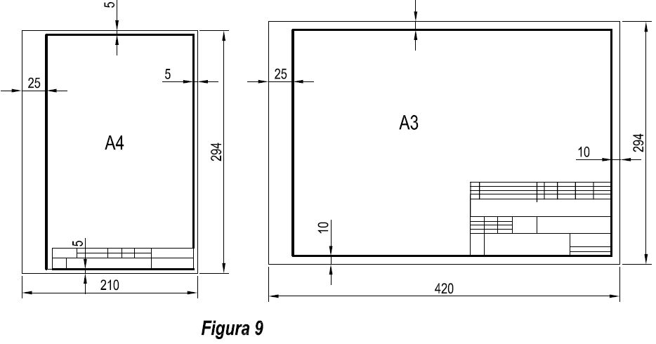
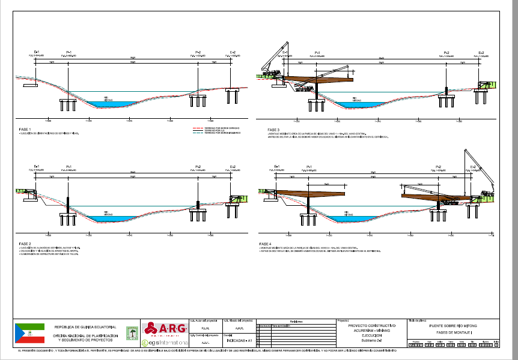
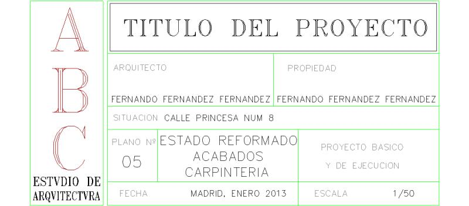
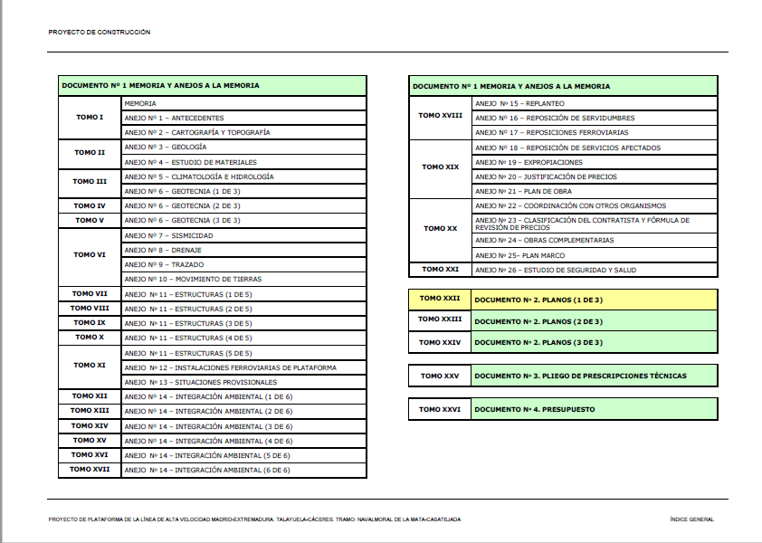
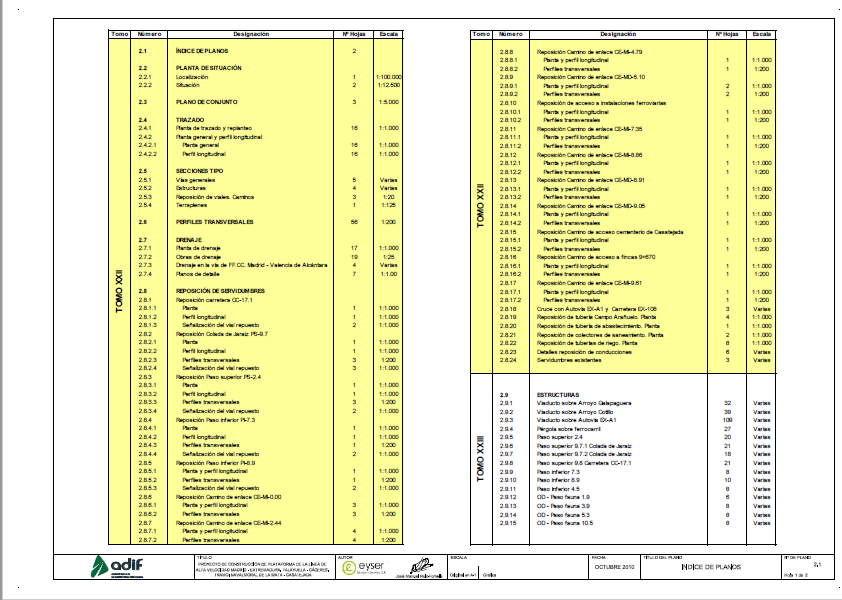

# 3.1 Normativa para la elaboración de planos {#sec-planos-normativa .unnumbered}

En el Bloque 1 estudiamos las normas UNE que regulan los aspectos formales del dibujo técnico ([formatos](../01-03-01-formatos-papel.qmd), [rotulación](../01-03-02-rotulacion.qmd), [líneas](../01-03-03-tipos-linea.qmd), [escalas](../01-03-04-escalas.qmd), [acotación](../01-03-05-acotacion.qmd) y [cajetín](../01-03-06-cajetin.qmd)). En este capítulo damos el paso de la lámina al **plano de proyecto**: cómo se aplica esa normativa cuando el dibujo forma parte de un documento contractual.

Conviene fijar la idea desde el principio:

::: callout-important
## Un plano no es un dibujo

-   Un plano **no** es un dibujo.
-   Un plano **no** es un croquis.
-   Un plano **no** es una vista bonita.
-   Un plano es un **documento normalizado**: para serlo tiene que cumplir todo lo que se expone en este bloque.
:::

## Normas aplicables

La referencia general para la clasificación de los planos es la norma **UNE 1-166-1:1996** (equivalente a **ISO 10209-1**), *Documentación técnica de producto. Vocabulario. Términos relacionados con el dibujo técnico*, que define los tipos de dibujos que iremos viendo en los capítulos siguientes (planos de diseño, de conjunto, de despiece, de detalle...). A ella se suman las normas de presentación ya estudiadas en el Bloque 1: la serie A de formatos (UNE-EN ISO 216), los tipos de línea (UNE-EN ISO 128), la escritura (UNE-EN ISO 3098), las escalas (UNE-EN ISO 5455) y la acotación (UNE-EN ISO 129).

La estandarización de la presentación persigue una sola cosa: que cualquier técnico, en cualquier oficina, pueda **interpretar, archivar y reproducir** el plano sin ambigüedad. Sus elementos son cinco: el formato de papel, sus dimensiones, el trazado de márgenes, el rotulado y el plegado.

## Formato, márgenes y plegado

El formato de trabajo se elige de la **serie A** en función del tamaño y la escala de lo representado; en proyectos de ingeniería lo habitual es trabajar entre A3 y A0 (véase [1.1.1 Formatos de papel](../01-03-01-formatos-papel.qmd)). Sobre el formato se traza siempre el **margen**, que limita la zona útil de dibujo:

-   En el borde **izquierdo se dejan 20-25 mm** para el archivado: es la banda por la que se perfora o encuaderna el plano.
-   En los bordes superior, derecho e inferior se dejan **10 mm en los formatos A0 a A2** y **5 mm en A3 a A5**.

{#fig-margenes-cajetin width="85%"}

Los planos de un proyecto terminan encuadernados junto al resto de documentos, y por eso el formato A4 es la referencia de archivo: **todo plano, sea del tamaño que sea, se pliega hasta quedar reducido a un A4**, con el cajetín visible en la cara delantera. Esta es la razón práctica de la serie A: al conservar la proporción 1:√2, cada formato se pliega de forma sistemática hasta el tamaño de archivo.

## Cajetín y márgenes

Cualquier dibujo técnico debe llevar un **rótulo o cajetín**: uno o más rectángulos adyacentes subdivididos para recoger la información que identifica el plano (véase [1.1.6 Carátula, sello o cajetín](../01-03-06-cajetin.qmd)). En los planos de proyecto el cajetín se sitúa **dentro de la zona útil, en la esquina inferior derecha**, tanto en planos apaisados como verticales, y su dirección de lectura debe coincidir en general con la del dibujo.

El contenido del cajetín varía con el sector, pero en un plano de proyecto encontraremos como mínimo: el organismo o cliente, el título del proyecto, el título del plano, su número y hoja, la escala, la fecha y las firmas de los responsables.

{#fig-cajetin-civil width="90%"}

{#fig-cajetin-arq width="70%"}

## Organización de la información en el plano

Un proyecto de ingeniería se compone de cuatro documentos: **Memoria y anejos** (Documento nº 1), **Planos** (Documento nº 2), **Pliego de condiciones** (Documento nº 3) y **Presupuesto** (Documento nº 4). Los planos no son un anexo decorativo: son el documento que **define gráficamente la obra** y el único con carácter vinculante ante discrepancias dimensionales.

{#fig-documentos-proyecto width="80%"}

En un proyecto real los planos se cuentan por cientos, así que su organización está tan normalizada como su dibujo:

-   El documento de planos se abre siempre con un **índice de planos**.
-   Los planos se agrupan por **series temáticas** con numeración jerárquica (situación, trazado, secciones tipo, estructuras, drenaje, integración ambiental...).
-   Cada plano indica su **número de hojas** y su **escala**; una misma serie puede combinar escalas distintas (la localización a 1:100.000, los detalles a 1:20).

{#fig-indice-planos width="85%"}

Esta estructura se repite, con series propias, en cualquier sector: un proyecto de edificación organiza sus planos en plantas, alzados, secciones, estructuras e instalaciones exactamente con la misma lógica de índice, numeración y escalas.

En los capítulos siguientes recorreremos las series principales: los planos que sitúan la obra en el territorio ([4.2 Planos de situación y localización](04-02-situacion-localizacion.qmd)), los que definen estructuras e infraestructuras ([4.3 Planos de estructuras e infraestructuras](04-03-estructuras-infraestructuras.qmd)), los de conjunto y despiece ([4.4 Planos de conjunto y despiece](04-04-conjunto-despiece.qmd)), los de detalle ([4.5 Planos de detalle](04-05-detalle.qmd)) y la cartografía temática ambiental que acompaña a los proyectos en el medio natural ([4.6 Cartografía ambiental y forestal](04-06-cartografia-ambiental-forestal.qmd)).
