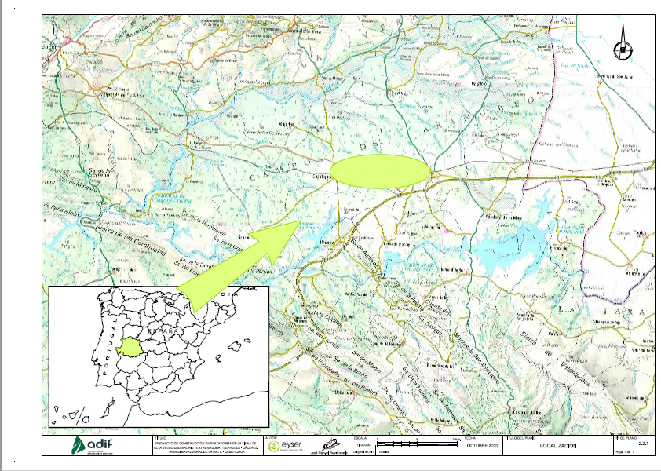
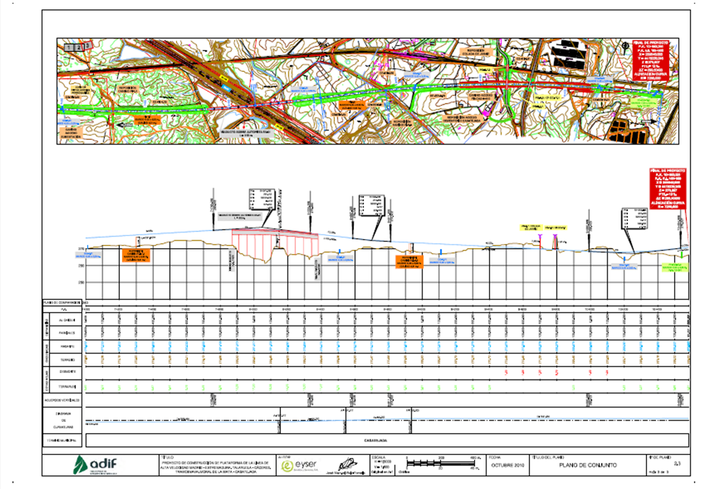
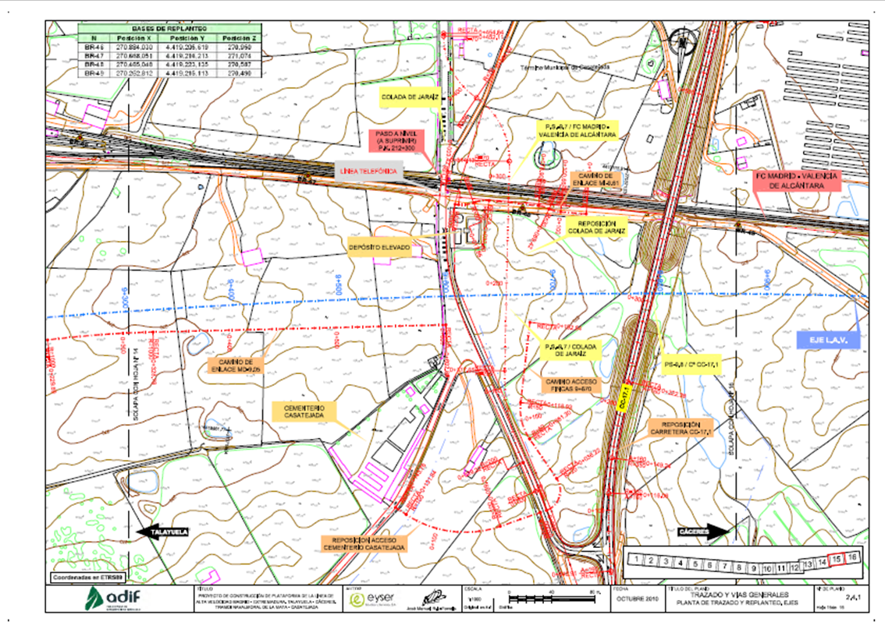
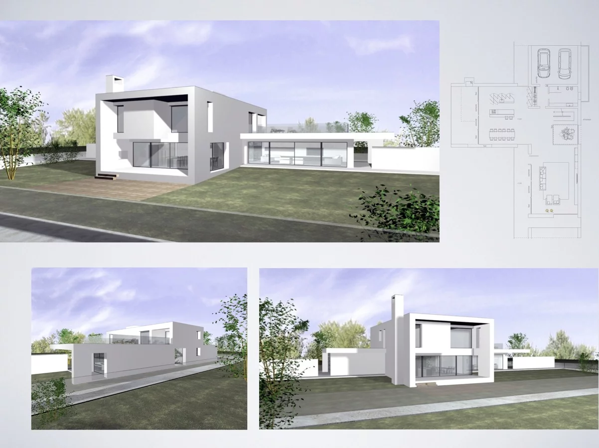
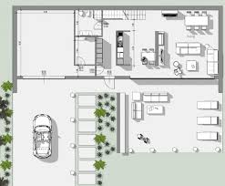
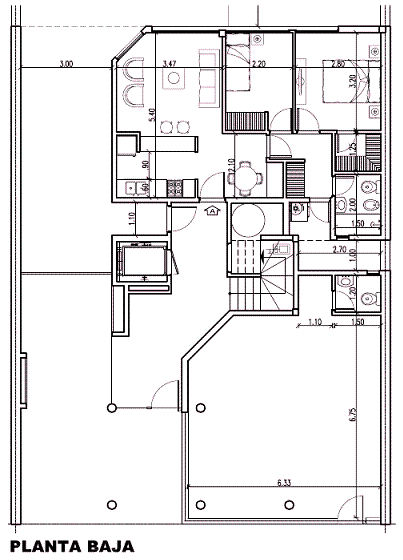
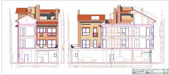
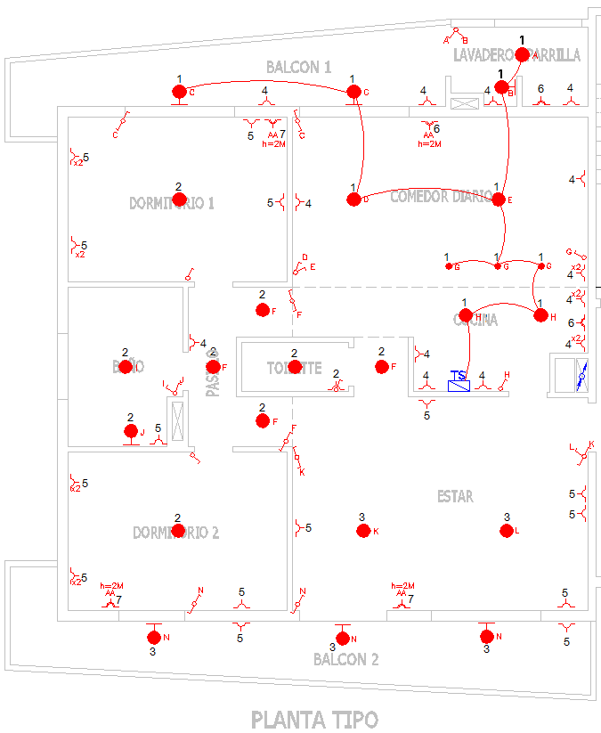

# 4.2 Planos de situación y localización. Plantas generales {#sec-planos-situacion .unnumbered}

Un proyecto de ingeniería se compone de cuatro documentos: la **Memoria**, los **Planos**, el **Pliego de condiciones** y el **Presupuesto**. Los planos constituyen el **Documento nº 2** y son la definición gráfica completa de la obra: lo que no está en los planos, no se construye. Este capítulo presenta los primeros planos de esa colección — los que sitúan la actuación en el territorio y la muestran en su conjunto — y recorre la serie completa en dos casos típicos: el proyecto lineal y el proyecto de edificación.

## La serie de planos de un proyecto lineal

En un proyecto de obra lineal (una carretera, un ferrocarril, un canal, una pista forestal) la colección de planos sigue una secuencia característica, **de lo general a lo particular**:

1.  **Plano de situación** (y de localización).
2.  **Planta general o de conjunto**.
3.  **Trazado en planta y replanteo**.
4.  **Perfil longitudinal**.
5.  **Perfiles transversales**.
6.  **Secciones tipo**.
7.  **Detalles constructivos**.

Cada escalón de la serie aumenta la escala y el nivel de detalle. Sirva de referencia el índice real de un proyecto de ADIF (Línea de Alta Velocidad Madrid–Extremadura), con las escalas empleadas en sus primeros planos:

| Plano                | Escala    |
|----------------------|-----------|
| Localización         | 1:100.000 |
| Situación            | 1:12.500  |
| Conjunto             | 1:5.000   |
| Trazado y replanteo  | 1:1.000   |

: Escalas de los primeros planos de un proyecto ferroviario real (L.A.V. Madrid–Extremadura, ADIF). {#tbl-escalas-lav}

## Planos de situación

El **plano de situación** concreta el **emplazamiento** de la actuación: muestra dónde está exactamente la obra respecto a su entorno inmediato — núcleos de población, carreteras y caminos de acceso, cauces, límites de término municipal. Se dibuja sobre cartografía oficial a escalas del orden de 1:10.000 a 1:25.000 (1:12.500 en el ejemplo de ADIF), suficientes para reconocer el terreno y llegar hasta la obra.

## Planos de localización

El **plano de localización** trabaja a una escala mucho más pequeña (1:100.000 o menor): su función no es llegar a la obra, sino **situarla en el territorio** — en qué provincia o comarca se encuentra, a qué red pertenece el tramo proyectado. Es habitual que incluya un mapa índice del país o de la región con la zona de actuación destacada.

{#fig-plano-localizacion width="90%"}

En la práctica ambos términos se usan a veces indistintamente, pero conviene distinguirlos: la **localización** sitúa la obra en el territorio a pequeña escala; la **situación** concreta su emplazamiento a una escala mayor. Muchos proyectos resuelven los dos contenidos en una sola hoja, con el plano de localización como recuadro índice del de situación.

## Plantas generales

La **planta general** — también llamada **plano de conjunto** — representa la **totalidad de la actuación** sobre la cartografía de la zona, a una escala intermedia (1:5.000 en el ejemplo). Es el plano que permite abarcar la obra completa de una mirada: el trazado íntegro, las estructuras principales, los enlaces y reposiciones, y su encaje en el terreno.

{#fig-plano-conjunto width="90%"}

A partir de la planta general, el **plano de trazado y replanteo** desciende a escala 1:1.000 y añade la definición geométrica precisa: alineaciones rectas y curvas con sus parámetros, puntos kilométricos y la **tabla de bases de replanteo** con sus coordenadas (en España, en el sistema de referencia ETRS89), que permite materializar el eje sobre el terreno.

{#fig-trazado-replanteo width="90%"}

La planta general se **particulariza además por especialidades**: sobre la misma base se elaboran plantas generales de drenaje, de estructuras, de reposición de servicios… Cada especialidad extrae de la planta de conjunto su propia colección de planos; el caso de las estructuras — por ejemplo, el plano de estructuras de un viaducto — se desarrolla en el capítulo siguiente ([4.3 Planos de estructuras e infraestructuras](04-03-estructuras-infraestructuras.qmd)).

## La serie de planos en edificación

En un proyecto de edificación la serie sigue la misma lógica — situar, mostrar el conjunto, definir y detallar — con planos propios del tipo de obra:

1.  **Planos de diseño**: presentan la propuesta, combinando imágenes realistas (renders) con la planta.
2.  **Planta amueblada**: muestra la distribución y el uso previsto de cada espacio.
3.  **Planta acotada**: define dimensionalmente la distribución — superficies, tabiques, huecos.
4.  **Alzados y secciones**: definen el edificio en vertical, por fuera y por dentro.
5.  **Detalles constructivos**: resuelven a gran escala los encuentros y elementos singulares.
6.  **Planos de instalaciones**: electricidad, fontanería, saneamiento, climatización…

{#fig-diseno-render-planta width="90%"}

{#fig-planta-amueblada width="90%"}

{#fig-planta-acotada width="90%"}

{#fig-alzados-secciones width="90%"}

{#fig-instalacion-electrica width="90%"}

Obsérvese el paralelismo entre ambas series: la planta amueblada juega en edificación el papel de la planta general, y la planta acotada el del trazado y replanteo. En ambos casos la colección avanza **de lo general a lo particular**, y cada plano tiene una función y una escala adecuadas a ella.

::: callout-tip
## Criterio general

Ante cualquier colección de planos, la pregunta que ordena la serie es siempre la misma: **¿qué necesita saber quien va a construir esto, y en qué orden?** Primero dónde está la obra, después cómo es en conjunto y, por último, cómo se ejecuta cada una de sus partes.
:::
