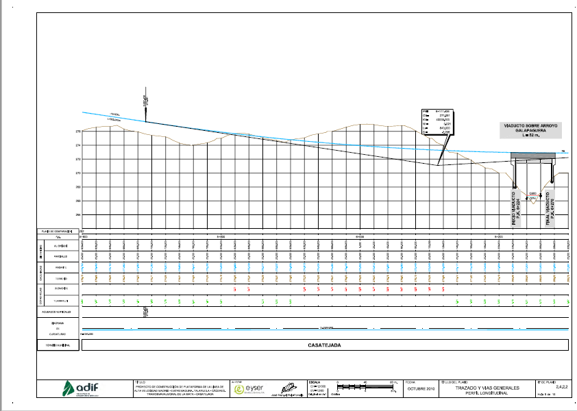
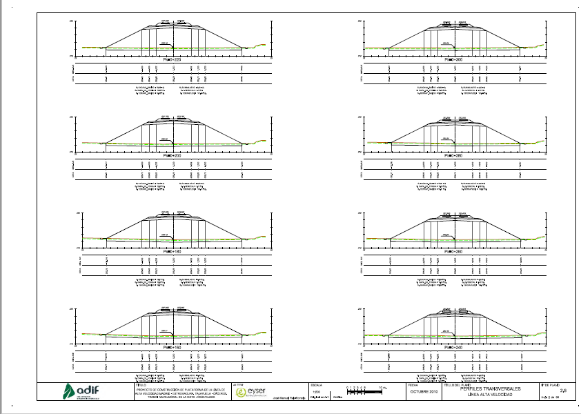
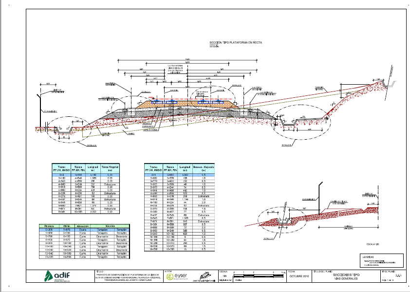
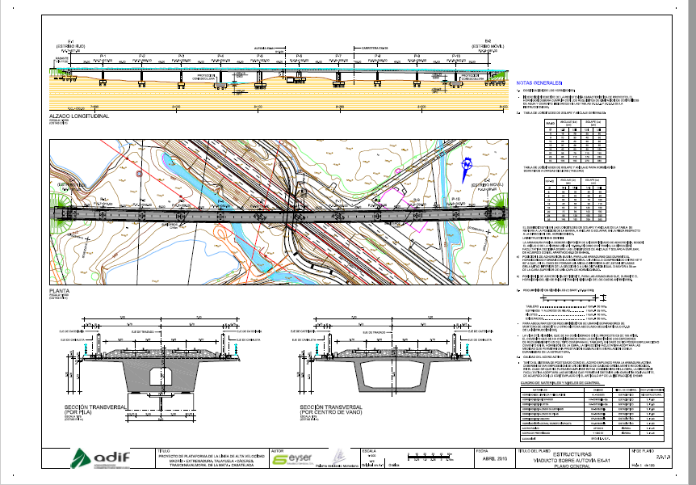
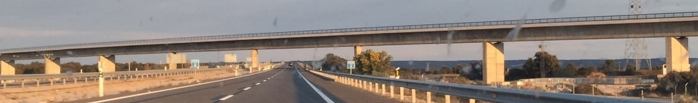

# 4.3 Planos de estructuras e infraestructuras {#sec-planos-estructuras .unnumbered}

Todo proyecto recorre una serie de **fases**: ingeniería **conceptual**, ingeniería **básica**, ingeniería **de detalle**, **ejecución**, **pruebas** y **cierre**. Los planos acompañan al proyecto de principio a fin y son su **eje**: en las fases iniciales fijan las decisiones de diseño; en la ingeniería de detalle definen la obra por completo; durante la ejecución son el documento de trabajo diario a pie de obra. Este capítulo examina los planos que definen una infraestructura lineal y, dentro de ella, sus estructuras.

## Planos de definición de una infraestructura lineal

Tras los planos de situación y las plantas generales vistos en el capítulo anterior ([4.2 Planos de situación y localización](04-02-situacion-localizacion.qmd)), la definición de una obra lineal descansa en cuatro familias de planos: el perfil longitudinal, los perfiles transversales, las secciones tipo y los detalles constructivos.

### El perfil longitudinal

El **perfil longitudinal** representa la sección del terreno y de la obra a lo largo del eje. Su construcción se estudió en [los perfiles longitudinales del Bloque 3](../03-planos-acotados/04-03-03-perfiles-longitudinales.qmd); en el plano de proyecto el perfil incorpora, además del terreno, la **rasante** proyectada, y su **guitarra** recoge las **alineaciones** en planta y en alzado, las ordenadas del terreno y de la rasante y las **cotas rojas**, que indican en cada punto si la obra va en **desmonte** (la rasante bajo el terreno) o en **terraplén** (sobre él).

{#fig-perfil-longitudinal width="90%"}

### Los perfiles transversales

Los **perfiles transversales** cortan el terreno y la obra perpendicularmente al eje, a intervalos regulares. Se dibujan a escala grande — típicamente **1:200** — y se agrupan **varios por hoja**, identificado cada uno por su **punto kilométrico (PK)**. Son los planos con los que se **miden los movimientos de tierras**: en cada perfil se aprecian las superficies de desmonte y terraplén, de cuya integración a lo largo del eje salen los volúmenes del presupuesto.

{#fig-perfiles-transversales width="90%"}

### Las secciones tipo

La **sección tipo** define, a escala **1:20 o 1:25**, la composición constante de la obra en sentido transversal: la **plataforma** con sus capas y anchos, los taludes de desmonte y terraplén, las **cunetas** y los elementos de drenaje longitudinal. Mientras los perfiles transversales cambian en cada PK, la sección tipo es la "receta" que se aplica a todos ellos; suelen definirse varias (en desmonte, en terraplén, en túnel, sobre estructura…).

{#fig-seccion-tipo width="90%"}

### Los detalles constructivos

Cierran la serie los **detalles constructivos**, que resuelven a gran escala los elementos que las demás familias no pueden definir: arquetas, bajantes, encuentros de cunetas, cerramientos, pequeñas obras de fábrica. Son el último escalón del recorrido de lo general a lo particular.

## Los planos de estructuras

Dentro de una infraestructura lineal, **cada estructura genera su propia colección de planos**, que puede ser muy extensa. El índice real del proyecto de ADIF citado en el capítulo anterior dedica su apartado 2.9, ESTRUCTURAS, entre otras, a estas colecciones:

-   Viaducto sobre el Arroyo Galapaguera: **32 hojas**.
-   Viaducto sobre el Arroyo Cotillo: **39 hojas**.
-   Viaducto sobre la Autovía EX-A1: **109 hojas**.
-   Pérgola sobre el ferrocarril: **27 hojas**.
-   Pasos superiores e inferiores.
-   Obras de drenaje y pasos de fauna.

Un solo viaducto puede requerir más de un centenar de planos: definición general, cimentaciones, pilas, estribos, tablero, pretensado, armaduras, equipamientos…

El **plano de estructuras** del viaducto — la hoja de definición general de la colección — combina de forma característica varias vistas y contenidos:

-   El **alzado longitudinal** de la estructura completa, con la numeración de pilas y vanos.
-   La **planta**, dibujada **sobre el topográfico** para mostrar el encaje en el terreno.
-   Las **secciones transversales**, por **pila** y por **centro de vano**.
-   Las **notas generales** y el **cuadro de materiales** (hormigones, aceros, recubrimientos), que fijan las condiciones comunes a toda la colección.

{#fig-plano-estructuras-viaducto width="90%"}

::: callout-note
## Un lenguaje común

Obsérvese que el plano de estructuras no inventa nada nuevo: aplica las vistas del sistema diédrico — alzado, planta, secciones — y los recursos del plano acotado — el topográfico, el perfil — al caso particular de una estructura. Los sistemas de representación estudiados en los bloques anteriores son el vocabulario; los planos del proyecto, las frases construidas con él.
:::

## Del plano a la obra

El destino de toda esta colección es la obra construida. Comparar el plano con la fotografía de la estructura terminada permite reconocer cada elemento definido en el papel — pilas, vanos, tablero, estribos — materializado en el terreno, y entender por qué la definición gráfica debe ser completa e inequívoca: sobre estos documentos se ejecuta, se mide y se certifica la obra.

{#fig-viaducto-construido width="90%"}
