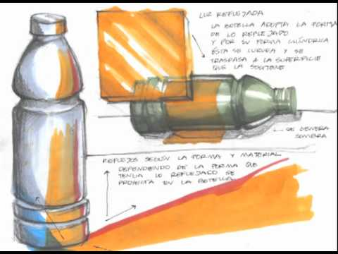
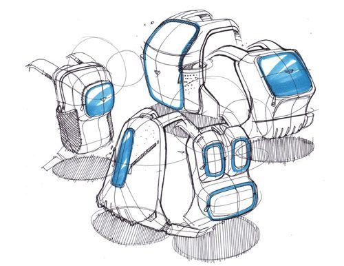
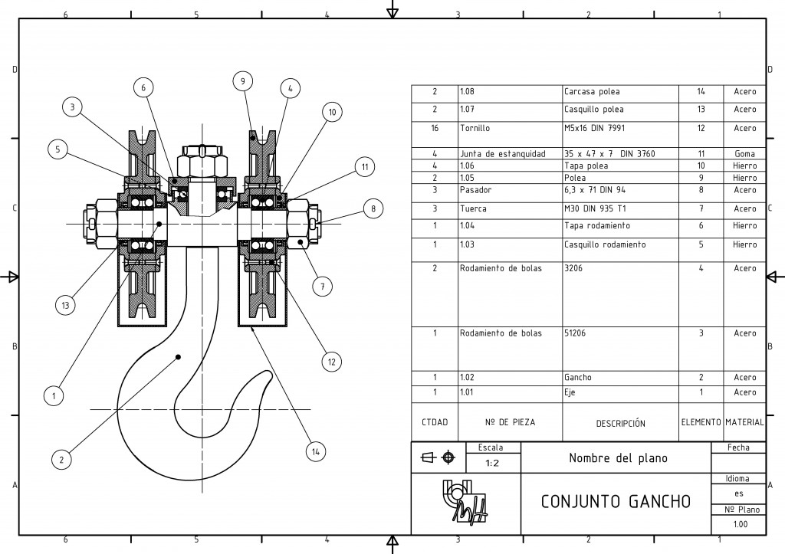
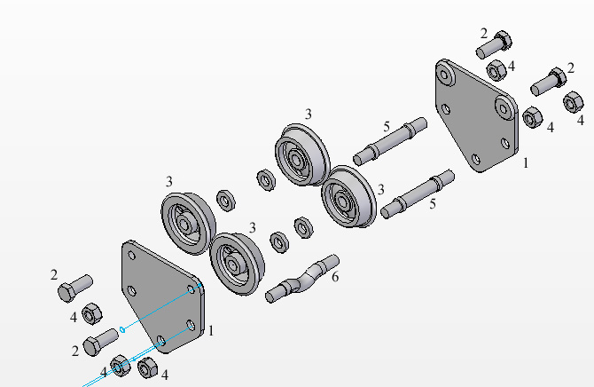
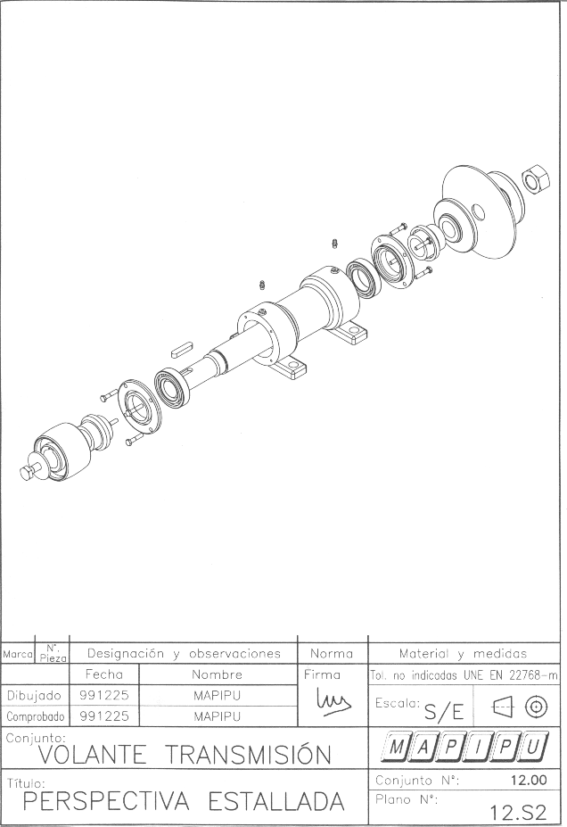
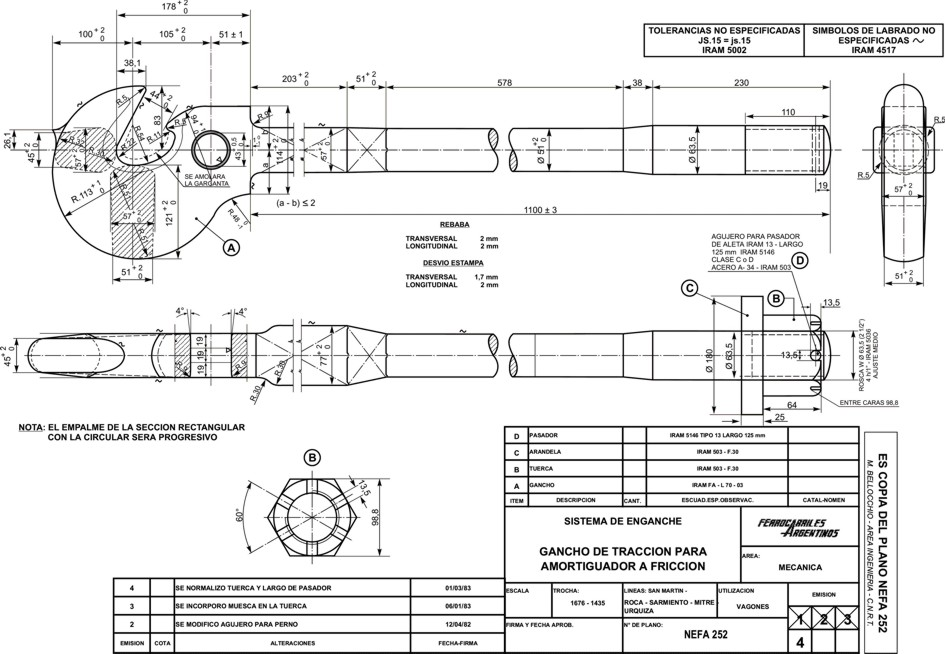
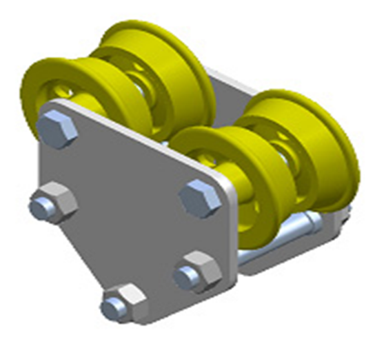

# 3.4 Planos de conjunto y despiece {#sec-planos-conjunto .unnumbered}

## Contenido

::: {style="border: 2px solid black; padding: 1em; background-color: #f0f8ff; margin-top: 2em;"}

En este tema se presentan los tipos de planos que documentan un producto industrial según la norma UNE 1-166-1:1996 y se estudian con detalle los planos de conjunto, la perspectiva estallada y los planos de despiece.

<ol>

<li>Clasificación de los planos: de la idea a la fabricación</li>

<li>Planos de diseño</li>

<li>Planos de conjunto</li>

<li>Perspectiva estallada o explosiva</li>

<li>Planos de taller o fabricación: el despiece</li>

<li>Planos para catálogos y documentación comercial</li>

</ol>

:::

## Apuntes

### Clasificación de los planos: de la idea a la fabricación

La norma **UNE 1-166-1:1996** (equivalente a la ISO 10209-1:1992), sobre Documentación Técnica de Producto, clasifica los planos que documentan un producto industrial en:

a)  **Planos de diseño**
b)  **Planos generales o de conjunto** (que pueden incluir planos de subconjuntos)
c)  **Planos de perspectiva explosiva o estallada**
d)  **Planos de taller o fabricación**
e)  **Planos de detalle**
f)  Planos para otros usos: folletos, catálogos y documentación comercial

La secuencia de a) a e) no es casual: refleja el recorrido del producto desde la idea hasta el taller, y en ese recorrido **aumentan progresivamente el detalle y la definición** de lo representado. El plano de diseño apenas fija la idea; el plano de detalle define una pieza hasta el punto de poder fabricarla sin más información.

### Planos de diseño

El plano de diseño es un **dibujo provisional, preliminar y dinámico**: sirve para que el diseñador ordene sus pensamientos y, ligeramente perfeccionado, se presenta al cliente para discutirlo e incorporar modificaciones. No pretende definir dimensionalmente el objeto, sino comunicar su concepto: por eso admite el croquis a mano alzada, la perspectiva rápida o el modelo CAD esquemático.

{#fig-croquis-botella width="70%"}

{#fig-croquis-mochilas width="85%"}

### Planos de conjunto

El plano de conjunto **representa una visión general del dispositivo a construir**, de forma que pueda verse la situación de las distintas piezas que lo componen y la relación y concordancia entre ellas. La referencia de sus elementos se regula en la norma **ISO 6433:2012**.

Un plano de conjunto debe contener:

-   La **relación de cada pieza respecto al resto**: cómo encajan y se vinculan entre sí.
-   La **descripción del funcionamiento** del dispositivo.
-   Una **lista numerada de todas las piezas**, identificadas en el dibujo mediante **marcas** (números de referencia).

En su ejecución se siguen unos criterios propios, distintos de los del plano de una pieza aislada:

-   Se pueden usar **vistas exteriores o en sección**; la sección es habitual porque muestra a la vez las piezas exteriores e interiores.
-   Se deben **evitar las líneas ocultas**, que en un conjunto de muchas piezas solo aportan confusión.
-   Deben verse todas las piezas con el **mínimo número de vistas**.
-   El conjunto se dibuja en su **posición de trabajo**.
-   **Prima la visión de la situación de las partes frente al detalle** de cada una: la acotación es escasa o inexistente.

Su función principal es **hacer posible el montaje**: quien tiene delante las piezas fabricadas debe poder armar el dispositivo a partir del plano de conjunto.

{#fig-conjunto-gancho width="90%"}

@fig-conjunto-gancho es el ejemplo canónico: una única vista en sección permite ver todas las piezas, cada una lleva su marca y la lista numerada las identifica y cuantifica.

{#fig-conjunto-polipasto width="80%"}

### Perspectiva estallada o explosiva

La perspectiva estallada o explosiva **ayuda a comprender el montaje y funcionamiento de los componentes de un ensamblado**. Las piezas se separan a lo largo del **eje predominante** del conjunto —aunque pueden usarse varios ejes si la geometría lo pide— manteniendo su alineación, de modo que la posición relativa de cada una queda a la vista.

Su virtud es que **indica de forma ordenada y precisa la secuencia de ubicación de las piezas**, permitiendo a cualquier operario desarmar y volver a armar el conjunto. Por eso es el formato preferido de los manuales de montaje y mantenimiento.

{#fig-estallada-polipasto width="85%"}

{#fig-estallada-volante width="90%"}

::: callout-note
## Un mismo objeto, tres documentos

El polipasto de estos apuntes aparece tres veces con tres propósitos distintos: como **plano de conjunto** en sección (@fig-conjunto-polipasto), que dice *dónde va cada pieza*; como **perspectiva estallada** (@fig-estallada-polipasto), que dice *en qué orden se monta*; y como **render 3D** (@fig-render-polipasto), que dice *qué aspecto tiene*. Ningún documento sustituye a los otros: cada uno responde a una pregunta diferente.
:::

### Planos de taller o fabricación: el despiece

Cuando el objetivo ya no es montar sino **fabricar**, el plano debe indicar **toda la información necesaria para la fabricación** de cada pieza: dimensiones, signos superficiales, tratamientos especiales, tolerancias, etc. Además debe contener la **lista de elementos numerados**, coherente con las marcas del plano de conjunto.

Este es el plano de taller, de fabricación o **despiece**: las piezas del conjunto, ya separadas, completamente acotadas y definidas.

{#fig-despiece-gancho width="90%"}

Si el despiece es complejo —muchas piezas, o piezas que exigen operarios y máquinas distintos— se recurre a dibujar **un plano por pieza**: son los **planos de detalle**, que se estudian en el [4.5 Planos de detalle](04-05-detalle.qmd).

### Planos para catálogos y documentación comercial

Fuera de la secuencia técnica quedan los planos para otros usos: folletos, catálogos y documentación comercial. Van **dirigidos al público general**, por lo que se busca en ellos el **atractivo visual más que el rigor**: suelen ser representaciones **en 3D**, renderizadas con materiales, luces y sombras.

{#fig-render-polipasto width="60%"}

## Material complementario

<a href="https://www.une.org/" target="_blank">AENOR / UNE — buscador de normas</a>

Acceso al catálogo de normas UNE, entre ellas la UNE 1-166-1:1996 de Documentación Técnica de Producto.

