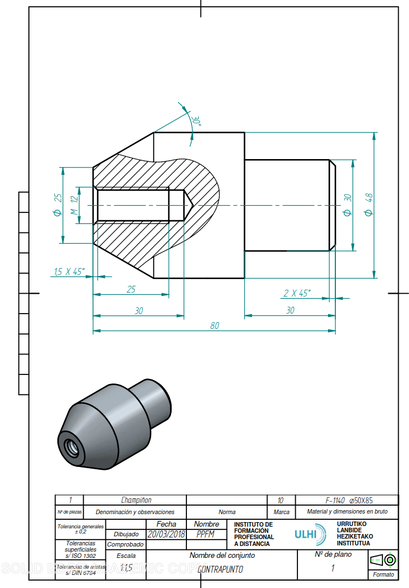
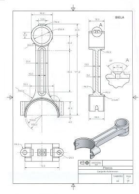
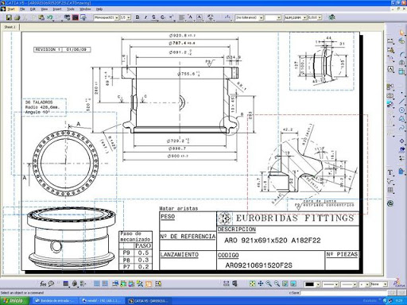
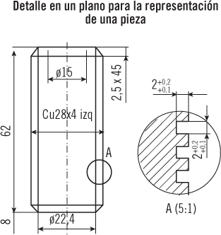
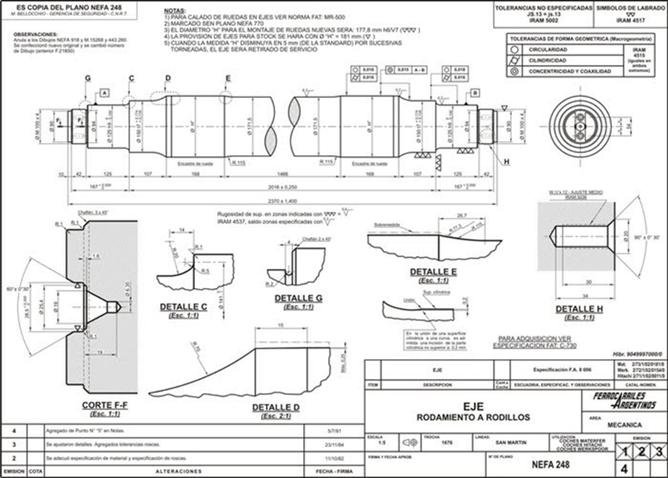
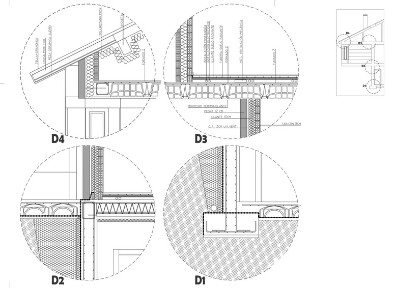

# 3.5 Planos de detalle {#sec-planos-detalle .unnumbered}

## Contenido

::: {style="border: 2px solid black; padding: 1em; background-color: #f0f8ff; margin-top: 2em;"}

En este tema se estudian los planos de detalle —un plano por pieza, con toda la información para fabricarla— y se distinguen de los planos de detalles, que amplían zonas concretas de un objeto.

<ol>

<li>Del despiece al plano de detalle</li>

<li>Características del plano de detalle</li>

<li>Plano de detalle y plano de detalles: dos cosas distintas</li>

<li>Los detalles constructivos en obra civil y edificación</li>

</ol>

:::

## Apuntes

### Del despiece al plano de detalle

En el [4.4 Planos de conjunto y despiece](04-04-conjunto-despiece.qmd) vimos que el plano de despiece reúne, completamente definidas, todas las piezas de un conjunto. Pero **si el despiece es muy complejo y deben intervenir distintos operarios con distintas máquinas**, ese plano único deja de ser práctico: el tornero, el fresador o el soldador no necesitan el conjunto entero, sino su pieza.

En ese caso se recurre a los **planos de detalle**: planos que **proporcionan la información necesaria para la fabricación** y en los que **cada plano contiene una sola pieza**. Se generan **tantos planos de detalle como haga falta** para la correcta definición del conjunto.

{#fig-detalle-tapa width="90%"}

@fig-detalle-tapa es la pareja natural del plano de conjunto del polipasto del capítulo anterior: la tapa que allí era la marca de una lista aquí ocupa un plano completo.

### Características del plano de detalle

Como su destino es el taller, el plano de detalle contiene todo lo que el plano de conjunto omitía deliberadamente: **cotas completas, tolerancias dimensionales, signos superficiales y tratamientos**. Además, al dedicar el plano a una sola pieza, se puede **aumentar la escala** y representar con claridad **elementos que no se verían en un plano de conjunto**: ranuras, chaflanes, roscas, radios de acuerdo.

{#fig-detalle-contrapunto width="90%"}

{#fig-detalle-biela width="90%"}

Hoy estos planos se generan habitualmente desde el modelo CAD tridimensional: el programa extrae las vistas, secciones y detalles a partir del modelo, y el delineante los organiza y acota sobre el formato.

{#fig-detalle-catia width="90%"}

### Plano de detalle y plano de detalles: dos cosas distintas

::: callout-warning
## No confundir

**PLANO DE DETALLE**: un plano por pieza, con toda la información para su fabricación. Es el tipo d)–e) de la clasificación de la UNE 1-166-1:1996.

**PLANO DE DETALLES**: un **DETALLE** es un dibujo que **amplía la información y definición de algún elemento o parte del objeto**. Un plano de detalles debe contener **únicamente detalles** y algún elemento 2D o 3D que permita **localizarlos e identificarlos sin lugar a dudas**. Se puede referenciar desde otros planos.
:::

El mecanismo del detalle es sencillo: en la vista general se rodea la zona de interés con un círculo y una letra (A, B, C...), y en otra parte del plano —o en un plano de detalles aparte— se dibuja esa zona ampliada, identificada con la misma letra y con su escala propia junto a la referencia.

{#fig-detalle-ampliado width="80%"}

{#fig-detalles-eje width="90%"}

### Los detalles constructivos en obra civil y edificación

En obra civil y edificación el equivalente del plano de detalles son los **planos de detalles constructivos**: los encuentros de forjado con fachada, el arranque de la cubierta, la cimentación o las juntas se dibujan a gran escala en planos propios, y se **referencian desde las secciones-llave** del edificio, que indican dónde se encuentra cada detalle.

{#fig-detalles-edificio width="90%"}

::: callout-note
## Criterio práctico

Ante un plano ajeno, la pregunta que distingue ambos documentos es: *¿este plano sirve para fabricar una pieza completa o para entender una zona concreta?* Si contiene una sola pieza íntegramente definida, es un plano de detalle; si contiene ampliaciones referenciadas de zonas de un objeto, es un plano de detalles.
:::

## Material complementario

<a href="https://ingemecanica.com/tutoriales/tutoriales.html" target="_blank">Ingemecánica — tutoriales de dibujo industrial</a>

Colección de tutoriales sobre normalización y planos de fabricación con ejemplos acotados.

