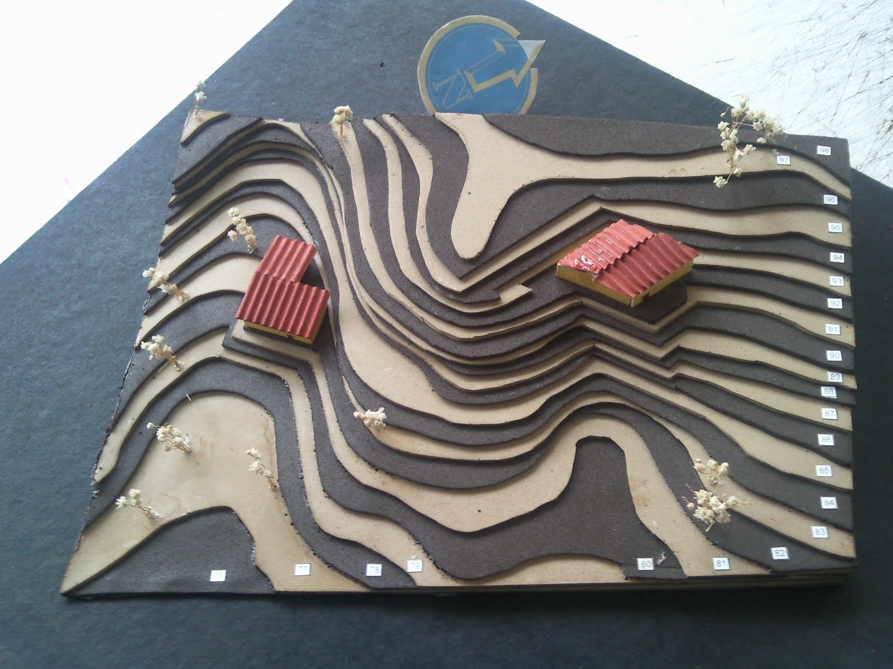
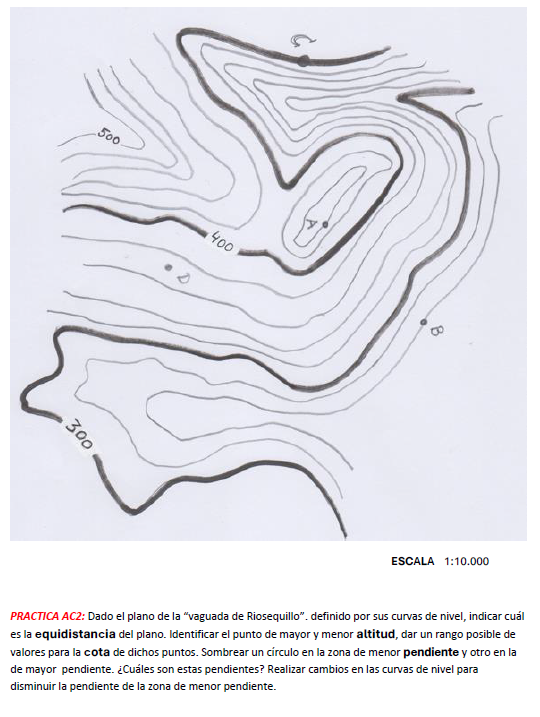

## Representar el mundo en papel

::: {.texto-azul style="font-size:0.7em; margin-bottom:0.3em;"}
Ya conocemos dos estrategias para llevar el "mundo 3D" al papel:
:::

:::: columns
::: {.column width="50%"}
::: {.fragment fragment-index="1"}

1 vista deformada = PERSPECTIVA

<svg viewBox="95 50 210 225" xmlns="http://www.w3.org/2000/svg" style="width:56%; display:block; margin:6px auto;">
<polygon points="175.0,59.8 222.1,87.0 151.4,127.8 104.3,100.6" fill="#c9f2f7" stroke="#075985" stroke-width="2"/>
<polygon points="222.1,134.6 292.8,175.4 222.1,216.2 151.4,175.4" fill="#c9f2f7" stroke="#075985" stroke-width="2"/>
<polygon points="222.1,134.6 151.4,175.4 151.4,127.8 222.1,87.0" fill="#55c4d6" stroke="#075985" stroke-width="2"/>
<polygon points="292.8,223.0 222.1,263.8 222.1,216.2 292.8,175.4" fill="#55c4d6" stroke="#075985" stroke-width="2"/>
<polygon points="104.3,195.8 222.1,263.8 222.1,216.2 151.4,175.4 151.4,127.8 104.3,100.6" fill="#8fe3ef" stroke="#075985" stroke-width="2"/>
</svg>

Se <b>ve</b> bien, se <b>mide</b> mal

:::
:::

::: {.column width="50%"}
::: {.fragment fragment-index="2"}

Muchas vistas en verdadera magnitud = DIÉDRICO

<svg viewBox="30 20 290 230" xmlns="http://www.w3.org/2000/svg" style="width:64%; display:block; margin:6px auto;">
<text x="102" y="34" font-size="13" font-weight="700" fill="#2d2d8a">Alzado</text>
<text x="222" y="34" font-size="13" font-weight="700" fill="#2d2d8a">Perfil</text>
<text x="102" y="248" font-size="13" font-weight="700" fill="#2d2d8a">Planta</text>
<polygon points="70,124 190,124 190,82 118,82 118,40 70,40" fill="none" stroke="#14532d" stroke-width="3"/>
<rect x="70" y="154" width="120" height="72" fill="none" stroke="#14532d" stroke-width="3"/>
<line x1="118" y1="154" x2="118" y2="226" stroke="#14532d" stroke-width="3"/>
<rect x="220" y="40" width="72" height="84" fill="none" stroke="#14532d" stroke-width="3"/>
<line x1="220" y1="82" x2="292" y2="82" stroke="#14532d" stroke-width="2" stroke-dasharray="7,5"/>
</svg>

Se <b>ve</b> mal, se <b>mide</b> bien

:::
:::
::::

::: {.fragment fragment-index="3" .texto-azul style="font-size:0.68em; text-align:center; margin-top:0.5em;"}
¿Y para representar un **terreno**? Una montaña no cabe bien en tres vistas: necesitamos un sistema propio — el **sistema de planos acotados**.
:::

## Un sistema univista

:::: columns
::: {.column width="55%"}
::: {.texto-azul style="font-size:0.66em; margin-top:0.6em;"}
El diédrico es un sistema **multivista**: en cada vista se **quita una dimensión**, y hacen falta varias vistas para reconstruir el objeto.

::: {.fragment fragment-index="1"}
El sistema acotado es **univista**: solo se dibuja la **planta** (proyección sobre un plano horizontal), y la dimensión que falta — la altura — **se sustituye por un número**: la **cota**.
:::

::: {.fragment fragment-index="2"}
La cota es la **distancia vertical** de cada punto al plano horizontal de referencia, llamado **plano de comparación**.
:::
:::
:::

::: {.column width="45%"}
::: {.fragment fragment-index="1"}
<svg viewBox="0 0 300 210" xmlns="http://www.w3.org/2000/svg" style="width:88%; display:block; margin:14px auto;">
<polygon points="30,160 100,105 290,105 220,160" fill="#d2b077" stroke="#1a1a1a" stroke-width="1.6"/>
<text x="44" y="152" font-size="11" fill="#6a5335" font-style="italic">Plano de comparación</text>
<line x1="168" y1="128" x2="168" y2="38" stroke="#909090" stroke-width="1.4" stroke-dasharray="4,3"/>
<circle cx="168" cy="38" r="3.6" fill="#fff" stroke="#1a1a1a" stroke-width="1.6"/>
<text x="176" y="34" font-size="14" font-weight="700">A</text>
<circle cx="168" cy="128" r="3.4" fill="#fff" stroke="#1a1a1a" stroke-width="1.6"/>
<text x="175" y="145" font-size="13" font-weight="700" fill="#2d2d8a">a(4)</text>
<line x1="150" y1="128" x2="150" y2="38" stroke="#d00000" stroke-width="1.6"/>
<line x1="146" y1="128" x2="154" y2="128" stroke="#d00000" stroke-width="1.6"/>
<line x1="146" y1="38" x2="154" y2="38" stroke="#d00000" stroke-width="1.6"/>
<text x="142" y="86" font-size="12.5" font-weight="700" fill="#d00000" text-anchor="end">cota = 4 m</text>
</svg>
:::
::: {.fragment fragment-index="2"}

En el papel solo queda <b>a(4)</b>: la proyección y su cota

:::
:::
::::

## El fundamento: cortar y proyectar

<svg viewBox="-378 -150 708 425" xmlns="http://www.w3.org/2000/svg" style="width:100%; display:block; margin:0 auto;">
<defs><marker id="axoh-flecha-rojo" viewBox="0 0 10 10" refX="8.5" refY="5" markerWidth="7" markerHeight="7" orient="auto-start-reverse"><path d="M 0 0 L 10 5 L 0 10 z" fill="#d00000"/></marker><marker id="axoh-flecha-verde" viewBox="0 0 10 10" refX="8.5" refY="5" markerWidth="7" markerHeight="7" orient="auto-start-reverse"><path d="M 0 0 L 10 5 L 0 10 z" fill="#14532d"/></marker><marker id="axoh-flecha-naranja" viewBox="0 0 10 10" refX="8.5" refY="5" markerWidth="7" markerHeight="7" orient="auto-start-reverse"><path d="M 0 0 L 10 5 L 0 10 z" fill="#e8862c"/></marker><marker id="axoh-flecha-gris" viewBox="0 0 10 10" refX="8.5" refY="5" markerWidth="7" markerHeight="7" orient="auto-start-reverse"><path d="M 0 0 L 10 5 L 0 10 z" fill="#909090"/></marker><marker id="axoh-flecha-negro" viewBox="0 0 10 10" refX="8.5" refY="5" markerWidth="7" markerHeight="7" orient="auto-start-reverse"><path d="M 0 0 L 10 5 L 0 10 z" fill="#1a1a1a"/></marker><marker id="axoh-flecha-teal" viewBox="0 0 10 10" refX="8.5" refY="5" markerWidth="7" markerHeight="7" orient="auto-start-reverse"><path d="M 0 0 L 10 5 L 0 10 z" fill="#0f766e"/></marker></defs>
<path d="M 0,8.7 L -23.6,14.3 L -47.3,16.5 L -73.7,15.9 L -109.9,11.1 L -118.2,11.4 L -125.2,13 L -133.5,16.8 L -143.2,23.5 L -176.6,55.1 L -193.3,68" fill="none" stroke="#4a4a4a" stroke-width="1.6" stroke-linejoin="round"/>
<path d="M 0,8.7 L 44.5,23.1 L 103.8,46.9 L 142.8,60.1 L 165,64.7 L 202.1,66.4 L 218.8,69.8 L 235.5,77.7 L 257.7,93" fill="none" stroke="#4a4a4a" stroke-width="1.6" stroke-linejoin="round"/>
<path d="M -193.3,68 L -174.8,68.8 L -134,65.9 L -122.8,67.1 L -111.7,70.3 L -102.4,74.7 L -91.3,81.7 L -48.7,115.8 L -24.6,131.4 L 7,146.3 L 64.4,167.9" fill="none" stroke="#c0c0c0" stroke-width="1.0" stroke-linejoin="round" stroke-dasharray="5,4"/>
<path d="M 257.7,93 L 234.1,89.7 L 225.7,90.5 L 218.8,92.6 L 206.3,99.8 L 174.3,125.2 L 157.6,134.9 L 132.6,145 L 64.4,167.9" fill="none" stroke="#4a4a4a" stroke-width="1.6" stroke-linejoin="round"/>
<text x="-373" y="-138" font-size="14" fill="#4a4a4a" font-weight="700">El terreno</text>
<g class="fragment" data-fragment-index="1">
<polygon points="0,-51 257.7,38.3 64.4,105.2 -193.3,16" fill="#6f9fd8" stroke="#5b7ba0" stroke-width="1.1" stroke-linejoin="round" stroke-dasharray="7,5" fill-opacity="0.12"/>
<text x="265.7" y="42.3" font-size="12" fill="#5b7ba0" font-weight="700">130</text>
<polygon points="0,-68 257.7,21.3 64.4,88.2 -193.3,-1" fill="#6f9fd8" stroke="#5b7ba0" stroke-width="1.1" stroke-linejoin="round" stroke-dasharray="7,5" fill-opacity="0.12"/>
<text x="265.7" y="25.3" font-size="12" fill="#5b7ba0" font-weight="700">140</text>
<line x1="-207.3" y1="16" x2="-207.3" y2="-1" stroke="#d00000" stroke-width="2"/>
<line x1="-212.3" y1="16" x2="-202.3" y2="16" stroke="#d00000" stroke-width="2"/>
<line x1="-212.3" y1="-1" x2="-202.3" y2="-1" stroke="#d00000" stroke-width="2"/>
<text x="-217.3" y="11.5" font-size="12.5" fill="#d00000" font-weight="700" text-anchor="end">EQUIDISTANCIA = 10 m</text>
<text x="-373" y="-120" font-size="12.5" fill="#3f5a78">1. Corto el terreno con planos</text>
<text x="-373" y="-105" font-size="12.5" fill="#3f5a78">horizontales cada 10 m</text>
</g>
<g class="fragment" data-fragment-index="2">
<path d="M 247.7,85.8 C 248.2,86.8 250.1,90.8 250.5,91.8" fill="none" stroke="#8a5a2a" stroke-width="1.9" stroke-linejoin="round"/>
<path d="M -47.6,16.5 C -43.5,16.4 -30.4,15.6 -22.6,15.6 C -14.9,15.7 -7.8,16 -1.1,16.8 C 5.6,17.5 12,18.6 17.5,20 C 23,21.4 28.2,23.4 31.8,25.1 C 35.4,26.8 37.5,28.4 39.3,30.3 C 41.1,32.2 42.3,34.5 42.8,36.5 C 43.4,38.4 43.4,39.2 42.7,42 C 42,44.9 39.3,50.7 38.8,53.5 C 38.2,56.3 38.6,57.1 39.5,58.9 C 40.4,60.6 42.1,62.6 44.2,63.9 C 46.3,65.3 49.9,66.5 52.2,67.1 C 54.4,67.7 55.8,67.7 57.7,67.7 C 59.6,67.8 56.2,68.4 63.6,67.6 C 71.1,66.8 91.2,64.1 102.4,63.1 C 113.7,62.1 121.1,61.8 131,61.8 C 140.8,61.7 151.6,62 161.5,62.7 C 171.3,63.4 185.5,65.4 190.3,65.9" fill="none" stroke="#8a5a2a" stroke-width="1.9" stroke-linejoin="round"/>
<path d="M 190.6,112.5 C 188.2,112.6 181,113.1 175.9,113.2 C 170.8,113.3 165.2,113.3 159.8,113.2 C 154.4,113 148.8,112.8 143.5,112.5 C 138.2,112.1 135.3,112.1 127.9,111.2 C 120.5,110.3 110.3,109.1 99.1,107 C 87.9,105 69,100.3 60.8,98.7 C 52.5,97.2 52.5,97.9 49.7,97.8 C 46.9,97.7 45.8,98.1 43.9,98.4 C 42,98.7 43.4,98 38.3,99.8 C 33.1,101.6 20,107 12.9,109.3 C 5.9,111.7 2.2,112.6 -3.9,113.9 C -10.1,115.2 -17.1,116.3 -24,117 C -30.9,117.7 -41.9,118 -45.4,118.2" fill="none" stroke="#8a5a2a" stroke-width="1.9" stroke-linejoin="round"/>
<path d="M -189,68.4 C -189.2,68 -189.9,66.3 -190.1,65.9" fill="none" stroke="#8a5a2a" stroke-width="1.9" stroke-linejoin="round"/>
<path d="M -89.2,13.9 C -81.9,13.2 -55.6,10.4 -45,9.5 C -34.5,8.7 -31,8.7 -26.1,8.6 C -21.3,8.6 -19.1,8.7 -15.8,8.9 C -12.6,9.2 -9.6,9.5 -6.8,9.9 C -4.1,10.3 -1.7,10.8 0.6,11.4 C 3,12 5.2,12.6 7.2,13.6 C 9.3,14.5 11.7,15.8 13.2,17.1 C 14.6,18.4 15.6,20 16.1,21.4 C 16.6,22.8 16.7,23.2 16.2,25.5 C 15.6,27.8 13.4,32.7 12.8,35.2 C 12.2,37.7 11.2,36 12.5,40.3 C 13.8,44.6 19.6,56.4 20.7,61 C 21.8,65.7 20.5,65.7 19.2,68 C 17.9,70.3 15.7,72.6 12.8,74.8 C 10,76.9 6.2,79.2 2,81.1 C -2.1,82.9 -6.9,84.6 -11.9,86 C -16.8,87.3 -22.2,88.3 -27.8,89 C -33.3,89.8 -39.2,90.3 -45.2,90.5 C -51.1,90.6 -57.3,90.6 -63.6,90.2 C -69.8,89.9 -79.5,88.6 -82.6,88.3" fill="none" stroke="#8a5a2a" stroke-width="1.9" stroke-linejoin="round"/>
<path d="M -146,66.3 C -147.4,65.2 -151.9,61.8 -154,59.4 C -156.2,57.1 -157.9,54.5 -159,52.1 C -160.1,49.7 -160.7,47.2 -160.6,44.9 C -160.6,42.5 -159.2,39.2 -158.9,38" fill="none" stroke="#8a5a2a" stroke-width="1.9" stroke-linejoin="round"/>
<path d="M 200.3,58.7 C 202.2,59.3 208.6,61.1 211.9,62.5 C 215.2,63.8 218.1,65.2 220.2,66.7 C 222.3,68.1 223.8,69.6 224.6,71.1 C 225.5,72.6 225.6,74.1 225.1,75.5 C 224.6,76.9 223.5,78.3 221.7,79.6 C 219.9,80.8 217.2,82.2 214.1,83.3 C 211,84.4 207.3,85.4 203.2,86.2 C 199.1,87 194.5,87.7 189.6,88.2 C 184.8,88.8 179.7,89.1 174.3,89.3 C 168.9,89.5 162.8,89.5 157.2,89.3 C 151.6,89.2 146.1,88.8 140.5,88.3 C 134.9,87.8 129.1,87.1 123.8,86.3 C 118.5,85.5 113.3,84.4 108.7,83.4 C 104.1,82.3 99.9,81.1 96.3,79.9 C 92.6,78.6 89.3,77.2 86.6,75.8 C 84,74.3 81.7,72.4 80.4,71.2 C 79.1,70 79,69.3 78.8,68.4 C 78.6,67.5 78.1,66.9 79.1,65.6 C 80.1,64.3 81.8,62.1 84.9,60.6 C 88.1,59 92.7,57.3 97.9,56.1 C 103.2,54.9 109.7,53.8 116.2,53.1 C 122.8,52.4 130,52 137.1,51.9 C 144.3,51.8 151.7,52 159.1,52.5 C 166.4,53 174.4,53.8 181.3,54.9 C 188.1,55.9 197.1,58.1 200.3,58.7" fill="none" stroke="#8a5a2a" stroke-width="1.9" stroke-linejoin="round"/>
<path d="M 188.4,45.1 C 189.8,45.5 194.3,46.8 196.7,47.8 C 199.1,48.7 201.2,49.8 202.7,50.9 C 204.3,52 205.4,53.1 206,54.1 C 206.6,55.2 206.6,56.2 206.3,57.2 C 205.9,58.2 205.1,59.2 203.9,60.1 C 202.6,61.1 200.8,62 198.6,62.8 C 196.4,63.6 193.8,64.3 190.9,64.9 C 188,65.5 184.8,66.1 181.2,66.5 C 177.7,66.8 173.5,67.1 169.6,67.3 C 165.7,67.4 162.1,67.5 158,67.4 C 154,67.3 149.5,67 145.3,66.7 C 141.2,66.3 137.1,65.9 133.3,65.3 C 129.4,64.7 125.5,64 122.1,63.2 C 118.8,62.4 115.8,61.6 113.2,60.7 C 110.6,59.8 108.4,58.8 106.5,57.8 C 104.6,56.8 102.9,55.9 101.9,54.6 C 100.9,53.3 100.2,51.5 100.7,50.2 C 101.1,48.8 102.6,47.5 104.8,46.3 C 106.9,45.1 110.2,44 113.7,43.1 C 117.3,42.2 121.4,41.5 126,41 C 130.7,40.5 136.3,40.1 141.6,40 C 146.9,40 152.4,40.1 157.8,40.4 C 163.2,40.8 169.1,41.4 174.2,42.2 C 179.3,42.9 186,44.6 188.4,45.1" fill="none" stroke="#8a5a2a" stroke-width="1.9" stroke-linejoin="round"/>
<path d="M -14.7,1.6 C -13.6,2 -10.1,3.2 -8.5,4.3 C -7,5.4 -6.1,5.5 -5.4,8.4 C -4.8,11.3 -6.1,16.3 -4.6,21.8 C -3.1,27.3 2.1,37.3 3.4,41.4 C 4.6,45.6 3.5,45.1 2.9,46.8 C 2.3,48.6 1,50.5 -0.3,52.1 C -1.6,53.6 -3.1,54.8 -5,56 C -6.9,57.3 -9.2,58.6 -11.7,59.7 C -14.1,60.8 -16.6,61.7 -19.5,62.6 C -22.4,63.4 -25.7,64.2 -29,64.9 C -32.4,65.5 -36.2,66 -39.8,66.4 C -43.5,66.7 -47.1,66.9 -50.9,67 C -54.7,67.1 -58.6,67 -62.4,66.8 C -66.2,66.7 -69.1,66.6 -73.8,66 C -78.6,65.4 -85.3,64.4 -90.8,63.3 C -96.3,62.2 -101.8,60.7 -106.7,59.1 C -111.6,57.6 -116.3,55.8 -120.4,53.8 C -124.5,51.9 -128.2,49.8 -131.4,47.6 C -134.5,45.4 -137.3,43 -139.3,40.7 C -141.3,38.3 -142.7,35.9 -143.5,33.6 C -144.2,31.2 -144.3,28.9 -143.7,26.6 C -143.1,24.4 -141.6,22 -139.9,20.1 C -138.2,18.2 -136.1,16.7 -133.6,15.2 C -131.1,13.7 -128.2,12.4 -124.9,11.1 C -121.6,9.9 -117.9,8.8 -113.8,7.9 C -109.8,6.9 -106.4,6.2 -100.6,5.4 C -94.7,4.6 -88.7,3.9 -78.7,2.9 C -68.6,2 -49,0.3 -40.2,-0.2 C -31.4,-0.7 -30,-0.4 -25.8,-0.1 C -21.5,0.1 -16.5,1.3 -14.7,1.6" fill="none" stroke="#8a5a2a" stroke-width="1.9" stroke-linejoin="round"/>
<path d="M 177.1,31.6 C 178.5,32.2 183.9,34.1 185.6,35.4 C 187.2,36.7 187.1,38.4 187.1,39.3 C 187,40.3 186.1,40.5 185.2,41.1 C 184.2,41.7 183.9,42.2 181.4,42.8 C 178.9,43.4 174.6,44.5 170.3,44.9 C 165.9,45.3 160.3,45.5 155.3,45.3 C 150.4,45.2 144.9,44.7 140.4,44 C 135.9,43.2 131.5,42.2 128.3,41.1 C 125.1,40 122.5,38.3 121.2,37.2 C 120,36.1 120.3,35.3 120.6,34.4 C 120.9,33.5 121.8,32.7 123.2,32 C 124.6,31.2 126.7,30.5 129.1,29.9 C 131.4,29.3 134.1,28.9 137.2,28.6 C 140.3,28.3 144,28.1 147.5,28.1 C 151,28 154.8,28.2 158.3,28.5 C 161.8,28.7 165.5,29.2 168.6,29.7 C 171.8,30.2 175.7,31.3 177.1,31.6" fill="none" stroke="#8a5a2a" stroke-width="1.9" stroke-linejoin="round"/>
<path d="M -35.6,-7.8 C -34.6,-7.5 -31.3,-6.6 -29.6,-5.8 C -27.9,-4.9 -28,-6 -25.3,-2.8 C -22.7,0.4 -16.3,9 -13.7,13.3 C -11.1,17.5 -10,20 -9.6,22.9 C -9.1,25.8 -9.6,28.2 -11.2,30.5 C -12.7,32.9 -16.5,35.7 -18.8,37.2 C -21.1,38.8 -22.7,39.2 -24.9,40 C -27,40.8 -29.4,41.5 -31.8,42.1 C -34.3,42.6 -36.6,43.1 -39.4,43.5 C -42.2,43.9 -45.3,44.3 -48.5,44.5 C -51.7,44.7 -55.2,44.8 -58.4,44.8 C -61.7,44.7 -64,44.7 -68,44.3 C -71.9,44 -77.6,43.4 -82.2,42.6 C -86.8,41.8 -91.1,40.8 -95.3,39.7 C -99.5,38.5 -103.6,37.1 -107.3,35.6 C -110.9,34.2 -114.2,32.6 -117.2,30.9 C -120.1,29.2 -122.7,27.2 -124.8,25.3 C -126.8,23.4 -128.5,21.5 -129.5,19.5 C -130.5,17.6 -131,15.6 -131,13.7 C -131,11.9 -130.3,9.9 -129.3,8.3 C -128.4,6.6 -127,5.2 -125.2,3.7 C -123.3,2.3 -121,1 -118.3,-0.2 C -115.7,-1.4 -112.7,-2.5 -109.3,-3.5 C -106,-4.4 -102.7,-5.2 -98.1,-5.9 C -93.6,-6.7 -88.3,-7.4 -82.3,-7.9 C -76.2,-8.4 -68.1,-8.9 -62,-9.1 C -56,-9.2 -50.4,-9.2 -46,-9 C -41.6,-8.8 -37.3,-8 -35.6,-7.8" fill="none" stroke="#8a5a2a" stroke-width="1.9" stroke-linejoin="round"/>
<path d="M -45.4,-17.3 C -43.6,-16.5 -38.2,-14.6 -34.9,-12.4 C -31.6,-10.2 -28,-6.8 -25.7,-4 C -23.5,-1.3 -21.9,1.6 -21.3,4.1 C -20.7,6.6 -21.1,8.8 -22.2,10.8 C -23.3,12.9 -25.2,14.7 -27.9,16.4 C -30.6,18 -34.4,19.5 -38.4,20.6 C -42.4,21.6 -46.9,22.3 -51.7,22.6 C -56.5,23 -62.8,22.9 -67.3,22.7 C -71.8,22.4 -74.9,21.9 -78.6,21.4 C -82.3,20.8 -85.8,20 -89.3,19.1 C -92.7,18.2 -96.2,17 -99.3,15.9 C -102.3,14.7 -105.1,13.4 -107.5,12 C -109.9,10.6 -112.2,9.1 -113.9,7.5 C -115.6,6 -116.9,4.5 -117.7,2.9 C -118.6,1.4 -119.1,-0.3 -119.2,-1.8 C -119.2,-3.3 -118.9,-4.8 -118.1,-6.3 C -117.3,-7.7 -116,-9 -114.4,-10.3 C -112.8,-11.5 -110.8,-12.7 -108.4,-13.8 C -106,-14.8 -103.2,-15.8 -100.2,-16.6 C -97.3,-17.4 -94.4,-18 -90.7,-18.5 C -87.1,-19 -82.5,-19.5 -78.3,-19.8 C -74.1,-20 -69.6,-20.1 -65.6,-20 C -61.6,-19.9 -57.4,-19.6 -54.1,-19.1 C -50.7,-18.7 -46.8,-17.6 -45.4,-17.3" fill="none" stroke="#8a5a2a" stroke-width="1.9" stroke-linejoin="round"/>
<path d="M -54,-29.1 C -52.4,-28.5 -47.6,-27 -44.8,-25.6 C -42.1,-24.1 -39.3,-22.2 -37.4,-20.3 C -35.5,-18.5 -34,-16.4 -33.3,-14.5 C -32.6,-12.6 -32.8,-10.5 -33.4,-8.9 C -34,-7.2 -35.3,-5.9 -37.2,-4.6 C -39,-3.3 -41.7,-2.1 -44.6,-1.2 C -47.4,-0.4 -50.8,0.3 -54.4,0.6 C -58,1 -63,1 -66.4,0.9 C -69.8,0.8 -72,0.5 -74.8,0.1 C -77.6,-0.3 -80.4,-0.9 -83.1,-1.5 C -85.7,-2.2 -88.2,-2.9 -90.6,-3.8 C -92.9,-4.6 -95.3,-5.6 -97.2,-6.7 C -99.2,-7.7 -101,-9 -102.4,-10.1 C -103.8,-11.2 -104.9,-12.3 -105.7,-13.4 C -106.5,-14.6 -107,-15.8 -107.2,-17 C -107.3,-18.2 -107.2,-19.4 -106.7,-20.5 C -106.3,-21.6 -105.4,-22.8 -104.3,-23.8 C -103.2,-24.8 -101.9,-25.6 -100.2,-26.4 C -98.5,-27.3 -96.2,-28.1 -94,-28.8 C -91.8,-29.4 -89.6,-29.9 -87,-30.3 C -84.4,-30.7 -81.3,-31.1 -78.4,-31.2 C -75.6,-31.4 -72.9,-31.4 -70.1,-31.3 C -67.2,-31.2 -64.1,-31 -61.4,-30.6 C -58.7,-30.2 -55.2,-29.4 -54,-29.1" fill="none" stroke="#8a5a2a" stroke-width="1.9" stroke-linejoin="round"/>
<path d="M -62,-40.7 C -60.9,-40.4 -57.3,-39.4 -55.4,-38.6 C -53.4,-37.7 -51.5,-36.6 -50.2,-35.5 C -48.9,-34.4 -47.8,-33.2 -47.3,-32 C -46.8,-30.9 -46.7,-29.8 -47,-28.7 C -47.3,-27.7 -48,-26.6 -49.1,-25.8 C -50.2,-24.9 -51.8,-24.1 -53.5,-23.5 C -55.2,-23 -57.3,-22.5 -59.5,-22.3 C -61.7,-22 -63.8,-21.8 -66.7,-22 C -69.7,-22.1 -73.8,-22.6 -77,-23.2 C -80.2,-23.9 -83.4,-25 -85.8,-26.1 C -88.2,-27.3 -90.3,-28.7 -91.5,-30.1 C -92.7,-31.5 -93.3,-33.2 -93,-34.6 C -92.7,-36 -91.3,-37.5 -89.5,-38.6 C -87.7,-39.7 -85.1,-40.6 -82.2,-41.2 C -79.3,-41.7 -75.5,-42 -72.2,-42 C -68.8,-41.9 -63.7,-40.9 -62,-40.7" fill="none" stroke="#8a5a2a" stroke-width="1.9" stroke-linejoin="round"/>
<text x="-373" y="-82" font-size="12.5" fill="#8a5a2a">2. Cada corte es una curva de nivel:</text>
<text x="-373" y="-67" font-size="12.5" fill="#8a5a2a">todos sus puntos tienen la misma cota</text>
</g>
<g class="fragment" data-fragment-index="3">
<polygon points="0,81.6 257.7,170.9 64.4,237.8 -193.3,148.6" fill="#d2b077" stroke="#1a1a1a" stroke-width="1.6" stroke-linejoin="round" fill-opacity="0.85"/>
<line x1="187.1" y1="39.3" x2="187.1" y2="171.9" stroke="#909090" stroke-width="1.1" stroke-dasharray="4,3"/>
<line x1="121.2" y1="37.2" x2="121.2" y2="169.8" stroke="#909090" stroke-width="1.1" stroke-dasharray="4,3"/>
<line x1="7.2" y1="13.6" x2="7.2" y2="112.2" stroke="#909090" stroke-width="1.1" stroke-dasharray="4,3"/>
<path d="M 247.7,167.4 C 248.2,168.4 250.1,172.4 250.5,173.4" fill="none" stroke="#8a5a2a" stroke-width="1.2" stroke-linejoin="round"/>
<path d="M -47.6,98.1 C -43.5,98 -30.4,97.2 -22.6,97.2 C -14.9,97.3 -7.8,97.6 -1.1,98.4 C 5.6,99.1 12,100.2 17.5,101.6 C 23,103 28.2,105 31.8,106.7 C 35.4,108.4 37.5,110 39.3,111.9 C 41.1,113.8 42.3,116.1 42.8,118.1 C 43.4,120 43.4,120.8 42.7,123.6 C 42,126.5 39.3,132.3 38.8,135.1 C 38.2,137.9 38.6,138.7 39.5,140.5 C 40.4,142.2 42.1,144.2 44.2,145.5 C 46.3,146.9 49.9,148.1 52.2,148.7 C 54.4,149.3 55.8,149.3 57.7,149.3 C 59.6,149.4 56.2,150 63.6,149.2 C 71.1,148.4 91.2,145.7 102.4,144.7 C 113.7,143.7 121.1,143.4 131,143.4 C 140.8,143.3 151.6,143.6 161.5,144.3 C 171.3,145 185.5,147 190.3,147.5" fill="none" stroke="#8a5a2a" stroke-width="1.2" stroke-linejoin="round"/>
<path d="M 190.6,194.1 C 188.2,194.2 181,194.7 175.9,194.8 C 170.8,194.9 165.2,194.9 159.8,194.8 C 154.4,194.6 148.8,194.4 143.5,194.1 C 138.2,193.7 135.3,193.7 127.9,192.8 C 120.5,191.9 110.3,190.7 99.1,188.6 C 87.9,186.6 69,181.9 60.8,180.3 C 52.5,178.8 52.5,179.5 49.7,179.4 C 46.9,179.3 45.8,179.7 43.9,180 C 42,180.3 43.4,179.6 38.3,181.4 C 33.1,183.2 20,188.6 12.9,190.9 C 5.9,193.3 2.2,194.2 -3.9,195.5 C -10.1,196.8 -17.1,197.9 -24,198.6 C -30.9,199.3 -41.9,199.6 -45.4,199.8" fill="none" stroke="#8a5a2a" stroke-width="1.2" stroke-linejoin="round"/>
<path d="M -189,150 C -189.2,149.6 -189.9,147.9 -190.1,147.5" fill="none" stroke="#8a5a2a" stroke-width="1.2" stroke-linejoin="round"/>
<path d="M -89.2,112.5 C -81.9,111.8 -55.6,109 -45,108.1 C -34.5,107.3 -31,107.3 -26.1,107.2 C -21.3,107.2 -19.1,107.3 -15.8,107.5 C -12.6,107.8 -9.6,108.1 -6.8,108.5 C -4.1,108.9 -1.7,109.4 0.6,110 C 3,110.6 5.2,111.2 7.2,112.2 C 9.3,113.1 11.7,114.4 13.2,115.7 C 14.6,117 15.6,118.6 16.1,120 C 16.6,121.4 16.7,121.8 16.2,124.1 C 15.6,126.4 13.4,131.3 12.8,133.8 C 12.2,136.3 11.2,134.6 12.5,138.9 C 13.8,143.2 19.6,155 20.7,159.6 C 21.8,164.3 20.5,164.3 19.2,166.6 C 17.9,168.9 15.7,171.2 12.8,173.4 C 10,175.5 6.2,177.8 2,179.7 C -2.1,181.5 -6.9,183.2 -11.9,184.6 C -16.8,185.9 -22.2,186.9 -27.8,187.6 C -33.3,188.4 -39.2,188.9 -45.2,189.1 C -51.1,189.2 -57.3,189.2 -63.6,188.8 C -69.8,188.5 -79.5,187.2 -82.6,186.9" fill="none" stroke="#8a5a2a" stroke-width="1.2" stroke-linejoin="round"/>
<path d="M -146,164.9 C -147.4,163.8 -151.9,160.4 -154,158 C -156.2,155.7 -157.9,153.1 -159,150.7 C -160.1,148.3 -160.7,145.8 -160.6,143.5 C -160.6,141.1 -159.2,137.8 -158.9,136.6" fill="none" stroke="#8a5a2a" stroke-width="1.2" stroke-linejoin="round"/>
<path d="M 200.3,157.3 C 202.2,157.9 208.6,159.7 211.9,161.1 C 215.2,162.4 218.1,163.8 220.2,165.3 C 222.3,166.7 223.8,168.2 224.6,169.7 C 225.5,171.2 225.6,172.7 225.1,174.1 C 224.6,175.5 223.5,176.9 221.7,178.2 C 219.9,179.4 217.2,180.8 214.1,181.9 C 211,183 207.3,184 203.2,184.8 C 199.1,185.6 194.5,186.3 189.6,186.8 C 184.8,187.4 179.7,187.7 174.3,187.9 C 168.9,188.1 162.8,188.1 157.2,187.9 C 151.6,187.8 146.1,187.4 140.5,186.9 C 134.9,186.4 129.1,185.7 123.8,184.9 C 118.5,184.1 113.3,183 108.7,182 C 104.1,180.9 99.9,179.7 96.3,178.5 C 92.6,177.2 89.3,175.8 86.6,174.4 C 84,172.9 81.7,171 80.4,169.8 C 79.1,168.6 79,167.9 78.8,167 C 78.6,166.1 78.1,165.5 79.1,164.2 C 80.1,162.9 81.8,160.7 84.9,159.2 C 88.1,157.6 92.7,155.9 97.9,154.7 C 103.2,153.5 109.7,152.4 116.2,151.7 C 122.8,151 130,150.6 137.1,150.5 C 144.3,150.4 151.7,150.6 159.1,151.1 C 166.4,151.6 174.4,152.4 181.3,153.5 C 188.1,154.5 197.1,156.7 200.3,157.3" fill="none" stroke="#8a5a2a" stroke-width="1.2" stroke-linejoin="round"/>
<path d="M 188.4,160.7 C 189.8,161.1 194.3,162.4 196.7,163.4 C 199.1,164.3 201.2,165.4 202.7,166.5 C 204.3,167.6 205.4,168.7 206,169.7 C 206.6,170.8 206.6,171.8 206.3,172.8 C 205.9,173.8 205.1,174.8 203.9,175.7 C 202.6,176.7 200.8,177.6 198.6,178.4 C 196.4,179.2 193.8,179.9 190.9,180.5 C 188,181.1 184.8,181.7 181.2,182.1 C 177.7,182.4 173.5,182.7 169.6,182.9 C 165.7,183 162.1,183.1 158,183 C 154,182.9 149.5,182.6 145.3,182.3 C 141.2,181.9 137.1,181.5 133.3,180.9 C 129.4,180.3 125.5,179.6 122.1,178.8 C 118.8,178 115.8,177.2 113.2,176.3 C 110.6,175.4 108.4,174.4 106.5,173.4 C 104.6,172.4 102.9,171.5 101.9,170.2 C 100.9,168.9 100.2,167.1 100.7,165.8 C 101.1,164.4 102.6,163.1 104.8,161.9 C 106.9,160.7 110.2,159.6 113.7,158.7 C 117.3,157.8 121.4,157.1 126,156.6 C 130.7,156.1 136.3,155.7 141.6,155.6 C 146.9,155.6 152.4,155.7 157.8,156 C 163.2,156.4 169.1,157 174.2,157.8 C 179.3,158.5 186,160.2 188.4,160.7" fill="none" stroke="#8a5a2a" stroke-width="1.2" stroke-linejoin="round"/>
<path d="M -14.7,117.2 C -13.6,117.6 -10.1,118.8 -8.5,119.9 C -7,121 -6.1,121.1 -5.4,124 C -4.8,126.9 -6.1,131.9 -4.6,137.4 C -3.1,142.9 2.1,152.9 3.4,157 C 4.6,161.2 3.5,160.7 2.9,162.4 C 2.3,164.2 1,166.1 -0.3,167.7 C -1.6,169.2 -3.1,170.4 -5,171.6 C -6.9,172.9 -9.2,174.2 -11.7,175.3 C -14.1,176.4 -16.6,177.3 -19.5,178.2 C -22.4,179 -25.7,179.8 -29,180.5 C -32.4,181.1 -36.2,181.6 -39.8,182 C -43.5,182.3 -47.1,182.5 -50.9,182.6 C -54.7,182.7 -58.6,182.6 -62.4,182.4 C -66.2,182.3 -69.1,182.2 -73.8,181.6 C -78.6,181 -85.3,180 -90.8,178.9 C -96.3,177.8 -101.8,176.3 -106.7,174.7 C -111.6,173.2 -116.3,171.4 -120.4,169.4 C -124.5,167.5 -128.2,165.4 -131.4,163.2 C -134.5,161 -137.3,158.6 -139.3,156.3 C -141.3,153.9 -142.7,151.5 -143.5,149.2 C -144.2,146.8 -144.3,144.5 -143.7,142.2 C -143.1,140 -141.6,137.6 -139.9,135.7 C -138.2,133.8 -136.1,132.3 -133.6,130.8 C -131.1,129.3 -128.2,128 -124.9,126.7 C -121.6,125.5 -117.9,124.4 -113.8,123.5 C -109.8,122.5 -106.4,121.8 -100.6,121 C -94.7,120.2 -88.7,119.5 -78.7,118.5 C -68.6,117.6 -49,115.9 -40.2,115.4 C -31.4,114.9 -30,115.2 -25.8,115.5 C -21.5,115.7 -16.5,116.9 -14.7,117.2" fill="none" stroke="#8a5a2a" stroke-width="1.2" stroke-linejoin="round"/>
<path d="M 177.1,164.2 C 178.5,164.8 183.9,166.7 185.6,168 C 187.2,169.3 187.1,171 187.1,171.9 C 187,172.9 186.1,173.1 185.2,173.7 C 184.2,174.3 183.9,174.8 181.4,175.4 C 178.9,176 174.6,177.1 170.3,177.5 C 165.9,177.9 160.3,178.1 155.3,177.9 C 150.4,177.8 144.9,177.3 140.4,176.6 C 135.9,175.8 131.5,174.8 128.3,173.7 C 125.1,172.6 122.5,170.9 121.2,169.8 C 120,168.7 120.3,167.9 120.6,167 C 120.9,166.1 121.8,165.3 123.2,164.6 C 124.6,163.8 126.7,163.1 129.1,162.5 C 131.4,161.9 134.1,161.5 137.2,161.2 C 140.3,160.9 144,160.7 147.5,160.7 C 151,160.6 154.8,160.8 158.3,161.1 C 161.8,161.3 165.5,161.8 168.6,162.3 C 171.8,162.8 175.7,163.9 177.1,164.2" fill="none" stroke="#8a5a2a" stroke-width="1.2" stroke-linejoin="round"/>
<path d="M -35.6,124.8 C -34.6,125.1 -31.3,126 -29.6,126.8 C -27.9,127.7 -28,126.6 -25.3,129.8 C -22.7,133 -16.3,141.6 -13.7,145.9 C -11.1,150.1 -10,152.6 -9.6,155.5 C -9.1,158.4 -9.6,160.8 -11.2,163.1 C -12.7,165.5 -16.5,168.3 -18.8,169.8 C -21.1,171.4 -22.7,171.8 -24.9,172.6 C -27,173.4 -29.4,174.1 -31.8,174.7 C -34.3,175.2 -36.6,175.7 -39.4,176.1 C -42.2,176.5 -45.3,176.9 -48.5,177.1 C -51.7,177.3 -55.2,177.4 -58.4,177.4 C -61.7,177.3 -64,177.3 -68,176.9 C -71.9,176.6 -77.6,176 -82.2,175.2 C -86.8,174.4 -91.1,173.4 -95.3,172.3 C -99.5,171.1 -103.6,169.7 -107.3,168.2 C -110.9,166.8 -114.2,165.2 -117.2,163.5 C -120.1,161.8 -122.7,159.8 -124.8,157.9 C -126.8,156 -128.5,154.1 -129.5,152.1 C -130.5,150.2 -131,148.2 -131,146.3 C -131,144.5 -130.3,142.5 -129.3,140.9 C -128.4,139.2 -127,137.8 -125.2,136.3 C -123.3,134.9 -121,133.6 -118.3,132.4 C -115.7,131.2 -112.7,130.1 -109.3,129.1 C -106,128.2 -102.7,127.4 -98.1,126.7 C -93.6,125.9 -88.3,125.2 -82.3,124.7 C -76.2,124.2 -68.1,123.7 -62,123.5 C -56,123.4 -50.4,123.4 -46,123.6 C -41.6,123.8 -37.3,124.6 -35.6,124.8" fill="none" stroke="#8a5a2a" stroke-width="1.2" stroke-linejoin="round"/>
<path d="M -45.4,132.3 C -43.6,133.1 -38.2,135 -34.9,137.2 C -31.6,139.4 -28,142.8 -25.7,145.6 C -23.5,148.3 -21.9,151.2 -21.3,153.7 C -20.7,156.2 -21.1,158.4 -22.2,160.4 C -23.3,162.5 -25.2,164.3 -27.9,166 C -30.6,167.6 -34.4,169.1 -38.4,170.2 C -42.4,171.2 -46.9,171.9 -51.7,172.2 C -56.5,172.6 -62.8,172.5 -67.3,172.3 C -71.8,172 -74.9,171.5 -78.6,171 C -82.3,170.4 -85.8,169.6 -89.3,168.7 C -92.7,167.8 -96.2,166.6 -99.3,165.5 C -102.3,164.3 -105.1,163 -107.5,161.6 C -109.9,160.2 -112.2,158.7 -113.9,157.1 C -115.6,155.6 -116.9,154.1 -117.7,152.5 C -118.6,151 -119.1,149.3 -119.2,147.8 C -119.2,146.3 -118.9,144.8 -118.1,143.3 C -117.3,141.9 -116,140.6 -114.4,139.3 C -112.8,138.1 -110.8,136.9 -108.4,135.8 C -106,134.8 -103.2,133.8 -100.2,133 C -97.3,132.2 -94.4,131.6 -90.7,131.1 C -87.1,130.6 -82.5,130.1 -78.3,129.8 C -74.1,129.6 -69.6,129.5 -65.6,129.6 C -61.6,129.7 -57.4,130 -54.1,130.5 C -50.7,130.9 -46.8,132 -45.4,132.3" fill="none" stroke="#8a5a2a" stroke-width="1.2" stroke-linejoin="round"/>
<path d="M -54,137.5 C -52.4,138.1 -47.6,139.6 -44.8,141 C -42.1,142.5 -39.3,144.4 -37.4,146.3 C -35.5,148.1 -34,150.2 -33.3,152.1 C -32.6,154 -32.8,156.1 -33.4,157.7 C -34,159.4 -35.3,160.7 -37.2,162 C -39,163.3 -41.7,164.5 -44.6,165.4 C -47.4,166.2 -50.8,166.9 -54.4,167.2 C -58,167.6 -63,167.6 -66.4,167.5 C -69.8,167.4 -72,167.1 -74.8,166.7 C -77.6,166.3 -80.4,165.7 -83.1,165.1 C -85.7,164.4 -88.2,163.7 -90.6,162.8 C -92.9,162 -95.3,161 -97.2,159.9 C -99.2,158.9 -101,157.6 -102.4,156.5 C -103.8,155.4 -104.9,154.3 -105.7,153.2 C -106.5,152 -107,150.8 -107.2,149.6 C -107.3,148.4 -107.2,147.2 -106.7,146.1 C -106.3,145 -105.4,143.8 -104.3,142.8 C -103.2,141.8 -101.9,141 -100.2,140.2 C -98.5,139.3 -96.2,138.5 -94,137.8 C -91.8,137.2 -89.6,136.7 -87,136.3 C -84.4,135.9 -81.3,135.5 -78.4,135.4 C -75.6,135.2 -72.9,135.2 -70.1,135.3 C -67.2,135.4 -64.1,135.6 -61.4,136 C -58.7,136.4 -55.2,137.2 -54,137.5" fill="none" stroke="#8a5a2a" stroke-width="1.2" stroke-linejoin="round"/>
<path d="M -62,142.9 C -60.9,143.2 -57.3,144.2 -55.4,145 C -53.4,145.9 -51.5,147 -50.2,148.1 C -48.9,149.2 -47.8,150.4 -47.3,151.6 C -46.8,152.7 -46.7,153.8 -47,154.9 C -47.3,155.9 -48,157 -49.1,157.8 C -50.2,158.7 -51.8,159.5 -53.5,160.1 C -55.2,160.6 -57.3,161.1 -59.5,161.3 C -61.7,161.6 -63.8,161.8 -66.7,161.6 C -69.7,161.5 -73.8,161 -77,160.4 C -80.2,159.7 -83.4,158.6 -85.8,157.5 C -88.2,156.3 -90.3,154.9 -91.5,153.5 C -92.7,152.1 -93.3,150.4 -93,149 C -92.7,147.6 -91.3,146.1 -89.5,145 C -87.7,143.9 -85.1,143 -82.2,142.4 C -79.3,141.9 -75.5,141.6 -72.2,141.6 C -68.8,141.7 -63.7,142.7 -62,142.9" fill="none" stroke="#8a5a2a" stroke-width="1.2" stroke-linejoin="round"/>
<text x="64.4" y="259.8" font-size="13" fill="#6a5335" font-weight="700" text-anchor="middle">PLANO DE COMPARACIÓN (cota 0)</text>
<text x="-373" y="-44" font-size="12.5" fill="#2f4f2f">3. Proyecto las curvas sobre un plano</text>
<text x="-373" y="-29" font-size="12.5" fill="#2f4f2f">horizontal: el plano acotado</text>
</g>
</svg>

## El terreno de trabajo

:::: columns
::: {.column width="44%"}

Una maqueta hace visible el "pastel de pisos": cada capa es una curva de nivel

:::

::: {.column width="56%"}
<svg viewBox="-10 -14 500 390" xmlns="http://www.w3.org/2000/svg" style="width:88%; display:block; margin:0 auto;">
<defs><marker id="plan1-flecha-negro" viewBox="0 0 10 10" refX="8.5" refY="5" markerWidth="7" markerHeight="7" orient="auto-start-reverse"><path d="M 0 0 L 10 5 L 0 10 z" fill="#1a1a1a"/></marker></defs>
<rect x="-10" y="-14" width="500" height="390" fill="#fdfbf7"/>
<path d="M 461.4,360.0 L 480.0,346.6" fill="none" stroke="#8a5a2a" stroke-width="2.2" stroke-linejoin="round"/>
<path d="M 0.0,271.3 C 3.5,275.6 13.7,289.8 21.0,296.9 C 28.3,304.0 35.8,309.6 44.0,313.9 C 52.2,318.2 61.2,321.2 70.0,322.6 C 78.8,324.0 89.0,323.4 97.0,322.2 C 105.0,321.0 111.2,318.6 118.0,315.2 C 124.8,311.8 132.2,306.5 138.0,301.8 C 143.8,297.1 145.7,295.1 152.7,286.8 C 159.7,278.5 172.9,260.2 180.0,252.2 C 187.1,244.2 189.5,242.4 195.0,238.6 C 200.5,234.8 207.3,231.0 213.0,229.3 C 218.7,227.6 225.2,227.8 229.0,228.2 C 232.8,228.6 233.8,230.0 235.8,231.6 C 237.8,233.2 236.1,228.5 241.0,237.5 C 245.9,246.5 257.2,272.7 265.0,285.8 C 272.8,298.9 279.0,306.6 288.0,315.9 C 297.0,325.2 307.9,334.3 319.0,341.7 C 330.1,349.1 348.5,356.9 354.4,360.0" fill="none" stroke="#8a5a2a" stroke-width="2.2" stroke-linejoin="round"/>
<path d="M 480.0,235.0 C 478.0,232.4 472.5,224.7 468.0,219.6 C 463.5,214.5 458.3,209.3 453.0,204.6 C 447.7,199.9 441.8,195.4 436.0,191.3 C 430.2,187.2 427.3,184.8 418.0,180.3 C 408.7,175.9 396.0,169.4 380.0,164.6 C 364.0,159.8 333.8,154.7 322.0,151.2 C 310.2,147.7 312.0,145.9 309.2,143.4 C 306.4,140.9 306.3,139.1 305.4,136.4 C 304.5,133.7 303.8,137.1 303.9,127.4 C 304.0,117.7 306.1,91.1 305.9,78.2 C 305.7,65.3 304.9,59.3 302.6,50.1 C 300.3,40.9 296.7,31.5 292.2,23.1 C 287.7,14.8 278.2,3.9 275.4,0.0" fill="none" stroke="#8a5a2a" stroke-width="2.2" stroke-linejoin="round"/>
<path d="M 7.9,0.0 L 0.0,5.9" fill="none" stroke="#8a5a2a" stroke-width="2.2" stroke-linejoin="round"/>
<path d="M 0.0,193.8 C 4.9,202.6 22.0,234.5 29.4,246.7 C 36.8,258.8 40.3,261.9 44.6,266.7 C 48.9,271.5 51.4,273.1 55.0,275.5 C 58.6,277.9 62.3,279.9 66.0,281.3 C 69.7,282.8 73.2,283.7 77.0,284.2 C 80.8,284.7 84.5,285.1 89.0,284.5 C 93.5,283.9 99.2,282.6 104.0,280.5 C 108.8,278.4 113.9,275.1 118.1,271.8 C 122.3,268.5 123.7,267.4 129.4,260.7 C 135.1,254.0 146.2,238.8 152.3,231.6 C 158.4,224.4 152.9,227.9 165.7,217.6 C 178.5,207.2 215.7,180.9 229.1,169.5 C 242.5,158.1 241.4,156.8 246.3,149.4 C 251.2,142.0 255.4,133.8 258.6,125.3 C 261.8,116.8 264.3,107.1 265.5,98.3 C 266.7,89.5 266.8,80.4 265.7,72.2 C 264.6,64.0 262.3,56.3 259.2,49.1 C 256.1,41.9 251.8,35.2 246.8,29.1 C 241.8,23.0 235.8,17.4 229.0,12.6 C 222.2,7.7 209.9,2.1 206.1,0.0" fill="none" stroke="#8a5a2a" stroke-width="1.1" stroke-linejoin="round"/>
<path d="M 88.0,0.0 C 83.7,1.8 70.4,6.7 62.0,11.1 C 53.6,15.4 45.2,20.6 37.7,26.1 C 30.2,31.6 23.0,37.8 16.7,44.1 C 10.4,50.4 2.8,60.8 0.0,64.1" fill="none" stroke="#8a5a2a" stroke-width="1.1" stroke-linejoin="round"/>
<path d="M 390.0,343.0 C 393.5,343.1 404.3,344.2 411.0,343.7 C 417.7,343.2 424.2,342.0 430.0,340.1 C 435.8,338.2 441.3,335.6 446.0,332.4 C 450.7,329.2 455.1,325.1 458.4,320.9 C 461.7,316.6 464.2,312.1 466.0,306.9 C 467.8,301.7 468.9,295.6 469.0,289.8 C 469.1,284.0 468.3,277.8 466.7,271.8 C 465.1,265.8 462.6,259.6 459.5,253.7 C 456.4,247.8 452.6,242.1 448.0,236.6 C 443.4,231.1 437.9,225.4 432.2,220.6 C 426.5,215.8 420.5,211.5 414.0,207.7 C 407.5,203.9 400.2,200.3 393.0,197.6 C 385.8,194.9 378.2,192.8 371.0,191.4 C 363.8,190.0 356.8,189.3 350.0,189.3 C 343.2,189.3 336.3,189.9 330.0,191.3 C 323.7,192.7 316.5,195.6 312.0,197.7 C 307.5,199.8 305.7,201.5 303.0,203.8 C 300.3,206.1 298.3,207.1 295.7,211.6 C 293.1,216.1 288.9,223.4 287.6,230.6 C 286.3,237.8 286.2,246.5 287.7,254.7 C 289.2,262.9 292.5,271.9 296.7,279.8 C 300.9,287.8 306.6,295.5 313.0,302.4 C 319.4,309.3 326.8,315.8 335.0,321.3 C 343.2,326.8 352.8,332.0 362.0,335.6 C 371.2,339.2 385.3,341.8 390.0,343.0" fill="none" stroke="#8a5a2a" stroke-width="1.1" stroke-linejoin="round"/>
<path d="M 388.0,322.9 C 390.5,323.0 398.2,323.8 403.0,323.4 C 407.8,323.0 412.7,322.0 417.0,320.6 C 421.3,319.2 425.3,317.2 428.7,314.9 C 432.1,312.6 434.9,309.9 437.3,306.9 C 439.7,303.9 441.6,300.5 442.9,296.8 C 444.2,293.1 445.0,289.0 445.1,284.8 C 445.2,280.6 444.8,276.2 443.7,271.8 C 442.6,267.4 441.1,263.1 438.8,258.7 C 436.6,254.3 433.4,249.7 430.2,245.7 C 427.0,241.7 423.6,238.2 419.6,234.7 C 415.6,231.2 410.8,227.6 406.0,224.7 C 401.2,221.8 396.2,219.2 391.0,217.2 C 385.8,215.2 380.2,213.6 375.0,212.5 C 369.8,211.4 364.8,210.9 360.0,210.9 C 355.2,210.9 350.5,211.3 346.0,212.3 C 341.5,213.3 337.3,214.3 333.0,216.8 C 328.7,219.3 323.3,223.3 320.0,227.5 C 316.7,231.7 314.5,236.5 313.4,241.7 C 312.2,246.9 312.2,253.0 313.1,258.7 C 314.0,264.4 315.9,270.1 318.9,275.8 C 321.9,281.5 326.2,287.6 330.9,292.8 C 335.6,298.0 341.0,302.8 347.0,306.9 C 353.0,311.0 360.2,314.8 367.0,317.5 C 373.8,320.2 384.5,322.0 388.0,322.9" fill="none" stroke="#8a5a2a" stroke-width="1.1" stroke-linejoin="round"/>
<path d="M 82.0,250.7 C 84.2,250.4 90.5,250.7 95.0,249.1 C 99.5,247.5 100.5,248.2 109.0,240.9 C 117.5,233.7 129.7,219.0 145.8,205.6 C 162.0,192.2 193.5,170.4 205.9,160.4 C 218.3,150.4 215.8,150.7 220.0,145.4 C 224.2,140.1 228.2,133.8 231.1,128.4 C 234.0,123.1 235.8,118.5 237.4,113.3 C 239.1,108.1 240.3,102.5 241.0,97.3 C 241.7,92.1 241.8,87.2 241.4,82.2 C 241.0,77.2 240.1,72.0 238.7,67.2 C 237.2,62.4 235.1,57.5 232.7,53.1 C 230.3,48.8 227.4,44.8 224.1,41.1 C 220.8,37.4 217.0,33.9 213.0,30.8 C 209.0,27.7 206.0,25.3 200.0,22.5 C 194.0,19.7 185.2,15.9 177.0,13.9 C 168.8,11.9 159.8,10.7 151.0,10.3 C 142.2,10.0 133.0,10.5 124.0,11.8 C 115.0,13.1 105.8,15.4 97.0,18.3 C 88.2,21.2 79.2,25.1 71.0,29.5 C 62.8,33.9 55.0,39.2 48.0,44.8 C 41.0,50.4 34.7,56.6 29.2,63.2 C 23.7,69.8 18.8,77.5 15.2,84.2 C 11.7,90.9 9.6,97.0 7.9,103.3 C 6.2,109.6 5.2,115.9 5.0,122.3 C 4.8,128.7 5.4,135.1 6.6,141.4 C 7.8,147.8 9.1,152.7 12.3,160.4 C 15.5,168.1 19.1,175.6 26.0,187.5 C 32.9,199.4 46.7,222.0 53.5,231.6 C 60.3,241.2 62.2,241.8 67.0,245.0 C 71.8,248.2 79.5,249.8 82.0,250.7" fill="none" stroke="#8a5a2a" stroke-width="1.1" stroke-linejoin="round"/>
<path d="M 387.0,302.9 C 390.0,302.5 400.0,302.5 405.0,300.6 C 410.0,298.7 414.5,294.0 417.0,291.4 C 419.5,288.8 419.4,287.2 420.1,284.8 C 420.8,282.4 421.7,280.8 421.1,276.8 C 420.5,272.8 419.3,265.9 416.4,260.7 C 413.5,255.5 408.7,249.9 403.6,245.7 C 398.5,241.5 392.1,237.8 386.0,235.5 C 379.9,233.2 373.0,231.8 367.0,231.9 C 361.0,232.0 354.2,234.0 350.0,235.8 C 345.8,237.6 343.9,240.0 341.9,242.7 C 339.9,245.3 338.5,248.4 337.8,251.7 C 337.1,255.0 337.1,259.0 337.7,262.7 C 338.3,266.4 339.7,270.1 341.7,273.8 C 343.7,277.5 346.7,281.5 349.9,284.8 C 353.1,288.1 357.0,291.2 361.0,293.8 C 365.0,296.4 369.7,298.6 374.0,300.1 C 378.3,301.6 384.8,302.4 387.0,302.9" fill="none" stroke="#8a5a2a" stroke-width="1.1" stroke-linejoin="round"/>
<path d="M 83.0,210.7 C 84.8,210.7 90.2,211.6 94.0,210.9 C 97.8,210.2 95.0,212.9 106.0,206.8 C 117.0,200.7 146.0,183.6 160.0,174.5 C 174.0,165.4 181.7,159.8 189.8,152.4 C 197.9,145.1 203.8,138.2 208.8,130.4 C 213.8,122.6 217.6,111.7 219.7,105.3 C 221.8,98.9 221.3,96.5 221.4,92.3 C 221.5,88.1 221.2,84.0 220.5,80.2 C 219.8,76.4 218.9,72.9 217.4,69.2 C 215.9,65.5 213.9,61.7 211.5,58.2 C 209.1,54.7 206.1,51.2 203.0,48.2 C 199.9,45.2 197.7,43.1 193.0,40.4 C 188.3,37.7 181.3,34.0 175.0,31.9 C 168.7,29.8 162.0,28.3 155.0,27.5 C 148.0,26.7 140.3,26.6 133.0,27.2 C 125.7,27.8 118.3,28.9 111.0,30.8 C 103.7,32.7 96.0,35.4 89.0,38.6 C 82.0,41.8 75.2,45.6 69.0,49.8 C 62.8,54.0 57.0,58.9 52.0,64.0 C 47.0,69.1 42.5,74.8 38.9,80.2 C 35.3,85.6 32.7,90.8 30.6,96.3 C 28.5,101.8 27.1,107.6 26.3,113.3 C 25.5,119.0 25.4,124.7 26.0,130.4 C 26.6,136.1 27.6,141.2 29.8,147.4 C 32.0,153.6 35.1,160.5 39.3,167.5 C 43.5,174.5 49.9,183.4 55.0,189.5 C 60.1,195.6 65.3,200.8 70.0,204.3 C 74.7,207.8 80.8,209.6 83.0,210.7" fill="none" stroke="#8a5a2a" stroke-width="1.1" stroke-linejoin="round"/>
<path d="M 94.0,181.5 C 97.8,180.9 108.0,180.9 117.0,178.0 C 126.0,175.1 138.5,169.4 148.0,164.1 C 157.5,158.8 166.7,152.5 173.9,146.4 C 181.1,140.3 186.8,133.9 191.3,127.4 C 195.8,120.9 199.0,114.2 200.8,107.3 C 202.6,100.4 203.2,92.7 202.3,86.2 C 201.4,79.7 199.1,73.6 195.5,68.2 C 191.9,62.8 185.8,57.2 181.0,53.6 C 176.2,50.0 172.0,48.4 167.0,46.6 C 162.0,44.8 156.7,43.5 151.0,42.7 C 145.3,42.0 139.0,41.8 133.0,42.1 C 127.0,42.5 121.0,43.3 115.0,44.8 C 109.0,46.3 102.7,48.4 97.0,50.9 C 91.3,53.4 86.0,56.4 81.0,59.7 C 76.0,63.1 71.2,66.9 67.0,71.0 C 62.8,75.1 59.1,79.5 56.0,84.1 C 52.9,88.6 50.5,93.4 48.6,98.3 C 46.7,103.2 45.4,108.3 44.8,113.3 C 44.2,118.3 44.3,123.6 44.9,128.4 C 45.5,133.2 46.6,137.6 48.6,142.4 C 50.6,147.2 53.6,152.8 56.8,157.4 C 60.0,162.0 64.0,166.3 68.0,169.8 C 72.0,173.3 76.7,176.4 81.0,178.3 C 85.3,180.2 91.8,181.0 94.0,181.5" fill="none" stroke="#8a5a2a" stroke-width="1.1" stroke-linejoin="round"/>
<path d="M 100.0,159.5 C 103.0,159.3 111.5,159.9 118.0,158.5 C 124.5,157.1 132.2,154.5 139.0,151.3 C 145.8,148.1 152.8,143.9 158.6,139.4 C 164.3,134.9 169.7,129.3 173.5,124.3 C 177.3,119.3 179.8,114.5 181.5,109.3 C 183.2,104.1 184.0,98.3 183.7,93.3 C 183.4,88.3 181.9,83.5 179.5,79.2 C 177.1,74.9 172.4,70.3 169.0,67.4 C 165.6,64.5 162.7,63.2 159.0,61.7 C 155.3,60.2 151.2,59.0 147.0,58.3 C 142.8,57.6 138.5,57.2 134.0,57.3 C 129.5,57.4 124.7,57.9 120.0,58.9 C 115.3,59.9 110.3,61.5 106.0,63.2 C 101.7,64.9 97.8,66.8 94.0,69.2 C 90.2,71.6 86.3,74.4 83.0,77.4 C 79.7,80.4 76.6,83.7 74.0,87.2 C 71.4,90.7 69.2,94.6 67.5,98.3 C 65.8,102.0 64.8,105.5 64.1,109.3 C 63.4,113.1 63.3,117.5 63.6,121.3 C 63.9,125.1 64.7,128.5 66.0,132.0 C 67.3,135.5 69.3,139.3 71.5,142.4 C 73.7,145.5 76.1,148.1 79.0,150.5 C 81.9,152.9 85.5,155.1 89.0,156.6 C 92.5,158.1 98.2,159.0 100.0,159.5" fill="none" stroke="#8a5a2a" stroke-width="2.2" stroke-linejoin="round"/>
<path d="M 107.0,137.6 C 109.0,137.7 114.8,138.4 119.0,137.9 C 123.2,137.4 127.8,136.2 132.0,134.5 C 136.2,132.8 140.5,130.4 144.0,127.9 C 147.5,125.4 150.7,122.4 153.2,119.3 C 155.7,116.2 157.9,112.6 159.2,109.3 C 160.5,106.0 161.1,102.5 161.1,99.3 C 161.1,96.1 160.2,93.1 158.9,90.3 C 157.6,87.5 156.2,85.0 153.0,82.7 C 149.8,80.4 144.8,77.7 140.0,76.6 C 135.2,75.5 129.3,75.4 124.0,76.2 C 118.7,77.0 112.9,78.9 108.0,81.6 C 103.1,84.3 98.0,88.2 94.5,92.3 C 91.0,96.4 88.2,101.7 87.0,106.3 C 85.8,110.9 85.8,115.7 87.0,119.9 C 88.2,124.1 90.9,128.5 94.2,131.4 C 97.5,134.3 104.9,136.6 107.0,137.6" fill="none" stroke="#8a5a2a" stroke-width="1.1" stroke-linejoin="round"/>
<text x="158.9" y="94.3" font-size="11" fill="#8a5a2a" font-weight="700" text-anchor="middle" stroke="#ffffff" stroke-width="3.5" stroke-linejoin="round" opacity="0.9">160</text>
<text x="158.9" y="94.3" font-size="11" fill="#8a5a2a" font-weight="700" text-anchor="middle">160</text>
<text x="147" y="62.3" font-size="11" fill="#8a5a2a" font-weight="700" text-anchor="middle" stroke="#ffffff" stroke-width="3.5" stroke-linejoin="round" opacity="0.9">150</text>
<text x="147" y="62.3" font-size="11" fill="#8a5a2a" font-weight="700" text-anchor="middle">150</text>
<text x="167" y="50.6" font-size="11" fill="#8a5a2a" font-weight="700" text-anchor="middle" stroke="#ffffff" stroke-width="3.5" stroke-linejoin="round" opacity="0.9">140</text>
<text x="167" y="50.6" font-size="11" fill="#8a5a2a" font-weight="700" text-anchor="middle">140</text>
<text x="403.6" y="249.7" font-size="11" fill="#8a5a2a" font-weight="700" text-anchor="middle" stroke="#ffffff" stroke-width="3.5" stroke-linejoin="round" opacity="0.9">130</text>
<text x="403.6" y="249.7" font-size="11" fill="#8a5a2a" font-weight="700" text-anchor="middle">130</text>
<text x="438.8" y="262.7" font-size="11" fill="#8a5a2a" font-weight="700" text-anchor="middle" stroke="#ffffff" stroke-width="3.5" stroke-linejoin="round" opacity="0.9">120</text>
<text x="438.8" y="262.7" font-size="11" fill="#8a5a2a" font-weight="700" text-anchor="middle">120</text>
<text x="89" y="288.5" font-size="11" fill="#8a5a2a" font-weight="700" text-anchor="middle" stroke="#ffffff" stroke-width="3.5" stroke-linejoin="round" opacity="0.9">110</text>
<text x="89" y="288.5" font-size="11" fill="#8a5a2a" font-weight="700" text-anchor="middle">110</text>
<text x="155" y="31.5" font-size="11" fill="#8a5a2a" font-weight="700" text-anchor="middle" stroke="#ffffff" stroke-width="3.5" stroke-linejoin="round" opacity="0.9">130</text>
<text x="155" y="31.5" font-size="11" fill="#8a5a2a" font-weight="700" text-anchor="middle">130</text>
<text x="177" y="17.9" font-size="11" fill="#8a5a2a" font-weight="700" text-anchor="middle" stroke="#ffffff" stroke-width="3.5" stroke-linejoin="round" opacity="0.9">120</text>
<text x="177" y="17.9" font-size="11" fill="#8a5a2a" font-weight="700" text-anchor="middle">120</text>
<text x="37.7" y="30.1" font-size="11" fill="#8a5a2a" font-weight="700" text-anchor="middle" stroke="#ffffff" stroke-width="3.5" stroke-linejoin="round" opacity="0.9">110</text>
<text x="37.7" y="30.1" font-size="11" fill="#8a5a2a" font-weight="700" text-anchor="middle">110</text>
<text x="213" y="233.3" font-size="11" fill="#8a5a2a" font-weight="700" text-anchor="middle" stroke="#ffffff" stroke-width="3.5" stroke-linejoin="round" opacity="0.9">100</text>
<text x="213" y="233.3" font-size="11" fill="#8a5a2a" font-weight="700" text-anchor="middle">100</text>
<line x1="468" y1="40" x2="468" y2="10" stroke="#1a1a1a" stroke-width="2" marker-end="url(#plan1-flecha-negro)"/>
<text x="461" y="54" font-size="15" fill="#1a1a1a" font-weight="700">N</text>
<text x="6" y="371" font-size="12.5" fill="#555">Equidistancia = 10 m</text>
</svg>
::: {.texto-azul style="font-size:0.58em; text-align:center;"}
Este será **nuestro terreno** durante todo el bloque: dos cerros y un collado. Conviene irlo reconociendo.
:::
:::
::::

## No solo terreno: otros fenómenos

:::: columns
::: {.column width="52%"}
<svg viewBox="-10 -14 500 390" xmlns="http://www.w3.org/2000/svg" style="width:80%; display:block; margin:0 auto;">
<rect x="-10" y="-14" width="500" height="390" fill="#fdfbf7"/>
<path d="M 1.0,360.0 L 354.4,360.0 L 320.0,342.4 L 290.0,318.0 L 265.8,287.0 L 240.0,236.1 L 233.0,229.8 L 224.0,227.5 L 210.0,230.3 L 194.0,239.3 L 180.0,252.2 L 152.5,287.0 L 137.8,302.0 L 118.0,315.2 L 97.0,322.2 L 70.0,322.6 L 44.0,313.9 L 21.1,297.0 L 0.0,271.3 L 1.0,360.0 Z" fill="#2e8b57" stroke="none" stroke-width="0" stroke-linejoin="round" fill-opacity="0.9"/>
<path d="M 462.0,360.0 L 480.0,360.0 L 480.0,346.6 L 462.0,360.0 Z" fill="#2e8b57" stroke="none" stroke-width="0" stroke-linejoin="round" fill-opacity="0.9"/>
<path d="M 480.0,235.0 L 480.0,0.0 L 275.4,0.0 L 292.1,23.0 L 302.5,50.0 L 305.9,78.0 L 303.9,128.0 L 309.8,144.0 L 322.0,151.2 L 380.0,164.6 L 417.0,179.7 L 453.0,204.6 L 480.0,235.0 Z" fill="#2e8b57" stroke="none" stroke-width="0" stroke-linejoin="round" fill-opacity="0.9"/>
<path d="M 1.0,5.2 L 7.9,0.0 L 0.0,0.0 L 1.0,5.2 Z" fill="#2e8b57" stroke="none" stroke-width="0" stroke-linejoin="round" fill-opacity="0.9"/>
<path d="M 352.0,359.1 L 461.4,360.0 L 479.6,347.0 L 480.0,235.0 L 453.0,204.6 L 417.0,179.7 L 380.0,164.6 L 322.0,151.2 L 309.8,144.0 L 303.9,128.0 L 305.9,78.0 L 302.5,50.0 L 292.1,23.0 L 275.4,0.0 L 206.1,0.0 L 223.0,8.6 L 238.1,20.0 L 250.6,34.0 L 259.2,49.0 L 264.4,65.0 L 266.5,83.0 L 265.0,102.0 L 260.2,121.0 L 249.7,144.0 L 234.7,164.0 L 217.9,179.0 L 165.3,218.0 L 128.3,262.0 L 114.0,274.8 L 99.0,282.4 L 84.0,284.7 L 69.0,282.4 L 54.0,274.8 L 32.8,252.0 L 0.0,193.8 L 0.0,271.3 L 23.0,298.8 L 48.0,315.8 L 65.0,321.6 L 83.0,323.6 L 101.0,321.3 L 118.0,315.2 L 144.3,296.0 L 178.0,254.4 L 191.8,241.0 L 210.9,230.0 L 227.0,227.7 L 235.0,231.0 L 241.0,237.5 L 265.2,286.0 L 288.0,315.9 L 317.0,340.4 L 352.0,359.1 Z" fill="#63b06a" stroke="none" stroke-width="0" stroke-linejoin="round" fill-opacity="0.9"/>
<path d="M 390.3,343.0 L 362.0,335.6 L 336.0,322.0 L 313.6,303.0 L 296.9,280.0 L 287.8,255.0 L 287.5,231.0 L 296.0,211.2 L 312.0,197.7 L 329.0,191.5 L 349.0,189.3 L 371.0,191.4 L 393.0,197.6 L 414.0,207.7 L 432.0,220.5 L 447.5,236.0 L 459.1,253.0 L 466.8,272.0 L 469.0,290.0 L 466.0,307.0 L 458.4,321.0 L 446.0,332.4 L 430.0,340.1 L 411.0,343.7 L 390.3,343.0 Z" fill="#63b06a" stroke="none" stroke-width="0" stroke-linejoin="round" fill-opacity="0.9"/>
<path d="M 0.1,64.0 L 16.8,44.0 L 37.8,26.0 L 62.0,11.1 L 88.0,0.0 L 6.0,1.4 L 0.0,5.9 L 0.1,64.0 Z" fill="#63b06a" stroke="none" stroke-width="0" stroke-linejoin="round" fill-opacity="0.9"/>
<path d="M 391.0,343.1 L 412.0,343.6 L 431.0,339.8 L 447.0,331.8 L 459.0,320.2 L 466.3,306.0 L 469.0,289.0 L 466.5,271.0 L 459.1,253.0 L 447.5,236.0 L 431.5,220.0 L 413.0,207.1 L 392.0,197.2 L 370.0,191.2 L 349.0,189.3 L 329.0,191.5 L 311.5,198.0 L 295.4,212.0 L 287.3,232.0 L 288.0,256.0 L 297.4,281.0 L 314.5,304.0 L 337.0,322.7 L 363.0,336.0 L 391.0,343.1 Z" fill="#a8cf82" stroke="none" stroke-width="0" stroke-linejoin="round" fill-opacity="0.9"/>
<path d="M 388.8,323.0 L 368.0,317.8 L 348.0,307.5 L 332.0,294.0 L 319.6,277.0 L 313.2,259.0 L 313.3,242.0 L 320.0,227.5 L 332.7,217.0 L 345.0,212.5 L 359.0,210.9 L 390.0,216.8 L 418.9,234.0 L 438.4,258.0 L 443.5,271.0 L 445.1,284.0 L 443.1,296.0 L 437.2,307.0 L 428.6,315.0 L 417.0,320.6 L 404.0,323.3 L 388.8,323.0 Z" fill="#a8cf82" stroke="none" stroke-width="0" stroke-linejoin="round" fill-opacity="0.9"/>
<path d="M 76.0,284.1 L 98.0,282.7 L 119.0,271.0 L 165.3,218.0 L 232.0,166.7 L 244.5,152.0 L 254.0,136.0 L 261.7,116.0 L 265.8,96.0 L 266.1,76.0 L 262.5,58.0 L 255.1,41.0 L 244.1,26.0 L 230.0,13.3 L 213.0,3.1 L 206.1,0.0 L 88.0,0.0 L 62.0,11.1 L 37.8,26.0 L 16.8,44.0 L 0.0,64.1 L 0.0,193.8 L 27.2,243.0 L 40.0,261.6 L 57.0,276.8 L 76.0,284.1 Z" fill="#a8cf82" stroke="none" stroke-width="0" stroke-linejoin="round" fill-opacity="0.9"/>
<path d="M 77.9,250.0 L 64.0,242.8 L 51.0,228.3 L 23.5,183.0 L 11.0,157.0 L 6.0,138.0 L 5.2,119.0 L 8.8,100.0 L 16.4,82.0 L 31.0,61.1 L 50.0,43.2 L 73.0,28.5 L 99.0,17.6 L 127.0,11.4 L 154.0,10.5 L 179.0,14.5 L 202.0,23.6 L 225.7,43.0 L 233.7,55.0 L 239.2,69.0 L 241.5,84.0 L 240.8,99.0 L 230.2,130.0 L 219.5,146.0 L 205.3,161.0 L 145.3,206.0 L 108.0,241.7 L 93.0,249.8 L 77.9,250.0 Z" fill="#a8cf82" stroke="none" stroke-width="0" stroke-linejoin="round" fill-opacity="0.9"/>
<path d="M 389.0,323.0 L 404.0,323.3 L 418.0,320.3 L 429.0,314.7 L 438.0,306.0 L 443.1,296.0 L 445.1,284.0 L 443.5,271.0 L 438.4,258.0 L 418.9,234.0 L 390.0,216.8 L 359.0,210.9 L 345.0,212.5 L 332.7,217.0 L 320.0,227.5 L 313.3,242.0 L 313.2,259.0 L 319.6,277.0 L 332.0,294.0 L 348.7,308.0 L 368.0,317.8 L 389.0,323.0 Z" fill="#e8dc9a" stroke="none" stroke-width="0" stroke-linejoin="round" fill-opacity="0.9"/>
<path d="M 388.2,303.0 L 375.0,300.4 L 362.0,294.4 L 351.0,285.9 L 342.4,275.0 L 338.0,264.0 L 337.5,253.0 L 341.0,244.0 L 349.0,236.4 L 365.0,231.9 L 385.0,235.1 L 403.0,245.2 L 416.0,260.0 L 421.1,276.0 L 417.3,291.0 L 406.0,300.2 L 388.2,303.0 Z" fill="#e8dc9a" stroke="none" stroke-width="0" stroke-linejoin="round" fill-opacity="0.9"/>
<path d="M 78.0,250.0 L 93.0,249.8 L 108.0,241.7 L 145.3,206.0 L 205.3,161.0 L 219.5,146.0 L 230.2,130.0 L 240.8,99.0 L 241.5,84.0 L 239.2,69.0 L 233.7,55.0 L 225.7,43.0 L 202.0,23.6 L 179.0,14.5 L 154.0,10.5 L 127.0,11.4 L 99.0,17.6 L 73.0,28.5 L 50.0,43.2 L 31.0,61.1 L 16.4,82.0 L 8.8,100.0 L 5.2,119.0 L 6.0,138.0 L 11.0,157.0 L 23.5,183.0 L 51.5,229.0 L 64.3,243.0 L 78.0,250.0 Z" fill="#e8dc9a" stroke="none" stroke-width="0" stroke-linejoin="round" fill-opacity="0.9"/>
<path d="M 84.5,211.0 L 71.0,205.1 L 56.0,190.7 L 40.0,168.7 L 30.1,148.0 L 26.1,131.0 L 26.2,114.0 L 30.4,97.0 L 38.4,81.0 L 51.0,65.0 L 68.0,50.5 L 88.0,39.0 L 110.0,31.1 L 132.0,27.2 L 154.0,27.4 L 175.0,31.9 L 192.4,40.0 L 211.0,57.4 L 220.5,80.0 L 219.7,105.0 L 209.1,130.0 L 190.3,152.0 L 163.0,172.6 L 107.0,206.3 L 95.0,210.7 L 84.5,211.0 Z" fill="#e8dc9a" stroke="none" stroke-width="0" stroke-linejoin="round" fill-opacity="0.9"/>
<path d="M 389.0,303.0 L 406.5,300.0 L 417.9,290.0 L 421.0,275.0 L 415.4,259.0 L 402.0,244.4 L 384.0,234.8 L 365.0,231.9 L 349.0,236.4 L 341.0,244.0 L 337.5,253.0 L 338.0,264.0 L 343.0,276.0 L 351.1,286.0 L 362.9,295.0 L 376.0,300.7 L 389.0,303.0 Z" fill="#dfb35e" stroke="none" stroke-width="0" stroke-linejoin="round" fill-opacity="0.9"/>
<path d="M 85.0,211.1 L 96.0,210.5 L 108.0,205.8 L 164.0,171.9 L 191.0,151.4 L 209.1,130.0 L 219.7,105.0 L 220.5,80.0 L 211.0,57.4 L 192.4,40.0 L 175.0,31.9 L 154.0,27.4 L 132.0,27.2 L 110.0,31.1 L 88.0,39.0 L 68.0,50.5 L 51.0,65.0 L 38.4,81.0 L 30.4,97.0 L 26.2,114.0 L 26.1,131.0 L 30.4,149.0 L 40.8,170.0 L 57.0,191.9 L 72.0,205.8 L 85.0,211.1 Z" fill="#dfb35e" stroke="none" stroke-width="0" stroke-linejoin="round" fill-opacity="0.9"/>
<path d="M 89.9,181.0 L 77.0,176.3 L 64.9,167.0 L 54.0,153.1 L 47.1,138.0 L 44.5,124.0 L 45.5,109.0 L 49.9,95.0 L 58.2,81.0 L 70.0,68.2 L 84.0,57.8 L 100.0,49.7 L 118.0,44.2 L 136.0,42.0 L 154.0,43.2 L 170.0,47.7 L 183.0,55.0 L 196.6,70.0 L 202.6,89.0 L 200.0,110.0 L 189.5,130.0 L 170.0,149.6 L 142.0,167.3 L 112.0,179.5 L 89.9,181.0 Z" fill="#dfb35e" stroke="none" stroke-width="0" stroke-linejoin="round" fill-opacity="0.9"/>
<path d="M 90.0,181.0 L 112.0,179.5 L 142.0,167.3 L 170.0,149.6 L 189.5,130.0 L 200.0,110.0 L 202.6,89.0 L 196.6,70.0 L 183.0,55.0 L 170.0,47.7 L 154.0,43.2 L 136.0,42.0 L 118.0,44.2 L 100.0,49.7 L 84.0,57.8 L 70.0,68.2 L 58.0,81.3 L 49.9,95.0 L 45.5,109.0 L 44.5,124.0 L 47.1,138.0 L 54.0,153.1 L 64.9,167.0 L 77.0,176.3 L 90.0,181.0 Z" fill="#c9834a" stroke="none" stroke-width="0" stroke-linejoin="round" fill-opacity="0.9"/>
<path d="M 96.9,159.0 L 86.0,155.2 L 77.0,148.7 L 69.9,140.0 L 65.0,129.0 L 64.6,107.0 L 75.7,85.0 L 96.0,68.0 L 122.0,58.5 L 149.0,58.7 L 170.0,68.1 L 179.9,80.0 L 183.8,95.0 L 180.9,111.0 L 172.0,126.3 L 156.4,141.0 L 136.0,152.7 L 115.0,159.1 L 96.9,159.0 Z" fill="#c9834a" stroke="none" stroke-width="0" stroke-linejoin="round" fill-opacity="0.9"/>
<path d="M 97.0,159.0 L 115.0,159.1 L 136.0,152.7 L 156.4,141.0 L 172.0,126.3 L 180.9,111.0 L 183.8,95.0 L 179.9,80.0 L 170.0,68.1 L 149.0,58.7 L 122.0,58.5 L 96.0,68.0 L 75.7,85.0 L 64.6,107.0 L 65.0,129.0 L 69.9,140.0 L 77.0,148.7 L 86.0,155.2 L 97.0,159.0 Z" fill="#a85f38" stroke="none" stroke-width="0" stroke-linejoin="round" fill-opacity="0.9"/>
<path d="M 461.4,360.0 L 480.0,346.6" fill="none" stroke="#6a4a22" stroke-width="1.4" stroke-linejoin="round"/>
<path d="M 0.0,271.3 C 3.5,275.6 13.7,289.8 21.0,296.9 C 28.3,304.0 35.8,309.6 44.0,313.9 C 52.2,318.2 61.2,321.2 70.0,322.6 C 78.8,324.0 89.0,323.4 97.0,322.2 C 105.0,321.0 111.2,318.6 118.0,315.2 C 124.8,311.8 132.2,306.5 138.0,301.8 C 143.8,297.1 145.7,295.1 152.7,286.8 C 159.7,278.5 172.9,260.2 180.0,252.2 C 187.1,244.2 189.5,242.4 195.0,238.6 C 200.5,234.8 207.3,231.0 213.0,229.3 C 218.7,227.6 225.2,227.8 229.0,228.2 C 232.8,228.6 233.8,230.0 235.8,231.6 C 237.8,233.2 236.1,228.5 241.0,237.5 C 245.9,246.5 257.2,272.7 265.0,285.8 C 272.8,298.9 279.0,306.6 288.0,315.9 C 297.0,325.2 307.9,334.3 319.0,341.7 C 330.1,349.1 348.5,356.9 354.4,360.0" fill="none" stroke="#6a4a22" stroke-width="1.4" stroke-linejoin="round"/>
<path d="M 480.0,235.0 C 478.0,232.4 472.5,224.7 468.0,219.6 C 463.5,214.5 458.3,209.3 453.0,204.6 C 447.7,199.9 441.8,195.4 436.0,191.3 C 430.2,187.2 427.3,184.8 418.0,180.3 C 408.7,175.9 396.0,169.4 380.0,164.6 C 364.0,159.8 333.8,154.7 322.0,151.2 C 310.2,147.7 312.0,145.9 309.2,143.4 C 306.4,140.9 306.3,139.1 305.4,136.4 C 304.5,133.7 303.8,137.1 303.9,127.4 C 304.0,117.7 306.1,91.1 305.9,78.2 C 305.7,65.3 304.9,59.3 302.6,50.1 C 300.3,40.9 296.7,31.5 292.2,23.1 C 287.7,14.8 278.2,3.9 275.4,0.0" fill="none" stroke="#6a4a22" stroke-width="1.4" stroke-linejoin="round"/>
<path d="M 7.9,0.0 L 0.0,5.9" fill="none" stroke="#6a4a22" stroke-width="1.4" stroke-linejoin="round"/>
<path d="M 0.0,193.8 C 4.9,202.6 22.0,234.5 29.4,246.7 C 36.8,258.8 40.3,261.9 44.6,266.7 C 48.9,271.5 51.4,273.1 55.0,275.5 C 58.6,277.9 62.3,279.9 66.0,281.3 C 69.7,282.8 73.2,283.7 77.0,284.2 C 80.8,284.7 84.5,285.1 89.0,284.5 C 93.5,283.9 99.2,282.6 104.0,280.5 C 108.8,278.4 113.9,275.1 118.1,271.8 C 122.3,268.5 123.7,267.4 129.4,260.7 C 135.1,254.0 146.2,238.8 152.3,231.6 C 158.4,224.4 152.9,227.9 165.7,217.6 C 178.5,207.2 215.7,180.9 229.1,169.5 C 242.5,158.1 241.4,156.8 246.3,149.4 C 251.2,142.0 255.4,133.8 258.6,125.3 C 261.8,116.8 264.3,107.1 265.5,98.3 C 266.7,89.5 266.8,80.4 265.7,72.2 C 264.6,64.0 262.3,56.3 259.2,49.1 C 256.1,41.9 251.8,35.2 246.8,29.1 C 241.8,23.0 235.8,17.4 229.0,12.6 C 222.2,7.7 209.9,2.1 206.1,0.0" fill="none" stroke="#6a4a22" stroke-width="0.8" stroke-linejoin="round"/>
<path d="M 88.0,0.0 C 83.7,1.8 70.4,6.7 62.0,11.1 C 53.6,15.4 45.2,20.6 37.7,26.1 C 30.2,31.6 23.0,37.8 16.7,44.1 C 10.4,50.4 2.8,60.8 0.0,64.1" fill="none" stroke="#6a4a22" stroke-width="0.8" stroke-linejoin="round"/>
<path d="M 390.0,343.0 C 393.5,343.1 404.3,344.2 411.0,343.7 C 417.7,343.2 424.2,342.0 430.0,340.1 C 435.8,338.2 441.3,335.6 446.0,332.4 C 450.7,329.2 455.1,325.1 458.4,320.9 C 461.7,316.6 464.2,312.1 466.0,306.9 C 467.8,301.7 468.9,295.6 469.0,289.8 C 469.1,284.0 468.3,277.8 466.7,271.8 C 465.1,265.8 462.6,259.6 459.5,253.7 C 456.4,247.8 452.6,242.1 448.0,236.6 C 443.4,231.1 437.9,225.4 432.2,220.6 C 426.5,215.8 420.5,211.5 414.0,207.7 C 407.5,203.9 400.2,200.3 393.0,197.6 C 385.8,194.9 378.2,192.8 371.0,191.4 C 363.8,190.0 356.8,189.3 350.0,189.3 C 343.2,189.3 336.3,189.9 330.0,191.3 C 323.7,192.7 316.5,195.6 312.0,197.7 C 307.5,199.8 305.7,201.5 303.0,203.8 C 300.3,206.1 298.3,207.1 295.7,211.6 C 293.1,216.1 288.9,223.4 287.6,230.6 C 286.3,237.8 286.2,246.5 287.7,254.7 C 289.2,262.9 292.5,271.9 296.7,279.8 C 300.9,287.8 306.6,295.5 313.0,302.4 C 319.4,309.3 326.8,315.8 335.0,321.3 C 343.2,326.8 352.8,332.0 362.0,335.6 C 371.2,339.2 385.3,341.8 390.0,343.0" fill="none" stroke="#6a4a22" stroke-width="0.8" stroke-linejoin="round"/>
<path d="M 388.0,322.9 C 390.5,323.0 398.2,323.8 403.0,323.4 C 407.8,323.0 412.7,322.0 417.0,320.6 C 421.3,319.2 425.3,317.2 428.7,314.9 C 432.1,312.6 434.9,309.9 437.3,306.9 C 439.7,303.9 441.6,300.5 442.9,296.8 C 444.2,293.1 445.0,289.0 445.1,284.8 C 445.2,280.6 444.8,276.2 443.7,271.8 C 442.6,267.4 441.1,263.1 438.8,258.7 C 436.6,254.3 433.4,249.7 430.2,245.7 C 427.0,241.7 423.6,238.2 419.6,234.7 C 415.6,231.2 410.8,227.6 406.0,224.7 C 401.2,221.8 396.2,219.2 391.0,217.2 C 385.8,215.2 380.2,213.6 375.0,212.5 C 369.8,211.4 364.8,210.9 360.0,210.9 C 355.2,210.9 350.5,211.3 346.0,212.3 C 341.5,213.3 337.3,214.3 333.0,216.8 C 328.7,219.3 323.3,223.3 320.0,227.5 C 316.7,231.7 314.5,236.5 313.4,241.7 C 312.2,246.9 312.2,253.0 313.1,258.7 C 314.0,264.4 315.9,270.1 318.9,275.8 C 321.9,281.5 326.2,287.6 330.9,292.8 C 335.6,298.0 341.0,302.8 347.0,306.9 C 353.0,311.0 360.2,314.8 367.0,317.5 C 373.8,320.2 384.5,322.0 388.0,322.9" fill="none" stroke="#6a4a22" stroke-width="0.8" stroke-linejoin="round"/>
<path d="M 82.0,250.7 C 84.2,250.4 90.5,250.7 95.0,249.1 C 99.5,247.5 100.5,248.2 109.0,240.9 C 117.5,233.7 129.7,219.0 145.8,205.6 C 162.0,192.2 193.5,170.4 205.9,160.4 C 218.3,150.4 215.8,150.7 220.0,145.4 C 224.2,140.1 228.2,133.8 231.1,128.4 C 234.0,123.1 235.8,118.5 237.4,113.3 C 239.1,108.1 240.3,102.5 241.0,97.3 C 241.7,92.1 241.8,87.2 241.4,82.2 C 241.0,77.2 240.1,72.0 238.7,67.2 C 237.2,62.4 235.1,57.5 232.7,53.1 C 230.3,48.8 227.4,44.8 224.1,41.1 C 220.8,37.4 217.0,33.9 213.0,30.8 C 209.0,27.7 206.0,25.3 200.0,22.5 C 194.0,19.7 185.2,15.9 177.0,13.9 C 168.8,11.9 159.8,10.7 151.0,10.3 C 142.2,10.0 133.0,10.5 124.0,11.8 C 115.0,13.1 105.8,15.4 97.0,18.3 C 88.2,21.2 79.2,25.1 71.0,29.5 C 62.8,33.9 55.0,39.2 48.0,44.8 C 41.0,50.4 34.7,56.6 29.2,63.2 C 23.7,69.8 18.8,77.5 15.2,84.2 C 11.7,90.9 9.6,97.0 7.9,103.3 C 6.2,109.6 5.2,115.9 5.0,122.3 C 4.8,128.7 5.4,135.1 6.6,141.4 C 7.8,147.8 9.1,152.7 12.3,160.4 C 15.5,168.1 19.1,175.6 26.0,187.5 C 32.9,199.4 46.7,222.0 53.5,231.6 C 60.3,241.2 62.2,241.8 67.0,245.0 C 71.8,248.2 79.5,249.8 82.0,250.7" fill="none" stroke="#6a4a22" stroke-width="0.8" stroke-linejoin="round"/>
<path d="M 387.0,302.9 C 390.0,302.5 400.0,302.5 405.0,300.6 C 410.0,298.7 414.5,294.0 417.0,291.4 C 419.5,288.8 419.4,287.2 420.1,284.8 C 420.8,282.4 421.7,280.8 421.1,276.8 C 420.5,272.8 419.3,265.9 416.4,260.7 C 413.5,255.5 408.7,249.9 403.6,245.7 C 398.5,241.5 392.1,237.8 386.0,235.5 C 379.9,233.2 373.0,231.8 367.0,231.9 C 361.0,232.0 354.2,234.0 350.0,235.8 C 345.8,237.6 343.9,240.0 341.9,242.7 C 339.9,245.3 338.5,248.4 337.8,251.7 C 337.1,255.0 337.1,259.0 337.7,262.7 C 338.3,266.4 339.7,270.1 341.7,273.8 C 343.7,277.5 346.7,281.5 349.9,284.8 C 353.1,288.1 357.0,291.2 361.0,293.8 C 365.0,296.4 369.7,298.6 374.0,300.1 C 378.3,301.6 384.8,302.4 387.0,302.9" fill="none" stroke="#6a4a22" stroke-width="0.8" stroke-linejoin="round"/>
<path d="M 83.0,210.7 C 84.8,210.7 90.2,211.6 94.0,210.9 C 97.8,210.2 95.0,212.9 106.0,206.8 C 117.0,200.7 146.0,183.6 160.0,174.5 C 174.0,165.4 181.7,159.8 189.8,152.4 C 197.9,145.1 203.8,138.2 208.8,130.4 C 213.8,122.6 217.6,111.7 219.7,105.3 C 221.8,98.9 221.3,96.5 221.4,92.3 C 221.5,88.1 221.2,84.0 220.5,80.2 C 219.8,76.4 218.9,72.9 217.4,69.2 C 215.9,65.5 213.9,61.7 211.5,58.2 C 209.1,54.7 206.1,51.2 203.0,48.2 C 199.9,45.2 197.7,43.1 193.0,40.4 C 188.3,37.7 181.3,34.0 175.0,31.9 C 168.7,29.8 162.0,28.3 155.0,27.5 C 148.0,26.7 140.3,26.6 133.0,27.2 C 125.7,27.8 118.3,28.9 111.0,30.8 C 103.7,32.7 96.0,35.4 89.0,38.6 C 82.0,41.8 75.2,45.6 69.0,49.8 C 62.8,54.0 57.0,58.9 52.0,64.0 C 47.0,69.1 42.5,74.8 38.9,80.2 C 35.3,85.6 32.7,90.8 30.6,96.3 C 28.5,101.8 27.1,107.6 26.3,113.3 C 25.5,119.0 25.4,124.7 26.0,130.4 C 26.6,136.1 27.6,141.2 29.8,147.4 C 32.0,153.6 35.1,160.5 39.3,167.5 C 43.5,174.5 49.9,183.4 55.0,189.5 C 60.1,195.6 65.3,200.8 70.0,204.3 C 74.7,207.8 80.8,209.6 83.0,210.7" fill="none" stroke="#6a4a22" stroke-width="0.8" stroke-linejoin="round"/>
<path d="M 94.0,181.5 C 97.8,180.9 108.0,180.9 117.0,178.0 C 126.0,175.1 138.5,169.4 148.0,164.1 C 157.5,158.8 166.7,152.5 173.9,146.4 C 181.1,140.3 186.8,133.9 191.3,127.4 C 195.8,120.9 199.0,114.2 200.8,107.3 C 202.6,100.4 203.2,92.7 202.3,86.2 C 201.4,79.7 199.1,73.6 195.5,68.2 C 191.9,62.8 185.8,57.2 181.0,53.6 C 176.2,50.0 172.0,48.4 167.0,46.6 C 162.0,44.8 156.7,43.5 151.0,42.7 C 145.3,42.0 139.0,41.8 133.0,42.1 C 127.0,42.5 121.0,43.3 115.0,44.8 C 109.0,46.3 102.7,48.4 97.0,50.9 C 91.3,53.4 86.0,56.4 81.0,59.7 C 76.0,63.1 71.2,66.9 67.0,71.0 C 62.8,75.1 59.1,79.5 56.0,84.1 C 52.9,88.6 50.5,93.4 48.6,98.3 C 46.7,103.2 45.4,108.3 44.8,113.3 C 44.2,118.3 44.3,123.6 44.9,128.4 C 45.5,133.2 46.6,137.6 48.6,142.4 C 50.6,147.2 53.6,152.8 56.8,157.4 C 60.0,162.0 64.0,166.3 68.0,169.8 C 72.0,173.3 76.7,176.4 81.0,178.3 C 85.3,180.2 91.8,181.0 94.0,181.5" fill="none" stroke="#6a4a22" stroke-width="0.8" stroke-linejoin="round"/>
<path d="M 100.0,159.5 C 103.0,159.3 111.5,159.9 118.0,158.5 C 124.5,157.1 132.2,154.5 139.0,151.3 C 145.8,148.1 152.8,143.9 158.6,139.4 C 164.3,134.9 169.7,129.3 173.5,124.3 C 177.3,119.3 179.8,114.5 181.5,109.3 C 183.2,104.1 184.0,98.3 183.7,93.3 C 183.4,88.3 181.9,83.5 179.5,79.2 C 177.1,74.9 172.4,70.3 169.0,67.4 C 165.6,64.5 162.7,63.2 159.0,61.7 C 155.3,60.2 151.2,59.0 147.0,58.3 C 142.8,57.6 138.5,57.2 134.0,57.3 C 129.5,57.4 124.7,57.9 120.0,58.9 C 115.3,59.9 110.3,61.5 106.0,63.2 C 101.7,64.9 97.8,66.8 94.0,69.2 C 90.2,71.6 86.3,74.4 83.0,77.4 C 79.7,80.4 76.6,83.7 74.0,87.2 C 71.4,90.7 69.2,94.6 67.5,98.3 C 65.8,102.0 64.8,105.5 64.1,109.3 C 63.4,113.1 63.3,117.5 63.6,121.3 C 63.9,125.1 64.7,128.5 66.0,132.0 C 67.3,135.5 69.3,139.3 71.5,142.4 C 73.7,145.5 76.1,148.1 79.0,150.5 C 81.9,152.9 85.5,155.1 89.0,156.6 C 92.5,158.1 98.2,159.0 100.0,159.5" fill="none" stroke="#6a4a22" stroke-width="1.4" stroke-linejoin="round"/>
<path d="M 107.0,137.6 C 109.0,137.7 114.8,138.4 119.0,137.9 C 123.2,137.4 127.8,136.2 132.0,134.5 C 136.2,132.8 140.5,130.4 144.0,127.9 C 147.5,125.4 150.7,122.4 153.2,119.3 C 155.7,116.2 157.9,112.6 159.2,109.3 C 160.5,106.0 161.1,102.5 161.1,99.3 C 161.1,96.1 160.2,93.1 158.9,90.3 C 157.6,87.5 156.2,85.0 153.0,82.7 C 149.8,80.4 144.8,77.7 140.0,76.6 C 135.2,75.5 129.3,75.4 124.0,76.2 C 118.7,77.0 112.9,78.9 108.0,81.6 C 103.1,84.3 98.0,88.2 94.5,92.3 C 91.0,96.4 88.2,101.7 87.0,106.3 C 85.8,110.9 85.8,115.7 87.0,119.9 C 88.2,124.1 90.9,128.5 94.2,131.4 C 97.5,134.3 104.9,136.6 107.0,137.6" fill="none" stroke="#6a4a22" stroke-width="0.8" stroke-linejoin="round"/>
</svg>
:::

::: {.column width="48%"}
::: {.texto-azul style="font-size:0.64em; margin-top:0.5em;"}
La misma técnica sirve para **cualquier variable continua** sobre el territorio: temperatura, precipitación, contaminación (NO₂), ruido…

Las curvas se llaman entonces **isolíneas**.

::: {.fragment}
Por cierto: en este plano, ¿**qué falta**? ¿Nos sirve así la información?
:::

::: {.fragment}
Faltan las **cotas** (y con ellas la equidistancia) y la **escala**: sin números, un plano acotado **no se puede leer**.
:::
:::
:::
::::

## La equidistancia no se ve: se lee

:::: columns
::: {.column width="62%"}
<svg viewBox="-10 -14 500 390" xmlns="http://www.w3.org/2000/svg" style="width:84%; display:block; margin:0 auto;">
<defs><marker id="plan2-flecha-rojo" viewBox="0 0 10 10" refX="8.5" refY="5" markerWidth="7" markerHeight="7" orient="auto-start-reverse"><path d="M 0 0 L 10 5 L 0 10 z" fill="#d00000"/></marker><marker id="plan2-flecha-verde" viewBox="0 0 10 10" refX="8.5" refY="5" markerWidth="7" markerHeight="7" orient="auto-start-reverse"><path d="M 0 0 L 10 5 L 0 10 z" fill="#14532d"/></marker><marker id="plan2-flecha-naranja" viewBox="0 0 10 10" refX="8.5" refY="5" markerWidth="7" markerHeight="7" orient="auto-start-reverse"><path d="M 0 0 L 10 5 L 0 10 z" fill="#e8862c"/></marker><marker id="plan2-flecha-gris" viewBox="0 0 10 10" refX="8.5" refY="5" markerWidth="7" markerHeight="7" orient="auto-start-reverse"><path d="M 0 0 L 10 5 L 0 10 z" fill="#909090"/></marker><marker id="plan2-flecha-negro" viewBox="0 0 10 10" refX="8.5" refY="5" markerWidth="7" markerHeight="7" orient="auto-start-reverse"><path d="M 0 0 L 10 5 L 0 10 z" fill="#1a1a1a"/></marker><marker id="plan2-flecha-teal" viewBox="0 0 10 10" refX="8.5" refY="5" markerWidth="7" markerHeight="7" orient="auto-start-reverse"><path d="M 0 0 L 10 5 L 0 10 z" fill="#0f766e"/></marker></defs>
<rect x="-10" y="-14" width="500" height="390" fill="#fdfbf7"/>
<path d="M 461.4,360.0 L 480.0,346.6" fill="none" stroke="#8a5a2a" stroke-width="2.2" stroke-linejoin="round"/>
<path d="M 0.0,271.3 C 3.5,275.6 13.7,289.8 21.0,296.9 C 28.3,304.0 35.8,309.6 44.0,313.9 C 52.2,318.2 61.2,321.2 70.0,322.6 C 78.8,324.0 89.0,323.4 97.0,322.2 C 105.0,321.0 111.2,318.6 118.0,315.2 C 124.8,311.8 132.2,306.5 138.0,301.8 C 143.8,297.1 145.7,295.1 152.7,286.8 C 159.7,278.5 172.9,260.2 180.0,252.2 C 187.1,244.2 189.5,242.4 195.0,238.6 C 200.5,234.8 207.3,231.0 213.0,229.3 C 218.7,227.6 225.2,227.8 229.0,228.2 C 232.8,228.6 233.8,230.0 235.8,231.6 C 237.8,233.2 236.1,228.5 241.0,237.5 C 245.9,246.5 257.2,272.7 265.0,285.8 C 272.8,298.9 279.0,306.6 288.0,315.9 C 297.0,325.2 307.9,334.3 319.0,341.7 C 330.1,349.1 348.5,356.9 354.4,360.0" fill="none" stroke="#8a5a2a" stroke-width="2.2" stroke-linejoin="round"/>
<path d="M 480.0,235.0 C 478.0,232.4 472.5,224.7 468.0,219.6 C 463.5,214.5 458.3,209.3 453.0,204.6 C 447.7,199.9 441.8,195.4 436.0,191.3 C 430.2,187.2 427.3,184.8 418.0,180.3 C 408.7,175.9 396.0,169.4 380.0,164.6 C 364.0,159.8 333.8,154.7 322.0,151.2 C 310.2,147.7 312.0,145.9 309.2,143.4 C 306.4,140.9 306.3,139.1 305.4,136.4 C 304.5,133.7 303.8,137.1 303.9,127.4 C 304.0,117.7 306.1,91.1 305.9,78.2 C 305.7,65.3 304.9,59.3 302.6,50.1 C 300.3,40.9 296.7,31.5 292.2,23.1 C 287.7,14.8 278.2,3.9 275.4,0.0" fill="none" stroke="#8a5a2a" stroke-width="2.2" stroke-linejoin="round"/>
<path d="M 7.9,0.0 L 0.0,5.9" fill="none" stroke="#8a5a2a" stroke-width="2.2" stroke-linejoin="round"/>
<path d="M 0.0,193.8 C 4.9,202.6 22.0,234.5 29.4,246.7 C 36.8,258.8 40.3,261.9 44.6,266.7 C 48.9,271.5 51.4,273.1 55.0,275.5 C 58.6,277.9 62.3,279.9 66.0,281.3 C 69.7,282.8 73.2,283.7 77.0,284.2 C 80.8,284.7 84.5,285.1 89.0,284.5 C 93.5,283.9 99.2,282.6 104.0,280.5 C 108.8,278.4 113.9,275.1 118.1,271.8 C 122.3,268.5 123.7,267.4 129.4,260.7 C 135.1,254.0 146.2,238.8 152.3,231.6 C 158.4,224.4 152.9,227.9 165.7,217.6 C 178.5,207.2 215.7,180.9 229.1,169.5 C 242.5,158.1 241.4,156.8 246.3,149.4 C 251.2,142.0 255.4,133.8 258.6,125.3 C 261.8,116.8 264.3,107.1 265.5,98.3 C 266.7,89.5 266.8,80.4 265.7,72.2 C 264.6,64.0 262.3,56.3 259.2,49.1 C 256.1,41.9 251.8,35.2 246.8,29.1 C 241.8,23.0 235.8,17.4 229.0,12.6 C 222.2,7.7 209.9,2.1 206.1,0.0" fill="none" stroke="#8a5a2a" stroke-width="1.1" stroke-linejoin="round"/>
<path d="M 88.0,0.0 C 83.7,1.8 70.4,6.7 62.0,11.1 C 53.6,15.4 45.2,20.6 37.7,26.1 C 30.2,31.6 23.0,37.8 16.7,44.1 C 10.4,50.4 2.8,60.8 0.0,64.1" fill="none" stroke="#8a5a2a" stroke-width="1.1" stroke-linejoin="round"/>
<path d="M 390.0,343.0 C 393.5,343.1 404.3,344.2 411.0,343.7 C 417.7,343.2 424.2,342.0 430.0,340.1 C 435.8,338.2 441.3,335.6 446.0,332.4 C 450.7,329.2 455.1,325.1 458.4,320.9 C 461.7,316.6 464.2,312.1 466.0,306.9 C 467.8,301.7 468.9,295.6 469.0,289.8 C 469.1,284.0 468.3,277.8 466.7,271.8 C 465.1,265.8 462.6,259.6 459.5,253.7 C 456.4,247.8 452.6,242.1 448.0,236.6 C 443.4,231.1 437.9,225.4 432.2,220.6 C 426.5,215.8 420.5,211.5 414.0,207.7 C 407.5,203.9 400.2,200.3 393.0,197.6 C 385.8,194.9 378.2,192.8 371.0,191.4 C 363.8,190.0 356.8,189.3 350.0,189.3 C 343.2,189.3 336.3,189.9 330.0,191.3 C 323.7,192.7 316.5,195.6 312.0,197.7 C 307.5,199.8 305.7,201.5 303.0,203.8 C 300.3,206.1 298.3,207.1 295.7,211.6 C 293.1,216.1 288.9,223.4 287.6,230.6 C 286.3,237.8 286.2,246.5 287.7,254.7 C 289.2,262.9 292.5,271.9 296.7,279.8 C 300.9,287.8 306.6,295.5 313.0,302.4 C 319.4,309.3 326.8,315.8 335.0,321.3 C 343.2,326.8 352.8,332.0 362.0,335.6 C 371.2,339.2 385.3,341.8 390.0,343.0" fill="none" stroke="#8a5a2a" stroke-width="1.1" stroke-linejoin="round"/>
<path d="M 388.0,322.9 C 390.5,323.0 398.2,323.8 403.0,323.4 C 407.8,323.0 412.7,322.0 417.0,320.6 C 421.3,319.2 425.3,317.2 428.7,314.9 C 432.1,312.6 434.9,309.9 437.3,306.9 C 439.7,303.9 441.6,300.5 442.9,296.8 C 444.2,293.1 445.0,289.0 445.1,284.8 C 445.2,280.6 444.8,276.2 443.7,271.8 C 442.6,267.4 441.1,263.1 438.8,258.7 C 436.6,254.3 433.4,249.7 430.2,245.7 C 427.0,241.7 423.6,238.2 419.6,234.7 C 415.6,231.2 410.8,227.6 406.0,224.7 C 401.2,221.8 396.2,219.2 391.0,217.2 C 385.8,215.2 380.2,213.6 375.0,212.5 C 369.8,211.4 364.8,210.9 360.0,210.9 C 355.2,210.9 350.5,211.3 346.0,212.3 C 341.5,213.3 337.3,214.3 333.0,216.8 C 328.7,219.3 323.3,223.3 320.0,227.5 C 316.7,231.7 314.5,236.5 313.4,241.7 C 312.2,246.9 312.2,253.0 313.1,258.7 C 314.0,264.4 315.9,270.1 318.9,275.8 C 321.9,281.5 326.2,287.6 330.9,292.8 C 335.6,298.0 341.0,302.8 347.0,306.9 C 353.0,311.0 360.2,314.8 367.0,317.5 C 373.8,320.2 384.5,322.0 388.0,322.9" fill="none" stroke="#8a5a2a" stroke-width="1.1" stroke-linejoin="round"/>
<path d="M 82.0,250.7 C 84.2,250.4 90.5,250.7 95.0,249.1 C 99.5,247.5 100.5,248.2 109.0,240.9 C 117.5,233.7 129.7,219.0 145.8,205.6 C 162.0,192.2 193.5,170.4 205.9,160.4 C 218.3,150.4 215.8,150.7 220.0,145.4 C 224.2,140.1 228.2,133.8 231.1,128.4 C 234.0,123.1 235.8,118.5 237.4,113.3 C 239.1,108.1 240.3,102.5 241.0,97.3 C 241.7,92.1 241.8,87.2 241.4,82.2 C 241.0,77.2 240.1,72.0 238.7,67.2 C 237.2,62.4 235.1,57.5 232.7,53.1 C 230.3,48.8 227.4,44.8 224.1,41.1 C 220.8,37.4 217.0,33.9 213.0,30.8 C 209.0,27.7 206.0,25.3 200.0,22.5 C 194.0,19.7 185.2,15.9 177.0,13.9 C 168.8,11.9 159.8,10.7 151.0,10.3 C 142.2,10.0 133.0,10.5 124.0,11.8 C 115.0,13.1 105.8,15.4 97.0,18.3 C 88.2,21.2 79.2,25.1 71.0,29.5 C 62.8,33.9 55.0,39.2 48.0,44.8 C 41.0,50.4 34.7,56.6 29.2,63.2 C 23.7,69.8 18.8,77.5 15.2,84.2 C 11.7,90.9 9.6,97.0 7.9,103.3 C 6.2,109.6 5.2,115.9 5.0,122.3 C 4.8,128.7 5.4,135.1 6.6,141.4 C 7.8,147.8 9.1,152.7 12.3,160.4 C 15.5,168.1 19.1,175.6 26.0,187.5 C 32.9,199.4 46.7,222.0 53.5,231.6 C 60.3,241.2 62.2,241.8 67.0,245.0 C 71.8,248.2 79.5,249.8 82.0,250.7" fill="none" stroke="#8a5a2a" stroke-width="1.1" stroke-linejoin="round"/>
<path d="M 387.0,302.9 C 390.0,302.5 400.0,302.5 405.0,300.6 C 410.0,298.7 414.5,294.0 417.0,291.4 C 419.5,288.8 419.4,287.2 420.1,284.8 C 420.8,282.4 421.7,280.8 421.1,276.8 C 420.5,272.8 419.3,265.9 416.4,260.7 C 413.5,255.5 408.7,249.9 403.6,245.7 C 398.5,241.5 392.1,237.8 386.0,235.5 C 379.9,233.2 373.0,231.8 367.0,231.9 C 361.0,232.0 354.2,234.0 350.0,235.8 C 345.8,237.6 343.9,240.0 341.9,242.7 C 339.9,245.3 338.5,248.4 337.8,251.7 C 337.1,255.0 337.1,259.0 337.7,262.7 C 338.3,266.4 339.7,270.1 341.7,273.8 C 343.7,277.5 346.7,281.5 349.9,284.8 C 353.1,288.1 357.0,291.2 361.0,293.8 C 365.0,296.4 369.7,298.6 374.0,300.1 C 378.3,301.6 384.8,302.4 387.0,302.9" fill="none" stroke="#8a5a2a" stroke-width="1.1" stroke-linejoin="round"/>
<path d="M 83.0,210.7 C 84.8,210.7 90.2,211.6 94.0,210.9 C 97.8,210.2 95.0,212.9 106.0,206.8 C 117.0,200.7 146.0,183.6 160.0,174.5 C 174.0,165.4 181.7,159.8 189.8,152.4 C 197.9,145.1 203.8,138.2 208.8,130.4 C 213.8,122.6 217.6,111.7 219.7,105.3 C 221.8,98.9 221.3,96.5 221.4,92.3 C 221.5,88.1 221.2,84.0 220.5,80.2 C 219.8,76.4 218.9,72.9 217.4,69.2 C 215.9,65.5 213.9,61.7 211.5,58.2 C 209.1,54.7 206.1,51.2 203.0,48.2 C 199.9,45.2 197.7,43.1 193.0,40.4 C 188.3,37.7 181.3,34.0 175.0,31.9 C 168.7,29.8 162.0,28.3 155.0,27.5 C 148.0,26.7 140.3,26.6 133.0,27.2 C 125.7,27.8 118.3,28.9 111.0,30.8 C 103.7,32.7 96.0,35.4 89.0,38.6 C 82.0,41.8 75.2,45.6 69.0,49.8 C 62.8,54.0 57.0,58.9 52.0,64.0 C 47.0,69.1 42.5,74.8 38.9,80.2 C 35.3,85.6 32.7,90.8 30.6,96.3 C 28.5,101.8 27.1,107.6 26.3,113.3 C 25.5,119.0 25.4,124.7 26.0,130.4 C 26.6,136.1 27.6,141.2 29.8,147.4 C 32.0,153.6 35.1,160.5 39.3,167.5 C 43.5,174.5 49.9,183.4 55.0,189.5 C 60.1,195.6 65.3,200.8 70.0,204.3 C 74.7,207.8 80.8,209.6 83.0,210.7" fill="none" stroke="#8a5a2a" stroke-width="1.1" stroke-linejoin="round"/>
<path d="M 94.0,181.5 C 97.8,180.9 108.0,180.9 117.0,178.0 C 126.0,175.1 138.5,169.4 148.0,164.1 C 157.5,158.8 166.7,152.5 173.9,146.4 C 181.1,140.3 186.8,133.9 191.3,127.4 C 195.8,120.9 199.0,114.2 200.8,107.3 C 202.6,100.4 203.2,92.7 202.3,86.2 C 201.4,79.7 199.1,73.6 195.5,68.2 C 191.9,62.8 185.8,57.2 181.0,53.6 C 176.2,50.0 172.0,48.4 167.0,46.6 C 162.0,44.8 156.7,43.5 151.0,42.7 C 145.3,42.0 139.0,41.8 133.0,42.1 C 127.0,42.5 121.0,43.3 115.0,44.8 C 109.0,46.3 102.7,48.4 97.0,50.9 C 91.3,53.4 86.0,56.4 81.0,59.7 C 76.0,63.1 71.2,66.9 67.0,71.0 C 62.8,75.1 59.1,79.5 56.0,84.1 C 52.9,88.6 50.5,93.4 48.6,98.3 C 46.7,103.2 45.4,108.3 44.8,113.3 C 44.2,118.3 44.3,123.6 44.9,128.4 C 45.5,133.2 46.6,137.6 48.6,142.4 C 50.6,147.2 53.6,152.8 56.8,157.4 C 60.0,162.0 64.0,166.3 68.0,169.8 C 72.0,173.3 76.7,176.4 81.0,178.3 C 85.3,180.2 91.8,181.0 94.0,181.5" fill="none" stroke="#8a5a2a" stroke-width="1.1" stroke-linejoin="round"/>
<path d="M 100.0,159.5 C 103.0,159.3 111.5,159.9 118.0,158.5 C 124.5,157.1 132.2,154.5 139.0,151.3 C 145.8,148.1 152.8,143.9 158.6,139.4 C 164.3,134.9 169.7,129.3 173.5,124.3 C 177.3,119.3 179.8,114.5 181.5,109.3 C 183.2,104.1 184.0,98.3 183.7,93.3 C 183.4,88.3 181.9,83.5 179.5,79.2 C 177.1,74.9 172.4,70.3 169.0,67.4 C 165.6,64.5 162.7,63.2 159.0,61.7 C 155.3,60.2 151.2,59.0 147.0,58.3 C 142.8,57.6 138.5,57.2 134.0,57.3 C 129.5,57.4 124.7,57.9 120.0,58.9 C 115.3,59.9 110.3,61.5 106.0,63.2 C 101.7,64.9 97.8,66.8 94.0,69.2 C 90.2,71.6 86.3,74.4 83.0,77.4 C 79.7,80.4 76.6,83.7 74.0,87.2 C 71.4,90.7 69.2,94.6 67.5,98.3 C 65.8,102.0 64.8,105.5 64.1,109.3 C 63.4,113.1 63.3,117.5 63.6,121.3 C 63.9,125.1 64.7,128.5 66.0,132.0 C 67.3,135.5 69.3,139.3 71.5,142.4 C 73.7,145.5 76.1,148.1 79.0,150.5 C 81.9,152.9 85.5,155.1 89.0,156.6 C 92.5,158.1 98.2,159.0 100.0,159.5" fill="none" stroke="#8a5a2a" stroke-width="2.2" stroke-linejoin="round"/>
<path d="M 107.0,137.6 C 109.0,137.7 114.8,138.4 119.0,137.9 C 123.2,137.4 127.8,136.2 132.0,134.5 C 136.2,132.8 140.5,130.4 144.0,127.9 C 147.5,125.4 150.7,122.4 153.2,119.3 C 155.7,116.2 157.9,112.6 159.2,109.3 C 160.5,106.0 161.1,102.5 161.1,99.3 C 161.1,96.1 160.2,93.1 158.9,90.3 C 157.6,87.5 156.2,85.0 153.0,82.7 C 149.8,80.4 144.8,77.7 140.0,76.6 C 135.2,75.5 129.3,75.4 124.0,76.2 C 118.7,77.0 112.9,78.9 108.0,81.6 C 103.1,84.3 98.0,88.2 94.5,92.3 C 91.0,96.4 88.2,101.7 87.0,106.3 C 85.8,110.9 85.8,115.7 87.0,119.9 C 88.2,124.1 90.9,128.5 94.2,131.4 C 97.5,134.3 104.9,136.6 107.0,137.6" fill="none" stroke="#8a5a2a" stroke-width="1.1" stroke-linejoin="round"/>
<text x="144" y="131.9" font-size="11" fill="#8a5a2a" font-weight="700" text-anchor="middle" stroke="#ffffff" stroke-width="3.5" stroke-linejoin="round" opacity="0.9">160</text>
<text x="144" y="131.9" font-size="11" fill="#8a5a2a" font-weight="700" text-anchor="middle">160</text>
<text x="106" y="67.2" font-size="11" fill="#8a5a2a" font-weight="700" text-anchor="middle" stroke="#ffffff" stroke-width="3.5" stroke-linejoin="round" opacity="0.9">150</text>
<text x="106" y="67.2" font-size="11" fill="#8a5a2a" font-weight="700" text-anchor="middle">150</text>
<text x="97" y="54.9" font-size="11" fill="#8a5a2a" font-weight="700" text-anchor="middle" stroke="#ffffff" stroke-width="3.5" stroke-linejoin="round" opacity="0.9">140</text>
<text x="97" y="54.9" font-size="11" fill="#8a5a2a" font-weight="700" text-anchor="middle">140</text>
<text x="403.6" y="249.7" font-size="11" fill="#8a5a2a" font-weight="700" text-anchor="middle" stroke="#ffffff" stroke-width="3.5" stroke-linejoin="round" opacity="0.9">130</text>
<text x="403.6" y="249.7" font-size="11" fill="#8a5a2a" font-weight="700" text-anchor="middle">130</text>
<text x="438.8" y="262.7" font-size="11" fill="#8a5a2a" font-weight="700" text-anchor="middle" stroke="#ffffff" stroke-width="3.5" stroke-linejoin="round" opacity="0.9">120</text>
<text x="438.8" y="262.7" font-size="11" fill="#8a5a2a" font-weight="700" text-anchor="middle">120</text>
<text x="89" y="288.5" font-size="11" fill="#8a5a2a" font-weight="700" text-anchor="middle" stroke="#ffffff" stroke-width="3.5" stroke-linejoin="round" opacity="0.9">110</text>
<text x="89" y="288.5" font-size="11" fill="#8a5a2a" font-weight="700" text-anchor="middle">110</text>
<text x="26.3" y="117.3" font-size="11" fill="#8a5a2a" font-weight="700" text-anchor="middle" stroke="#ffffff" stroke-width="3.5" stroke-linejoin="round" opacity="0.9">130</text>
<text x="26.3" y="117.3" font-size="11" fill="#8a5a2a" font-weight="700" text-anchor="middle">130</text>
<text x="6.6" y="145.4" font-size="11" fill="#8a5a2a" font-weight="700" text-anchor="middle" stroke="#ffffff" stroke-width="3.5" stroke-linejoin="round" opacity="0.9">120</text>
<text x="6.6" y="145.4" font-size="11" fill="#8a5a2a" font-weight="700" text-anchor="middle">120</text>
<g class="fragment" data-fragment-index="1">
<ellipse cx="106" cy="63.2" rx="15" ry="9.5" fill="none" stroke="#d00000" stroke-width="2"/>
<ellipse cx="97" cy="50.9" rx="15" ry="9.5" fill="none" stroke="#d00000" stroke-width="2"/>
<text x="126" y="96" font-size="13.5" fill="#d00000" font-weight="700" stroke="#ffffff" stroke-width="3.5" stroke-linejoin="round" opacity="0.9">150 − 140 = 10 m: la equidistancia</text>
<text x="126" y="96" font-size="13.5" fill="#d00000" font-weight="700">150 − 140 = 10 m: la equidistancia</text>
<text x="126" y="113" font-size="13.5" fill="#d00000" font-weight="700" stroke="#ffffff" stroke-width="3.5" stroke-linejoin="round" opacity="0.9">no la VEO, la LEO</text>
<text x="126" y="113" font-size="13.5" fill="#d00000" font-weight="700">no la VEO, la LEO</text>
</g>
<g class="fragment" data-fragment-index="2">
<line x1="150" y1="40" x2="152.5" y2="6" stroke="#14532d" stroke-width="2.4" marker-start="url(#plan2-flecha-verde)" marker-end="url(#plan2-flecha-verde)"/>
<line x1="268" y1="208" x2="331" y2="245" stroke="#14532d" stroke-width="2.4" marker-start="url(#plan2-flecha-verde)" marker-end="url(#plan2-flecha-verde)"/>
<text x="163" y="14" font-size="13" fill="#14532d" font-weight="700" stroke="#ffffff" stroke-width="3.5" stroke-linejoin="round" opacity="0.9">curvas juntas = mucha pendiente</text>
<text x="163" y="14" font-size="13" fill="#14532d" font-weight="700">curvas juntas = mucha pendiente</text>
<text x="310" y="278" font-size="13" fill="#14532d" font-weight="700" stroke="#ffffff" stroke-width="3.5" stroke-linejoin="round" opacity="0.9">curvas separadas =</text>
<text x="310" y="278" font-size="13" fill="#14532d" font-weight="700">curvas separadas =</text>
<text x="310" y="294" font-size="13" fill="#14532d" font-weight="700" stroke="#ffffff" stroke-width="3.5" stroke-linejoin="round" opacity="0.9">poca pendiente</text>
<text x="310" y="294" font-size="13" fill="#14532d" font-weight="700">poca pendiente</text>
</g>
</svg>
:::

::: {.column width="38%"}
::: {.texto-azul style="font-size:0.62em; margin-top:0.8em;"}
En el plano hay **una sola distancia vertical**, común a todo el dibujo: la **equidistancia** entre curvas.

::: {.fragment fragment-index="1"}
¿Dónde está? **No se ve**: se **lee** restando las cotas de dos curvas consecutivas.
:::

::: {.fragment fragment-index="2"}
Las **distancias horizontales** sí se miden en el plano, y hay muchas. Entre curva y curva: el **intervalo** — curvas juntas significan mucha pendiente; separadas, poca.
:::
:::
:::
::::

## Pendiente: el concepto

:::: columns
::: {.column width="58%"}
<svg viewBox="0 0 460 250" xmlns="http://www.w3.org/2000/svg" style="width:78%; display:block; margin:0 auto;">
<polygon points="20,225 120,140 445,140 345,225" fill="#d2b077" stroke="#1a1a1a" stroke-width="1.6" stroke-linejoin="round" fill-opacity="0.9"/>
<g class="fragment" data-fragment-index="1">
<line x1="70" y1="214" x2="250" y2="168" stroke="#e8862c" stroke-width="3.5" stroke-linecap="round"/>
<line x1="190" y1="183" x2="190" y2="168" stroke="#d00000" stroke-width="2"/>
<line x1="96" y1="207" x2="190" y2="183" stroke="#14532d" stroke-width="2"/>
<text x="48" y="244" font-size="13" fill="#8a5a10" font-weight="700">Poca pendiente</text>
</g>
<g class="fragment" data-fragment-index="2">
<line x1="255" y1="210" x2="360" y2="30" stroke="#0f766e" stroke-width="3.5" stroke-linecap="round"/>
<line x1="330" y1="132" x2="330" y2="81" stroke="#d00000" stroke-width="2"/>
<line x1="272" y1="181" x2="330" y2="132" stroke="#14532d" stroke-width="2"/>
<text x="368" y="22" font-size="13" fill="#0f766e" font-weight="700">Mucha</text>
<text x="368" y="38" font-size="13" fill="#0f766e" font-weight="700">pendiente</text>
</g>
<g class="fragment" data-fragment-index="3">
<text x="30" y="30" font-size="13" fill="#d00000" font-weight="700">dV</text>
<text x="58" y="30" font-size="12" fill="#444">= distancia vertical</text>
<text x="30" y="50" font-size="13" fill="#14532d" font-weight="700">dH</text>
<text x="58" y="50" font-size="12" fill="#444">= distancia horizontal</text>
</g>
</svg>
:::

::: {.column width="42%"}
::: {.texto-azul style="font-size:0.64em; margin-top:0.8em;"}
La **pendiente** es la relación entre la **distancia vertical** y la **distancia horizontal** que separan dos puntos:

$$\text{Pendiente} = \frac{\color{#d00000}{dV}}{\color{#14532d}{dH}}$$

::: {.fragment fragment-index="3"}
Se expresa en **tanto por uno**, en **tanto por ciento** o como el ángulo cuya **tangente** es ese cociente.
:::
:::
:::
::::

## Práctica: dos conos en AutoCAD

:::: columns
::: {.column width="40%"}
::: {.texto-azul style="font-size:0.58em; margin-top:0.4em;"}
Modelar **dos conos** apoyados en el plano XY (cota 0):

-   Cono 1: radio 20 m, altura 10 m
-   Cono 2: radio 40 m, altura 10 m

Dibujar en cada uno la **altura** y una **generatriz**, dividirlas en 5 partes iguales (orden `divide`) y trazar las **circunferencias** de cotas 0, 2, 4, 6 y 8 apoyadas en la superficie del cono.
:::
:::

::: {.column width="60%"}
<svg viewBox="0 0 560 300" xmlns="http://www.w3.org/2000/svg" style="width:92%; display:block; margin:0 auto;">
<g class="fragment" data-fragment-index="1">
<circle cx="120" cy="150" r="64.0" fill="none" stroke="#8a5a2a" stroke-width="2.2"/>
<text x="168.3" y="101.7" font-size="10.5" fill="#8a5a2a" font-weight="700">0</text>
<circle cx="120" cy="150" r="51.2" fill="none" stroke="#8a5a2a" stroke-width="1.6"/>
<circle cx="120" cy="150" r="38.4" fill="none" stroke="#8a5a2a" stroke-width="1.6"/>
<text x="150.2" y="119.8" font-size="10.5" fill="#8a5a2a" font-weight="700">4</text>
<circle cx="120" cy="150" r="25.6" fill="none" stroke="#8a5a2a" stroke-width="1.6"/>
<circle cx="120" cy="150" r="12.799999999999997" fill="none" stroke="#8a5a2a" stroke-width="1.6"/>
<circle cx="120" cy="150" r="2.6" fill="#1a1a1a" stroke="#1a1a1a" stroke-width="1.6"/>
<text x="126" y="145" font-size="10.5" fill="#1a1a1a" font-weight="700">10</text>
<line x1="158.4" y1="150" x2="171.2" y2="150" stroke="#d00000" stroke-width="3"/>
<text x="160.8" y="166" font-size="13" fill="#d00000" font-weight="700" font-style="italic">i</text>
<text x="42" y="288" font-size="13" fill="#2d2d8a" font-weight="700">Cono 1: R = 20 m, h = 10 m</text>
</g>
<g class="fragment" data-fragment-index="2">
<circle cx="400" cy="150" r="128.0" fill="none" stroke="#8a5a2a" stroke-width="2.2"/>
<text x="493.5" y="56.5" font-size="10.5" fill="#8a5a2a" font-weight="700">0</text>
<circle cx="400" cy="150" r="102.4" fill="none" stroke="#8a5a2a" stroke-width="1.6"/>
<text x="475.4" y="74.6" font-size="10.5" fill="#8a5a2a" font-weight="700">2</text>
<circle cx="400" cy="150" r="76.8" fill="none" stroke="#8a5a2a" stroke-width="1.6"/>
<text x="457.3" y="92.7" font-size="10.5" fill="#8a5a2a" font-weight="700">4</text>
<circle cx="400" cy="150" r="51.2" fill="none" stroke="#8a5a2a" stroke-width="1.6"/>
<text x="439.2" y="110.8" font-size="10.5" fill="#8a5a2a" font-weight="700">6</text>
<circle cx="400" cy="150" r="25.599999999999994" fill="none" stroke="#8a5a2a" stroke-width="1.6"/>
<text x="421.1" y="128.9" font-size="10.5" fill="#8a5a2a" font-weight="700">8</text>
<circle cx="400" cy="150" r="2.6" fill="#1a1a1a" stroke="#1a1a1a" stroke-width="1.6"/>
<text x="406" y="145" font-size="10.5" fill="#1a1a1a" font-weight="700">10</text>
<line x1="476.8" y1="150" x2="502.4" y2="150" stroke="#d00000" stroke-width="3"/>
<text x="485.6" y="166" font-size="13" fill="#d00000" font-weight="700" font-style="italic">i</text>
<text x="322" y="288" font-size="13" fill="#2d2d8a" font-weight="700">Cono 2: R = 40 m, h = 10 m</text>
</g>
</svg>
::: {.fragment .texto-azul style="font-size:0.62em; text-align:center;"}
En planta: ¿cuál tiene **más pendiente**? ¿Cuál es la **equidistancia**? ¿Cuánto mide el **intervalo** de cada cono?
:::
:::
::::

## Práctica AC2: Riosequillo

:::: columns
::: {.column width="55%"}

:::

::: {.column width="45%"}
::: {.texto-azul style="font-size:0.6em; margin-top:1em;"}
Con el plano de la "vaguada de Riosequillo" (escala 1:10.000):

-   Indicar la **equidistancia** del plano
-   Identificar el punto de **mayor** y **menor** altitud y dar un rango posible para su **cota**
-   Sombrear un círculo en la zona de **menor pendiente** y otro en la de **mayor** — ¿cuáles son esas pendientes?
-   Proponer cambios en las curvas para **disminuir** la pendiente de la zona más tendida
:::
:::
::::
