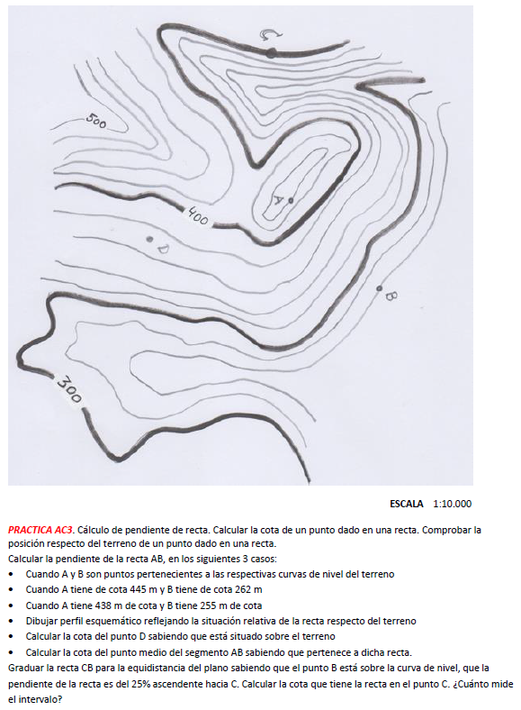

## Índice

::: {.texto-azul style="font-size:0.78em; margin-top:0.8em;"}
-   Fundamentos del sistema
-   El **punto**
-   La **recta** y sus posiciones particulares
-   El **plano** y sus rectas singulares
-   El terreno: reglas de las curvas de nivel
-   **Graduar** rectas: los tres casos
:::

## Fundamentos del sistema

:::: columns
::: {.column width="55%"}
::: {.texto-azul style="font-size:0.66em; margin-top:0.6em;"}
El sistema acotado consiste en la **proyección ortogonal** de los objetos del espacio **sobre un plano horizontal**: el **plano de comparación** (PC).

::: {.fragment fragment-index="1"}
La **cota** — altura sobre el plano de comparación — completa el sistema y lo hace **biunívoco**: cada punto del espacio tiene una única representación, y cada representación corresponde a un único punto.
:::

::: {.fragment fragment-index="2"}
En España, las cotas absolutas (altitudes) se refieren al **nivel medio del mar en Alicante**.
:::
:::
:::

::: {.column width="45%"}
<svg viewBox="0 0 300 210" xmlns="http://www.w3.org/2000/svg" style="width:88%; display:block; margin:14px auto;">
<polygon points="30,160 100,105 290,105 220,160" fill="#d2b077" stroke="#1a1a1a" stroke-width="1.6"/>
<text x="44" y="152" font-size="11" fill="#6a5335" font-style="italic">Plano de comparación</text>
<line x1="168" y1="128" x2="168" y2="38" stroke="#909090" stroke-width="1.4" stroke-dasharray="4,3"/>
<circle cx="168" cy="38" r="3.6" fill="#fff" stroke="#1a1a1a" stroke-width="1.6"/>
<text x="176" y="34" font-size="14" font-weight="700">A</text>
<circle cx="168" cy="128" r="3.4" fill="#fff" stroke="#1a1a1a" stroke-width="1.6"/>
<text x="175" y="145" font-size="13" font-weight="700" fill="#2d2d8a">a(4)</text>
<line x1="150" y1="128" x2="150" y2="38" stroke="#d00000" stroke-width="1.6"/>
<line x1="146" y1="128" x2="154" y2="128" stroke="#d00000" stroke-width="1.6"/>
<line x1="146" y1="38" x2="154" y2="38" stroke="#d00000" stroke-width="1.6"/>
<text x="142" y="86" font-size="12.5" font-weight="700" fill="#d00000" text-anchor="end">cota = 4 m</text>
</svg>
:::
::::

## El punto

<svg viewBox="0 0 640 300" xmlns="http://www.w3.org/2000/svg" style="width:96%; display:block; margin:0 auto;">
<polygon points="28.4,256 388.4,256 464,202 104,202" fill="#d2b077" stroke="#1a1a1a" stroke-width="1.6" stroke-linejoin="round" fill-opacity="0.9"/>
<text x="47.4" y="248.4" font-size="11.5" fill="#6a5335" font-style="italic">PC (cota 0)</text>
<g class="fragment" data-fragment-index="1">
<line x1="200.4" y1="226" x2="200.4" y2="190" stroke="#909090" stroke-width="1.3" stroke-dasharray="4,3"/>
<circle cx="200.4" cy="190" r="3.6" fill="#fff" stroke="#1a1a1a" stroke-width="1.6"/>
<text x="207.4" y="185" font-size="14" fill="#1a1a1a" font-weight="700">A</text>
<circle cx="200.4" cy="226" r="3.2" fill="#e8a33d" stroke="#7a5510" stroke-width="1.4"/>
<text x="206.4" y="241" font-size="12.5" fill="#2d2d8a" font-weight="700">a(4)</text>
</g>
<g class="fragment" data-fragment-index="1">
<line x1="318" y1="217" x2="318" y2="172" stroke="#909090" stroke-width="1.3" stroke-dasharray="4,3"/>
<circle cx="318" cy="172" r="3.6" fill="#fff" stroke="#1a1a1a" stroke-width="1.6"/>
<text x="325" y="167" font-size="14" fill="#1a1a1a" font-weight="700">C</text>
<circle cx="318" cy="217" r="3.2" fill="#e8a33d" stroke="#7a5510" stroke-width="1.4"/>
<text x="324" y="232" font-size="12.5" fill="#2d2d8a" font-weight="700">c(5)</text>
</g>
<g class="fragment" data-fragment-index="2">
<circle cx="159.3" cy="212.5" r="3.6" fill="#fff" stroke="#1a1a1a" stroke-width="1.6"/>
<text x="165.3" y="227.5" font-size="12.5" fill="#2d2d8a" font-weight="700">d(0)</text>
<text x="155.3" y="202.5" font-size="14" fill="#1a1a1a" font-weight="700">D</text>
</g>
<g class="fragment" data-fragment-index="3">
<line x1="380.6" y1="241.6" x2="380.6" y2="259.6" stroke="#909090" stroke-width="1.3" stroke-dasharray="4,3"/>
<circle cx="380.6" cy="259.6" r="3.6" fill="#fff" stroke="#1a1a1a" stroke-width="1.6"/>
<text x="387.6" y="254.6" font-size="14" fill="#1a1a1a" font-weight="700">B</text>
<circle cx="380.6" cy="241.6" r="3.2" fill="#e8a33d" stroke="#7a5510" stroke-width="1.4"/>
<text x="388.6" y="232.6" font-size="12.5" fill="#2d2d8a" font-weight="700">b(-2)</text>
</g>
<g class="fragment" data-fragment-index="4">
<line x1="200.4" y1="190" x2="318" y2="190" stroke="#d00000" stroke-width="1.2" stroke-dasharray="5,3"/>
<line x1="318" y1="172" x2="318" y2="190" stroke="#d00000" stroke-width="2.2"/>
<text x="326" y="185" font-size="12.5" fill="#d00000" font-weight="700">desnivel = 5 − 4 = 1 m</text>
</g>
<g class="fragment" data-fragment-index="5">
<rect x="480" y="30" width="150" height="220" fill="#ffffff" stroke="#b8a37e" stroke-width="2"/>
<text x="555" y="50" font-size="12" fill="#6a5335" text-anchor="middle" font-style="italic">El papel</text>
<circle cx="534.2" cy="127.8" r="3.2" fill="#e8a33d" stroke="#7a5510" stroke-width="1.4"/>
<text x="539.2" y="140.8" font-size="12" fill="#2d2d8a" font-weight="700">a(4)</text>
<circle cx="577.9" cy="91.1" r="3.2" fill="#e8a33d" stroke="#7a5510" stroke-width="1.4"/>
<text x="582.9" y="104.1" font-size="12" fill="#2d2d8a" font-weight="700">c(5)</text>
<circle cx="509.2" cy="72.8" r="3.2" fill="#e8a33d" stroke="#7a5510" stroke-width="1.4"/>
<text x="514.2" y="85.8" font-size="12" fill="#2d2d8a" font-weight="700">d(0)</text>
<circle cx="618.3" cy="191.3" r="3.2" fill="#e8a33d" stroke="#7a5510" stroke-width="1.4"/>
<text x="612.3" y="204.3" font-size="12" fill="#2d2d8a" font-weight="700" text-anchor="end">b(-2)</text>
</g>
</svg>

::: {.texto-azul style="font-size:0.6em; text-align:center; margin-top:0.3em;"}
Cota **positiva** (encima del PC), **nula** (en el PC) o **negativa** (debajo). El **desnivel** entre dos puntos es la diferencia de sus cotas.
:::

## La recta

:::: columns
::: {.column width="66%"}
<svg viewBox="0 0 640 320" xmlns="http://www.w3.org/2000/svg" style="width:96%; display:block; margin:0 auto;">
<defs><marker id="fr-flecha-rojo" viewBox="0 0 10 10" refX="8.5" refY="5" markerWidth="7" markerHeight="7" orient="auto-start-reverse"><path d="M 0 0 L 10 5 L 0 10 z" fill="#d00000"/></marker><marker id="fr-flecha-verde" viewBox="0 0 10 10" refX="8.5" refY="5" markerWidth="7" markerHeight="7" orient="auto-start-reverse"><path d="M 0 0 L 10 5 L 0 10 z" fill="#14532d"/></marker><marker id="fr-flecha-naranja" viewBox="0 0 10 10" refX="8.5" refY="5" markerWidth="7" markerHeight="7" orient="auto-start-reverse"><path d="M 0 0 L 10 5 L 0 10 z" fill="#e8862c"/></marker><marker id="fr-flecha-gris" viewBox="0 0 10 10" refX="8.5" refY="5" markerWidth="7" markerHeight="7" orient="auto-start-reverse"><path d="M 0 0 L 10 5 L 0 10 z" fill="#909090"/></marker><marker id="fr-flecha-negro" viewBox="0 0 10 10" refX="8.5" refY="5" markerWidth="7" markerHeight="7" orient="auto-start-reverse"><path d="M 0 0 L 10 5 L 0 10 z" fill="#1a1a1a"/></marker><marker id="fr-flecha-teal" viewBox="0 0 10 10" refX="8.5" refY="5" markerWidth="7" markerHeight="7" orient="auto-start-reverse"><path d="M 0 0 L 10 5 L 0 10 z" fill="#0f766e"/></marker></defs>
<polygon points="28.4,279 428.4,279 504,225 104,225" fill="#d2b077" stroke="#1a1a1a" stroke-width="1.6" stroke-linejoin="round" fill-opacity="0.9"/>
<g class="fragment" data-fragment-index="1">
<circle cx="397.2" cy="159" r="3.6" fill="#fff" stroke="#1a1a1a" stroke-width="1.6"/>
<text x="405.2" y="155" font-size="14" fill="#1a1a1a" font-weight="700">A</text>
<line x1="397.2" y1="237" x2="397.2" y2="159" stroke="#909090" stroke-width="1.3" stroke-dasharray="4,3"/>
<circle cx="397.2" cy="237" r="3.2" fill="#e8a33d" stroke="#7a5510" stroke-width="1.4"/>
<text x="404.2" y="251" font-size="12.5" fill="#2d2d8a" font-weight="700">a(3)</text>
</g>
<g class="fragment" data-fragment-index="2">
<line x1="103.1" y1="268.5" x2="397.2" y2="159" stroke="#1a1a1a" stroke-width="2.6"/>
<text x="236.1" y="203.8" font-size="14" fill="#1a1a1a" font-weight="700" font-style="italic">R</text>
<line x1="103.1" y1="268.5" x2="397.2" y2="237" stroke="#14532d" stroke-width="2.6"/>
<text x="250.1" y="268.8" font-size="14" fill="#14532d" font-weight="700" font-style="italic">r</text>
</g>
<g class="fragment" data-fragment-index="3">
<circle cx="103.1" cy="268.5" r="3.6" fill="#fff" stroke="#1a1a1a" stroke-width="1.6"/>
<text x="97.1" y="286.5" font-size="12.5" fill="#2d2d8a" font-weight="700">t(0)</text>
<text x="93.1" y="258.5" font-size="14" fill="#1a1a1a" font-weight="700">T</text>
</g>
<g class="fragment" data-fragment-index="4">
<line x1="397.2" y1="237" x2="397.2" y2="159" stroke="#d00000" stroke-width="2.4"/>
<text x="407.2" y="202" font-size="12.5" fill="#d00000" font-weight="700">dV = 3 m</text>
<text x="210.1" y="278.8" font-size="12.5" fill="#14532d" font-weight="700">dH = 300 m</text>
<path d="M 154.8,263 A 52 52 0 0 0 151.8,250.4" fill="none" stroke="#e8862c" stroke-width="2"/>
<text x="165.1" y="262.5" font-size="14" fill="#e8862c" font-weight="700">α</text>
</g>
</svg>
:::

::: {.column width="34%"}
::: {.texto-azul style="font-size:0.6em; margin-top:0.5em;"}
::: {.fragment fragment-index="2"}
Dos puntos determinan una recta: en acotado se **unen sus proyecciones**.
:::

::: {.fragment fragment-index="3"}
La **traza** (t) es el punto de **cota 0**: la intersección de la recta con el plano de comparación.
:::

::: {.fragment fragment-index="4"}
$$\text{Pte} = \frac{\color{#d00000}{dV}}{\color{#14532d}{dH}} = \frac{3}{300} = 1\,\%$$

También es la **tangente** del ángulo α.
:::
:::
:::
::::

## Posiciones particulares de la recta

<svg viewBox="0 0 660 240" xmlns="http://www.w3.org/2000/svg" style="width:98%; display:block; margin:0 auto;">
<g class="fragment" data-fragment-index="1">
<polygon points="18,190 78,130 218,130 158,190" fill="#d2b077" stroke="#1a1a1a" stroke-width="1.4" stroke-linejoin="round" fill-opacity="0.85"/>
<line x1="63" y1="175" x2="180" y2="52" stroke="#1a1a1a" stroke-width="2.4"/>
<line x1="63" y1="175" x2="180" y2="145" stroke="#14532d" stroke-width="2.4"/>
<line x1="180" y1="52" x2="180" y2="145" stroke="#909090" stroke-width="1.2" stroke-dasharray="4,3"/>
<circle cx="63" cy="175" r="3.2" fill="#fff" stroke="#1a1a1a" stroke-width="1.6"/>
<text x="50" y="172" font-size="12" fill="#1a1a1a" font-weight="700" font-style="italic">t</text>
<text x="118" y="216" font-size="13" fill="#2d2d8a" font-weight="700" text-anchor="middle">OBLICUA</text>
<text x="118" y="232" font-size="10.5" fill="#666" text-anchor="middle">posición general</text>
</g>
<g class="fragment" data-fragment-index="2">
<polygon points="238,190 298,130 438,130 378,190" fill="#d2b077" stroke="#1a1a1a" stroke-width="1.4" stroke-linejoin="round" fill-opacity="0.85"/>
<line x1="276" y1="92" x2="396" y2="74" stroke="#1a1a1a" stroke-width="2.4"/>
<line x1="291" y1="172" x2="411" y2="154" stroke="#14532d" stroke-width="2.4"/>
<line x1="276" y1="92" x2="291" y2="172" stroke="#909090" stroke-width="1.1" stroke-dasharray="4,3"/>
<line x1="396" y1="74" x2="411" y2="154" stroke="#909090" stroke-width="1.1" stroke-dasharray="4,3"/>
<text x="326" y="66" font-size="11.5" fill="#1a1a1a" font-weight="700">A</text>
<text x="404" y="62" font-size="11.5" fill="#1a1a1a" font-weight="700">B</text>
<text x="332" y="186" font-size="11" fill="#2d2d8a" font-weight="700">a(3)  b(3)</text>
<text x="338" y="216" font-size="13" fill="#2d2d8a" font-weight="700" text-anchor="middle">HORIZONTAL</text>
<text x="338" y="232" font-size="10.5" fill="#666" text-anchor="middle">pendiente = 0 · proyección en V.M.</text>
</g>
<g class="fragment" data-fragment-index="3">
<polygon points="458,190 518,130 658,130 598,190" fill="#d2b077" stroke="#1a1a1a" stroke-width="1.4" stroke-linejoin="round" fill-opacity="0.85"/>
<line x1="558" y1="40" x2="558" y2="158" stroke="#1a1a1a" stroke-width="2.4"/>
<circle cx="558" cy="158" r="3.4" fill="#e8a33d" stroke="#7a5510" stroke-width="1.4"/>
<text x="565" y="172" font-size="11" fill="#2d2d8a" font-weight="700">r = un punto</text>
<text x="558" y="216" font-size="13" fill="#2d2d8a" font-weight="700" text-anchor="middle">VERTICAL</text>
<text x="558" y="232" font-size="10.5" fill="#666" text-anchor="middle">pendiente = ∞ · proyección: un punto</text>
</g>
</svg>

::: {.fragment .texto-azul style="font-size:0.62em; text-align:center; margin-top:0.5em;"}
La recta **horizontal** se proyecta en **verdadera magnitud**; la **vertical** se proyecta en **un solo punto** (y su cota no puede escribirse: se rotula la de sus puntos notables).
:::

## El plano: rectas singulares

<svg viewBox="0 168 660 178" xmlns="http://www.w3.org/2000/svg" style="width:100%; display:block; margin:0 auto;">
<defs><marker id="fp-flecha-rojo" viewBox="0 0 10 10" refX="8.5" refY="5" markerWidth="7" markerHeight="7" orient="auto-start-reverse"><path d="M 0 0 L 10 5 L 0 10 z" fill="#d00000"/></marker><marker id="fp-flecha-verde" viewBox="0 0 10 10" refX="8.5" refY="5" markerWidth="7" markerHeight="7" orient="auto-start-reverse"><path d="M 0 0 L 10 5 L 0 10 z" fill="#14532d"/></marker><marker id="fp-flecha-naranja" viewBox="0 0 10 10" refX="8.5" refY="5" markerWidth="7" markerHeight="7" orient="auto-start-reverse"><path d="M 0 0 L 10 5 L 0 10 z" fill="#e8862c"/></marker><marker id="fp-flecha-gris" viewBox="0 0 10 10" refX="8.5" refY="5" markerWidth="7" markerHeight="7" orient="auto-start-reverse"><path d="M 0 0 L 10 5 L 0 10 z" fill="#909090"/></marker><marker id="fp-flecha-negro" viewBox="0 0 10 10" refX="8.5" refY="5" markerWidth="7" markerHeight="7" orient="auto-start-reverse"><path d="M 0 0 L 10 5 L 0 10 z" fill="#1a1a1a"/></marker><marker id="fp-flecha-teal" viewBox="0 0 10 10" refX="8.5" refY="5" markerWidth="7" markerHeight="7" orient="auto-start-reverse"><path d="M 0 0 L 10 5 L 0 10 z" fill="#0f766e"/></marker></defs>
<polygon points="17.1,328.5 562.1,328.5 656.6,261 111.6,261" fill="#d2b077" stroke="#1a1a1a" stroke-width="1.6" stroke-linejoin="round" fill-opacity="0.55"/>
<g class="fragment" data-fragment-index="1">
<polygon points="142.6,321 492.6,321 559.8,201 209.8,201" fill="#6f9fd8" stroke="#24537a" stroke-width="1.8" stroke-linejoin="round" fill-opacity="0.22"/>
<text x="533.8" y="217" font-size="16" fill="#24537a" font-weight="700">P</text>
<line x1="142.6" y1="321" x2="492.6" y2="321" stroke="#1a1a1a" stroke-width="3.4"/>
<text x="357.6" y="339" font-size="12.5" fill="#1a1a1a" font-weight="700">traza de P (cota 0)</text>
</g>
<g class="fragment" data-fragment-index="2">
<line x1="159.4" y1="291" x2="509.4" y2="291" stroke="#2e9e40" stroke-width="3"/>
<text x="517.4" y="295" font-size="12.5" fill="#d00000" font-weight="700">2</text>
<text x="500.6" y="325" font-size="12.5" fill="#d00000" font-weight="700">0</text>
<line x1="159.4" y1="309" x2="509.4" y2="309" stroke="#909090" stroke-width="1.0" stroke-dasharray="5,4"/>
<line x1="176.2" y1="261" x2="526.2" y2="261" stroke="#2e9e40" stroke-width="3"/>
<text x="534.2" y="265" font-size="12.5" fill="#d00000" font-weight="700">4</text>
<line x1="176.2" y1="297" x2="526.2" y2="297" stroke="#909090" stroke-width="1.0" stroke-dasharray="5,4"/>
<line x1="193" y1="231" x2="543" y2="231" stroke="#2e9e40" stroke-width="3"/>
<text x="551" y="235" font-size="12.5" fill="#d00000" font-weight="700">6</text>
<line x1="193" y1="285" x2="543" y2="285" stroke="#909090" stroke-width="1.0" stroke-dasharray="5,4"/>
<line x1="209.8" y1="201" x2="559.8" y2="201" stroke="#2e9e40" stroke-width="3"/>
<text x="567.8" y="205" font-size="12.5" fill="#d00000" font-weight="700">8</text>
<line x1="209.8" y1="273" x2="559.8" y2="273" stroke="#909090" stroke-width="1.0" stroke-dasharray="5,4"/>
<text x="205.8" y="191" font-size="12" fill="#2e9e40" font-weight="700">líneas de nivel del plano</text>
</g>
<g class="fragment" data-fragment-index="3">
<line x1="312.6" y1="321" x2="379.8" y2="201" stroke="#d00000" stroke-width="3"/>
<text x="356.2" y="263" font-size="12.5" fill="#d00000" font-weight="700" font-style="italic">l.m.p.</text>
<line x1="312.6" y1="321" x2="379.8" y2="273" stroke="#d00000" stroke-width="1.4" stroke-dasharray="5,4"/>
<text x="324.6" y="307" font-size="14" fill="#e8862c" font-weight="700">α</text>
</g>
<g class="fragment" data-fragment-index="4">
<line x1="159.4" y1="291" x2="159.4" y2="309" stroke="#d00000" stroke-width="2.6"/>
<line x1="176.2" y1="261" x2="176.2" y2="279" stroke="#d00000" stroke-width="2.6"/>
<line x1="142.6" y1="321" x2="159.4" y2="309" stroke="#14532d" stroke-width="2.6"/>
<text x="134.6" y="291" font-size="12" fill="#d00000" font-weight="700" text-anchor="end">equidistancia (dV)</text>
<text x="134.6" y="307" font-size="12" fill="#14532d" font-weight="700" text-anchor="end">intervalo (dH)</text>
<line x1="132.6" y1="295" x2="145.4" y2="310" stroke="#909090" stroke-width="0"/>
</g>
</svg>

::: {.texto-azul style="font-size:0.56em; text-align:center; margin-top:0.2em;"}
::: {.fragment fragment-index="2"}
Las **líneas de nivel** del plano son sus rectas horizontales: paralelas entre sí y a la **traza** (la de cota 0).
:::
::: {.fragment fragment-index="3"}
La **línea de máxima pendiente** (l.m.p.) es **perpendicular** a las líneas de nivel. En un plano hay **infinitas pendientes**, entre **cero** y la de la l.m.p.: por eso la pendiente **del plano** es la de su l.m.p.
:::
:::

## El plano en planta

:::: columns
::: {.column width="56%"}
<svg viewBox="0 0 560 400" xmlns="http://www.w3.org/2000/svg" style="width:80%; display:block; margin:0 auto;">
<g class="fragment" data-fragment-index="1">
<line x1="120" y1="60" x2="513.9" y2="129.5" stroke="#1a1a1a" stroke-width="3.2"/>
<text x="505.9" y="121.5" font-size="12.5" fill="#1a1a1a" font-weight="700">traza (0)</text>
<line x1="130.4" y1="119.1" x2="524.3" y2="188.5" stroke="#2e9e40" stroke-width="2.4"/>
<text x="528.3" y="192.5" font-size="12.5" fill="#d00000" font-weight="700">2</text>
<line x1="140.8" y1="178.2" x2="534.8" y2="247.6" stroke="#2e9e40" stroke-width="2.4"/>
<text x="538.8" y="251.6" font-size="12.5" fill="#d00000" font-weight="700">4</text>
<line x1="151.3" y1="237.3" x2="545.2" y2="306.7" stroke="#2e9e40" stroke-width="2.4"/>
<text x="549.2" y="310.7" font-size="12.5" fill="#d00000" font-weight="700">6</text>
<line x1="161.7" y1="296.4" x2="555.6" y2="365.8" stroke="#2e9e40" stroke-width="2.4"/>
<text x="559.6" y="369.8" font-size="12.5" fill="#d00000" font-weight="700">8</text>
</g>
<g class="fragment" data-fragment-index="2">
<line x1="333" y1="77.5" x2="383" y2="361.1" stroke="#d00000" stroke-width="3"/>
<text x="389" y="363.1" font-size="12.5" fill="#d00000" font-weight="700" font-style="italic">l.m.p.</text>
<circle cx="336.7" cy="98.2" r="3.4" fill="#fff" stroke="#1a1a1a" stroke-width="1.6"/>
<circle cx="347.1" cy="157.3" r="3.4" fill="#fff" stroke="#1a1a1a" stroke-width="1.6"/>
<circle cx="357.5" cy="216.4" r="3.4" fill="#fff" stroke="#1a1a1a" stroke-width="1.6"/>
<circle cx="367.9" cy="275.5" r="3.4" fill="#fff" stroke="#1a1a1a" stroke-width="1.6"/>
<circle cx="378.3" cy="334.6" r="3.4" fill="#fff" stroke="#1a1a1a" stroke-width="1.6"/>
</g>
<g class="fragment" data-fragment-index="3">
<line x1="373.3" y1="219.2" x2="383.7" y2="278.2" stroke="#14532d" stroke-width="3"/>
<text x="390.5" y="250.7" font-size="13" fill="#14532d" font-weight="700">i = 6,67 m</text>
</g>
<text x="40" y="390" font-size="12.5" fill="#555">Equidistancia = 2 m · Pendiente del plano = 30 % · Escala 1:500</text>
</svg>
:::

::: {.column width="44%"}
::: {.texto-azul style="font-size:0.62em; margin-top:0.6em;"}
En el papel, un plano se representa por la **proyección graduada de su línea de máxima pendiente**: las líneas de nivel son perpendiculares a ella por los puntos de cota entera.

::: {.fragment fragment-index="3"}
**¿Cuánto mide el intervalo?**

$$\text{Pte} = \frac{e}{i} \;\Rightarrow\; i = \frac{2}{0{,}30} = 6{,}67 \text{ m}$$

En el papel, a escala 1:500: $6{,}67/500 = 13{,}3$ mm.
:::
:::
:::
::::

## El terreno: reglas de las curvas

:::: columns
::: {.column width="60%"}
<svg viewBox="-10 -14 500 390" xmlns="http://www.w3.org/2000/svg" style="width:80%; display:block; margin:0 auto;">
<rect x="-10" y="-14" width="500" height="390" fill="#fdfbf7"/>
<path d="M 461.4,360.0 L 480.0,346.6" fill="none" stroke="#8a5a2a" stroke-width="2.2" stroke-linejoin="round"/>
<path d="M 0.0,271.3 C 3.5,275.6 13.7,289.8 21.0,296.9 C 28.3,304.0 35.8,309.6 44.0,313.9 C 52.2,318.2 61.2,321.2 70.0,322.6 C 78.8,324.0 89.0,323.4 97.0,322.2 C 105.0,321.0 111.2,318.6 118.0,315.2 C 124.8,311.8 132.2,306.5 138.0,301.8 C 143.8,297.1 145.7,295.1 152.7,286.8 C 159.7,278.5 172.9,260.2 180.0,252.2 C 187.1,244.2 189.5,242.4 195.0,238.6 C 200.5,234.8 207.3,231.0 213.0,229.3 C 218.7,227.6 225.2,227.8 229.0,228.2 C 232.8,228.6 233.8,230.0 235.8,231.6 C 237.8,233.2 236.1,228.5 241.0,237.5 C 245.9,246.5 257.2,272.7 265.0,285.8 C 272.8,298.9 279.0,306.6 288.0,315.9 C 297.0,325.2 307.9,334.3 319.0,341.7 C 330.1,349.1 348.5,356.9 354.4,360.0" fill="none" stroke="#8a5a2a" stroke-width="2.2" stroke-linejoin="round"/>
<path d="M 480.0,235.0 C 478.0,232.4 472.5,224.7 468.0,219.6 C 463.5,214.5 458.3,209.3 453.0,204.6 C 447.7,199.9 441.8,195.4 436.0,191.3 C 430.2,187.2 427.3,184.8 418.0,180.3 C 408.7,175.9 396.0,169.4 380.0,164.6 C 364.0,159.8 333.8,154.7 322.0,151.2 C 310.2,147.7 312.0,145.9 309.2,143.4 C 306.4,140.9 306.3,139.1 305.4,136.4 C 304.5,133.7 303.8,137.1 303.9,127.4 C 304.0,117.7 306.1,91.1 305.9,78.2 C 305.7,65.3 304.9,59.3 302.6,50.1 C 300.3,40.9 296.7,31.5 292.2,23.1 C 287.7,14.8 278.2,3.9 275.4,0.0" fill="none" stroke="#8a5a2a" stroke-width="2.2" stroke-linejoin="round"/>
<path d="M 7.9,0.0 L 0.0,5.9" fill="none" stroke="#8a5a2a" stroke-width="2.2" stroke-linejoin="round"/>
<path d="M 0.0,193.8 C 4.9,202.6 22.0,234.5 29.4,246.7 C 36.8,258.8 40.3,261.9 44.6,266.7 C 48.9,271.5 51.4,273.1 55.0,275.5 C 58.6,277.9 62.3,279.9 66.0,281.3 C 69.7,282.8 73.2,283.7 77.0,284.2 C 80.8,284.7 84.5,285.1 89.0,284.5 C 93.5,283.9 99.2,282.6 104.0,280.5 C 108.8,278.4 113.9,275.1 118.1,271.8 C 122.3,268.5 123.7,267.4 129.4,260.7 C 135.1,254.0 146.2,238.8 152.3,231.6 C 158.4,224.4 152.9,227.9 165.7,217.6 C 178.5,207.2 215.7,180.9 229.1,169.5 C 242.5,158.1 241.4,156.8 246.3,149.4 C 251.2,142.0 255.4,133.8 258.6,125.3 C 261.8,116.8 264.3,107.1 265.5,98.3 C 266.7,89.5 266.8,80.4 265.7,72.2 C 264.6,64.0 262.3,56.3 259.2,49.1 C 256.1,41.9 251.8,35.2 246.8,29.1 C 241.8,23.0 235.8,17.4 229.0,12.6 C 222.2,7.7 209.9,2.1 206.1,0.0" fill="none" stroke="#8a5a2a" stroke-width="1.1" stroke-linejoin="round"/>
<path d="M 88.0,0.0 C 83.7,1.8 70.4,6.7 62.0,11.1 C 53.6,15.4 45.2,20.6 37.7,26.1 C 30.2,31.6 23.0,37.8 16.7,44.1 C 10.4,50.4 2.8,60.8 0.0,64.1" fill="none" stroke="#8a5a2a" stroke-width="1.1" stroke-linejoin="round"/>
<path d="M 390.0,343.0 C 393.5,343.1 404.3,344.2 411.0,343.7 C 417.7,343.2 424.2,342.0 430.0,340.1 C 435.8,338.2 441.3,335.6 446.0,332.4 C 450.7,329.2 455.1,325.1 458.4,320.9 C 461.7,316.6 464.2,312.1 466.0,306.9 C 467.8,301.7 468.9,295.6 469.0,289.8 C 469.1,284.0 468.3,277.8 466.7,271.8 C 465.1,265.8 462.6,259.6 459.5,253.7 C 456.4,247.8 452.6,242.1 448.0,236.6 C 443.4,231.1 437.9,225.4 432.2,220.6 C 426.5,215.8 420.5,211.5 414.0,207.7 C 407.5,203.9 400.2,200.3 393.0,197.6 C 385.8,194.9 378.2,192.8 371.0,191.4 C 363.8,190.0 356.8,189.3 350.0,189.3 C 343.2,189.3 336.3,189.9 330.0,191.3 C 323.7,192.7 316.5,195.6 312.0,197.7 C 307.5,199.8 305.7,201.5 303.0,203.8 C 300.3,206.1 298.3,207.1 295.7,211.6 C 293.1,216.1 288.9,223.4 287.6,230.6 C 286.3,237.8 286.2,246.5 287.7,254.7 C 289.2,262.9 292.5,271.9 296.7,279.8 C 300.9,287.8 306.6,295.5 313.0,302.4 C 319.4,309.3 326.8,315.8 335.0,321.3 C 343.2,326.8 352.8,332.0 362.0,335.6 C 371.2,339.2 385.3,341.8 390.0,343.0" fill="none" stroke="#8a5a2a" stroke-width="1.1" stroke-linejoin="round"/>
<path d="M 388.0,322.9 C 390.5,323.0 398.2,323.8 403.0,323.4 C 407.8,323.0 412.7,322.0 417.0,320.6 C 421.3,319.2 425.3,317.2 428.7,314.9 C 432.1,312.6 434.9,309.9 437.3,306.9 C 439.7,303.9 441.6,300.5 442.9,296.8 C 444.2,293.1 445.0,289.0 445.1,284.8 C 445.2,280.6 444.8,276.2 443.7,271.8 C 442.6,267.4 441.1,263.1 438.8,258.7 C 436.6,254.3 433.4,249.7 430.2,245.7 C 427.0,241.7 423.6,238.2 419.6,234.7 C 415.6,231.2 410.8,227.6 406.0,224.7 C 401.2,221.8 396.2,219.2 391.0,217.2 C 385.8,215.2 380.2,213.6 375.0,212.5 C 369.8,211.4 364.8,210.9 360.0,210.9 C 355.2,210.9 350.5,211.3 346.0,212.3 C 341.5,213.3 337.3,214.3 333.0,216.8 C 328.7,219.3 323.3,223.3 320.0,227.5 C 316.7,231.7 314.5,236.5 313.4,241.7 C 312.2,246.9 312.2,253.0 313.1,258.7 C 314.0,264.4 315.9,270.1 318.9,275.8 C 321.9,281.5 326.2,287.6 330.9,292.8 C 335.6,298.0 341.0,302.8 347.0,306.9 C 353.0,311.0 360.2,314.8 367.0,317.5 C 373.8,320.2 384.5,322.0 388.0,322.9" fill="none" stroke="#8a5a2a" stroke-width="1.1" stroke-linejoin="round"/>
<path d="M 82.0,250.7 C 84.2,250.4 90.5,250.7 95.0,249.1 C 99.5,247.5 100.5,248.2 109.0,240.9 C 117.5,233.7 129.7,219.0 145.8,205.6 C 162.0,192.2 193.5,170.4 205.9,160.4 C 218.3,150.4 215.8,150.7 220.0,145.4 C 224.2,140.1 228.2,133.8 231.1,128.4 C 234.0,123.1 235.8,118.5 237.4,113.3 C 239.1,108.1 240.3,102.5 241.0,97.3 C 241.7,92.1 241.8,87.2 241.4,82.2 C 241.0,77.2 240.1,72.0 238.7,67.2 C 237.2,62.4 235.1,57.5 232.7,53.1 C 230.3,48.8 227.4,44.8 224.1,41.1 C 220.8,37.4 217.0,33.9 213.0,30.8 C 209.0,27.7 206.0,25.3 200.0,22.5 C 194.0,19.7 185.2,15.9 177.0,13.9 C 168.8,11.9 159.8,10.7 151.0,10.3 C 142.2,10.0 133.0,10.5 124.0,11.8 C 115.0,13.1 105.8,15.4 97.0,18.3 C 88.2,21.2 79.2,25.1 71.0,29.5 C 62.8,33.9 55.0,39.2 48.0,44.8 C 41.0,50.4 34.7,56.6 29.2,63.2 C 23.7,69.8 18.8,77.5 15.2,84.2 C 11.7,90.9 9.6,97.0 7.9,103.3 C 6.2,109.6 5.2,115.9 5.0,122.3 C 4.8,128.7 5.4,135.1 6.6,141.4 C 7.8,147.8 9.1,152.7 12.3,160.4 C 15.5,168.1 19.1,175.6 26.0,187.5 C 32.9,199.4 46.7,222.0 53.5,231.6 C 60.3,241.2 62.2,241.8 67.0,245.0 C 71.8,248.2 79.5,249.8 82.0,250.7" fill="none" stroke="#8a5a2a" stroke-width="1.1" stroke-linejoin="round"/>
<path d="M 387.0,302.9 C 390.0,302.5 400.0,302.5 405.0,300.6 C 410.0,298.7 414.5,294.0 417.0,291.4 C 419.5,288.8 419.4,287.2 420.1,284.8 C 420.8,282.4 421.7,280.8 421.1,276.8 C 420.5,272.8 419.3,265.9 416.4,260.7 C 413.5,255.5 408.7,249.9 403.6,245.7 C 398.5,241.5 392.1,237.8 386.0,235.5 C 379.9,233.2 373.0,231.8 367.0,231.9 C 361.0,232.0 354.2,234.0 350.0,235.8 C 345.8,237.6 343.9,240.0 341.9,242.7 C 339.9,245.3 338.5,248.4 337.8,251.7 C 337.1,255.0 337.1,259.0 337.7,262.7 C 338.3,266.4 339.7,270.1 341.7,273.8 C 343.7,277.5 346.7,281.5 349.9,284.8 C 353.1,288.1 357.0,291.2 361.0,293.8 C 365.0,296.4 369.7,298.6 374.0,300.1 C 378.3,301.6 384.8,302.4 387.0,302.9" fill="none" stroke="#8a5a2a" stroke-width="1.1" stroke-linejoin="round"/>
<path d="M 83.0,210.7 C 84.8,210.7 90.2,211.6 94.0,210.9 C 97.8,210.2 95.0,212.9 106.0,206.8 C 117.0,200.7 146.0,183.6 160.0,174.5 C 174.0,165.4 181.7,159.8 189.8,152.4 C 197.9,145.1 203.8,138.2 208.8,130.4 C 213.8,122.6 217.6,111.7 219.7,105.3 C 221.8,98.9 221.3,96.5 221.4,92.3 C 221.5,88.1 221.2,84.0 220.5,80.2 C 219.8,76.4 218.9,72.9 217.4,69.2 C 215.9,65.5 213.9,61.7 211.5,58.2 C 209.1,54.7 206.1,51.2 203.0,48.2 C 199.9,45.2 197.7,43.1 193.0,40.4 C 188.3,37.7 181.3,34.0 175.0,31.9 C 168.7,29.8 162.0,28.3 155.0,27.5 C 148.0,26.7 140.3,26.6 133.0,27.2 C 125.7,27.8 118.3,28.9 111.0,30.8 C 103.7,32.7 96.0,35.4 89.0,38.6 C 82.0,41.8 75.2,45.6 69.0,49.8 C 62.8,54.0 57.0,58.9 52.0,64.0 C 47.0,69.1 42.5,74.8 38.9,80.2 C 35.3,85.6 32.7,90.8 30.6,96.3 C 28.5,101.8 27.1,107.6 26.3,113.3 C 25.5,119.0 25.4,124.7 26.0,130.4 C 26.6,136.1 27.6,141.2 29.8,147.4 C 32.0,153.6 35.1,160.5 39.3,167.5 C 43.5,174.5 49.9,183.4 55.0,189.5 C 60.1,195.6 65.3,200.8 70.0,204.3 C 74.7,207.8 80.8,209.6 83.0,210.7" fill="none" stroke="#8a5a2a" stroke-width="1.1" stroke-linejoin="round"/>
<path d="M 94.0,181.5 C 97.8,180.9 108.0,180.9 117.0,178.0 C 126.0,175.1 138.5,169.4 148.0,164.1 C 157.5,158.8 166.7,152.5 173.9,146.4 C 181.1,140.3 186.8,133.9 191.3,127.4 C 195.8,120.9 199.0,114.2 200.8,107.3 C 202.6,100.4 203.2,92.7 202.3,86.2 C 201.4,79.7 199.1,73.6 195.5,68.2 C 191.9,62.8 185.8,57.2 181.0,53.6 C 176.2,50.0 172.0,48.4 167.0,46.6 C 162.0,44.8 156.7,43.5 151.0,42.7 C 145.3,42.0 139.0,41.8 133.0,42.1 C 127.0,42.5 121.0,43.3 115.0,44.8 C 109.0,46.3 102.7,48.4 97.0,50.9 C 91.3,53.4 86.0,56.4 81.0,59.7 C 76.0,63.1 71.2,66.9 67.0,71.0 C 62.8,75.1 59.1,79.5 56.0,84.1 C 52.9,88.6 50.5,93.4 48.6,98.3 C 46.7,103.2 45.4,108.3 44.8,113.3 C 44.2,118.3 44.3,123.6 44.9,128.4 C 45.5,133.2 46.6,137.6 48.6,142.4 C 50.6,147.2 53.6,152.8 56.8,157.4 C 60.0,162.0 64.0,166.3 68.0,169.8 C 72.0,173.3 76.7,176.4 81.0,178.3 C 85.3,180.2 91.8,181.0 94.0,181.5" fill="none" stroke="#8a5a2a" stroke-width="1.1" stroke-linejoin="round"/>
<path d="M 100.0,159.5 C 103.0,159.3 111.5,159.9 118.0,158.5 C 124.5,157.1 132.2,154.5 139.0,151.3 C 145.8,148.1 152.8,143.9 158.6,139.4 C 164.3,134.9 169.7,129.3 173.5,124.3 C 177.3,119.3 179.8,114.5 181.5,109.3 C 183.2,104.1 184.0,98.3 183.7,93.3 C 183.4,88.3 181.9,83.5 179.5,79.2 C 177.1,74.9 172.4,70.3 169.0,67.4 C 165.6,64.5 162.7,63.2 159.0,61.7 C 155.3,60.2 151.2,59.0 147.0,58.3 C 142.8,57.6 138.5,57.2 134.0,57.3 C 129.5,57.4 124.7,57.9 120.0,58.9 C 115.3,59.9 110.3,61.5 106.0,63.2 C 101.7,64.9 97.8,66.8 94.0,69.2 C 90.2,71.6 86.3,74.4 83.0,77.4 C 79.7,80.4 76.6,83.7 74.0,87.2 C 71.4,90.7 69.2,94.6 67.5,98.3 C 65.8,102.0 64.8,105.5 64.1,109.3 C 63.4,113.1 63.3,117.5 63.6,121.3 C 63.9,125.1 64.7,128.5 66.0,132.0 C 67.3,135.5 69.3,139.3 71.5,142.4 C 73.7,145.5 76.1,148.1 79.0,150.5 C 81.9,152.9 85.5,155.1 89.0,156.6 C 92.5,158.1 98.2,159.0 100.0,159.5" fill="none" stroke="#8a5a2a" stroke-width="2.2" stroke-linejoin="round"/>
<path d="M 107.0,137.6 C 109.0,137.7 114.8,138.4 119.0,137.9 C 123.2,137.4 127.8,136.2 132.0,134.5 C 136.2,132.8 140.5,130.4 144.0,127.9 C 147.5,125.4 150.7,122.4 153.2,119.3 C 155.7,116.2 157.9,112.6 159.2,109.3 C 160.5,106.0 161.1,102.5 161.1,99.3 C 161.1,96.1 160.2,93.1 158.9,90.3 C 157.6,87.5 156.2,85.0 153.0,82.7 C 149.8,80.4 144.8,77.7 140.0,76.6 C 135.2,75.5 129.3,75.4 124.0,76.2 C 118.7,77.0 112.9,78.9 108.0,81.6 C 103.1,84.3 98.0,88.2 94.5,92.3 C 91.0,96.4 88.2,101.7 87.0,106.3 C 85.8,110.9 85.8,115.7 87.0,119.9 C 88.2,124.1 90.9,128.5 94.2,131.4 C 97.5,134.3 104.9,136.6 107.0,137.6" fill="none" stroke="#8a5a2a" stroke-width="1.1" stroke-linejoin="round"/>
<text x="158.9" y="94.3" font-size="11" fill="#8a5a2a" font-weight="700" text-anchor="middle" stroke="#ffffff" stroke-width="3.5" stroke-linejoin="round" opacity="0.9">160</text>
<text x="158.9" y="94.3" font-size="11" fill="#8a5a2a" font-weight="700" text-anchor="middle">160</text>
<text x="106" y="67.2" font-size="11" fill="#8a5a2a" font-weight="700" text-anchor="middle" stroke="#ffffff" stroke-width="3.5" stroke-linejoin="round" opacity="0.9">150</text>
<text x="106" y="67.2" font-size="11" fill="#8a5a2a" font-weight="700" text-anchor="middle">150</text>
<text x="89" y="288.5" font-size="11" fill="#8a5a2a" font-weight="700" text-anchor="middle" stroke="#ffffff" stroke-width="3.5" stroke-linejoin="round" opacity="0.9">110</text>
<text x="89" y="288.5" font-size="11" fill="#8a5a2a" font-weight="700" text-anchor="middle">110</text>
<text x="213" y="233.3" font-size="11" fill="#8a5a2a" font-weight="700" text-anchor="middle" stroke="#ffffff" stroke-width="3.5" stroke-linejoin="round" opacity="0.9">100</text>
<text x="213" y="233.3" font-size="11" fill="#8a5a2a" font-weight="700" text-anchor="middle">100</text>
<g class="fragment" data-fragment-index="1">
<ellipse cx="122" cy="102" rx="52" ry="36" fill="none" stroke="#0f766e" stroke-width="2.2" stroke-dasharray="6,4"/>
<text x="250" y="44" font-size="13" fill="#0f766e" font-weight="700" text-anchor="middle" stroke="#ffffff" stroke-width="3.5" stroke-linejoin="round" opacity="0.9">cima: curvas cerradas, cota crece hacia dentro</text>
<text x="250" y="44" font-size="13" fill="#0f766e" font-weight="700" text-anchor="middle">cima: curvas cerradas, cota crece hacia dentro</text>
</g>
<g class="fragment" data-fragment-index="2">
<ellipse cx="213" cy="229.3" rx="16" ry="11" fill="none" stroke="#d00000" stroke-width="2.2"/>
<ellipse cx="418" cy="180.3" rx="16" ry="11" fill="none" stroke="#d00000" stroke-width="2.2"/>
<text x="418" y="184.3" font-size="11" fill="#8a5a2a" font-weight="700" text-anchor="middle" stroke="#ffffff" stroke-width="3.5" stroke-linejoin="round" opacity="0.9">100</text>
<text x="418" y="184.3" font-size="11" fill="#8a5a2a" font-weight="700" text-anchor="middle">100</text>
<text x="300" y="330" font-size="13" fill="#d00000" font-weight="700" text-anchor="middle" stroke="#ffffff" stroke-width="3.5" stroke-linejoin="round" opacity="0.9">collado: la misma cota aparece a ambos lados</text>
<text x="300" y="330" font-size="13" fill="#d00000" font-weight="700" text-anchor="middle">collado: la misma cota aparece a ambos lados</text>
</g>
<g class="fragment" data-fragment-index="3">
<text x="245" y="370" font-size="13.5" fill="#2d2d8a" font-weight="700" text-anchor="middle">y dos curvas de nivel nunca se cortan</text>
</g>
</svg>
:::

::: {.column width="40%"}
::: {.texto-azul style="font-size:0.62em; margin-top:0.8em;"}
Entre curva y curva **solo conocemos** la cota de las propias curvas: suponemos que el terreno **varía uniformemente**.

::: {.fragment fragment-index="1"}
Una curva de nivel siempre **se cierra** (en el dibujo o fuera de él): las cerradas más interiores son **cimas** (u hoyas, si la cota decrece).
:::

::: {.fragment fragment-index="2"}
En un **collado**, la misma cota aparece **repetida** a ambos lados.
:::

::: {.fragment fragment-index="3"}
Y dos curvas de distinta cota **nunca se cortan**: un punto no puede tener dos alturas.
:::
:::
:::
::::

## Procedimientos

::: {style="background-color:#2d2d8a; color:#fff; padding:0.9em 1.2em; border-radius:8px; margin-top:2.2em; font-size:0.85em;"}
**No hay que saber más.**

A partir de aquí, todo consiste en aplicar adecuadamente los conceptos vistos hasta ahora: cota, equidistancia, intervalo y pendiente.
:::

::: {.fragment style="background-color:#1a6e1a; color:#fff; padding:0.9em 1.2em; border-radius:8px; margin-top:1.2em; font-size:0.85em;"}
El primer procedimiento — y el más importante del bloque — es **graduar una recta**: señalar sobre su proyección los puntos cuyas cotas pertenecen a la serie de la equidistancia.
:::

## Graduar una recta: caso 1

:::: columns
::: {.column width="64%"}
<svg viewBox="0 0 620 330" xmlns="http://www.w3.org/2000/svg" style="width:94%; display:block; margin:0 auto;">
<defs><marker id="g1-flecha-gris" viewBox="0 0 10 10" refX="8.5" refY="5" markerWidth="7" markerHeight="7" orient="auto-start-reverse"><path d="M 0 0 L 10 5 L 0 10 z" fill="#909090"/></marker><marker id="g1-flecha-verde" viewBox="0 0 10 10" refX="8.5" refY="5" markerWidth="7" markerHeight="7" orient="auto-start-reverse"><path d="M 0 0 L 10 5 L 0 10 z" fill="#14532d"/></marker></defs>
<line x1="37.2" y1="289.1" x2="582.8" y2="70.9" stroke="#c9c9c9" stroke-width="4" stroke-linecap="round"/>
<g class="fragment" data-fragment-index="1">
<circle cx="90" cy="268" r="4" fill="#fff" stroke="#1a1a1a" stroke-width="1.6"/>
<text x="78" y="290" font-size="13.5" fill="#2d2d8a" font-weight="700">a(500)</text>
<circle cx="530" cy="92" r="4" fill="#fff" stroke="#1a1a1a" stroke-width="1.6"/>
<text x="518" y="114" font-size="13.5" fill="#2d2d8a" font-weight="700">b(540)</text>
</g>
<g class="fragment" data-fragment-index="2">
<line x1="90" y1="268" x2="410" y2="308" stroke="#909090" stroke-width="1.3" marker-end="url(#g1-flecha-gris)"/>
<circle cx="161.1" cy="276.9" r="2.4" fill="#909090" stroke="#909090" stroke-width="1.6"/>
<circle cx="232.2" cy="285.8" r="2.4" fill="#909090" stroke="#909090" stroke-width="1.6"/>
<circle cx="303.3" cy="294.7" r="2.4" fill="#909090" stroke="#909090" stroke-width="1.6"/>
<circle cx="374.4" cy="303.6" r="2.4" fill="#909090" stroke="#909090" stroke-width="1.6"/>
<line x1="374.4" y1="303.6" x2="530" y2="92" stroke="#909090" stroke-width="1.3"/>
<line x1="161.1" y1="276.9" x2="200" y2="224" stroke="#909090" stroke-width="1.1" stroke-dasharray="4,3"/>
<line x1="232.2" y1="285.8" x2="310" y2="180" stroke="#909090" stroke-width="1.1" stroke-dasharray="4,3"/>
<line x1="303.3" y1="294.7" x2="420" y2="136" stroke="#909090" stroke-width="1.1" stroke-dasharray="4,3"/>
<text x="420" y="298" font-size="12" fill="#777" font-style="italic">divido en 4 partes iguales</text>
</g>
<g class="fragment" data-fragment-index="3">
<circle cx="200" cy="224" r="3.6" fill="#fff" stroke="#1a1a1a" stroke-width="1.6"/>
<text x="190" y="246" font-size="12.5" fill="#2d2d8a" font-weight="700">(510)</text>
<circle cx="310" cy="180" r="3.6" fill="#fff" stroke="#1a1a1a" stroke-width="1.6"/>
<text x="300" y="202" font-size="12.5" fill="#2d2d8a" font-weight="700">(520)</text>
<circle cx="420" cy="136" r="3.6" fill="#fff" stroke="#1a1a1a" stroke-width="1.6"/>
<text x="410" y="158" font-size="12.5" fill="#2d2d8a" font-weight="700">(530)</text>
</g>
<g class="fragment" data-fragment-index="4">
<line x1="200" y1="210" x2="310" y2="166" stroke="#14532d" stroke-width="2.4" marker-start="url(#g1-flecha-verde)" marker-end="url(#g1-flecha-verde)"/>
<text x="229" y="168" font-size="13.5" fill="#14532d" font-weight="700">i = 35 m</text>
</g>
<text x="16" y="318" font-size="12.5" fill="#555">Equidistancia = 10 m · Las cotas de a y b pertenecen a la serie</text>
</svg>
:::

::: {.column width="36%"}
::: {.texto-azul style="font-size:0.58em; margin-top:0.4em;"}
**Datos**: la proyección y la cota de dos puntos, ambos **de la serie** (e = 10 m; a 500, b 540).

::: {.fragment fragment-index="2"}
Cotas a situar: 510, 520, 530. Divido ab en

$$\frac{540-500}{10} = 4 \text{ partes iguales}$$
:::

::: {.fragment fragment-index="4"}
El **intervalo** se mide sobre la proyección: i = 35 m. La pendiente:

$$\text{Pte} = \frac{e}{i} = \frac{10}{35} = 28{,}6\,\%$$
:::
:::
:::
::::

## Graduar una recta: caso 2

:::: columns
::: {.column width="64%"}
<svg viewBox="0 0 620 330" xmlns="http://www.w3.org/2000/svg" style="width:94%; display:block; margin:0 auto;">
<defs><marker id="g2-flecha-verde" viewBox="0 0 10 10" refX="8.5" refY="5" markerWidth="7" markerHeight="7" orient="auto-start-reverse"><path d="M 0 0 L 10 5 L 0 10 z" fill="#14532d"/></marker><marker id="g2-flecha-naranja" viewBox="0 0 10 10" refX="8.5" refY="5" markerWidth="7" markerHeight="7" orient="auto-start-reverse"><path d="M 0 0 L 10 5 L 0 10 z" fill="#e8862c"/></marker></defs>
<line x1="11.8" y1="284.1" x2="613.2" y2="55.9" stroke="#c9c9c9" stroke-width="4" stroke-linecap="round"/>
<g class="fragment" data-fragment-index="1">
<circle cx="70" cy="262" r="4" fill="#fff" stroke="#1a1a1a" stroke-width="1.6"/>
<text x="58" y="284" font-size="13.5" fill="#2d2d8a" font-weight="700">a(509)</text>
<circle cx="555" cy="78" r="4" fill="#fff" stroke="#1a1a1a" stroke-width="1.6"/>
<text x="543" y="100" font-size="13.5" fill="#2d2d8a" font-weight="700">b(516)</text>
<line x1="80" y1="244" x2="539" y2="58" stroke="#14532d" stroke-width="2" marker-start="url(#g2-flecha-verde)" marker-end="url(#g2-flecha-verde)"/>
<text x="272.5" y="136" font-size="13" fill="#14532d" font-weight="700">dH = 2.212 m</text>
</g>
<g class="fragment" data-fragment-index="2">
<line x1="70" y1="262" x2="139.3" y2="235.7" stroke="#e8862c" stroke-width="3.4" stroke-linecap="round"/>
<circle cx="139.3" cy="235.7" r="3.6" fill="#fff" stroke="#1a1a1a" stroke-width="1.6"/>
<text x="127.3" y="257.7" font-size="12.5" fill="#2d2d8a" font-weight="700">(510)</text>
<text x="93.3" y="223.7" font-size="13.5" fill="#e8862c" font-weight="700">¿x?</text>
</g>
<g class="fragment" data-fragment-index="3">
<circle cx="277.9" cy="183.1" r="3.6" fill="#fff" stroke="#1a1a1a" stroke-width="1.6"/>
<text x="267.9" y="205.1" font-size="12.5" fill="#2d2d8a" font-weight="700">(512)</text>
<circle cx="416.4" cy="130.6" r="3.6" fill="#fff" stroke="#1a1a1a" stroke-width="1.6"/>
<text x="406.4" y="152.6" font-size="12.5" fill="#2d2d8a" font-weight="700">(514)</text>
<text x="425" y="124" font-size="12" fill="#777" font-style="italic">…y sigo como en el caso 1</text>
</g>
<text x="16" y="318" font-size="12.5" fill="#555">Equidistancia = 2 m · La cota de a no pertenece a la serie</text>
</svg>
:::

::: {.column width="36%"}
::: {.texto-azul style="font-size:0.58em; margin-top:0.4em;"}
**Datos**: la proyección y la cota de dos puntos, pero alguna **no pertenece a la serie** (e = 2 m; a 509, b 516).

::: {.fragment fragment-index="2"}
Busco el primer punto de cota entera (510) con la fórmula de la pendiente o una regla de tres:

$$\frac{516-509}{2212} = \frac{510-509}{x}$$

$$x = 316 \text{ m}$$
:::

::: {.fragment fragment-index="3"}
Sitúo la cota 510… y ya estoy en el **caso 1**.
:::
:::
:::
::::

## Graduar una recta: caso 3

:::: columns
::: {.column width="64%"}
<svg viewBox="0 0 620 330" xmlns="http://www.w3.org/2000/svg" style="width:94%; display:block; margin:0 auto;">
<defs><marker id="g3-flecha-verde" viewBox="0 0 10 10" refX="8.5" refY="5" markerWidth="7" markerHeight="7" orient="auto-start-reverse"><path d="M 0 0 L 10 5 L 0 10 z" fill="#14532d"/></marker><marker id="g3-flecha-naranja" viewBox="0 0 10 10" refX="8.5" refY="5" markerWidth="7" markerHeight="7" orient="auto-start-reverse"><path d="M 0 0 L 10 5 L 0 10 z" fill="#e8862c"/></marker></defs>
<line x1="28.6" y1="283.8" x2="611.4" y2="58.2" stroke="#c9c9c9" stroke-width="4" stroke-linecap="round"/>
<g class="fragment" data-fragment-index="1">
<circle cx="85" cy="262" r="4" fill="#fff" stroke="#1a1a1a" stroke-width="1.6"/>
<text x="73" y="284" font-size="13.5" fill="#2d2d8a" font-weight="700">a(610)</text>
<line x1="122.3" y1="217.6" x2="206.2" y2="185.1" stroke="#e8862c" stroke-width="2.6" marker-end="url(#g3-flecha-naranja)"/>
<text x="40" y="172" font-size="12.5" fill="#e8862c" font-weight="700">pendiente 35 % (ascendente)</text>
</g>
<g class="fragment" data-fragment-index="2">
<circle cx="224.9" cy="207.8" r="3.6" fill="#fff" stroke="#1a1a1a" stroke-width="1.6"/>
<text x="214.9" y="229.8" font-size="12.5" fill="#2d2d8a" font-weight="700">(612)</text>
<circle cx="364.8" cy="153.7" r="3.6" fill="#fff" stroke="#1a1a1a" stroke-width="1.6"/>
<text x="354.8" y="175.7" font-size="12.5" fill="#2d2d8a" font-weight="700">(614)</text>
<circle cx="504.6" cy="99.5" r="3.6" fill="#fff" stroke="#1a1a1a" stroke-width="1.6"/>
<text x="494.6" y="121.5" font-size="12.5" fill="#2d2d8a" font-weight="700">(616)</text>
<line x1="224.9" y1="193.8" x2="364.8" y2="139.7" stroke="#14532d" stroke-width="2.4" marker-start="url(#g3-flecha-verde)" marker-end="url(#g3-flecha-verde)"/>
<text x="270.8" y="146.8" font-size="13.5" fill="#14532d" font-weight="700">i = 5,71 m</text>
</g>
<text x="16" y="318" font-size="12.5" fill="#555">Equidistancia = 2 m · Conozco un punto y la pendiente</text>
</svg>
:::

::: {.column width="36%"}
::: {.texto-azul style="font-size:0.58em; margin-top:0.4em;"}
**Datos**: la proyección, la cota de **un** punto y la **pendiente** (e = 2 m; a 610; pendiente 35 % ascendente).

::: {.fragment fragment-index="2"}
Despejo el intervalo:

$$\frac{35}{100} = \frac{2}{i} \;\Rightarrow\; i = 5{,}71 \text{ m}$$

y lo llevo sucesivamente sobre la proyección desde a: 612, 614, 616…
:::
:::
:::
::::

## Práctica AC3

:::: columns
::: {.column width="52%"}

:::

::: {.column width="48%"}
::: {.texto-azul style="font-size:0.56em; margin-top:0.6em;"}
Sobre el plano de Riosequillo, calcular la **pendiente de la recta AB** en tres supuestos:

-   A y B están **sobre el terreno** (en sus curvas de nivel)
-   A tiene cota 445 m y B cota 262 m
-   A tiene cota 438 m y B cota 255 m

Además:

-   Dibujar un **perfil esquemático** con la posición relativa de la recta respecto del terreno
-   Calcular la cota de **D** (sobre el terreno) y la del **punto medio** de AB (sobre la recta)
-   **Graduar la recta CB** (B sobre su curva; pendiente 25 % ascendente hacia C): ¿qué cota tiene C? ¿cuánto mide el intervalo?
:::
:::
::::

## Referencias

::: {.texto-azul style="font-size:0.7em; margin-top:1em;"}
Apuntes del bloque en el libro electrónico y en Moodle.

**Recursos web**

-   [dibujotecni.com — Sistema de planos acotados](https://dibujotecni.com/acotado/sistema-de-planos-acotados/)
-   [dibujo.ramondelaguila.com — Planos acotados](http://dibujo.ramondelaguila.com/?page_id=1825)
-   [OCW EHU — Expresión gráfica](https://ocw.ehu.eus/course/view.php?id=346)
:::
