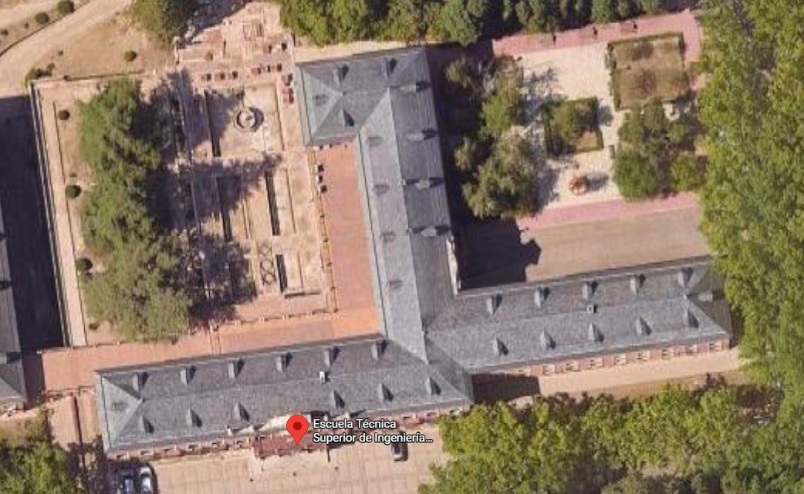
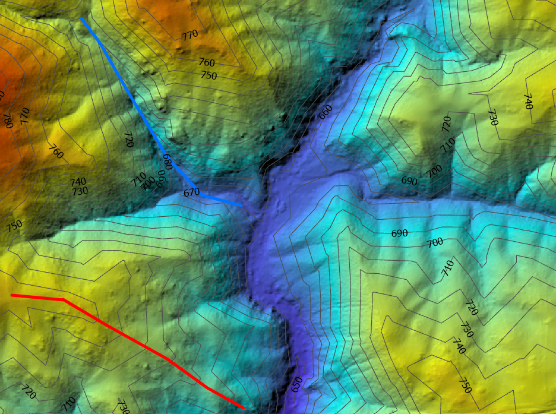

## Índice

::: {.texto-azul style="font-size:0.78em; margin-top:0.8em;"}
-   Repaso: equidistancia, intervalo y pendiente
-   El plano: **recta contenida** en un plano
-   Formas de **definir un plano**
-   **Intersección** de planos
-   Limatesa y limahoya
-   **Vaguadas y divisorias**
:::

## Repaso: el plano graduado

:::: columns
::: {.column width="52%"}
<svg viewBox="0 0 560 400" xmlns="http://www.w3.org/2000/svg" style="width:80%; display:block; margin:0 auto;">
<line x1="120" y1="60" x2="513.9" y2="129.5" stroke="#1a1a1a" stroke-width="3.2"/>
<text x="505.9" y="121.5" font-size="12.5" fill="#1a1a1a" font-weight="700">traza (0)</text>
<line x1="130.4" y1="119.1" x2="524.3" y2="188.5" stroke="#2e9e40" stroke-width="2.4"/>
<text x="528.3" y="192.5" font-size="12.5" fill="#d00000" font-weight="700">2</text>
<line x1="140.8" y1="178.2" x2="534.8" y2="247.6" stroke="#2e9e40" stroke-width="2.4"/>
<text x="538.8" y="251.6" font-size="12.5" fill="#d00000" font-weight="700">4</text>
<line x1="151.3" y1="237.3" x2="545.2" y2="306.7" stroke="#2e9e40" stroke-width="2.4"/>
<text x="549.2" y="310.7" font-size="12.5" fill="#d00000" font-weight="700">6</text>
<line x1="161.7" y1="296.4" x2="555.6" y2="365.8" stroke="#2e9e40" stroke-width="2.4"/>
<text x="559.6" y="369.8" font-size="12.5" fill="#d00000" font-weight="700">8</text>
<line x1="333" y1="77.5" x2="383" y2="361.1" stroke="#d00000" stroke-width="3"/>
<text x="389" y="363.1" font-size="12.5" fill="#d00000" font-weight="700" font-style="italic">l.m.p.</text>
<circle cx="336.7" cy="98.2" r="3.4" fill="#fff" stroke="#1a1a1a" stroke-width="1.6"/>
<circle cx="347.1" cy="157.3" r="3.4" fill="#fff" stroke="#1a1a1a" stroke-width="1.6"/>
<circle cx="357.5" cy="216.4" r="3.4" fill="#fff" stroke="#1a1a1a" stroke-width="1.6"/>
<circle cx="367.9" cy="275.5" r="3.4" fill="#fff" stroke="#1a1a1a" stroke-width="1.6"/>
<circle cx="378.3" cy="334.6" r="3.4" fill="#fff" stroke="#1a1a1a" stroke-width="1.6"/>
<line x1="373.3" y1="219.2" x2="383.7" y2="278.2" stroke="#14532d" stroke-width="3"/>
<text x="390.5" y="250.7" font-size="13" fill="#14532d" font-weight="700">i = 6,67 m</text>
<text x="40" y="390" font-size="12.5" fill="#555">Equidistancia = 2 m · Pendiente del plano = 30 % · Escala 1:500</text>
</svg>
:::

::: {.column width="48%"}
::: {.texto-azul style="font-size:0.64em; margin-top:0.5em;"}
Un plano se representa por la **proyección graduada de su línea de máxima pendiente**.

::: {.fragment}
-   La **equidistancia** es la distancia vertical entre líneas de nivel consecutivas
-   El **intervalo** es su separación horizontal, medida sobre la l.m.p.
-   La **pendiente** del plano es la de su l.m.p.: $\text{pte} = e/i$
:::

::: {.fragment}
Con e = 2 m y pendiente 30 %: $i = 2/0{,}30 = 6{,}67$ m — **constante** en todo el plano.
:::
:::
:::
::::

## Recta contenida en un plano

:::: columns
::: {.column width="58%"}
<svg viewBox="0 0 560 400" xmlns="http://www.w3.org/2000/svg" style="width:78%; display:block; margin:0 auto;">
<line x1="120" y1="55" x2="513.9" y2="124.5" stroke="#1a1a1a" stroke-width="3.2"/>
<text x="509.9" y="116.5" font-size="12.5" fill="#1a1a1a" font-weight="700" text-anchor="end">traza (0)</text>
<line x1="130.4" y1="114.1" x2="524.3" y2="183.5" stroke="#2e9e40" stroke-width="2.4"/>
<text x="529.3" y="187.5" font-size="12.5" fill="#d00000" font-weight="700">2</text>
<line x1="140.8" y1="173.2" x2="534.8" y2="242.6" stroke="#2e9e40" stroke-width="2.4"/>
<text x="539.8" y="246.6" font-size="12.5" fill="#d00000" font-weight="700">4</text>
<line x1="151.3" y1="232.3" x2="545.2" y2="301.7" stroke="#2e9e40" stroke-width="2.4"/>
<text x="550.2" y="305.7" font-size="12.5" fill="#d00000" font-weight="700">6</text>
<line x1="161.7" y1="291.4" x2="555.6" y2="360.8" stroke="#2e9e40" stroke-width="2.4"/>
<text x="560.6" y="364.8" font-size="12.5" fill="#d00000" font-weight="700">8</text>
<line x1="313.8" y1="72" x2="363.3" y2="352.7" stroke="#d00000" stroke-width="2.6"/>
<circle cx="317" cy="89.7" r="3.2" fill="#fff" stroke="#1a1a1a" stroke-width="1.6"/>
<circle cx="327.4" cy="148.8" r="3.2" fill="#fff" stroke="#1a1a1a" stroke-width="1.6"/>
<circle cx="337.8" cy="207.9" r="3.2" fill="#fff" stroke="#1a1a1a" stroke-width="1.6"/>
<circle cx="348.2" cy="267" r="3.2" fill="#fff" stroke="#1a1a1a" stroke-width="1.6"/>
<circle cx="358.6" cy="326.1" r="3.2" fill="#fff" stroke="#1a1a1a" stroke-width="1.6"/>
<text x="369.3" y="354.7" font-size="12" fill="#d00000" font-weight="700" font-style="italic">l.m.p.</text>
<g class="fragment" data-fragment-index="1">
<line x1="453.6" y1="85.2" x2="416.3" y2="393.5" stroke="#6a4a92" stroke-width="2.8"/>
<text x="463.6" y="87.2" font-size="14" fill="#6a4a92" font-weight="700" font-style="italic">s</text>
</g>
<g class="fragment" data-fragment-index="2">
<circle cx="443.4" cy="169.3" r="3.6" fill="#fff" stroke="#1a1a1a" stroke-width="1.6"/>
<text x="450.4" y="185.3" font-size="12.5" fill="#2d2d8a" font-weight="700">(2)</text>
<circle cx="429.9" cy="281.4" r="3.6" fill="#fff" stroke="#1a1a1a" stroke-width="1.6"/>
<text x="436.9" y="297.4" font-size="12.5" fill="#2d2d8a" font-weight="700">(6)</text>
<text x="60" y="372" font-size="12.5" fill="#2d2d8a" font-weight="700">En los cruces con las líneas de nivel, la cota de la recta es la del plano</text>
</g>
<text x="60" y="392" font-size="12" fill="#555">Equidistancia = 2 m</text>
</svg>
:::

::: {.column width="42%"}
::: {.texto-azul style="font-size:0.64em; margin-top:0.8em;"}
Una recta **pertenece a un plano** cuando al menos dos de sus puntos están contenidos en él.

::: {.fragment fragment-index="1"}
Dibujo una recta s cualquiera sobre el plano graduado…
:::

::: {.fragment fragment-index="2"}
…y en las **intersecciones con las líneas de nivel**, la cota de la recta es la de la línea de nivel del plano: la recta queda **graduada por pertenencia**.
:::
:::
:::
::::

## Definir un plano: una línea de nivel y la pendiente

:::: columns
::: {.column width="58%"}
<svg viewBox="0 0 560 400" xmlns="http://www.w3.org/2000/svg" style="width:78%; display:block; margin:0 auto;">
<line x1="130.4" y1="114.1" x2="524.3" y2="183.5" stroke="#2e9e40" stroke-width="3"/>
<text x="529.3" y="187.5" font-size="12.5" fill="#d00000" font-weight="700">2</text>
<text x="60" y="34" font-size="12.5" fill="#444" font-style="italic">dato: una línea de nivel y la pendiente (30 %)</text>
<g class="fragment" data-fragment-index="1">
<line x1="324.3" y1="131.1" x2="363.3" y2="352.7" stroke="#d00000" stroke-width="2.6"/>
<circle cx="327.4" cy="148.8" r="3.2" fill="#fff" stroke="#1a1a1a" stroke-width="1.6"/>
<circle cx="337.8" cy="207.9" r="3.2" fill="#fff" stroke="#1a1a1a" stroke-width="1.6"/>
<circle cx="348.2" cy="267" r="3.2" fill="#fff" stroke="#1a1a1a" stroke-width="1.6"/>
<circle cx="358.6" cy="326.1" r="3.2" fill="#fff" stroke="#1a1a1a" stroke-width="1.6"/>
<text x="347.8" y="199.9" font-size="12.5" fill="#d00000" font-weight="700">i = e / pte = 2 / 0,30 = 6,67 m</text>
</g>
<g class="fragment" data-fragment-index="2">
<line x1="140.8" y1="173.2" x2="534.8" y2="242.6" stroke="#2e9e40" stroke-width="2.4"/>
<text x="539.8" y="246.6" font-size="12.5" fill="#d00000" font-weight="700">4</text>
<line x1="151.3" y1="232.3" x2="545.2" y2="301.7" stroke="#2e9e40" stroke-width="2.4"/>
<text x="550.2" y="305.7" font-size="12.5" fill="#d00000" font-weight="700">6</text>
<line x1="161.7" y1="291.4" x2="555.6" y2="360.8" stroke="#2e9e40" stroke-width="2.4"/>
<text x="560.6" y="364.8" font-size="12.5" fill="#d00000" font-weight="700">8</text>
<line x1="120" y1="55" x2="513.9" y2="124.5" stroke="#1a1a1a" stroke-width="3.2"/>
<text x="509.9" y="116.5" font-size="12.5" fill="#1a1a1a" font-weight="700" text-anchor="end">traza (0)</text>
</g>
<text x="60" y="392" font-size="12" fill="#555">Equidistancia = 2 m · Escala 1:500</text>
</svg>
:::

::: {.column width="42%"}
::: {.texto-azul style="font-size:0.64em; margin-top:0.8em;"}
**Dato**: una línea de nivel del plano y su pendiente.

::: {.fragment fragment-index="1"}
Calculo el **intervalo** y **gradúo la l.m.p.** (perpendicular a la línea de nivel):

$$i = \frac{e}{\text{pte}} = \frac{2}{0{,}30} = 6{,}67 \text{ m}$$
:::

::: {.fragment fragment-index="2"}
Las demás líneas de nivel son **paralelas** por los puntos graduados.
:::
:::
:::
::::

## Definir un plano: una recta y un punto

:::: columns
::: {.column width="58%"}
<svg viewBox="0 0 560 400" xmlns="http://www.w3.org/2000/svg" style="width:78%; display:block; margin:0 auto;">
<line x1="226.1" y1="50.8" x2="376.9" y2="386.6" stroke="#1a1a1a" stroke-width="2.6"/>
<text x="218.1" y="42.8" font-size="12" fill="#444" font-style="italic">recta graduada</text>
<circle cx="237.3" cy="75.7" r="3.4" fill="#fff" stroke="#1a1a1a" stroke-width="1.6"/>
<text x="233.3" y="93.7" font-size="12" fill="#2d2d8a" font-weight="700">0</text>
<circle cx="265.2" cy="137.9" r="3.4" fill="#fff" stroke="#1a1a1a" stroke-width="1.6"/>
<text x="261.2" y="155.9" font-size="12" fill="#2d2d8a" font-weight="700">2</text>
<circle cx="293.2" cy="200" r="3.4" fill="#fff" stroke="#1a1a1a" stroke-width="1.6"/>
<text x="289.2" y="218" font-size="12" fill="#2d2d8a" font-weight="700">4</text>
<circle cx="321.1" cy="262.2" r="3.4" fill="#fff" stroke="#1a1a1a" stroke-width="1.6"/>
<text x="317.1" y="280.2" font-size="12" fill="#2d2d8a" font-weight="700">6</text>
<circle cx="349" cy="324.4" r="3.4" fill="#fff" stroke="#1a1a1a" stroke-width="1.6"/>
<text x="345" y="342.4" font-size="12" fill="#2d2d8a" font-weight="700">8</text>
<circle cx="477.1" cy="175.2" r="3.6" fill="#fff" stroke="#1a1a1a" stroke-width="1.6"/>
<text x="484.1" y="169.2" font-size="12.5" fill="#2d2d8a" font-weight="700">m(2)</text>
<g class="fragment" data-fragment-index="1">
<line x1="265.2" y1="137.9" x2="515.2" y2="181.9" stroke="#2e9e40" stroke-width="3"/>
<text x="371.1" y="146.5" font-size="12" fill="#2e9e40" font-weight="700">línea de nivel 2</text>
</g>
<g class="fragment" data-fragment-index="2">
<line x1="197.9" y1="68.7" x2="500" y2="122" stroke="#1a1a1a" stroke-width="3"/>
<text x="506" y="126" font-size="12" fill="#1a1a1a" font-weight="700">traza (0)</text>
<line x1="253.8" y1="193.1" x2="500" y2="236.5" stroke="#2e9e40" stroke-width="2.2"/>
<text x="506" y="240.5" font-size="12" fill="#d00000" font-weight="700">4</text>
<line x1="281.7" y1="255.3" x2="500" y2="293.8" stroke="#2e9e40" stroke-width="2.2"/>
<text x="506" y="297.8" font-size="12" fill="#d00000" font-weight="700">6</text>
<line x1="309.6" y1="317.4" x2="500" y2="351" stroke="#2e9e40" stroke-width="2.2"/>
<text x="506" y="355" font-size="12" fill="#d00000" font-weight="700">8</text>
<text x="60" y="372" font-size="12.5" fill="#2d2d8a" font-weight="700">Las demás líneas de nivel: paralelas por los puntos de cota de la recta</text>
</g>
<text x="60" y="392" font-size="12" fill="#555">Equidistancia = 2 m</text>
</svg>
:::

::: {.column width="42%"}
::: {.texto-azul style="font-size:0.64em; margin-top:0.8em;"}
**Dato**: una recta graduada y un punto exterior con cota.

::: {.fragment fragment-index="1"}
La **línea de nivel** que pasa por el punto une m(2) con el punto de cota 2 de la recta.
:::

::: {.fragment fragment-index="2"}
Las demás son **paralelas a ella** por los puntos de cota de la recta.

Otras variantes del dato — **dos puntos** con cota y **un punto y la pendiente** — se reducen a ésta graduando primero.
:::
:::
:::
::::

## Definir un plano: tres puntos

:::: columns
::: {.column width="58%"}
<svg viewBox="0 0 560 400" xmlns="http://www.w3.org/2000/svg" style="width:78%; display:block; margin:0 auto;">
<circle cx="140" cy="300" r="3.8" fill="#fff" stroke="#1a1a1a" stroke-width="1.6"/>
<text x="148" y="316" font-size="13" fill="#2d2d8a" font-weight="700">a(2)</text>
<circle cx="430" cy="120" r="3.8" fill="#fff" stroke="#1a1a1a" stroke-width="1.6"/>
<text x="438" y="136" font-size="13" fill="#2d2d8a" font-weight="700">b(8)</text>
<circle cx="410" cy="330" r="3.8" fill="#fff" stroke="#1a1a1a" stroke-width="1.6"/>
<text x="370" y="352" font-size="13" fill="#2d2d8a" font-weight="700">c(4)</text>
<text x="70" y="60" font-size="12.5" fill="#444" font-style="italic">dato: tres puntos no alineados</text>
<g class="fragment" data-fragment-index="1">
<line x1="140" y1="300" x2="430" y2="120" stroke="#1a1a1a" stroke-width="2.6"/>
<circle cx="236.7" cy="240" r="3.4" fill="#fff" stroke="#1a1a1a" stroke-width="1.6"/>
<text x="230.7" y="258" font-size="12" fill="#2d2d8a" font-weight="700">(4)</text>
<circle cx="333.3" cy="180" r="3.4" fill="#fff" stroke="#1a1a1a" stroke-width="1.6"/>
<text x="327.3" y="198" font-size="12" fill="#2d2d8a" font-weight="700">(6)</text>
<text x="150" y="130" font-size="12" fill="#555" font-style="italic">uno a y b, y gradúo ab</text>
</g>
<g class="fragment" data-fragment-index="2">
<line x1="210" y1="226.2" x2="454.4" y2="353" stroke="#2e9e40" stroke-width="3"/>
<text x="463.7" y="359.8" font-size="12" fill="#2e9e40" font-weight="700">línea de nivel 4</text>
<text x="70" y="372" font-size="12.5" fill="#2d2d8a" font-weight="700">…y ya es el caso anterior: recta graduada + punto</text>
</g>
<text x="70" y="392" font-size="12" fill="#555">Equidistancia = 2 m</text>
</svg>
:::

::: {.column width="42%"}
::: {.texto-azul style="font-size:0.64em; margin-top:0.8em;"}
**Dato**: tres puntos no alineados — la forma clásica de definir un plano.

::: {.fragment fragment-index="1"}
**Uno dos puntos** y tengo una recta, que gradúo entre sus cotas (de 2 a 8 por tercios: 4 y 6).
:::

::: {.fragment fragment-index="2"}
Con la recta graduada y el tercer punto… **se reduce al caso anterior**.
:::
:::
:::
::::

## Intersección de planos

:::: columns
::: {.column width="56%"}
<svg viewBox="0 0 620 420" xmlns="http://www.w3.org/2000/svg" style="width:80%; display:block; margin:0 auto;">
<g class="fragment" data-fragment-index="1">
<line x1="60" y1="344" x2="420" y2="316" stroke="#2e9e40" stroke-width="2.4"/>
<text x="52" y="348" font-size="12" fill="#2e9e40" font-weight="700" text-anchor="end">100</text>
<line x1="60" y1="282" x2="420" y2="254" stroke="#2e9e40" stroke-width="2.4"/>
<text x="52" y="286" font-size="12" fill="#2e9e40" font-weight="700" text-anchor="end">105</text>
<line x1="60" y1="220" x2="420" y2="192" stroke="#2e9e40" stroke-width="2.4"/>
<text x="52" y="224" font-size="12" fill="#2e9e40" font-weight="700" text-anchor="end">110</text>
<line x1="60" y1="158" x2="420" y2="130" stroke="#2e9e40" stroke-width="2.4"/>
<text x="52" y="162" font-size="12" fill="#2e9e40" font-weight="700" text-anchor="end">115</text>
<text x="120" y="396" font-size="12.5" fill="#2e9e40" font-weight="700">plano verde: gradúo sus líneas de nivel</text>
</g>
<g class="fragment" data-fragment-index="2">
<line x1="180" y1="60" x2="226" y2="400" stroke="#c05ad0" stroke-width="2.4"/>
<text x="178" y="52" font-size="12" fill="#a03ab0" font-weight="700">100</text>
<line x1="268" y1="60" x2="314" y2="400" stroke="#c05ad0" stroke-width="2.4"/>
<text x="266" y="52" font-size="12" fill="#a03ab0" font-weight="700">105</text>
<line x1="356" y1="60" x2="402" y2="400" stroke="#c05ad0" stroke-width="2.4"/>
<text x="354" y="52" font-size="12" fill="#a03ab0" font-weight="700">110</text>
<line x1="444" y1="60" x2="490" y2="400" stroke="#c05ad0" stroke-width="2.4"/>
<text x="442" y="52" font-size="12" fill="#a03ab0" font-weight="700">115</text>
<text x="480" y="90" font-size="12.5" fill="#a03ab0" font-weight="700">plano rosa:</text>
<text x="480" y="106" font-size="12.5" fill="#a03ab0" font-weight="700">gradúo</text>
</g>
<g class="fragment" data-fragment-index="3">
<circle cx="216.8" cy="331.8" r="4" fill="#fff" stroke="#1a1a1a" stroke-width="1.6"/>
<circle cx="295.6" cy="263.7" r="4" fill="#fff" stroke="#1a1a1a" stroke-width="1.6"/>
<circle cx="374.3" cy="195.6" r="4" fill="#fff" stroke="#1a1a1a" stroke-width="1.6"/>
<circle cx="453.1" cy="127.4" r="4" fill="#fff" stroke="#1a1a1a" stroke-width="1.6"/>
<line x1="216.8" y1="331.8" x2="453.1" y2="127.4" stroke="#d2b077" stroke-width="5" stroke-linecap="round"/>
<circle cx="216.8" cy="331.8" r="4" fill="#fff" stroke="#1a1a1a" stroke-width="1.6"/>
<circle cx="295.6" cy="263.7" r="4" fill="#fff" stroke="#1a1a1a" stroke-width="1.6"/>
<circle cx="374.3" cy="195.6" r="4" fill="#fff" stroke="#1a1a1a" stroke-width="1.6"/>
<circle cx="453.1" cy="127.4" r="4" fill="#fff" stroke="#1a1a1a" stroke-width="1.6"/>
<text x="608" y="386" font-size="13" fill="#8a6a30" font-weight="700" text-anchor="end">intersección: puntos de igual cota</text>
</g>
<text x="52" y="416" font-size="12" fill="#555">Equidistancia = 5 m</text>
</svg>
:::

::: {.column width="44%"}
::: {.texto-azul style="font-size:0.64em; margin-top:0.8em;"}
La intersección de dos planos es una **recta**: la que une los puntos donde se cortan las **líneas de nivel de igual cota**.

::: {.fragment fragment-index="1"}
Gradúo el plano verde…
:::
::: {.fragment fragment-index="2"}
…gradúo el plano rosa…
:::
::: {.fragment fragment-index="3"}
…y **uno los cruces de igual cota**: 100 con 100, 105 con 105…

La recta intersección queda **graduada** automáticamente.
:::
:::
:::
::::

## Limatesa y limahoya

:::: columns
::: {.column width="58%"}

La E.T.S.I. de Montes vista desde arriba (imagen: Google Maps)

:::

::: {.column width="42%"}
::: {.texto-azul style="font-size:0.62em; margin-top:0.6em;"}
Los faldones de una cubierta son **planos que se cortan**: sus intersecciones se ven perfectamente desde el aire.

::: {.fragment}
-   **Limatesa**: intersección por la que el agua **se separa** (caballete, aristas salientes)
-   **Limahoya**: intersección por la que el agua **se junta** (rincones entrantes)
:::

::: {.fragment}
En el terreno pasa exactamente lo mismo… pero con otros nombres: **divisorias** y **vaguadas**.
:::
:::
:::
::::

## ¿Vaguada o divisoria?

:::: columns
::: {.column width="54%"}
<svg viewBox="-10 -14 500 400" xmlns="http://www.w3.org/2000/svg" style="width:76%; display:block; margin:0 auto;">
<rect x="-10" y="-14" width="500" height="400" fill="#fdfbf7"/>
<path d="M 461.4,360.0 L 480.0,346.6" fill="none" stroke="#8a5a2a" stroke-width="2.2" stroke-linejoin="round"/>
<path d="M 0.0,271.3 C 3.5,275.6 13.7,289.8 21.0,296.9 C 28.3,304.0 35.8,309.6 44.0,313.9 C 52.2,318.2 61.2,321.2 70.0,322.6 C 78.8,324.0 89.0,323.4 97.0,322.2 C 105.0,321.0 111.2,318.6 118.0,315.2 C 124.8,311.8 132.2,306.5 138.0,301.8 C 143.8,297.1 145.7,295.1 152.7,286.8 C 159.7,278.5 172.9,260.2 180.0,252.2 C 187.1,244.2 189.5,242.4 195.0,238.6 C 200.5,234.8 207.3,231.0 213.0,229.3 C 218.7,227.6 225.2,227.8 229.0,228.2 C 232.8,228.6 233.8,230.0 235.8,231.6 C 237.8,233.2 236.1,228.5 241.0,237.5 C 245.9,246.5 257.2,272.7 265.0,285.8 C 272.8,298.9 279.0,306.6 288.0,315.9 C 297.0,325.2 307.9,334.3 319.0,341.7 C 330.1,349.1 348.5,356.9 354.4,360.0" fill="none" stroke="#8a5a2a" stroke-width="2.2" stroke-linejoin="round"/>
<path d="M 480.0,235.0 C 478.0,232.4 472.5,224.7 468.0,219.6 C 463.5,214.5 458.3,209.3 453.0,204.6 C 447.7,199.9 441.8,195.4 436.0,191.3 C 430.2,187.2 427.3,184.8 418.0,180.3 C 408.7,175.9 396.0,169.4 380.0,164.6 C 364.0,159.8 333.8,154.7 322.0,151.2 C 310.2,147.7 312.0,145.9 309.2,143.4 C 306.4,140.9 306.3,139.1 305.4,136.4 C 304.5,133.7 303.8,137.1 303.9,127.4 C 304.0,117.7 306.1,91.1 305.9,78.2 C 305.7,65.3 304.9,59.3 302.6,50.1 C 300.3,40.9 296.7,31.5 292.2,23.1 C 287.7,14.8 278.2,3.9 275.4,0.0" fill="none" stroke="#8a5a2a" stroke-width="2.2" stroke-linejoin="round"/>
<path d="M 7.9,0.0 L 0.0,5.9" fill="none" stroke="#8a5a2a" stroke-width="2.2" stroke-linejoin="round"/>
<path d="M 0.0,193.8 C 4.9,202.6 22.0,234.5 29.4,246.7 C 36.8,258.8 40.3,261.9 44.6,266.7 C 48.9,271.5 51.4,273.1 55.0,275.5 C 58.6,277.9 62.3,279.9 66.0,281.3 C 69.7,282.8 73.2,283.7 77.0,284.2 C 80.8,284.7 84.5,285.1 89.0,284.5 C 93.5,283.9 99.2,282.6 104.0,280.5 C 108.8,278.4 113.9,275.1 118.1,271.8 C 122.3,268.5 123.7,267.4 129.4,260.7 C 135.1,254.0 146.2,238.8 152.3,231.6 C 158.4,224.4 152.9,227.9 165.7,217.6 C 178.5,207.2 215.7,180.9 229.1,169.5 C 242.5,158.1 241.4,156.8 246.3,149.4 C 251.2,142.0 255.4,133.8 258.6,125.3 C 261.8,116.8 264.3,107.1 265.5,98.3 C 266.7,89.5 266.8,80.4 265.7,72.2 C 264.6,64.0 262.3,56.3 259.2,49.1 C 256.1,41.9 251.8,35.2 246.8,29.1 C 241.8,23.0 235.8,17.4 229.0,12.6 C 222.2,7.7 209.9,2.1 206.1,0.0" fill="none" stroke="#8a5a2a" stroke-width="1.1" stroke-linejoin="round"/>
<path d="M 88.0,0.0 C 83.7,1.8 70.4,6.7 62.0,11.1 C 53.6,15.4 45.2,20.6 37.7,26.1 C 30.2,31.6 23.0,37.8 16.7,44.1 C 10.4,50.4 2.8,60.8 0.0,64.1" fill="none" stroke="#8a5a2a" stroke-width="1.1" stroke-linejoin="round"/>
<path d="M 390.0,343.0 C 393.5,343.1 404.3,344.2 411.0,343.7 C 417.7,343.2 424.2,342.0 430.0,340.1 C 435.8,338.2 441.3,335.6 446.0,332.4 C 450.7,329.2 455.1,325.1 458.4,320.9 C 461.7,316.6 464.2,312.1 466.0,306.9 C 467.8,301.7 468.9,295.6 469.0,289.8 C 469.1,284.0 468.3,277.8 466.7,271.8 C 465.1,265.8 462.6,259.6 459.5,253.7 C 456.4,247.8 452.6,242.1 448.0,236.6 C 443.4,231.1 437.9,225.4 432.2,220.6 C 426.5,215.8 420.5,211.5 414.0,207.7 C 407.5,203.9 400.2,200.3 393.0,197.6 C 385.8,194.9 378.2,192.8 371.0,191.4 C 363.8,190.0 356.8,189.3 350.0,189.3 C 343.2,189.3 336.3,189.9 330.0,191.3 C 323.7,192.7 316.5,195.6 312.0,197.7 C 307.5,199.8 305.7,201.5 303.0,203.8 C 300.3,206.1 298.3,207.1 295.7,211.6 C 293.1,216.1 288.9,223.4 287.6,230.6 C 286.3,237.8 286.2,246.5 287.7,254.7 C 289.2,262.9 292.5,271.9 296.7,279.8 C 300.9,287.8 306.6,295.5 313.0,302.4 C 319.4,309.3 326.8,315.8 335.0,321.3 C 343.2,326.8 352.8,332.0 362.0,335.6 C 371.2,339.2 385.3,341.8 390.0,343.0" fill="none" stroke="#8a5a2a" stroke-width="1.1" stroke-linejoin="round"/>
<path d="M 388.0,322.9 C 390.5,323.0 398.2,323.8 403.0,323.4 C 407.8,323.0 412.7,322.0 417.0,320.6 C 421.3,319.2 425.3,317.2 428.7,314.9 C 432.1,312.6 434.9,309.9 437.3,306.9 C 439.7,303.9 441.6,300.5 442.9,296.8 C 444.2,293.1 445.0,289.0 445.1,284.8 C 445.2,280.6 444.8,276.2 443.7,271.8 C 442.6,267.4 441.1,263.1 438.8,258.7 C 436.6,254.3 433.4,249.7 430.2,245.7 C 427.0,241.7 423.6,238.2 419.6,234.7 C 415.6,231.2 410.8,227.6 406.0,224.7 C 401.2,221.8 396.2,219.2 391.0,217.2 C 385.8,215.2 380.2,213.6 375.0,212.5 C 369.8,211.4 364.8,210.9 360.0,210.9 C 355.2,210.9 350.5,211.3 346.0,212.3 C 341.5,213.3 337.3,214.3 333.0,216.8 C 328.7,219.3 323.3,223.3 320.0,227.5 C 316.7,231.7 314.5,236.5 313.4,241.7 C 312.2,246.9 312.2,253.0 313.1,258.7 C 314.0,264.4 315.9,270.1 318.9,275.8 C 321.9,281.5 326.2,287.6 330.9,292.8 C 335.6,298.0 341.0,302.8 347.0,306.9 C 353.0,311.0 360.2,314.8 367.0,317.5 C 373.8,320.2 384.5,322.0 388.0,322.9" fill="none" stroke="#8a5a2a" stroke-width="1.1" stroke-linejoin="round"/>
<path d="M 82.0,250.7 C 84.2,250.4 90.5,250.7 95.0,249.1 C 99.5,247.5 100.5,248.2 109.0,240.9 C 117.5,233.7 129.7,219.0 145.8,205.6 C 162.0,192.2 193.5,170.4 205.9,160.4 C 218.3,150.4 215.8,150.7 220.0,145.4 C 224.2,140.1 228.2,133.8 231.1,128.4 C 234.0,123.1 235.8,118.5 237.4,113.3 C 239.1,108.1 240.3,102.5 241.0,97.3 C 241.7,92.1 241.8,87.2 241.4,82.2 C 241.0,77.2 240.1,72.0 238.7,67.2 C 237.2,62.4 235.1,57.5 232.7,53.1 C 230.3,48.8 227.4,44.8 224.1,41.1 C 220.8,37.4 217.0,33.9 213.0,30.8 C 209.0,27.7 206.0,25.3 200.0,22.5 C 194.0,19.7 185.2,15.9 177.0,13.9 C 168.8,11.9 159.8,10.7 151.0,10.3 C 142.2,10.0 133.0,10.5 124.0,11.8 C 115.0,13.1 105.8,15.4 97.0,18.3 C 88.2,21.2 79.2,25.1 71.0,29.5 C 62.8,33.9 55.0,39.2 48.0,44.8 C 41.0,50.4 34.7,56.6 29.2,63.2 C 23.7,69.8 18.8,77.5 15.2,84.2 C 11.7,90.9 9.6,97.0 7.9,103.3 C 6.2,109.6 5.2,115.9 5.0,122.3 C 4.8,128.7 5.4,135.1 6.6,141.4 C 7.8,147.8 9.1,152.7 12.3,160.4 C 15.5,168.1 19.1,175.6 26.0,187.5 C 32.9,199.4 46.7,222.0 53.5,231.6 C 60.3,241.2 62.2,241.8 67.0,245.0 C 71.8,248.2 79.5,249.8 82.0,250.7" fill="none" stroke="#8a5a2a" stroke-width="1.1" stroke-linejoin="round"/>
<path d="M 387.0,302.9 C 390.0,302.5 400.0,302.5 405.0,300.6 C 410.0,298.7 414.5,294.0 417.0,291.4 C 419.5,288.8 419.4,287.2 420.1,284.8 C 420.8,282.4 421.7,280.8 421.1,276.8 C 420.5,272.8 419.3,265.9 416.4,260.7 C 413.5,255.5 408.7,249.9 403.6,245.7 C 398.5,241.5 392.1,237.8 386.0,235.5 C 379.9,233.2 373.0,231.8 367.0,231.9 C 361.0,232.0 354.2,234.0 350.0,235.8 C 345.8,237.6 343.9,240.0 341.9,242.7 C 339.9,245.3 338.5,248.4 337.8,251.7 C 337.1,255.0 337.1,259.0 337.7,262.7 C 338.3,266.4 339.7,270.1 341.7,273.8 C 343.7,277.5 346.7,281.5 349.9,284.8 C 353.1,288.1 357.0,291.2 361.0,293.8 C 365.0,296.4 369.7,298.6 374.0,300.1 C 378.3,301.6 384.8,302.4 387.0,302.9" fill="none" stroke="#8a5a2a" stroke-width="1.1" stroke-linejoin="round"/>
<path d="M 83.0,210.7 C 84.8,210.7 90.2,211.6 94.0,210.9 C 97.8,210.2 95.0,212.9 106.0,206.8 C 117.0,200.7 146.0,183.6 160.0,174.5 C 174.0,165.4 181.7,159.8 189.8,152.4 C 197.9,145.1 203.8,138.2 208.8,130.4 C 213.8,122.6 217.6,111.7 219.7,105.3 C 221.8,98.9 221.3,96.5 221.4,92.3 C 221.5,88.1 221.2,84.0 220.5,80.2 C 219.8,76.4 218.9,72.9 217.4,69.2 C 215.9,65.5 213.9,61.7 211.5,58.2 C 209.1,54.7 206.1,51.2 203.0,48.2 C 199.9,45.2 197.7,43.1 193.0,40.4 C 188.3,37.7 181.3,34.0 175.0,31.9 C 168.7,29.8 162.0,28.3 155.0,27.5 C 148.0,26.7 140.3,26.6 133.0,27.2 C 125.7,27.8 118.3,28.9 111.0,30.8 C 103.7,32.7 96.0,35.4 89.0,38.6 C 82.0,41.8 75.2,45.6 69.0,49.8 C 62.8,54.0 57.0,58.9 52.0,64.0 C 47.0,69.1 42.5,74.8 38.9,80.2 C 35.3,85.6 32.7,90.8 30.6,96.3 C 28.5,101.8 27.1,107.6 26.3,113.3 C 25.5,119.0 25.4,124.7 26.0,130.4 C 26.6,136.1 27.6,141.2 29.8,147.4 C 32.0,153.6 35.1,160.5 39.3,167.5 C 43.5,174.5 49.9,183.4 55.0,189.5 C 60.1,195.6 65.3,200.8 70.0,204.3 C 74.7,207.8 80.8,209.6 83.0,210.7" fill="none" stroke="#8a5a2a" stroke-width="1.1" stroke-linejoin="round"/>
<path d="M 94.0,181.5 C 97.8,180.9 108.0,180.9 117.0,178.0 C 126.0,175.1 138.5,169.4 148.0,164.1 C 157.5,158.8 166.7,152.5 173.9,146.4 C 181.1,140.3 186.8,133.9 191.3,127.4 C 195.8,120.9 199.0,114.2 200.8,107.3 C 202.6,100.4 203.2,92.7 202.3,86.2 C 201.4,79.7 199.1,73.6 195.5,68.2 C 191.9,62.8 185.8,57.2 181.0,53.6 C 176.2,50.0 172.0,48.4 167.0,46.6 C 162.0,44.8 156.7,43.5 151.0,42.7 C 145.3,42.0 139.0,41.8 133.0,42.1 C 127.0,42.5 121.0,43.3 115.0,44.8 C 109.0,46.3 102.7,48.4 97.0,50.9 C 91.3,53.4 86.0,56.4 81.0,59.7 C 76.0,63.1 71.2,66.9 67.0,71.0 C 62.8,75.1 59.1,79.5 56.0,84.1 C 52.9,88.6 50.5,93.4 48.6,98.3 C 46.7,103.2 45.4,108.3 44.8,113.3 C 44.2,118.3 44.3,123.6 44.9,128.4 C 45.5,133.2 46.6,137.6 48.6,142.4 C 50.6,147.2 53.6,152.8 56.8,157.4 C 60.0,162.0 64.0,166.3 68.0,169.8 C 72.0,173.3 76.7,176.4 81.0,178.3 C 85.3,180.2 91.8,181.0 94.0,181.5" fill="none" stroke="#8a5a2a" stroke-width="1.1" stroke-linejoin="round"/>
<path d="M 100.0,159.5 C 103.0,159.3 111.5,159.9 118.0,158.5 C 124.5,157.1 132.2,154.5 139.0,151.3 C 145.8,148.1 152.8,143.9 158.6,139.4 C 164.3,134.9 169.7,129.3 173.5,124.3 C 177.3,119.3 179.8,114.5 181.5,109.3 C 183.2,104.1 184.0,98.3 183.7,93.3 C 183.4,88.3 181.9,83.5 179.5,79.2 C 177.1,74.9 172.4,70.3 169.0,67.4 C 165.6,64.5 162.7,63.2 159.0,61.7 C 155.3,60.2 151.2,59.0 147.0,58.3 C 142.8,57.6 138.5,57.2 134.0,57.3 C 129.5,57.4 124.7,57.9 120.0,58.9 C 115.3,59.9 110.3,61.5 106.0,63.2 C 101.7,64.9 97.8,66.8 94.0,69.2 C 90.2,71.6 86.3,74.4 83.0,77.4 C 79.7,80.4 76.6,83.7 74.0,87.2 C 71.4,90.7 69.2,94.6 67.5,98.3 C 65.8,102.0 64.8,105.5 64.1,109.3 C 63.4,113.1 63.3,117.5 63.6,121.3 C 63.9,125.1 64.7,128.5 66.0,132.0 C 67.3,135.5 69.3,139.3 71.5,142.4 C 73.7,145.5 76.1,148.1 79.0,150.5 C 81.9,152.9 85.5,155.1 89.0,156.6 C 92.5,158.1 98.2,159.0 100.0,159.5" fill="none" stroke="#8a5a2a" stroke-width="2.2" stroke-linejoin="round"/>
<path d="M 107.0,137.6 C 109.0,137.7 114.8,138.4 119.0,137.9 C 123.2,137.4 127.8,136.2 132.0,134.5 C 136.2,132.8 140.5,130.4 144.0,127.9 C 147.5,125.4 150.7,122.4 153.2,119.3 C 155.7,116.2 157.9,112.6 159.2,109.3 C 160.5,106.0 161.1,102.5 161.1,99.3 C 161.1,96.1 160.2,93.1 158.9,90.3 C 157.6,87.5 156.2,85.0 153.0,82.7 C 149.8,80.4 144.8,77.7 140.0,76.6 C 135.2,75.5 129.3,75.4 124.0,76.2 C 118.7,77.0 112.9,78.9 108.0,81.6 C 103.1,84.3 98.0,88.2 94.5,92.3 C 91.0,96.4 88.2,101.7 87.0,106.3 C 85.8,110.9 85.8,115.7 87.0,119.9 C 88.2,124.1 90.9,128.5 94.2,131.4 C 97.5,134.3 104.9,136.6 107.0,137.6" fill="none" stroke="#8a5a2a" stroke-width="1.1" stroke-linejoin="round"/>
<path d="M 272,176 L 305.4,146 L 329.2,127.9 L 357,111.1 L 382.1,99.9 L 406.2,93.3 L 428.6,91.6 L 453.4,94.6 L 479.8,102.2" fill="none" stroke="#111" stroke-width="3.6" stroke-linejoin="round"/>
<text x="240" y="372" font-size="14" fill="#111" font-weight="700" text-anchor="middle" stroke="#ffffff" stroke-width="3.5" stroke-linejoin="round" opacity="0.9">¿La línea negra es vaguada o divisoria?</text>
<text x="240" y="372" font-size="14" fill="#111" font-weight="700" text-anchor="middle">¿La línea negra es vaguada o divisoria?</text>
<g class="fragment" data-fragment-index="1">
<text x="144" y="131.9" font-size="13" fill="#8a5a2a" font-weight="700" text-anchor="middle" stroke="#ffffff" stroke-width="3.5" stroke-linejoin="round" opacity="0.9">160</text>
<text x="144" y="131.9" font-size="13" fill="#8a5a2a" font-weight="700" text-anchor="middle">160</text>
<text x="81" y="63.7" font-size="13" fill="#8a5a2a" font-weight="700" text-anchor="middle" stroke="#ffffff" stroke-width="3.5" stroke-linejoin="round" opacity="0.9">140</text>
<text x="81" y="63.7" font-size="13" fill="#8a5a2a" font-weight="700" text-anchor="middle">140</text>
<text x="438.8" y="262.7" font-size="13" fill="#8a5a2a" font-weight="700" text-anchor="middle" stroke="#ffffff" stroke-width="3.5" stroke-linejoin="round" opacity="0.9">120</text>
<text x="438.8" y="262.7" font-size="13" fill="#8a5a2a" font-weight="700" text-anchor="middle">120</text>
<text x="213" y="233.3" font-size="13" fill="#8a5a2a" font-weight="700" text-anchor="middle" stroke="#ffffff" stroke-width="3.5" stroke-linejoin="round" opacity="0.9">100</text>
<text x="213" y="233.3" font-size="13" fill="#8a5a2a" font-weight="700" text-anchor="middle">100</text>
<text x="155" y="31.5" font-size="13" fill="#8a5a2a" font-weight="700" text-anchor="middle" stroke="#ffffff" stroke-width="3.5" stroke-linejoin="round" opacity="0.9">130</text>
<text x="155" y="31.5" font-size="13" fill="#8a5a2a" font-weight="700" text-anchor="middle">130</text>
<text x="37.7" y="30.1" font-size="13" fill="#8a5a2a" font-weight="700" text-anchor="middle" stroke="#ffffff" stroke-width="3.5" stroke-linejoin="round" opacity="0.9">110</text>
<text x="37.7" y="30.1" font-size="13" fill="#8a5a2a" font-weight="700" text-anchor="middle">110</text>
<text x="89" y="288.5" font-size="13" fill="#8a5a2a" font-weight="700" text-anchor="middle" stroke="#ffffff" stroke-width="3.5" stroke-linejoin="round" opacity="0.9">110</text>
<text x="89" y="288.5" font-size="13" fill="#8a5a2a" font-weight="700" text-anchor="middle">110</text>
<text x="468" y="196" font-size="13" fill="#1d6fd0" font-weight="700" text-anchor="end" stroke="#ffffff" stroke-width="3.5" stroke-linejoin="round" opacity="0.9">con las cotas: el terreno baja hacia el NE</text>
<text x="468" y="196" font-size="13" fill="#1d6fd0" font-weight="700" text-anchor="end">con las cotas: el terreno baja hacia el NE</text>
<text x="468" y="214" font-size="13" fill="#1d6fd0" font-weight="700" text-anchor="end" stroke="#ffffff" stroke-width="3.5" stroke-linejoin="round" opacity="0.9">y las curvas apuntan aguas arriba: VAGUADA</text>
<text x="468" y="214" font-size="13" fill="#1d6fd0" font-weight="700" text-anchor="end">y las curvas apuntan aguas arriba: VAGUADA</text>
</g>
</svg>
:::

::: {.column width="46%"}
::: {.texto-azul style="font-size:0.62em; margin-top:0.8em;"}
Sin las cotas **no se puede saber**: una vaguada y una divisoria son, ambas, líneas perpendiculares a las curvas de nivel.
:::

::: {.fragment}

En un modelo real, con cotas y sombreado: la línea azul <b>recoge</b> el agua (vaguada) y la roja la <b>separa</b> (divisoria)

:::
:::
::::

## Vaguadas y divisorias en nuestro terreno

:::: columns
::: {.column width="56%"}
<svg viewBox="-10 -14 500 400" xmlns="http://www.w3.org/2000/svg" style="width:76%; display:block; margin:0 auto;">
<defs><marker id="vg-flecha-azul" viewBox="0 0 10 10" refX="8.5" refY="5" markerWidth="7" markerHeight="7" orient="auto-start-reverse"><path d="M 0 0 L 10 5 L 0 10 z" fill="#1d6fd0"/></marker><marker id="vg-flecha-rojo" viewBox="0 0 10 10" refX="8.5" refY="5" markerWidth="7" markerHeight="7" orient="auto-start-reverse"><path d="M 0 0 L 10 5 L 0 10 z" fill="#d00000"/></marker></defs>
<rect x="-10" y="-14" width="500" height="400" fill="#fdfbf7"/>
<path d="M 461.4,360.0 L 480.0,346.6" fill="none" stroke="#8a5a2a" stroke-width="2.2" stroke-linejoin="round"/>
<path d="M 0.0,271.3 C 3.5,275.6 13.7,289.8 21.0,296.9 C 28.3,304.0 35.8,309.6 44.0,313.9 C 52.2,318.2 61.2,321.2 70.0,322.6 C 78.8,324.0 89.0,323.4 97.0,322.2 C 105.0,321.0 111.2,318.6 118.0,315.2 C 124.8,311.8 132.2,306.5 138.0,301.8 C 143.8,297.1 145.7,295.1 152.7,286.8 C 159.7,278.5 172.9,260.2 180.0,252.2 C 187.1,244.2 189.5,242.4 195.0,238.6 C 200.5,234.8 207.3,231.0 213.0,229.3 C 218.7,227.6 225.2,227.8 229.0,228.2 C 232.8,228.6 233.8,230.0 235.8,231.6 C 237.8,233.2 236.1,228.5 241.0,237.5 C 245.9,246.5 257.2,272.7 265.0,285.8 C 272.8,298.9 279.0,306.6 288.0,315.9 C 297.0,325.2 307.9,334.3 319.0,341.7 C 330.1,349.1 348.5,356.9 354.4,360.0" fill="none" stroke="#8a5a2a" stroke-width="2.2" stroke-linejoin="round"/>
<path d="M 480.0,235.0 C 478.0,232.4 472.5,224.7 468.0,219.6 C 463.5,214.5 458.3,209.3 453.0,204.6 C 447.7,199.9 441.8,195.4 436.0,191.3 C 430.2,187.2 427.3,184.8 418.0,180.3 C 408.7,175.9 396.0,169.4 380.0,164.6 C 364.0,159.8 333.8,154.7 322.0,151.2 C 310.2,147.7 312.0,145.9 309.2,143.4 C 306.4,140.9 306.3,139.1 305.4,136.4 C 304.5,133.7 303.8,137.1 303.9,127.4 C 304.0,117.7 306.1,91.1 305.9,78.2 C 305.7,65.3 304.9,59.3 302.6,50.1 C 300.3,40.9 296.7,31.5 292.2,23.1 C 287.7,14.8 278.2,3.9 275.4,0.0" fill="none" stroke="#8a5a2a" stroke-width="2.2" stroke-linejoin="round"/>
<path d="M 7.9,0.0 L 0.0,5.9" fill="none" stroke="#8a5a2a" stroke-width="2.2" stroke-linejoin="round"/>
<path d="M 0.0,193.8 C 4.9,202.6 22.0,234.5 29.4,246.7 C 36.8,258.8 40.3,261.9 44.6,266.7 C 48.9,271.5 51.4,273.1 55.0,275.5 C 58.6,277.9 62.3,279.9 66.0,281.3 C 69.7,282.8 73.2,283.7 77.0,284.2 C 80.8,284.7 84.5,285.1 89.0,284.5 C 93.5,283.9 99.2,282.6 104.0,280.5 C 108.8,278.4 113.9,275.1 118.1,271.8 C 122.3,268.5 123.7,267.4 129.4,260.7 C 135.1,254.0 146.2,238.8 152.3,231.6 C 158.4,224.4 152.9,227.9 165.7,217.6 C 178.5,207.2 215.7,180.9 229.1,169.5 C 242.5,158.1 241.4,156.8 246.3,149.4 C 251.2,142.0 255.4,133.8 258.6,125.3 C 261.8,116.8 264.3,107.1 265.5,98.3 C 266.7,89.5 266.8,80.4 265.7,72.2 C 264.6,64.0 262.3,56.3 259.2,49.1 C 256.1,41.9 251.8,35.2 246.8,29.1 C 241.8,23.0 235.8,17.4 229.0,12.6 C 222.2,7.7 209.9,2.1 206.1,0.0" fill="none" stroke="#8a5a2a" stroke-width="1.1" stroke-linejoin="round"/>
<path d="M 88.0,0.0 C 83.7,1.8 70.4,6.7 62.0,11.1 C 53.6,15.4 45.2,20.6 37.7,26.1 C 30.2,31.6 23.0,37.8 16.7,44.1 C 10.4,50.4 2.8,60.8 0.0,64.1" fill="none" stroke="#8a5a2a" stroke-width="1.1" stroke-linejoin="round"/>
<path d="M 390.0,343.0 C 393.5,343.1 404.3,344.2 411.0,343.7 C 417.7,343.2 424.2,342.0 430.0,340.1 C 435.8,338.2 441.3,335.6 446.0,332.4 C 450.7,329.2 455.1,325.1 458.4,320.9 C 461.7,316.6 464.2,312.1 466.0,306.9 C 467.8,301.7 468.9,295.6 469.0,289.8 C 469.1,284.0 468.3,277.8 466.7,271.8 C 465.1,265.8 462.6,259.6 459.5,253.7 C 456.4,247.8 452.6,242.1 448.0,236.6 C 443.4,231.1 437.9,225.4 432.2,220.6 C 426.5,215.8 420.5,211.5 414.0,207.7 C 407.5,203.9 400.2,200.3 393.0,197.6 C 385.8,194.9 378.2,192.8 371.0,191.4 C 363.8,190.0 356.8,189.3 350.0,189.3 C 343.2,189.3 336.3,189.9 330.0,191.3 C 323.7,192.7 316.5,195.6 312.0,197.7 C 307.5,199.8 305.7,201.5 303.0,203.8 C 300.3,206.1 298.3,207.1 295.7,211.6 C 293.1,216.1 288.9,223.4 287.6,230.6 C 286.3,237.8 286.2,246.5 287.7,254.7 C 289.2,262.9 292.5,271.9 296.7,279.8 C 300.9,287.8 306.6,295.5 313.0,302.4 C 319.4,309.3 326.8,315.8 335.0,321.3 C 343.2,326.8 352.8,332.0 362.0,335.6 C 371.2,339.2 385.3,341.8 390.0,343.0" fill="none" stroke="#8a5a2a" stroke-width="1.1" stroke-linejoin="round"/>
<path d="M 388.0,322.9 C 390.5,323.0 398.2,323.8 403.0,323.4 C 407.8,323.0 412.7,322.0 417.0,320.6 C 421.3,319.2 425.3,317.2 428.7,314.9 C 432.1,312.6 434.9,309.9 437.3,306.9 C 439.7,303.9 441.6,300.5 442.9,296.8 C 444.2,293.1 445.0,289.0 445.1,284.8 C 445.2,280.6 444.8,276.2 443.7,271.8 C 442.6,267.4 441.1,263.1 438.8,258.7 C 436.6,254.3 433.4,249.7 430.2,245.7 C 427.0,241.7 423.6,238.2 419.6,234.7 C 415.6,231.2 410.8,227.6 406.0,224.7 C 401.2,221.8 396.2,219.2 391.0,217.2 C 385.8,215.2 380.2,213.6 375.0,212.5 C 369.8,211.4 364.8,210.9 360.0,210.9 C 355.2,210.9 350.5,211.3 346.0,212.3 C 341.5,213.3 337.3,214.3 333.0,216.8 C 328.7,219.3 323.3,223.3 320.0,227.5 C 316.7,231.7 314.5,236.5 313.4,241.7 C 312.2,246.9 312.2,253.0 313.1,258.7 C 314.0,264.4 315.9,270.1 318.9,275.8 C 321.9,281.5 326.2,287.6 330.9,292.8 C 335.6,298.0 341.0,302.8 347.0,306.9 C 353.0,311.0 360.2,314.8 367.0,317.5 C 373.8,320.2 384.5,322.0 388.0,322.9" fill="none" stroke="#8a5a2a" stroke-width="1.1" stroke-linejoin="round"/>
<path d="M 82.0,250.7 C 84.2,250.4 90.5,250.7 95.0,249.1 C 99.5,247.5 100.5,248.2 109.0,240.9 C 117.5,233.7 129.7,219.0 145.8,205.6 C 162.0,192.2 193.5,170.4 205.9,160.4 C 218.3,150.4 215.8,150.7 220.0,145.4 C 224.2,140.1 228.2,133.8 231.1,128.4 C 234.0,123.1 235.8,118.5 237.4,113.3 C 239.1,108.1 240.3,102.5 241.0,97.3 C 241.7,92.1 241.8,87.2 241.4,82.2 C 241.0,77.2 240.1,72.0 238.7,67.2 C 237.2,62.4 235.1,57.5 232.7,53.1 C 230.3,48.8 227.4,44.8 224.1,41.1 C 220.8,37.4 217.0,33.9 213.0,30.8 C 209.0,27.7 206.0,25.3 200.0,22.5 C 194.0,19.7 185.2,15.9 177.0,13.9 C 168.8,11.9 159.8,10.7 151.0,10.3 C 142.2,10.0 133.0,10.5 124.0,11.8 C 115.0,13.1 105.8,15.4 97.0,18.3 C 88.2,21.2 79.2,25.1 71.0,29.5 C 62.8,33.9 55.0,39.2 48.0,44.8 C 41.0,50.4 34.7,56.6 29.2,63.2 C 23.7,69.8 18.8,77.5 15.2,84.2 C 11.7,90.9 9.6,97.0 7.9,103.3 C 6.2,109.6 5.2,115.9 5.0,122.3 C 4.8,128.7 5.4,135.1 6.6,141.4 C 7.8,147.8 9.1,152.7 12.3,160.4 C 15.5,168.1 19.1,175.6 26.0,187.5 C 32.9,199.4 46.7,222.0 53.5,231.6 C 60.3,241.2 62.2,241.8 67.0,245.0 C 71.8,248.2 79.5,249.8 82.0,250.7" fill="none" stroke="#8a5a2a" stroke-width="1.1" stroke-linejoin="round"/>
<path d="M 387.0,302.9 C 390.0,302.5 400.0,302.5 405.0,300.6 C 410.0,298.7 414.5,294.0 417.0,291.4 C 419.5,288.8 419.4,287.2 420.1,284.8 C 420.8,282.4 421.7,280.8 421.1,276.8 C 420.5,272.8 419.3,265.9 416.4,260.7 C 413.5,255.5 408.7,249.9 403.6,245.7 C 398.5,241.5 392.1,237.8 386.0,235.5 C 379.9,233.2 373.0,231.8 367.0,231.9 C 361.0,232.0 354.2,234.0 350.0,235.8 C 345.8,237.6 343.9,240.0 341.9,242.7 C 339.9,245.3 338.5,248.4 337.8,251.7 C 337.1,255.0 337.1,259.0 337.7,262.7 C 338.3,266.4 339.7,270.1 341.7,273.8 C 343.7,277.5 346.7,281.5 349.9,284.8 C 353.1,288.1 357.0,291.2 361.0,293.8 C 365.0,296.4 369.7,298.6 374.0,300.1 C 378.3,301.6 384.8,302.4 387.0,302.9" fill="none" stroke="#8a5a2a" stroke-width="1.1" stroke-linejoin="round"/>
<path d="M 83.0,210.7 C 84.8,210.7 90.2,211.6 94.0,210.9 C 97.8,210.2 95.0,212.9 106.0,206.8 C 117.0,200.7 146.0,183.6 160.0,174.5 C 174.0,165.4 181.7,159.8 189.8,152.4 C 197.9,145.1 203.8,138.2 208.8,130.4 C 213.8,122.6 217.6,111.7 219.7,105.3 C 221.8,98.9 221.3,96.5 221.4,92.3 C 221.5,88.1 221.2,84.0 220.5,80.2 C 219.8,76.4 218.9,72.9 217.4,69.2 C 215.9,65.5 213.9,61.7 211.5,58.2 C 209.1,54.7 206.1,51.2 203.0,48.2 C 199.9,45.2 197.7,43.1 193.0,40.4 C 188.3,37.7 181.3,34.0 175.0,31.9 C 168.7,29.8 162.0,28.3 155.0,27.5 C 148.0,26.7 140.3,26.6 133.0,27.2 C 125.7,27.8 118.3,28.9 111.0,30.8 C 103.7,32.7 96.0,35.4 89.0,38.6 C 82.0,41.8 75.2,45.6 69.0,49.8 C 62.8,54.0 57.0,58.9 52.0,64.0 C 47.0,69.1 42.5,74.8 38.9,80.2 C 35.3,85.6 32.7,90.8 30.6,96.3 C 28.5,101.8 27.1,107.6 26.3,113.3 C 25.5,119.0 25.4,124.7 26.0,130.4 C 26.6,136.1 27.6,141.2 29.8,147.4 C 32.0,153.6 35.1,160.5 39.3,167.5 C 43.5,174.5 49.9,183.4 55.0,189.5 C 60.1,195.6 65.3,200.8 70.0,204.3 C 74.7,207.8 80.8,209.6 83.0,210.7" fill="none" stroke="#8a5a2a" stroke-width="1.1" stroke-linejoin="round"/>
<path d="M 94.0,181.5 C 97.8,180.9 108.0,180.9 117.0,178.0 C 126.0,175.1 138.5,169.4 148.0,164.1 C 157.5,158.8 166.7,152.5 173.9,146.4 C 181.1,140.3 186.8,133.9 191.3,127.4 C 195.8,120.9 199.0,114.2 200.8,107.3 C 202.6,100.4 203.2,92.7 202.3,86.2 C 201.4,79.7 199.1,73.6 195.5,68.2 C 191.9,62.8 185.8,57.2 181.0,53.6 C 176.2,50.0 172.0,48.4 167.0,46.6 C 162.0,44.8 156.7,43.5 151.0,42.7 C 145.3,42.0 139.0,41.8 133.0,42.1 C 127.0,42.5 121.0,43.3 115.0,44.8 C 109.0,46.3 102.7,48.4 97.0,50.9 C 91.3,53.4 86.0,56.4 81.0,59.7 C 76.0,63.1 71.2,66.9 67.0,71.0 C 62.8,75.1 59.1,79.5 56.0,84.1 C 52.9,88.6 50.5,93.4 48.6,98.3 C 46.7,103.2 45.4,108.3 44.8,113.3 C 44.2,118.3 44.3,123.6 44.9,128.4 C 45.5,133.2 46.6,137.6 48.6,142.4 C 50.6,147.2 53.6,152.8 56.8,157.4 C 60.0,162.0 64.0,166.3 68.0,169.8 C 72.0,173.3 76.7,176.4 81.0,178.3 C 85.3,180.2 91.8,181.0 94.0,181.5" fill="none" stroke="#8a5a2a" stroke-width="1.1" stroke-linejoin="round"/>
<path d="M 100.0,159.5 C 103.0,159.3 111.5,159.9 118.0,158.5 C 124.5,157.1 132.2,154.5 139.0,151.3 C 145.8,148.1 152.8,143.9 158.6,139.4 C 164.3,134.9 169.7,129.3 173.5,124.3 C 177.3,119.3 179.8,114.5 181.5,109.3 C 183.2,104.1 184.0,98.3 183.7,93.3 C 183.4,88.3 181.9,83.5 179.5,79.2 C 177.1,74.9 172.4,70.3 169.0,67.4 C 165.6,64.5 162.7,63.2 159.0,61.7 C 155.3,60.2 151.2,59.0 147.0,58.3 C 142.8,57.6 138.5,57.2 134.0,57.3 C 129.5,57.4 124.7,57.9 120.0,58.9 C 115.3,59.9 110.3,61.5 106.0,63.2 C 101.7,64.9 97.8,66.8 94.0,69.2 C 90.2,71.6 86.3,74.4 83.0,77.4 C 79.7,80.4 76.6,83.7 74.0,87.2 C 71.4,90.7 69.2,94.6 67.5,98.3 C 65.8,102.0 64.8,105.5 64.1,109.3 C 63.4,113.1 63.3,117.5 63.6,121.3 C 63.9,125.1 64.7,128.5 66.0,132.0 C 67.3,135.5 69.3,139.3 71.5,142.4 C 73.7,145.5 76.1,148.1 79.0,150.5 C 81.9,152.9 85.5,155.1 89.0,156.6 C 92.5,158.1 98.2,159.0 100.0,159.5" fill="none" stroke="#8a5a2a" stroke-width="2.2" stroke-linejoin="round"/>
<path d="M 107.0,137.6 C 109.0,137.7 114.8,138.4 119.0,137.9 C 123.2,137.4 127.8,136.2 132.0,134.5 C 136.2,132.8 140.5,130.4 144.0,127.9 C 147.5,125.4 150.7,122.4 153.2,119.3 C 155.7,116.2 157.9,112.6 159.2,109.3 C 160.5,106.0 161.1,102.5 161.1,99.3 C 161.1,96.1 160.2,93.1 158.9,90.3 C 157.6,87.5 156.2,85.0 153.0,82.7 C 149.8,80.4 144.8,77.7 140.0,76.6 C 135.2,75.5 129.3,75.4 124.0,76.2 C 118.7,77.0 112.9,78.9 108.0,81.6 C 103.1,84.3 98.0,88.2 94.5,92.3 C 91.0,96.4 88.2,101.7 87.0,106.3 C 85.8,110.9 85.8,115.7 87.0,119.9 C 88.2,124.1 90.9,128.5 94.2,131.4 C 97.5,134.3 104.9,136.6 107.0,137.6" fill="none" stroke="#8a5a2a" stroke-width="1.1" stroke-linejoin="round"/>
<text x="144" y="131.9" font-size="11" fill="#8a5a2a" font-weight="700" text-anchor="middle" stroke="#ffffff" stroke-width="3.5" stroke-linejoin="round" opacity="0.9">160</text>
<text x="144" y="131.9" font-size="11" fill="#8a5a2a" font-weight="700" text-anchor="middle">160</text>
<text x="81" y="63.7" font-size="11" fill="#8a5a2a" font-weight="700" text-anchor="middle" stroke="#ffffff" stroke-width="3.5" stroke-linejoin="round" opacity="0.9">140</text>
<text x="81" y="63.7" font-size="11" fill="#8a5a2a" font-weight="700" text-anchor="middle">140</text>
<text x="438.8" y="262.7" font-size="11" fill="#8a5a2a" font-weight="700" text-anchor="middle" stroke="#ffffff" stroke-width="3.5" stroke-linejoin="round" opacity="0.9">120</text>
<text x="438.8" y="262.7" font-size="11" fill="#8a5a2a" font-weight="700" text-anchor="middle">120</text>
<text x="213" y="233.3" font-size="11" fill="#8a5a2a" font-weight="700" text-anchor="middle" stroke="#ffffff" stroke-width="3.5" stroke-linejoin="round" opacity="0.9">100</text>
<text x="213" y="233.3" font-size="11" fill="#8a5a2a" font-weight="700" text-anchor="middle">100</text>
<text x="155" y="31.5" font-size="11" fill="#8a5a2a" font-weight="700" text-anchor="middle" stroke="#ffffff" stroke-width="3.5" stroke-linejoin="round" opacity="0.9">130</text>
<text x="155" y="31.5" font-size="11" fill="#8a5a2a" font-weight="700" text-anchor="middle">130</text>
<text x="37.7" y="30.1" font-size="11" fill="#8a5a2a" font-weight="700" text-anchor="middle" stroke="#ffffff" stroke-width="3.5" stroke-linejoin="round" opacity="0.9">110</text>
<text x="37.7" y="30.1" font-size="11" fill="#8a5a2a" font-weight="700" text-anchor="middle">110</text>
<g class="fragment" data-fragment-index="1">
<path d="M 276,168 L 282.8,165.1 L 313.5,139.4 L 340.1,120.8 L 364.2,107.5 L 387.3,98.1 L 409.2,92.9 L 431.6,91.7 L 453.9,94.7 L 477.9,101.5" fill="none" stroke="#1d6fd0" stroke-width="3" stroke-linejoin="round"/>
<path d="M 262,192 L 251.6,202.5 L 234.7,227.3 L 224.3,247.3 L 216.8,268.5 L 213.2,288.1 L 211.9,313.1 L 213.6,338 L 217.4,357.6" fill="none" stroke="#1d6fd0" stroke-width="3" stroke-linejoin="round"/>
<text x="430" y="40" font-size="14" fill="#1d6fd0" font-weight="700" text-anchor="end" stroke="#ffffff" stroke-width="3.5" stroke-linejoin="round" opacity="0.9">vaguada</text>
<text x="430" y="40" font-size="14" fill="#1d6fd0" font-weight="700" text-anchor="end">vaguada</text>
<text x="150" y="330" font-size="14" fill="#1d6fd0" font-weight="700" stroke="#ffffff" stroke-width="3.5" stroke-linejoin="round" opacity="0.9">vaguada</text>
<text x="150" y="330" font-size="14" fill="#1d6fd0" font-weight="700">vaguada</text>
</g>
<g class="fragment" data-fragment-index="2">
<path d="M 255,175 L 211,138 L 175.3,115.1 L 159.2,108.1 L 144.8,104.3 L 132.3,103.9 L 122.9,106.9 L 124.4,104.8 L 123.8,107.3 L 123.1,104.9 L 124,107.2" fill="none" stroke="#d00000" stroke-width="3" stroke-linejoin="round" stroke-dasharray="8,4"/>
<path d="M 283,188 L 299.7,206.6 L 323.7,228.4 L 357.6,254 L 378.7,267.5 L 381.2,267 L 379.1,268.4 L 380.1,266.1 L 378.9,268.3 L 380.2,266.2 L 378.9,268.3" fill="none" stroke="#d00000" stroke-width="3" stroke-linejoin="round" stroke-dasharray="8,4"/>
<text x="205" y="152" font-size="14" fill="#d00000" font-weight="700" stroke="#ffffff" stroke-width="3.5" stroke-linejoin="round" opacity="0.9">divisoria</text>
<text x="205" y="152" font-size="14" fill="#d00000" font-weight="700">divisoria</text>
<text x="352" y="196" font-size="14" fill="#d00000" font-weight="700" stroke="#ffffff" stroke-width="3.5" stroke-linejoin="round" opacity="0.9">divisoria</text>
<text x="352" y="196" font-size="14" fill="#d00000" font-weight="700">divisoria</text>
</g>
<g class="fragment" data-fragment-index="3">
<circle cx="270" cy="180" r="5" fill="#fff" stroke="#1a1a1a" stroke-width="2"/>
<text x="282" y="184" font-size="13" fill="#1a1a1a" font-weight="700" stroke="#ffffff" stroke-width="3.5" stroke-linejoin="round" opacity="0.9">collado</text>
<text x="282" y="184" font-size="13" fill="#1a1a1a" font-weight="700">collado</text>
</g>
</svg>
:::

::: {.column width="44%"}
::: {.texto-azul style="font-size:0.6em; margin-top:0.5em;"}
::: {.fragment fragment-index="1"}
La **vaguada** es la línea que **recoge** las aguas: une los puntos donde las curvas de nivel "apuntan" **aguas arriba** (el vértice de la V señala hacia las cotas altas).
:::

::: {.fragment fragment-index="2"}
La **divisoria** **separa** las aguas de dos cuencas: sigue las crestas, donde las curvas "apuntan" **aguas abajo**.
:::

::: {.fragment fragment-index="3"}
Ambas **se cruzan en el collado**: el punto de paso entre las dos cimas.

Vaguadas y divisorias son **perpendiculares a las curvas de nivel**: son líneas de máxima pendiente del terreno.
:::
:::
:::
::::
