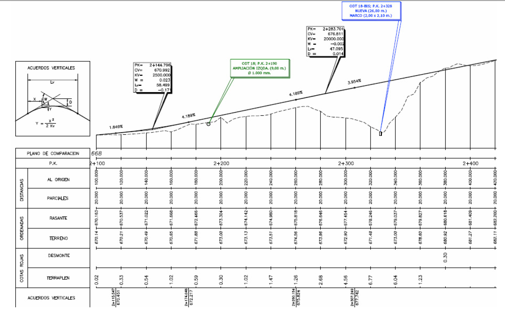
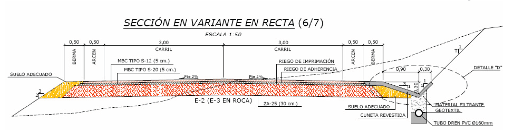
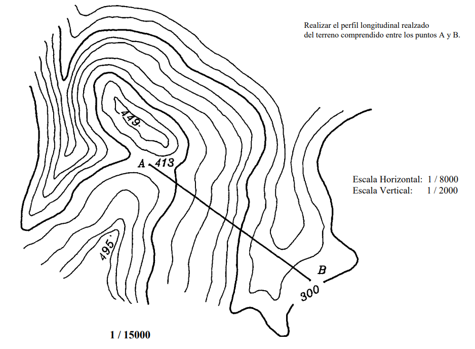

## Índice

::: {.texto-azul style="font-size:0.78em; margin-top:0.8em;"}
-   Perfil de un terreno: **definición** y construcción
-   Perfil **natural** vs perfil **realzado**
-   La **guitarra**
-   Perfil **desarrollado** (alineaciones y tramos curvos)
-   Perfil del terreno **con rasante** vs perfil de obra con terreno
-   Perfiles **transversales**
:::

## Perfil de un terreno: definición

:::: columns
::: {.column width="58%"}
<svg viewBox="-10 -14 500 390" xmlns="http://www.w3.org/2000/svg" style="width:82%; display:block; margin:0 auto;">
<rect x="-10" y="-14" width="500" height="390" fill="#fdfbf7"/>
<path d="M 461.4,360.0 L 480.0,346.6" fill="none" stroke="#8a5a2a" stroke-width="2.2" stroke-linejoin="round"/>
<path d="M 0.0,271.3 C 3.5,275.6 13.7,289.8 21.0,296.9 C 28.3,304.0 35.8,309.6 44.0,313.9 C 52.2,318.2 61.2,321.2 70.0,322.6 C 78.8,324.0 89.0,323.4 97.0,322.2 C 105.0,321.0 111.2,318.6 118.0,315.2 C 124.8,311.8 132.2,306.5 138.0,301.8 C 143.8,297.1 145.7,295.1 152.7,286.8 C 159.7,278.5 172.9,260.2 180.0,252.2 C 187.1,244.2 189.5,242.4 195.0,238.6 C 200.5,234.8 207.3,231.0 213.0,229.3 C 218.7,227.6 225.2,227.8 229.0,228.2 C 232.8,228.6 233.8,230.0 235.8,231.6 C 237.8,233.2 236.1,228.5 241.0,237.5 C 245.9,246.5 257.2,272.7 265.0,285.8 C 272.8,298.9 279.0,306.6 288.0,315.9 C 297.0,325.2 307.9,334.3 319.0,341.7 C 330.1,349.1 348.5,356.9 354.4,360.0" fill="none" stroke="#8a5a2a" stroke-width="2.2" stroke-linejoin="round"/>
<path d="M 480.0,235.0 C 478.0,232.4 472.5,224.7 468.0,219.6 C 463.5,214.5 458.3,209.3 453.0,204.6 C 447.7,199.9 441.8,195.4 436.0,191.3 C 430.2,187.2 427.3,184.8 418.0,180.3 C 408.7,175.9 396.0,169.4 380.0,164.6 C 364.0,159.8 333.8,154.7 322.0,151.2 C 310.2,147.7 312.0,145.9 309.2,143.4 C 306.4,140.9 306.3,139.1 305.4,136.4 C 304.5,133.7 303.8,137.1 303.9,127.4 C 304.0,117.7 306.1,91.1 305.9,78.2 C 305.7,65.3 304.9,59.3 302.6,50.1 C 300.3,40.9 296.7,31.5 292.2,23.1 C 287.7,14.8 278.2,3.9 275.4,0.0" fill="none" stroke="#8a5a2a" stroke-width="2.2" stroke-linejoin="round"/>
<path d="M 7.9,0.0 L 0.0,5.9" fill="none" stroke="#8a5a2a" stroke-width="2.2" stroke-linejoin="round"/>
<path d="M 0.0,193.8 C 4.9,202.6 22.0,234.5 29.4,246.7 C 36.8,258.8 40.3,261.9 44.6,266.7 C 48.9,271.5 51.4,273.1 55.0,275.5 C 58.6,277.9 62.3,279.9 66.0,281.3 C 69.7,282.8 73.2,283.7 77.0,284.2 C 80.8,284.7 84.5,285.1 89.0,284.5 C 93.5,283.9 99.2,282.6 104.0,280.5 C 108.8,278.4 113.9,275.1 118.1,271.8 C 122.3,268.5 123.7,267.4 129.4,260.7 C 135.1,254.0 146.2,238.8 152.3,231.6 C 158.4,224.4 152.9,227.9 165.7,217.6 C 178.5,207.2 215.7,180.9 229.1,169.5 C 242.5,158.1 241.4,156.8 246.3,149.4 C 251.2,142.0 255.4,133.8 258.6,125.3 C 261.8,116.8 264.3,107.1 265.5,98.3 C 266.7,89.5 266.8,80.4 265.7,72.2 C 264.6,64.0 262.3,56.3 259.2,49.1 C 256.1,41.9 251.8,35.2 246.8,29.1 C 241.8,23.0 235.8,17.4 229.0,12.6 C 222.2,7.7 209.9,2.1 206.1,0.0" fill="none" stroke="#8a5a2a" stroke-width="1.1" stroke-linejoin="round"/>
<path d="M 88.0,0.0 C 83.7,1.8 70.4,6.7 62.0,11.1 C 53.6,15.4 45.2,20.6 37.7,26.1 C 30.2,31.6 23.0,37.8 16.7,44.1 C 10.4,50.4 2.8,60.8 0.0,64.1" fill="none" stroke="#8a5a2a" stroke-width="1.1" stroke-linejoin="round"/>
<path d="M 390.0,343.0 C 393.5,343.1 404.3,344.2 411.0,343.7 C 417.7,343.2 424.2,342.0 430.0,340.1 C 435.8,338.2 441.3,335.6 446.0,332.4 C 450.7,329.2 455.1,325.1 458.4,320.9 C 461.7,316.6 464.2,312.1 466.0,306.9 C 467.8,301.7 468.9,295.6 469.0,289.8 C 469.1,284.0 468.3,277.8 466.7,271.8 C 465.1,265.8 462.6,259.6 459.5,253.7 C 456.4,247.8 452.6,242.1 448.0,236.6 C 443.4,231.1 437.9,225.4 432.2,220.6 C 426.5,215.8 420.5,211.5 414.0,207.7 C 407.5,203.9 400.2,200.3 393.0,197.6 C 385.8,194.9 378.2,192.8 371.0,191.4 C 363.8,190.0 356.8,189.3 350.0,189.3 C 343.2,189.3 336.3,189.9 330.0,191.3 C 323.7,192.7 316.5,195.6 312.0,197.7 C 307.5,199.8 305.7,201.5 303.0,203.8 C 300.3,206.1 298.3,207.1 295.7,211.6 C 293.1,216.1 288.9,223.4 287.6,230.6 C 286.3,237.8 286.2,246.5 287.7,254.7 C 289.2,262.9 292.5,271.9 296.7,279.8 C 300.9,287.8 306.6,295.5 313.0,302.4 C 319.4,309.3 326.8,315.8 335.0,321.3 C 343.2,326.8 352.8,332.0 362.0,335.6 C 371.2,339.2 385.3,341.8 390.0,343.0" fill="none" stroke="#8a5a2a" stroke-width="1.1" stroke-linejoin="round"/>
<path d="M 388.0,322.9 C 390.5,323.0 398.2,323.8 403.0,323.4 C 407.8,323.0 412.7,322.0 417.0,320.6 C 421.3,319.2 425.3,317.2 428.7,314.9 C 432.1,312.6 434.9,309.9 437.3,306.9 C 439.7,303.9 441.6,300.5 442.9,296.8 C 444.2,293.1 445.0,289.0 445.1,284.8 C 445.2,280.6 444.8,276.2 443.7,271.8 C 442.6,267.4 441.1,263.1 438.8,258.7 C 436.6,254.3 433.4,249.7 430.2,245.7 C 427.0,241.7 423.6,238.2 419.6,234.7 C 415.6,231.2 410.8,227.6 406.0,224.7 C 401.2,221.8 396.2,219.2 391.0,217.2 C 385.8,215.2 380.2,213.6 375.0,212.5 C 369.8,211.4 364.8,210.9 360.0,210.9 C 355.2,210.9 350.5,211.3 346.0,212.3 C 341.5,213.3 337.3,214.3 333.0,216.8 C 328.7,219.3 323.3,223.3 320.0,227.5 C 316.7,231.7 314.5,236.5 313.4,241.7 C 312.2,246.9 312.2,253.0 313.1,258.7 C 314.0,264.4 315.9,270.1 318.9,275.8 C 321.9,281.5 326.2,287.6 330.9,292.8 C 335.6,298.0 341.0,302.8 347.0,306.9 C 353.0,311.0 360.2,314.8 367.0,317.5 C 373.8,320.2 384.5,322.0 388.0,322.9" fill="none" stroke="#8a5a2a" stroke-width="1.1" stroke-linejoin="round"/>
<path d="M 82.0,250.7 C 84.2,250.4 90.5,250.7 95.0,249.1 C 99.5,247.5 100.5,248.2 109.0,240.9 C 117.5,233.7 129.7,219.0 145.8,205.6 C 162.0,192.2 193.5,170.4 205.9,160.4 C 218.3,150.4 215.8,150.7 220.0,145.4 C 224.2,140.1 228.2,133.8 231.1,128.4 C 234.0,123.1 235.8,118.5 237.4,113.3 C 239.1,108.1 240.3,102.5 241.0,97.3 C 241.7,92.1 241.8,87.2 241.4,82.2 C 241.0,77.2 240.1,72.0 238.7,67.2 C 237.2,62.4 235.1,57.5 232.7,53.1 C 230.3,48.8 227.4,44.8 224.1,41.1 C 220.8,37.4 217.0,33.9 213.0,30.8 C 209.0,27.7 206.0,25.3 200.0,22.5 C 194.0,19.7 185.2,15.9 177.0,13.9 C 168.8,11.9 159.8,10.7 151.0,10.3 C 142.2,10.0 133.0,10.5 124.0,11.8 C 115.0,13.1 105.8,15.4 97.0,18.3 C 88.2,21.2 79.2,25.1 71.0,29.5 C 62.8,33.9 55.0,39.2 48.0,44.8 C 41.0,50.4 34.7,56.6 29.2,63.2 C 23.7,69.8 18.8,77.5 15.2,84.2 C 11.7,90.9 9.6,97.0 7.9,103.3 C 6.2,109.6 5.2,115.9 5.0,122.3 C 4.8,128.7 5.4,135.1 6.6,141.4 C 7.8,147.8 9.1,152.7 12.3,160.4 C 15.5,168.1 19.1,175.6 26.0,187.5 C 32.9,199.4 46.7,222.0 53.5,231.6 C 60.3,241.2 62.2,241.8 67.0,245.0 C 71.8,248.2 79.5,249.8 82.0,250.7" fill="none" stroke="#8a5a2a" stroke-width="1.1" stroke-linejoin="round"/>
<path d="M 387.0,302.9 C 390.0,302.5 400.0,302.5 405.0,300.6 C 410.0,298.7 414.5,294.0 417.0,291.4 C 419.5,288.8 419.4,287.2 420.1,284.8 C 420.8,282.4 421.7,280.8 421.1,276.8 C 420.5,272.8 419.3,265.9 416.4,260.7 C 413.5,255.5 408.7,249.9 403.6,245.7 C 398.5,241.5 392.1,237.8 386.0,235.5 C 379.9,233.2 373.0,231.8 367.0,231.9 C 361.0,232.0 354.2,234.0 350.0,235.8 C 345.8,237.6 343.9,240.0 341.9,242.7 C 339.9,245.3 338.5,248.4 337.8,251.7 C 337.1,255.0 337.1,259.0 337.7,262.7 C 338.3,266.4 339.7,270.1 341.7,273.8 C 343.7,277.5 346.7,281.5 349.9,284.8 C 353.1,288.1 357.0,291.2 361.0,293.8 C 365.0,296.4 369.7,298.6 374.0,300.1 C 378.3,301.6 384.8,302.4 387.0,302.9" fill="none" stroke="#8a5a2a" stroke-width="1.1" stroke-linejoin="round"/>
<path d="M 83.0,210.7 C 84.8,210.7 90.2,211.6 94.0,210.9 C 97.8,210.2 95.0,212.9 106.0,206.8 C 117.0,200.7 146.0,183.6 160.0,174.5 C 174.0,165.4 181.7,159.8 189.8,152.4 C 197.9,145.1 203.8,138.2 208.8,130.4 C 213.8,122.6 217.6,111.7 219.7,105.3 C 221.8,98.9 221.3,96.5 221.4,92.3 C 221.5,88.1 221.2,84.0 220.5,80.2 C 219.8,76.4 218.9,72.9 217.4,69.2 C 215.9,65.5 213.9,61.7 211.5,58.2 C 209.1,54.7 206.1,51.2 203.0,48.2 C 199.9,45.2 197.7,43.1 193.0,40.4 C 188.3,37.7 181.3,34.0 175.0,31.9 C 168.7,29.8 162.0,28.3 155.0,27.5 C 148.0,26.7 140.3,26.6 133.0,27.2 C 125.7,27.8 118.3,28.9 111.0,30.8 C 103.7,32.7 96.0,35.4 89.0,38.6 C 82.0,41.8 75.2,45.6 69.0,49.8 C 62.8,54.0 57.0,58.9 52.0,64.0 C 47.0,69.1 42.5,74.8 38.9,80.2 C 35.3,85.6 32.7,90.8 30.6,96.3 C 28.5,101.8 27.1,107.6 26.3,113.3 C 25.5,119.0 25.4,124.7 26.0,130.4 C 26.6,136.1 27.6,141.2 29.8,147.4 C 32.0,153.6 35.1,160.5 39.3,167.5 C 43.5,174.5 49.9,183.4 55.0,189.5 C 60.1,195.6 65.3,200.8 70.0,204.3 C 74.7,207.8 80.8,209.6 83.0,210.7" fill="none" stroke="#8a5a2a" stroke-width="1.1" stroke-linejoin="round"/>
<path d="M 94.0,181.5 C 97.8,180.9 108.0,180.9 117.0,178.0 C 126.0,175.1 138.5,169.4 148.0,164.1 C 157.5,158.8 166.7,152.5 173.9,146.4 C 181.1,140.3 186.8,133.9 191.3,127.4 C 195.8,120.9 199.0,114.2 200.8,107.3 C 202.6,100.4 203.2,92.7 202.3,86.2 C 201.4,79.7 199.1,73.6 195.5,68.2 C 191.9,62.8 185.8,57.2 181.0,53.6 C 176.2,50.0 172.0,48.4 167.0,46.6 C 162.0,44.8 156.7,43.5 151.0,42.7 C 145.3,42.0 139.0,41.8 133.0,42.1 C 127.0,42.5 121.0,43.3 115.0,44.8 C 109.0,46.3 102.7,48.4 97.0,50.9 C 91.3,53.4 86.0,56.4 81.0,59.7 C 76.0,63.1 71.2,66.9 67.0,71.0 C 62.8,75.1 59.1,79.5 56.0,84.1 C 52.9,88.6 50.5,93.4 48.6,98.3 C 46.7,103.2 45.4,108.3 44.8,113.3 C 44.2,118.3 44.3,123.6 44.9,128.4 C 45.5,133.2 46.6,137.6 48.6,142.4 C 50.6,147.2 53.6,152.8 56.8,157.4 C 60.0,162.0 64.0,166.3 68.0,169.8 C 72.0,173.3 76.7,176.4 81.0,178.3 C 85.3,180.2 91.8,181.0 94.0,181.5" fill="none" stroke="#8a5a2a" stroke-width="1.1" stroke-linejoin="round"/>
<path d="M 100.0,159.5 C 103.0,159.3 111.5,159.9 118.0,158.5 C 124.5,157.1 132.2,154.5 139.0,151.3 C 145.8,148.1 152.8,143.9 158.6,139.4 C 164.3,134.9 169.7,129.3 173.5,124.3 C 177.3,119.3 179.8,114.5 181.5,109.3 C 183.2,104.1 184.0,98.3 183.7,93.3 C 183.4,88.3 181.9,83.5 179.5,79.2 C 177.1,74.9 172.4,70.3 169.0,67.4 C 165.6,64.5 162.7,63.2 159.0,61.7 C 155.3,60.2 151.2,59.0 147.0,58.3 C 142.8,57.6 138.5,57.2 134.0,57.3 C 129.5,57.4 124.7,57.9 120.0,58.9 C 115.3,59.9 110.3,61.5 106.0,63.2 C 101.7,64.9 97.8,66.8 94.0,69.2 C 90.2,71.6 86.3,74.4 83.0,77.4 C 79.7,80.4 76.6,83.7 74.0,87.2 C 71.4,90.7 69.2,94.6 67.5,98.3 C 65.8,102.0 64.8,105.5 64.1,109.3 C 63.4,113.1 63.3,117.5 63.6,121.3 C 63.9,125.1 64.7,128.5 66.0,132.0 C 67.3,135.5 69.3,139.3 71.5,142.4 C 73.7,145.5 76.1,148.1 79.0,150.5 C 81.9,152.9 85.5,155.1 89.0,156.6 C 92.5,158.1 98.2,159.0 100.0,159.5" fill="none" stroke="#8a5a2a" stroke-width="2.2" stroke-linejoin="round"/>
<path d="M 107.0,137.6 C 109.0,137.7 114.8,138.4 119.0,137.9 C 123.2,137.4 127.8,136.2 132.0,134.5 C 136.2,132.8 140.5,130.4 144.0,127.9 C 147.5,125.4 150.7,122.4 153.2,119.3 C 155.7,116.2 157.9,112.6 159.2,109.3 C 160.5,106.0 161.1,102.5 161.1,99.3 C 161.1,96.1 160.2,93.1 158.9,90.3 C 157.6,87.5 156.2,85.0 153.0,82.7 C 149.8,80.4 144.8,77.7 140.0,76.6 C 135.2,75.5 129.3,75.4 124.0,76.2 C 118.7,77.0 112.9,78.9 108.0,81.6 C 103.1,84.3 98.0,88.2 94.5,92.3 C 91.0,96.4 88.2,101.7 87.0,106.3 C 85.8,110.9 85.8,115.7 87.0,119.9 C 88.2,124.1 90.9,128.5 94.2,131.4 C 97.5,134.3 104.9,136.6 107.0,137.6" fill="none" stroke="#8a5a2a" stroke-width="1.1" stroke-linejoin="round"/>
<text x="144" y="131.9" font-size="11" fill="#8a5a2a" font-weight="700" text-anchor="middle" stroke="#ffffff" stroke-width="3.5" stroke-linejoin="round" opacity="0.9">160</text>
<text x="144" y="131.9" font-size="11" fill="#8a5a2a" font-weight="700" text-anchor="middle">160</text>
<text x="81" y="63.7" font-size="11" fill="#8a5a2a" font-weight="700" text-anchor="middle" stroke="#ffffff" stroke-width="3.5" stroke-linejoin="round" opacity="0.9">140</text>
<text x="81" y="63.7" font-size="11" fill="#8a5a2a" font-weight="700" text-anchor="middle">140</text>
<text x="438.8" y="262.7" font-size="11" fill="#8a5a2a" font-weight="700" text-anchor="middle" stroke="#ffffff" stroke-width="3.5" stroke-linejoin="round" opacity="0.9">120</text>
<text x="438.8" y="262.7" font-size="11" fill="#8a5a2a" font-weight="700" text-anchor="middle">120</text>
<text x="213" y="233.3" font-size="11" fill="#8a5a2a" font-weight="700" text-anchor="middle" stroke="#ffffff" stroke-width="3.5" stroke-linejoin="round" opacity="0.9">100</text>
<text x="213" y="233.3" font-size="11" fill="#8a5a2a" font-weight="700" text-anchor="middle">100</text>
<text x="155" y="31.5" font-size="11" fill="#8a5a2a" font-weight="700" text-anchor="middle" stroke="#ffffff" stroke-width="3.5" stroke-linejoin="round" opacity="0.9">130</text>
<text x="155" y="31.5" font-size="11" fill="#8a5a2a" font-weight="700" text-anchor="middle">130</text>
<g class="fragment" data-fragment-index="1">
<line x1="45" y1="52" x2="445" y2="310" stroke="#d00000" stroke-width="2.6"/>
<circle cx="45" cy="52" r="4" fill="#fff" stroke="#1a1a1a" stroke-width="1.6"/>
<circle cx="445" cy="310" r="4" fill="#fff" stroke="#1a1a1a" stroke-width="1.6"/>
<text x="33" y="42" font-size="15" fill="#1a1a1a" font-weight="700">A</text>
<text x="453" y="316" font-size="15" fill="#1a1a1a" font-weight="700">B</text>
</g>
<g class="fragment" data-fragment-index="2">
<circle cx="56.7" cy="59.5" r="3" fill="#fff" stroke="#1a1a1a" stroke-width="1.6"/>
<circle cx="70" cy="68.1" r="3" fill="#fff" stroke="#1a1a1a" stroke-width="1.6"/>
<circle cx="83.6" cy="76.9" r="3" fill="#fff" stroke="#1a1a1a" stroke-width="1.6"/>
<circle cx="99.6" cy="87.2" r="3" fill="#fff" stroke="#1a1a1a" stroke-width="1.6"/>
<circle cx="151.9" cy="120.9" r="3" fill="#fff" stroke="#1a1a1a" stroke-width="1.6"/>
<circle cx="167.7" cy="131.2" r="3" fill="#fff" stroke="#1a1a1a" stroke-width="1.6"/>
<circle cx="181.1" cy="139.8" r="3" fill="#fff" stroke="#1a1a1a" stroke-width="1.6"/>
<circle cx="194.2" cy="148.3" r="3" fill="#fff" stroke="#1a1a1a" stroke-width="1.6"/>
<circle cx="208.8" cy="157.7" r="3" fill="#fff" stroke="#1a1a1a" stroke-width="1.6"/>
<circle cx="228.3" cy="170.2" r="3" fill="#fff" stroke="#1a1a1a" stroke-width="1.6"/>
<circle cx="294.7" cy="213" r="3" fill="#fff" stroke="#1a1a1a" stroke-width="1.6"/>
<circle cx="319.1" cy="228.8" r="3" fill="#fff" stroke="#1a1a1a" stroke-width="1.6"/>
<circle cx="341.5" cy="243.2" r="3" fill="#fff" stroke="#1a1a1a" stroke-width="1.6"/>
<circle cx="416.7" cy="291.8" r="3" fill="#fff" stroke="#1a1a1a" stroke-width="1.6"/>
<circle cx="438.2" cy="305.6" r="3" fill="#fff" stroke="#1a1a1a" stroke-width="1.6"/>
<text x="240" y="372" font-size="13" fill="#2d2d8a" font-weight="700" text-anchor="middle" stroke="#ffffff" stroke-width="3.5" stroke-linejoin="round" opacity="0.9">marco los cruces de AB con cada curva de nivel</text>
<text x="240" y="372" font-size="13" fill="#2d2d8a" font-weight="700" text-anchor="middle">marco los cruces de AB con cada curva de nivel</text>
</g>
</svg>
:::

::: {.column width="42%"}
::: {.texto-azul style="font-size:0.64em; margin-top:0.8em;"}
El **perfil longitudinal** es la intersección del terreno con un **plano vertical** que pasa por una traza dada — aquí, la recta AB sobre nuestro terreno.

::: {.fragment fragment-index="1"}
La traza AB cruza el Cerro Mayor, el collado y el Cerro Menor.
:::

::: {.fragment fragment-index="2"}
En el plano, del terreno solo conocemos las curvas de nivel: los datos del perfil son los **cruces de AB con cada curva** — de cada cruce sé su **distancia a A** y su **cota**.
:::
:::
:::
::::

## Levantar el perfil

:::: columns
::: {.column width="66%"}
<svg viewBox="0 0 660 420" xmlns="http://www.w3.org/2000/svg" style="width:94%; display:block; margin:0 auto;">
<line x1="40" y1="40" x2="620" y2="40" stroke="#1a1a1a" stroke-width="2.4"/>
<text x="34" y="32" font-size="14" fill="#1a1a1a" font-weight="700" text-anchor="end">A</text>
<text x="626" y="32" font-size="14" fill="#1a1a1a" font-weight="700">B</text>
<g class="fragment" data-fragment-index="1">
<line x1="56.9" y1="34" x2="56.9" y2="46" stroke="#8a5a2a" stroke-width="1.8"/>
<line x1="76.3" y1="34" x2="76.3" y2="46" stroke="#8a5a2a" stroke-width="1.8"/>
<line x1="95.9" y1="34" x2="95.9" y2="46" stroke="#8a5a2a" stroke-width="1.8"/>
<line x1="119.2" y1="34" x2="119.2" y2="46" stroke="#8a5a2a" stroke-width="1.8"/>
<line x1="194.9" y1="34" x2="194.9" y2="46" stroke="#8a5a2a" stroke-width="1.8"/>
<line x1="218" y1="34" x2="218" y2="46" stroke="#8a5a2a" stroke-width="1.8"/>
<line x1="237.3" y1="34" x2="237.3" y2="46" stroke="#8a5a2a" stroke-width="1.8"/>
<line x1="256.4" y1="34" x2="256.4" y2="46" stroke="#8a5a2a" stroke-width="1.8"/>
<line x1="277.6" y1="34" x2="277.6" y2="46" stroke="#8a5a2a" stroke-width="1.8"/>
<line x1="305.8" y1="34" x2="305.8" y2="46" stroke="#8a5a2a" stroke-width="1.8"/>
<line x1="402" y1="34" x2="402" y2="46" stroke="#8a5a2a" stroke-width="1.8"/>
<line x1="437.4" y1="34" x2="437.4" y2="46" stroke="#8a5a2a" stroke-width="1.8"/>
<line x1="469.9" y1="34" x2="469.9" y2="46" stroke="#8a5a2a" stroke-width="1.8"/>
<line x1="579" y1="34" x2="579" y2="46" stroke="#8a5a2a" stroke-width="1.8"/>
<line x1="610.2" y1="34" x2="610.2" y2="46" stroke="#8a5a2a" stroke-width="1.8"/>
<text x="48" y="22" font-size="11.5" fill="#8a5a2a" font-style="italic">cruces con las curvas de nivel (con su cota)</text>
</g>
<g class="fragment" data-fragment-index="2">
<line x1="40" y1="384" x2="620" y2="384" stroke="#c9c9c9" stroke-width="0.9"/>
<text x="34" y="388" font-size="11" fill="#777" text-anchor="end">100</text>
<line x1="40" y1="362" x2="620" y2="362" stroke="#c9c9c9" stroke-width="0.9"/>
<text x="34" y="366" font-size="11" fill="#777" text-anchor="end">110</text>
<line x1="40" y1="340" x2="620" y2="340" stroke="#c9c9c9" stroke-width="0.9"/>
<text x="34" y="344" font-size="11" fill="#777" text-anchor="end">120</text>
<line x1="40" y1="318" x2="620" y2="318" stroke="#c9c9c9" stroke-width="0.9"/>
<text x="34" y="322" font-size="11" fill="#777" text-anchor="end">130</text>
<line x1="40" y1="296" x2="620" y2="296" stroke="#c9c9c9" stroke-width="0.9"/>
<text x="34" y="300" font-size="11" fill="#777" text-anchor="end">140</text>
<line x1="40" y1="274" x2="620" y2="274" stroke="#c9c9c9" stroke-width="0.9"/>
<text x="34" y="278" font-size="11" fill="#777" text-anchor="end">150</text>
<line x1="40" y1="252" x2="620" y2="252" stroke="#c9c9c9" stroke-width="0.9"/>
<text x="34" y="256" font-size="11" fill="#777" text-anchor="end">160</text>
</g>
<g class="fragment" data-fragment-index="3">
<line x1="56.9" y1="46" x2="56.9" y2="318" stroke="#909090" stroke-width="0.9" stroke-dasharray="4,3"/>
<circle cx="56.9" cy="318" r="2.8" fill="#fff" stroke="#1a1a1a" stroke-width="1.6"/>
<line x1="76.3" y1="46" x2="76.3" y2="296" stroke="#909090" stroke-width="0.9" stroke-dasharray="4,3"/>
<circle cx="76.3" cy="296" r="2.8" fill="#fff" stroke="#1a1a1a" stroke-width="1.6"/>
<line x1="95.9" y1="46" x2="95.9" y2="274" stroke="#909090" stroke-width="0.9" stroke-dasharray="4,3"/>
<circle cx="95.9" cy="274" r="2.8" fill="#fff" stroke="#1a1a1a" stroke-width="1.6"/>
<line x1="119.2" y1="46" x2="119.2" y2="252" stroke="#909090" stroke-width="0.9" stroke-dasharray="4,3"/>
<circle cx="119.2" cy="252" r="2.8" fill="#fff" stroke="#1a1a1a" stroke-width="1.6"/>
<line x1="194.9" y1="46" x2="194.9" y2="252" stroke="#909090" stroke-width="0.9" stroke-dasharray="4,3"/>
<circle cx="194.9" cy="252" r="2.8" fill="#fff" stroke="#1a1a1a" stroke-width="1.6"/>
<line x1="218" y1="46" x2="218" y2="274" stroke="#909090" stroke-width="0.9" stroke-dasharray="4,3"/>
<circle cx="218" cy="274" r="2.8" fill="#fff" stroke="#1a1a1a" stroke-width="1.6"/>
<line x1="237.3" y1="46" x2="237.3" y2="296" stroke="#909090" stroke-width="0.9" stroke-dasharray="4,3"/>
<circle cx="237.3" cy="296" r="2.8" fill="#fff" stroke="#1a1a1a" stroke-width="1.6"/>
<line x1="256.4" y1="46" x2="256.4" y2="318" stroke="#909090" stroke-width="0.9" stroke-dasharray="4,3"/>
<circle cx="256.4" cy="318" r="2.8" fill="#fff" stroke="#1a1a1a" stroke-width="1.6"/>
<line x1="277.6" y1="46" x2="277.6" y2="340" stroke="#909090" stroke-width="0.9" stroke-dasharray="4,3"/>
<circle cx="277.6" cy="340" r="2.8" fill="#fff" stroke="#1a1a1a" stroke-width="1.6"/>
<line x1="305.8" y1="46" x2="305.8" y2="362" stroke="#909090" stroke-width="0.9" stroke-dasharray="4,3"/>
<circle cx="305.8" cy="362" r="2.8" fill="#fff" stroke="#1a1a1a" stroke-width="1.6"/>
<line x1="402" y1="46" x2="402" y2="362" stroke="#909090" stroke-width="0.9" stroke-dasharray="4,3"/>
<circle cx="402" cy="362" r="2.8" fill="#fff" stroke="#1a1a1a" stroke-width="1.6"/>
<line x1="437.4" y1="46" x2="437.4" y2="340" stroke="#909090" stroke-width="0.9" stroke-dasharray="4,3"/>
<circle cx="437.4" cy="340" r="2.8" fill="#fff" stroke="#1a1a1a" stroke-width="1.6"/>
<line x1="469.9" y1="46" x2="469.9" y2="318" stroke="#909090" stroke-width="0.9" stroke-dasharray="4,3"/>
<circle cx="469.9" cy="318" r="2.8" fill="#fff" stroke="#1a1a1a" stroke-width="1.6"/>
<line x1="579" y1="46" x2="579" y2="318" stroke="#909090" stroke-width="0.9" stroke-dasharray="4,3"/>
<circle cx="579" cy="318" r="2.8" fill="#fff" stroke="#1a1a1a" stroke-width="1.6"/>
<line x1="610.2" y1="46" x2="610.2" y2="340" stroke="#909090" stroke-width="0.9" stroke-dasharray="4,3"/>
<circle cx="610.2" cy="340" r="2.8" fill="#fff" stroke="#1a1a1a" stroke-width="1.6"/>
</g>
<g class="fragment" data-fragment-index="4">
<path d="M 40,335.7 L 57,318 L 95.7,274.2 L 115.1,255.4 L 126,247 L 136.9,240.9 L 147.8,237.2 L 157.5,236.2 L 165.9,237.1 L 175.6,240.1 L 184.1,244.4 L 193.8,251.1 L 203.5,259.3 L 214.4,270.1 L 260.4,322.4 L 272.5,335.1 L 283.4,345.3 L 296.7,356 L 308.8,363.7 L 320.9,369.6 L 333,373.5 L 346.3,375.5 L 359.7,375.4 L 374.2,372.9 L 388.7,368.1 L 402,362 L 416.6,353.8 L 463.8,321.9 L 482,311.1 L 491.6,306.4 L 501.3,302.8 L 509.8,300.5 L 518.3,299.3 L 528,299 L 538.9,300.4 L 549.8,303.3 L 560.7,307.8 L 571.6,313.5 L 583.7,321 L 620,347.2" fill="none" stroke="#14532d" stroke-width="3" stroke-linejoin="round"/>
<text x="240" y="226.2" font-size="13" fill="#14532d" font-weight="700">el perfil del terreno</text>
</g>
</svg>
:::

::: {.column width="34%"}
::: {.texto-azul style="font-size:0.58em; margin-top:0.5em;"}
::: {.fragment fragment-index="1"}
1. Llevo sobre una recta los **cruces** con su distancia a A.
:::
::: {.fragment fragment-index="2"}
2. Dibujo una **guía horizontal por cada cota** de la serie.
:::
::: {.fragment fragment-index="3"}
3. Subo una **vertical** desde cada cruce hasta su cota.
:::
::: {.fragment fragment-index="4"}
4. Uno los puntos: el **perfil del terreno**. Entre curva y curva el terreno se supone uniforme.
:::
:::
:::
::::

## Perfil natural y perfil realzado

:::: columns
::: {.column width="62%"}
<svg viewBox="0 0 660 400" xmlns="http://www.w3.org/2000/svg" style="width:94%; display:block; margin:0 auto;">
<g class="fragment" data-fragment-index="1">
<text x="40" y="28" font-size="13.5" fill="#2d2d8a" font-weight="700">Perfil NATURAL: Ev = Eh</text>
<line x1="60" y1="118" x2="336.1" y2="118" stroke="#999" stroke-width="1"/>
<path d="M 60,102.4 L 86.5,86.2 L 95.7,81.2 L 106.1,77.4 L 115.9,76.1 L 124.6,77.2 L 133.2,80.1 L 143,85.1 L 164.9,98.9 L 175.8,104.9 L 188,109.8 L 199.5,112.3 L 212.2,112.8 L 226,110.9 L 239.2,107.1 L 270.4,95.9 L 279.6,93.7 L 287.7,92.8 L 297.5,93.1 L 307.8,95 L 318.8,98.5 L 336.1,105.4" fill="none" stroke="#14532d" stroke-width="2.6" stroke-linejoin="round"/>
<text x="348.1" y="96" font-size="11.5" fill="#666" font-style="italic">queda demasiado</text>
<text x="348.1" y="110" font-size="11.5" fill="#666" font-style="italic">“suave”</text>
</g>
<g class="fragment" data-fragment-index="2">
<text x="40" y="168" font-size="13.5" fill="#2d2d8a" font-weight="700">Perfil REALZADO: Ev = 4 × Eh (p. ej. Eh 1:8000, Ev 1:2000)</text>
<line x1="60" y1="388" x2="336.1" y2="388" stroke="#999" stroke-width="1"/>
<path d="M 60,325.5 L 86.5,260.6 L 95.7,240.7 L 100.9,232 L 106.1,225.5 L 111.3,221.6 L 115.9,220.5 L 119.9,221.5 L 124.6,224.7 L 128.6,229.2 L 133.2,236.2 L 143,256.3 L 164.9,311.5 L 175.8,335.6 L 182.2,346.9 L 188,355 L 193.7,361.2 L 199.5,365.3 L 205.8,367.5 L 212.2,367.3 L 219.1,364.7 L 226,359.7 L 232.3,353.2 L 239.2,344.5 L 261.7,310.9 L 270.4,299.5 L 279.6,290.7 L 283.6,288.4 L 287.7,287 L 292.3,286.8 L 297.5,288.2 L 302.6,291.3 L 307.8,296 L 318.8,310 L 336.1,337.6" fill="none" stroke="#14532d" stroke-width="2.6" stroke-linejoin="round"/>
</g>
</svg>
:::

::: {.column width="38%"}
::: {.texto-azul style="font-size:0.6em; margin-top:0.8em;"}
::: {.fragment fragment-index="1"}
En el perfil **natural** la escala vertical y la horizontal son **iguales**: refleja las pendientes reales, pero en general queda demasiado suave. Solo se usa cuando hay que **visualizar correctamente las pendientes**.
:::

::: {.fragment fragment-index="2"}
En el perfil **realzado** se **exagera la escala vertical** para ver mejor el relieve. El realce es el cociente de escalas: con Eh 1:8000 y Ev 1:2000, el realce es 8000/2000 = **×4**.
:::
:::
:::
::::

## La guitarra

:::: columns
::: {.column width="70%"}
<svg viewBox="0 0 660 430" xmlns="http://www.w3.org/2000/svg" style="width:94%; display:block; margin:0 auto;">
<path d="M 40,174.2 L 57,160.5 L 95.7,126.7 L 115.1,112.1 L 126,105.7 L 136.9,100.9 L 147.8,98.1 L 157.5,97.3 L 165.9,98 L 175.6,100.3 L 184.1,103.7 L 193.8,108.8 L 203.5,115.2 L 214.4,123.5 L 260.4,163.9 L 283.4,181.6 L 296.7,189.9 L 308.8,195.8 L 320.9,200.4 L 333,203.4 L 346.3,205 L 359.7,204.9 L 374.2,202.9 L 388.7,199.2 L 402,194.5 L 416.6,188.1 L 463.8,163.5 L 482,155.1 L 501.3,148.7 L 518.3,146 L 528,145.8 L 538.9,146.9 L 549.8,149.2 L 560.7,152.6 L 583.7,162.8 L 620,183.1" fill="none" stroke="#14532d" stroke-width="2.6" stroke-linejoin="round"/>
<circle cx="56.9" cy="160.5" r="2.4" fill="#fff" stroke="#1a1a1a" stroke-width="1.6"/>
<line x1="56.9" y1="160.5" x2="56.9" y2="240" stroke="#bbb" stroke-width="0.7"/>
<circle cx="76.3" cy="143.5" r="2.4" fill="#fff" stroke="#1a1a1a" stroke-width="1.6"/>
<line x1="76.3" y1="143.5" x2="76.3" y2="240" stroke="#bbb" stroke-width="0.7"/>
<circle cx="95.9" cy="126.5" r="2.4" fill="#fff" stroke="#1a1a1a" stroke-width="1.6"/>
<line x1="95.9" y1="126.5" x2="95.9" y2="240" stroke="#bbb" stroke-width="0.7"/>
<circle cx="119.2" cy="109.5" r="2.4" fill="#fff" stroke="#1a1a1a" stroke-width="1.6"/>
<line x1="119.2" y1="109.5" x2="119.2" y2="240" stroke="#bbb" stroke-width="0.7"/>
<circle cx="194.9" cy="109.5" r="2.4" fill="#fff" stroke="#1a1a1a" stroke-width="1.6"/>
<line x1="194.9" y1="109.5" x2="194.9" y2="240" stroke="#bbb" stroke-width="0.7"/>
<circle cx="218" cy="126.5" r="2.4" fill="#fff" stroke="#1a1a1a" stroke-width="1.6"/>
<line x1="218" y1="126.5" x2="218" y2="240" stroke="#bbb" stroke-width="0.7"/>
<circle cx="237.3" cy="143.5" r="2.4" fill="#fff" stroke="#1a1a1a" stroke-width="1.6"/>
<line x1="237.3" y1="143.5" x2="237.3" y2="240" stroke="#bbb" stroke-width="0.7"/>
<circle cx="256.4" cy="160.5" r="2.4" fill="#fff" stroke="#1a1a1a" stroke-width="1.6"/>
<line x1="256.4" y1="160.5" x2="256.4" y2="240" stroke="#bbb" stroke-width="0.7"/>
<circle cx="277.6" cy="177.5" r="2.4" fill="#fff" stroke="#1a1a1a" stroke-width="1.6"/>
<line x1="277.6" y1="177.5" x2="277.6" y2="240" stroke="#bbb" stroke-width="0.7"/>
<circle cx="305.8" cy="194.5" r="2.4" fill="#fff" stroke="#1a1a1a" stroke-width="1.6"/>
<line x1="305.8" y1="194.5" x2="305.8" y2="240" stroke="#bbb" stroke-width="0.7"/>
<circle cx="402" cy="194.5" r="2.4" fill="#fff" stroke="#1a1a1a" stroke-width="1.6"/>
<line x1="402" y1="194.5" x2="402" y2="240" stroke="#bbb" stroke-width="0.7"/>
<circle cx="437.4" cy="177.5" r="2.4" fill="#fff" stroke="#1a1a1a" stroke-width="1.6"/>
<line x1="437.4" y1="177.5" x2="437.4" y2="240" stroke="#bbb" stroke-width="0.7"/>
<circle cx="469.9" cy="160.5" r="2.4" fill="#fff" stroke="#1a1a1a" stroke-width="1.6"/>
<line x1="469.9" y1="160.5" x2="469.9" y2="240" stroke="#bbb" stroke-width="0.7"/>
<circle cx="579" cy="160.5" r="2.4" fill="#fff" stroke="#1a1a1a" stroke-width="1.6"/>
<line x1="579" y1="160.5" x2="579" y2="240" stroke="#bbb" stroke-width="0.7"/>
<circle cx="610.2" cy="177.5" r="2.4" fill="#fff" stroke="#1a1a1a" stroke-width="1.6"/>
<line x1="610.2" y1="177.5" x2="610.2" y2="240" stroke="#bbb" stroke-width="0.7"/>
<line x1="40" y1="240" x2="620" y2="240" stroke="#1a1a1a" stroke-width="1.6"/>
<g class="fragment" data-fragment-index="1">
<text x="8" y="254" font-size="10.5" fill="#333">Plano de comparación 95 m</text>
<line x1="40" y1="240" x2="620" y2="240" stroke="#1a1a1a" stroke-width="1.1"/>
<text x="8" y="274" font-size="10.5" fill="#333">Ordenadas del terreno</text>
<line x1="40" y1="300" x2="620" y2="300" stroke="#1a1a1a" stroke-width="1.1"/>
<text x="8" y="334" font-size="10.5" fill="#333">Distancias al origen</text>
<line x1="40" y1="360" x2="620" y2="360" stroke="#1a1a1a" stroke-width="1.1"/>
<text x="8" y="394" font-size="10.5" fill="#333">Distancias parciales</text>
<line x1="40" y1="420" x2="620" y2="420" stroke="#1a1a1a" stroke-width="1.1"/>
<line x1="40" y1="240" x2="40" y2="420" stroke="#ccc" stroke-width="0.6"/>
<text x="43" y="296" font-size="9.5" fill="#1a1a1a" transform="rotate(-90 43 296)">122</text>
<text x="43" y="356" font-size="9.5" fill="#1a1a1a" transform="rotate(-90 43 356)">0</text>
<line x1="56.9" y1="240" x2="56.9" y2="420" stroke="#ccc" stroke-width="0.6"/>
<text x="59.9" y="296" font-size="9.5" fill="#1a1a1a" transform="rotate(-90 59.9 296)">130</text>
<text x="59.9" y="356" font-size="9.5" fill="#1a1a1a" transform="rotate(-90 59.9 356)">14</text>
<text x="51.5" y="416" font-size="9.5" fill="#555" transform="rotate(-90 51.5 416)">14</text>
<line x1="76.3" y1="240" x2="76.3" y2="420" stroke="#ccc" stroke-width="0.6"/>
<text x="79.3" y="296" font-size="9.5" fill="#1a1a1a" transform="rotate(-90 79.3 296)">140</text>
<text x="79.3" y="356" font-size="9.5" fill="#1a1a1a" transform="rotate(-90 79.3 356)">30</text>
<text x="69.6" y="416" font-size="9.5" fill="#555" transform="rotate(-90 69.6 416)">16</text>
<line x1="95.9" y1="240" x2="95.9" y2="420" stroke="#ccc" stroke-width="0.6"/>
<text x="98.9" y="296" font-size="9.5" fill="#1a1a1a" transform="rotate(-90 98.9 296)">150</text>
<text x="98.9" y="356" font-size="9.5" fill="#1a1a1a" transform="rotate(-90 98.9 356)">46</text>
<text x="89.1" y="416" font-size="9.5" fill="#555" transform="rotate(-90 89.1 416)">16</text>
<line x1="119.2" y1="240" x2="119.2" y2="420" stroke="#ccc" stroke-width="0.6"/>
<text x="122.2" y="296" font-size="9.5" fill="#1a1a1a" transform="rotate(-90 122.2 296)">160</text>
<text x="122.2" y="356" font-size="9.5" fill="#1a1a1a" transform="rotate(-90 122.2 356)">65</text>
<text x="110.5" y="416" font-size="9.5" fill="#555" transform="rotate(-90 110.5 416)">19</text>
<line x1="194.9" y1="240" x2="194.9" y2="420" stroke="#ccc" stroke-width="0.6"/>
<text x="197.9" y="296" font-size="9.5" fill="#1a1a1a" transform="rotate(-90 197.9 296)">160</text>
<text x="197.9" y="356" font-size="9.5" fill="#1a1a1a" transform="rotate(-90 197.9 356)">127</text>
<text x="160.1" y="416" font-size="9.5" fill="#555" transform="rotate(-90 160.1 416)">62</text>
<line x1="218" y1="240" x2="218" y2="420" stroke="#ccc" stroke-width="0.6"/>
<text x="221" y="296" font-size="9.5" fill="#1a1a1a" transform="rotate(-90 221 296)">150</text>
<text x="221" y="356" font-size="9.5" fill="#1a1a1a" transform="rotate(-90 221 356)">146</text>
<text x="209.5" y="416" font-size="9.5" fill="#555" transform="rotate(-90 209.5 416)">19</text>
<line x1="237.3" y1="240" x2="237.3" y2="420" stroke="#ccc" stroke-width="0.6"/>
<text x="240.3" y="296" font-size="9.5" fill="#1a1a1a" transform="rotate(-90 240.3 296)">140</text>
<text x="240.3" y="356" font-size="9.5" fill="#1a1a1a" transform="rotate(-90 240.3 356)">162</text>
<text x="230.6" y="416" font-size="9.5" fill="#555" transform="rotate(-90 230.6 416)">16</text>
<line x1="256.4" y1="240" x2="256.4" y2="420" stroke="#ccc" stroke-width="0.6"/>
<text x="259.4" y="296" font-size="9.5" fill="#1a1a1a" transform="rotate(-90 259.4 296)">130</text>
<text x="259.4" y="356" font-size="9.5" fill="#1a1a1a" transform="rotate(-90 259.4 356)">178</text>
<text x="249.8" y="416" font-size="9.5" fill="#555" transform="rotate(-90 249.8 416)">16</text>
<line x1="277.6" y1="240" x2="277.6" y2="420" stroke="#ccc" stroke-width="0.6"/>
<text x="280.6" y="296" font-size="9.5" fill="#1a1a1a" transform="rotate(-90 280.6 296)">120</text>
<text x="280.6" y="356" font-size="9.5" fill="#1a1a1a" transform="rotate(-90 280.6 356)">195</text>
<text x="270" y="416" font-size="9.5" fill="#555" transform="rotate(-90 270 416)">17</text>
<line x1="305.8" y1="240" x2="305.8" y2="420" stroke="#ccc" stroke-width="0.6"/>
<text x="308.8" y="296" font-size="9.5" fill="#1a1a1a" transform="rotate(-90 308.8 296)">110</text>
<text x="308.8" y="356" font-size="9.5" fill="#1a1a1a" transform="rotate(-90 308.8 356)">218</text>
<text x="294.7" y="416" font-size="9.5" fill="#555" transform="rotate(-90 294.7 416)">23</text>
<line x1="402" y1="240" x2="402" y2="420" stroke="#ccc" stroke-width="0.6"/>
<text x="405" y="296" font-size="9.5" fill="#1a1a1a" transform="rotate(-90 405 296)">110</text>
<text x="405" y="356" font-size="9.5" fill="#1a1a1a" transform="rotate(-90 405 356)">297</text>
<text x="356.9" y="416" font-size="9.5" fill="#555" transform="rotate(-90 356.9 416)">79</text>
<line x1="437.4" y1="240" x2="437.4" y2="420" stroke="#ccc" stroke-width="0.6"/>
<text x="440.4" y="296" font-size="9.5" fill="#1a1a1a" transform="rotate(-90 440.4 296)">120</text>
<text x="440.4" y="356" font-size="9.5" fill="#1a1a1a" transform="rotate(-90 440.4 356)">326</text>
<text x="422.7" y="416" font-size="9.5" fill="#555" transform="rotate(-90 422.7 416)">29</text>
<line x1="469.9" y1="240" x2="469.9" y2="420" stroke="#ccc" stroke-width="0.6"/>
<text x="472.9" y="296" font-size="9.5" fill="#1a1a1a" transform="rotate(-90 472.9 296)">130</text>
<text x="472.9" y="356" font-size="9.5" fill="#1a1a1a" transform="rotate(-90 472.9 356)">353</text>
<text x="456.7" y="416" font-size="9.5" fill="#555" transform="rotate(-90 456.7 416)">27</text>
<line x1="579" y1="240" x2="579" y2="420" stroke="#ccc" stroke-width="0.6"/>
<text x="582" y="296" font-size="9.5" fill="#1a1a1a" transform="rotate(-90 582 296)">130</text>
<text x="582" y="356" font-size="9.5" fill="#1a1a1a" transform="rotate(-90 582 356)">442</text>
<text x="527.5" y="416" font-size="9.5" fill="#555" transform="rotate(-90 527.5 416)">90</text>
<line x1="620" y1="240" x2="620" y2="420" stroke="#ccc" stroke-width="0.6"/>
<text x="623" y="296" font-size="9.5" fill="#1a1a1a" transform="rotate(-90 623 296)">116.7</text>
<text x="623" y="356" font-size="9.5" fill="#1a1a1a" transform="rotate(-90 623 356)">476</text>
<text x="602.5" y="416" font-size="9.5" fill="#555" transform="rotate(-90 602.5 416)">34</text>
</g>
</svg>
:::

::: {.column width="30%"}
::: {.texto-azul style="font-size:0.58em; margin-top:0.6em;"}
La **guitarra** es la información **alfanumérica** asociada al dibujo del perfil.

::: {.fragment fragment-index="1"}
Las filas mínimas:

-   **Plano de comparación** (la cota de la base del dibujo)
-   **Ordenadas del terreno** (cotas de los puntos tomados)
-   **Distancias al origen**
-   **Distancias parciales**

Se ajusta a los datos de cada perfil: si hay rasante, se añaden sus filas.
:::
:::
:::
::::

## Perfil desarrollado

:::: columns
::: {.column width="64%"}
<svg viewBox="0 0 680 430" xmlns="http://www.w3.org/2000/svg" style="width:94%; display:block; margin:0 auto;">
<g opacity="0.95">
<path d="M 223.8,171.2 L 231.6,165.6" fill="none" stroke="#8a5a2a" stroke-width="1.4" stroke-linejoin="round"/>
<path d="M 30,133.9 L 38.8,144.7 L 48.5,151.8 L 59.4,155.5 L 70.7,155.3 L 79.6,152.4 L 88,146.8 L 94.1,140.5 L 105.6,125.9 L 111.9,120.2 L 119.5,116.3 L 126.2,115.8 L 129,117.3 L 131.2,119.8 L 141.3,140 L 151,152.7 L 164,163.5 L 178.8,171.2" fill="none" stroke="#8a5a2a" stroke-width="1.4" stroke-linejoin="round"/>
<path d="M 231.6,118.7 L 226.6,112.2 L 220.3,105.9 L 213.1,100.3 L 205.6,95.7 L 189.6,89.1 L 165.2,83.5 L 159.9,80.2 L 158.3,77.3 L 157.6,73.5 L 158.5,52.8 L 157.1,41 L 152.7,29.7 L 145.7,20" fill="none" stroke="#8a5a2a" stroke-width="1.4" stroke-linejoin="round"/>
<path d="M 33.3,20 L 30,22.5" fill="none" stroke="#8a5a2a" stroke-width="1.4" stroke-linejoin="round"/>
<path d="M 30,101.4 L 42.3,123.6 L 48.7,132 L 53.1,135.7 L 57.7,138.1 L 62.3,139.4 L 67.4,139.5 L 73.7,137.8 L 79.6,134.2 L 84.3,129.5 L 94,117.3 L 99.6,111.4 L 126.2,91.2 L 133.4,82.7 L 138.6,72.6 L 141.5,61.3 L 141.6,50.3 L 138.9,40.6 L 133.7,32.2 L 126.2,25.3 L 116.6,20" fill="none" stroke="#8a5a2a" stroke-width="0.7" stroke-linejoin="round"/>
<path d="M 67,20 L 56,24.7 L 45.8,31 L 37,38.5 L 30,46.9" fill="none" stroke="#8a5a2a" stroke-width="0.7" stroke-linejoin="round"/>
<path d="M 193.8,164.1 L 202.6,164.4 L 210.6,162.8 L 217.3,159.6 L 222.5,154.8 L 225.7,148.9 L 227,141.7 L 226,134.2 L 223,126.6 L 218.2,119.4 L 211.5,112.7 L 203.9,107.2 L 195.1,103 L 185.8,100.4 L 177,99.5 L 168.6,100.3 L 161,103 L 157.3,105.6 L 154.2,108.9 L 150.8,116.9 L 150.8,127 L 154.6,137.5 L 161.5,147 L 170.7,154.9 L 182,161 L 193.8,164.1" fill="none" stroke="#8a5a2a" stroke-width="0.7" stroke-linejoin="round"/>
<path d="M 193,155.6 L 199.3,155.8 L 205.1,154.7 L 210.1,152.3 L 213.7,148.9 L 216,144.7 L 216.9,139.6 L 216.4,134.2 L 214.3,128.7 L 210.7,123.2 L 206.2,118.6 L 200.5,114.4 L 194.2,111.2 L 187.5,109.2 L 181.2,108.6 L 175.3,109.2 L 169.9,111.1 L 164.4,115.5 L 161.6,121.5 L 161.5,128.7 L 163.9,135.8 L 169,143 L 175.7,148.9 L 184.1,153.3 L 193,155.6" fill="none" stroke="#8a5a2a" stroke-width="0.7" stroke-linejoin="round"/>
<path d="M 64.4,125.3 L 69.9,124.6 L 75.8,121.2 L 91.2,106.4 L 116.5,87.4 L 122.4,81.1 L 127.1,73.9 L 129.7,67.6 L 131.2,60.9 L 131.4,54.5 L 130.3,48.2 L 127.7,42.3 L 124.1,37.3 L 119.5,32.9 L 114,29.4 L 104.3,25.8 L 93.4,24.3 L 82.1,25 L 70.7,27.7 L 59.8,32.4 L 50.2,38.8 L 42.3,46.5 L 36.4,55.4 L 33.3,63.4 L 32.1,71.4 L 32.8,79.4 L 35.2,87.4 L 40.9,98.8 L 52.5,117.3 L 58.1,122.9 L 64.4,125.3" fill="none" stroke="#8a5a2a" stroke-width="0.7" stroke-linejoin="round"/>
<path d="M 192.5,147.2 L 200.1,146.3 L 205.1,142.4 L 206.4,139.6 L 206.9,136.3 L 204.9,129.5 L 199.5,123.2 L 192.1,118.9 L 184.1,117.4 L 177,119 L 173.6,121.9 L 171.9,125.7 L 171.8,130.3 L 173.5,135 L 177,139.6 L 181.6,143.4 L 187.1,146 L 192.5,147.2" fill="none" stroke="#8a5a2a" stroke-width="0.7" stroke-linejoin="round"/>
<path d="M 64.9,108.5 L 69.5,108.6 L 74.5,106.9 L 97.2,93.3 L 109.7,84 L 117.7,74.8 L 122.3,64.2 L 123,58.8 L 122.6,53.7 L 121.3,49.1 L 118.8,44.4 L 115.3,40.2 L 111.1,37 L 103.5,33.4 L 95.1,31.5 L 85.9,31.4 L 76.6,32.9 L 67.4,36.2 L 59,40.9 L 51.8,46.9 L 46.3,53.7 L 42.9,60.4 L 41,67.6 L 40.9,74.8 L 42.5,81.9 L 46.5,90.3 L 53.1,99.6 L 59.4,105.8 L 64.9,108.5" fill="none" stroke="#8a5a2a" stroke-width="0.7" stroke-linejoin="round"/>
<path d="M 69.5,96.2 L 79.1,94.8 L 92.2,88.9 L 103,81.5 L 110.3,73.5 L 114.3,65.1 L 115,56.2 L 112.1,48.6 L 106,42.5 L 100.1,39.6 L 93.4,37.9 L 85.9,37.7 L 78.3,38.8 L 70.7,41.4 L 64,45.1 L 58.1,49.8 L 53.5,55.3 L 50.4,61.3 L 48.8,67.6 L 48.9,73.9 L 50.4,79.8 L 53.9,86.1 L 58.6,91.3 L 64,94.9 L 69.5,96.2" fill="none" stroke="#8a5a2a" stroke-width="0.7" stroke-linejoin="round"/>
<path d="M 72,87 L 79.6,86.6 L 88.4,83.5 L 96.6,78.5 L 102.9,72.2 L 106.2,65.9 L 107.2,59.2 L 105.4,53.3 L 101,48.3 L 96.8,45.9 L 91.7,44.5 L 86.3,44.1 L 80.4,44.7 L 74.5,46.5 L 69.5,49.1 L 64.9,52.5 L 61.1,56.6 L 58.3,61.3 L 56.9,65.9 L 56.7,70.9 L 57.7,75.4 L 60,79.8 L 63.2,83.2 L 67.4,85.8 L 72,87" fill="none" stroke="#8a5a2a" stroke-width="1.4" stroke-linejoin="round"/>
<path d="M 74.9,77.8 L 80,77.9 L 85.4,76.5 L 90.5,73.7 L 94.3,70.1 L 96.9,65.9 L 97.7,61.7 L 96.7,57.9 L 94.3,54.7 L 88.8,52.2 L 82.1,52 L 75.4,54.3 L 69.7,58.8 L 66.5,64.6 L 66.5,70.4 L 69.6,75.2 L 74.9,77.8" fill="none" stroke="#8a5a2a" stroke-width="0.7" stroke-linejoin="round"/>
<line x1="63.6" y1="45.2" x2="143.4" y2="95.6" stroke="#d00000" stroke-width="2.2"/>
<line x1="143.4" y1="95.6" x2="210.6" y2="146" stroke="#d00000" stroke-width="2.2"/>
<circle cx="63.6" cy="45.2" r="3.2" fill="#fff" stroke="#1a1a1a" stroke-width="1.6"/>
<circle cx="143.4" cy="95.6" r="3.2" fill="#fff" stroke="#1a1a1a" stroke-width="1.6"/>
<circle cx="210.6" cy="146" r="3.2" fill="#fff" stroke="#1a1a1a" stroke-width="1.6"/>
<text x="49.6" y="49.2" font-size="13" fill="#1a1a1a" font-weight="700">A</text>
<text x="145.4" y="87.6" font-size="13" fill="#1a1a1a" font-weight="700">V</text>
<text x="216.6" y="150" font-size="13" fill="#1a1a1a" font-weight="700">B</text>
</g>
<text x="240" y="30" font-size="12.5" fill="#444" font-style="italic">dos alineaciones: A–V y V–B</text>
<g class="fragment" data-fragment-index="1">
<line x1="40" y1="405" x2="640" y2="405" stroke="#999" stroke-width="1"/>
<path d="M 40,315.4 L 70.6,289.7 L 82.5,281.2 L 93.1,274.7 L 103.8,269.5 L 114.4,265.9 L 125,263.8 L 135.6,263.5 L 146.3,264.9 L 158.2,268.5 L 170.2,274 L 182.1,281.3 L 204.7,298.5 L 259.2,345.8 L 273.8,356.9 L 288.4,366.5 L 301.7,373.7 L 313.6,378.9 L 325.6,382.8 L 338.9,385.7 L 353.5,387.1 L 369.3,386.7 L 384.7,384.4 L 401.2,379.9 L 415.4,374.7 L 431.9,367.3 L 484,339.7 L 504.1,330.1 L 524.1,322.8 L 543.1,318.9 L 553.7,318.1 L 564.3,318.4 L 575,319.8 L 586.8,322.6 L 598.6,326.5 L 610.4,331.4 L 640,346.9" fill="none" stroke="#14532d" stroke-width="2.8" stroke-linejoin="round"/>
<line x1="357.5" y1="405" x2="357.5" y2="230" stroke="#d00000" stroke-width="1.4" stroke-dasharray="6,4"/>
<circle cx="357.5" cy="222" r="9" fill="none" stroke="#d00000" stroke-width="1.6"/>
<text x="357.5" y="226" font-size="11" fill="#d00000" font-weight="700" text-anchor="middle">V</text>
<text x="371.5" y="240" font-size="11.5" fill="#d00000" font-style="italic">el desarrollo “endereza” el eje: giro en V</text>
<text x="40" y="236" font-size="13" fill="#1a1a1a" font-weight="700">A</text>
<text x="636" y="236" font-size="13" fill="#1a1a1a" font-weight="700">B</text>
</g>
</svg>
:::

::: {.column width="36%"}
::: {.texto-azul style="font-size:0.58em; margin-top:0.5em;"}
Cuando el eje tiene **varias alineaciones** (o tramos curvos), el perfil se **desarrolla**: se endereza el eje llevando cada tramo a continuación del anterior, con su longitud real.

::: {.fragment fragment-index="1"}
En el desarrollo se marca el **punto de giro** (V) con su ángulo.

Si el tramo es **curvo**, se desarrolla según la **longitud del arco**:

$$L_{arco} = \alpha_{(rad)} \cdot R$$
:::
:::
:::
::::

## Perfil del terreno con rasante

:::: columns
::: {.column width="64%"}
<svg viewBox="0 0 660 340" xmlns="http://www.w3.org/2000/svg" style="width:94%; display:block; margin:0 auto;">
<g class="fragment" data-fragment-index="2">
<path d="M 40,261.1 L 41.2,260 L 42.4,258.9 L 43.6,257.8 L 44.8,256.7 L 46.1,255.6 L 47.3,254.4 L 48.5,253.3 L 49.7,252.1 L 50.9,250.9 L 52.1,249.8 L 52.1,249.9 L 50.9,249.8 L 49.7,249.7 L 48.5,249.6 L 47.3,249.6 L 46.1,249.5 L 44.8,249.4 L 43.6,249.3 L 42.4,249.2 L 41.2,249.1 L 40,249 Z" fill="#7ac07a" stroke="none" stroke-width="0" stroke-linejoin="round" fill-opacity="0.55"/>
<path d="M 52.1,249.8 L 53.3,248.6 L 54.5,247.4 L 55.7,246.2 L 57,245 L 58.2,243.8 L 59.4,242.5 L 60.6,241.3 L 61.8,240.1 L 63,238.8 L 64.2,237.6 L 65.4,236.3 L 66.6,235.1 L 67.8,233.8 L 69.1,232.6 L 70.3,231.3 L 71.5,230 L 72.7,228.8 L 73.9,227.5 L 75.1,226.2 L 76.3,225 L 77.5,223.7 L 78.7,222.4 L 80,221.2 L 81.2,219.9 L 82.4,218.7 L 83.6,217.4 L 84.8,216.2 L 86,214.9 L 87.2,213.7 L 88.4,212.4 L 89.6,211.2 L 90.9,210 L 92.1,208.8 L 93.3,207.6 L 94.5,206.4 L 95.7,205.2 L 96.9,204 L 98.1,202.9 L 99.3,201.7 L 100.5,200.6 L 101.8,199.4 L 103,198.3 L 104.2,197.2 L 105.4,196.1 L 106.6,195.1 L 107.8,194 L 109,193 L 110.2,192 L 111.4,191 L 112.7,190 L 113.9,189 L 115.1,188.1 L 116.3,187.1 L 117.5,186.2 L 118.7,185.3 L 119.9,184.5 L 121.1,183.6 L 122.3,182.8 L 123.5,182 L 124.8,181.2 L 126,180.5 L 127.2,179.8 L 128.4,179.1 L 129.6,178.4 L 130.8,177.7 L 132,177.1 L 133.2,176.5 L 134.4,176 L 135.7,175.4 L 136.9,174.9 L 138.1,174.4 L 139.3,174 L 140.5,173.5 L 141.7,173.1 L 142.9,172.7 L 144.1,172.4 L 145.3,172.1 L 146.6,171.8 L 147.8,171.6 L 149,171.3 L 150.2,171.1 L 151.4,171 L 152.6,170.9 L 153.8,170.8 L 155,170.7 L 156.2,170.6 L 157.5,170.6 L 158.7,170.7 L 159.9,170.7 L 161.1,170.8 L 162.3,170.9 L 163.5,171.1 L 164.7,171.2 L 165.9,171.5 L 167.1,171.7 L 168.4,172 L 169.6,172.3 L 170.8,172.6 L 172,172.9 L 173.2,173.3 L 174.4,173.8 L 175.6,174.2 L 176.8,174.7 L 178,175.2 L 179.2,175.7 L 180.5,176.3 L 181.7,176.9 L 182.9,177.5 L 184.1,178.1 L 185.3,178.8 L 186.5,179.5 L 187.7,180.2 L 188.9,180.9 L 190.1,181.7 L 191.4,182.5 L 192.6,183.3 L 193.8,184.2 L 195,185 L 196.2,185.9 L 197.4,186.8 L 198.6,187.8 L 199.8,188.7 L 201,189.7 L 202.3,190.7 L 203.5,191.7 L 204.7,192.7 L 205.9,193.7 L 207.1,194.8 L 208.3,195.9 L 209.5,197 L 210.7,198.1 L 211.9,199.2 L 213.2,200.3 L 214.4,201.5 L 215.6,202.7 L 216.8,203.8 L 218,205 L 219.2,206.2 L 220.4,207.4 L 221.6,208.6 L 222.8,209.9 L 224.1,211.1 L 225.3,212.4 L 226.5,213.6 L 227.7,214.9 L 228.9,216.1 L 230.1,217.4 L 231.3,218.7 L 232.5,219.9 L 233.7,221.2 L 234.9,222.5 L 236.2,223.8 L 237.4,225.1 L 238.6,226.4 L 239.8,227.6 L 241,228.9 L 242.2,230.2 L 243.4,231.5 L 244.6,232.8 L 245.8,234.1 L 247.1,235.3 L 248.3,236.6 L 249.5,237.9 L 250.7,239.1 L 251.9,240.4 L 253.1,241.7 L 254.3,242.9 L 255.5,244.1 L 256.7,245.4 L 258,246.6 L 259.2,247.8 L 260.4,249 L 261.6,250.2 L 262.8,251.4 L 264,252.6 L 265.2,253.8 L 266.4,254.9 L 267.6,256.1 L 268.9,257.2 L 270.1,258.3 L 271.3,259.4 L 272.5,260.5 L 273.7,261.6 L 274.9,262.7 L 276.1,263.8 L 277.3,264.8 L 278.5,265.8 L 279.7,266.9 L 281,267.9 L 281,267.3 L 279.7,267.2 L 278.5,267.1 L 277.3,267 L 276.1,266.9 L 274.9,266.8 L 273.7,266.7 L 272.5,266.6 L 271.3,266.5 L 270.1,266.5 L 268.9,266.4 L 267.6,266.3 L 266.4,266.2 L 265.2,266.1 L 264,266 L 262.8,265.9 L 261.6,265.8 L 260.4,265.7 L 259.2,265.6 L 258,265.5 L 256.7,265.4 L 255.5,265.4 L 254.3,265.3 L 253.1,265.2 L 251.9,265.1 L 250.7,265 L 249.5,264.9 L 248.3,264.8 L 247.1,264.7 L 245.8,264.6 L 244.6,264.5 L 243.4,264.4 L 242.2,264.3 L 241,264.2 L 239.8,264.2 L 238.6,264.1 L 237.4,264 L 236.2,263.9 L 234.9,263.8 L 233.7,263.7 L 232.5,263.6 L 231.3,263.5 L 230.1,263.4 L 228.9,263.3 L 227.7,263.2 L 226.5,263.1 L 225.3,263.1 L 224.1,263 L 222.8,262.9 L 221.6,262.8 L 220.4,262.7 L 219.2,262.6 L 218,262.5 L 216.8,262.4 L 215.6,262.3 L 214.4,262.2 L 213.2,262.1 L 211.9,262 L 210.7,262 L 209.5,261.9 L 208.3,261.8 L 207.1,261.7 L 205.9,261.6 L 204.7,261.5 L 203.5,261.4 L 202.3,261.3 L 201,261.2 L 199.8,261.1 L 198.6,261 L 197.4,260.9 L 196.2,260.8 L 195,260.8 L 193.8,260.7 L 192.6,260.6 L 191.4,260.5 L 190.1,260.4 L 188.9,260.3 L 187.7,260.2 L 186.5,260.1 L 185.3,260 L 184.1,259.9 L 182.9,259.8 L 181.7,259.7 L 180.5,259.7 L 179.2,259.6 L 178,259.5 L 176.8,259.4 L 175.6,259.3 L 174.4,259.2 L 173.2,259.1 L 172,259 L 170.8,258.9 L 169.6,258.8 L 168.4,258.7 L 167.1,258.6 L 165.9,258.6 L 164.7,258.5 L 163.5,258.4 L 162.3,258.3 L 161.1,258.2 L 159.9,258.1 L 158.7,258 L 157.5,257.9 L 156.2,257.8 L 155,257.7 L 153.8,257.6 L 152.6,257.5 L 151.4,257.5 L 150.2,257.4 L 149,257.3 L 147.8,257.2 L 146.6,257.1 L 145.3,257 L 144.1,256.9 L 142.9,256.8 L 141.7,256.7 L 140.5,256.6 L 139.3,256.5 L 138.1,256.4 L 136.9,256.3 L 135.7,256.3 L 134.4,256.2 L 133.2,256.1 L 132,256 L 130.8,255.9 L 129.6,255.8 L 128.4,255.7 L 127.2,255.6 L 126,255.5 L 124.8,255.4 L 123.5,255.3 L 122.3,255.2 L 121.1,255.2 L 119.9,255.1 L 118.7,255 L 117.5,254.9 L 116.3,254.8 L 115.1,254.7 L 113.9,254.6 L 112.7,254.5 L 111.4,254.4 L 110.2,254.3 L 109,254.2 L 107.8,254.1 L 106.6,254.1 L 105.4,254 L 104.2,253.9 L 103,253.8 L 101.8,253.7 L 100.5,253.6 L 99.3,253.5 L 98.1,253.4 L 96.9,253.3 L 95.7,253.2 L 94.5,253.1 L 93.3,253 L 92.1,252.9 L 90.9,252.9 L 89.6,252.8 L 88.4,252.7 L 87.2,252.6 L 86,252.5 L 84.8,252.4 L 83.6,252.3 L 82.4,252.2 L 81.2,252.1 L 80,252 L 78.7,251.9 L 77.5,251.8 L 76.3,251.8 L 75.1,251.7 L 73.9,251.6 L 72.7,251.5 L 71.5,251.4 L 70.3,251.3 L 69.1,251.2 L 67.8,251.1 L 66.6,251 L 65.4,250.9 L 64.2,250.8 L 63,250.7 L 61.8,250.7 L 60.6,250.6 L 59.4,250.5 L 58.2,250.4 L 57,250.3 L 55.7,250.2 L 54.5,250.1 L 53.3,250 L 52.1,249.9 Z" fill="#e07a7a" stroke="none" stroke-width="0" stroke-linejoin="round" fill-opacity="0.55"/>
<path d="M 281,267.9 L 282.2,268.9 L 283.4,269.8 L 284.6,270.8 L 285.8,271.7 L 287,272.7 L 288.2,273.6 L 289.4,274.5 L 290.6,275.4 L 291.9,276.2 L 293.1,277.1 L 294.3,277.9 L 295.5,278.7 L 296.7,279.5 L 297.9,280.3 L 299.1,281.1 L 300.3,281.8 L 301.5,282.6 L 302.8,283.3 L 304,284 L 305.2,284.7 L 306.4,285.3 L 307.6,286 L 308.8,286.6 L 310,287.2 L 311.2,287.8 L 312.4,288.4 L 313.7,288.9 L 314.9,289.5 L 316.1,290 L 317.3,290.5 L 318.5,291 L 319.7,291.4 L 320.9,291.9 L 322.1,292.3 L 323.3,292.7 L 324.6,293.1 L 325.8,293.5 L 327,293.9 L 328.2,294.2 L 329.4,294.5 L 330.6,294.9 L 331.8,295.1 L 333,295.4 L 334.2,295.7 L 335.4,295.9 L 336.7,296.1 L 337.9,296.3 L 339.1,296.5 L 340.3,296.7 L 341.5,296.9 L 342.7,297 L 343.9,297.1 L 345.1,297.2 L 346.3,297.3 L 347.6,297.4 L 348.8,297.4 L 350,297.5 L 351.2,297.5 L 352.4,297.5 L 353.6,297.5 L 354.8,297.5 L 356,297.4 L 357.2,297.4 L 358.5,297.3 L 359.7,297.2 L 360.9,297.1 L 362.1,297 L 363.3,296.8 L 364.5,296.7 L 365.7,296.5 L 366.9,296.3 L 368.1,296.1 L 369.4,295.9 L 370.6,295.7 L 371.8,295.4 L 373,295.2 L 374.2,294.9 L 375.4,294.6 L 376.6,294.3 L 377.8,294 L 379,293.7 L 380.3,293.3 L 381.5,293 L 382.7,292.6 L 383.9,292.2 L 385.1,291.8 L 386.3,291.4 L 387.5,291 L 388.7,290.6 L 389.9,290.1 L 391.1,289.7 L 392.4,289.2 L 393.6,288.7 L 394.8,288.2 L 396,287.7 L 397.2,287.2 L 398.4,286.7 L 399.6,286.1 L 400.8,285.6 L 402,285 L 403.3,284.4 L 404.5,283.8 L 405.7,283.3 L 406.9,282.6 L 408.1,282 L 409.3,281.4 L 410.5,280.8 L 411.7,280.1 L 412.9,279.5 L 414.2,278.8 L 415.4,278.2 L 416.6,277.5 L 416.6,277.6 L 415.4,277.5 L 414.2,277.4 L 412.9,277.3 L 411.7,277.2 L 410.5,277.1 L 409.3,277 L 408.1,276.9 L 406.9,276.8 L 405.7,276.7 L 404.5,276.6 L 403.3,276.6 L 402,276.5 L 400.8,276.4 L 399.6,276.3 L 398.4,276.2 L 397.2,276.1 L 396,276 L 394.8,275.9 L 393.6,275.8 L 392.4,275.7 L 391.1,275.6 L 389.9,275.5 L 388.7,275.5 L 387.5,275.4 L 386.3,275.3 L 385.1,275.2 L 383.9,275.1 L 382.7,275 L 381.5,274.9 L 380.3,274.8 L 379,274.7 L 377.8,274.6 L 376.6,274.5 L 375.4,274.4 L 374.2,274.4 L 373,274.3 L 371.8,274.2 L 370.6,274.1 L 369.4,274 L 368.1,273.9 L 366.9,273.8 L 365.7,273.7 L 364.5,273.6 L 363.3,273.5 L 362.1,273.4 L 360.9,273.3 L 359.7,273.3 L 358.5,273.2 L 357.2,273.1 L 356,273 L 354.8,272.9 L 353.6,272.8 L 352.4,272.7 L 351.2,272.6 L 350,272.5 L 348.8,272.4 L 347.6,272.3 L 346.3,272.2 L 345.1,272.1 L 343.9,272.1 L 342.7,272 L 341.5,271.9 L 340.3,271.8 L 339.1,271.7 L 337.9,271.6 L 336.7,271.5 L 335.4,271.4 L 334.2,271.3 L 333,271.2 L 331.8,271.1 L 330.6,271 L 329.4,271 L 328.2,270.9 L 327,270.8 L 325.8,270.7 L 324.6,270.6 L 323.3,270.5 L 322.1,270.4 L 320.9,270.3 L 319.7,270.2 L 318.5,270.1 L 317.3,270 L 316.1,269.9 L 314.9,269.9 L 313.7,269.8 L 312.4,269.7 L 311.2,269.6 L 310,269.5 L 308.8,269.4 L 307.6,269.3 L 306.4,269.2 L 305.2,269.1 L 304,269 L 302.8,268.9 L 301.5,268.8 L 300.3,268.7 L 299.1,268.7 L 297.9,268.6 L 296.7,268.5 L 295.5,268.4 L 294.3,268.3 L 293.1,268.2 L 291.9,268.1 L 290.6,268 L 289.4,267.9 L 288.2,267.8 L 287,267.7 L 285.8,267.6 L 284.6,267.6 L 283.4,267.5 L 282.2,267.4 L 281,267.3 Z" fill="#7ac07a" stroke="none" stroke-width="0" stroke-linejoin="round" fill-opacity="0.55"/>
<path d="M 416.6,277.5 L 417.8,276.8 L 419,276.1 L 420.2,275.4 L 421.4,274.7 L 422.6,274 L 423.8,273.3 L 425.1,272.6 L 426.3,271.9 L 427.5,271.1 L 428.7,270.4 L 429.9,269.7 L 431.1,268.9 L 432.3,268.2 L 433.5,267.4 L 434.7,266.7 L 435.9,265.9 L 437.2,265.2 L 438.4,264.4 L 439.6,263.6 L 440.8,262.9 L 442,262.1 L 443.2,261.3 L 444.4,260.6 L 445.6,259.8 L 446.8,259 L 448.1,258.3 L 449.3,257.5 L 450.5,256.7 L 451.7,256 L 452.9,255.2 L 454.1,254.4 L 455.3,253.7 L 456.5,252.9 L 457.7,252.2 L 459,251.5 L 460.2,250.7 L 461.4,250 L 462.6,249.3 L 463.8,248.5 L 465,247.8 L 466.2,247.1 L 467.4,246.4 L 468.6,245.7 L 469.9,245 L 471.1,244.4 L 472.3,243.7 L 473.5,243 L 474.7,242.4 L 475.9,241.7 L 477.1,241.1 L 478.3,240.5 L 479.5,239.9 L 480.8,239.3 L 482,238.7 L 483.2,238.1 L 484.4,237.6 L 485.6,237 L 486.8,236.5 L 488,235.9 L 489.2,235.4 L 490.4,234.9 L 491.6,234.5 L 492.9,234 L 494.1,233.5 L 495.3,233.1 L 496.5,232.7 L 497.7,232.3 L 498.9,231.9 L 500.1,231.5 L 501.3,231.1 L 502.5,230.8 L 503.8,230.5 L 505,230.2 L 506.2,229.9 L 507.4,229.6 L 508.6,229.4 L 509.8,229.1 L 511,228.9 L 512.2,228.7 L 513.4,228.5 L 514.7,228.3 L 515.9,228.2 L 517.1,228.1 L 518.3,228 L 519.5,227.9 L 520.7,227.8 L 521.9,227.7 L 523.1,227.7 L 524.3,227.7 L 525.6,227.7 L 526.8,227.7 L 528,227.8 L 529.2,227.8 L 530.4,227.9 L 531.6,228 L 532.8,228.1 L 534,228.2 L 535.2,228.4 L 536.5,228.6 L 537.7,228.8 L 538.9,229 L 540.1,229.2 L 541.3,229.4 L 542.5,229.7 L 543.7,230 L 544.9,230.3 L 546.1,230.6 L 547.3,230.9 L 548.6,231.3 L 549.8,231.7 L 551,232 L 552.2,232.4 L 553.4,232.9 L 554.6,233.3 L 555.8,233.7 L 557,234.2 L 558.2,234.7 L 559.5,235.2 L 560.7,235.7 L 561.9,236.2 L 563.1,236.8 L 564.3,237.3 L 565.5,237.9 L 566.7,238.5 L 567.9,239 L 569.1,239.6 L 570.4,240.3 L 571.6,240.9 L 572.8,241.5 L 574,242.2 L 575.2,242.8 L 576.4,243.5 L 577.6,244.2 L 578.8,244.9 L 580,245.6 L 581.3,246.3 L 582.5,247 L 583.7,247.7 L 584.9,248.5 L 586.1,249.2 L 587.3,250 L 588.5,250.7 L 589.7,251.5 L 590.9,252.3 L 592.2,253 L 593.4,253.8 L 594.6,254.6 L 595.8,255.4 L 597,256.2 L 598.2,257 L 599.4,257.8 L 600.6,258.6 L 601.8,259.4 L 603,260.2 L 604.3,261 L 605.5,261.8 L 606.7,262.6 L 607.9,263.5 L 609.1,264.3 L 610.3,265.1 L 611.5,265.9 L 612.7,266.7 L 613.9,267.5 L 615.2,268.3 L 616.4,269.2 L 617.6,270 L 618.8,270.8 L 620,271.6 L 620,293 L 618.8,292.9 L 617.6,292.8 L 616.4,292.7 L 615.2,292.6 L 613.9,292.5 L 612.7,292.4 L 611.5,292.4 L 610.3,292.3 L 609.1,292.2 L 607.9,292.1 L 606.7,292 L 605.5,291.9 L 604.3,291.8 L 603,291.7 L 601.8,291.6 L 600.6,291.5 L 599.4,291.4 L 598.2,291.3 L 597,291.3 L 595.8,291.2 L 594.6,291.1 L 593.4,291 L 592.2,290.9 L 590.9,290.8 L 589.7,290.7 L 588.5,290.6 L 587.3,290.5 L 586.1,290.4 L 584.9,290.3 L 583.7,290.2 L 582.5,290.2 L 581.3,290.1 L 580,290 L 578.8,289.9 L 577.6,289.8 L 576.4,289.7 L 575.2,289.6 L 574,289.5 L 572.8,289.4 L 571.6,289.3 L 570.4,289.2 L 569.1,289.1 L 567.9,289.1 L 566.7,289 L 565.5,288.9 L 564.3,288.8 L 563.1,288.7 L 561.9,288.6 L 560.7,288.5 L 559.5,288.4 L 558.2,288.3 L 557,288.2 L 555.8,288.1 L 554.6,288 L 553.4,287.9 L 552.2,287.9 L 551,287.8 L 549.8,287.7 L 548.6,287.6 L 547.3,287.5 L 546.1,287.4 L 544.9,287.3 L 543.7,287.2 L 542.5,287.1 L 541.3,287 L 540.1,286.9 L 538.9,286.8 L 537.7,286.8 L 536.5,286.7 L 535.2,286.6 L 534,286.5 L 532.8,286.4 L 531.6,286.3 L 530.4,286.2 L 529.2,286.1 L 528,286 L 526.8,285.9 L 525.6,285.8 L 524.3,285.7 L 523.1,285.7 L 521.9,285.6 L 520.7,285.5 L 519.5,285.4 L 518.3,285.3 L 517.1,285.2 L 515.9,285.1 L 514.7,285 L 513.4,284.9 L 512.2,284.8 L 511,284.7 L 509.8,284.6 L 508.6,284.5 L 507.4,284.5 L 506.2,284.4 L 505,284.3 L 503.8,284.2 L 502.5,284.1 L 501.3,284 L 500.1,283.9 L 498.9,283.8 L 497.7,283.7 L 496.5,283.6 L 495.3,283.5 L 494.1,283.4 L 492.9,283.4 L 491.6,283.3 L 490.4,283.2 L 489.2,283.1 L 488,283 L 486.8,282.9 L 485.6,282.8 L 484.4,282.7 L 483.2,282.6 L 482,282.5 L 480.8,282.4 L 479.5,282.3 L 478.3,282.3 L 477.1,282.2 L 475.9,282.1 L 474.7,282 L 473.5,281.9 L 472.3,281.8 L 471.1,281.7 L 469.9,281.6 L 468.6,281.5 L 467.4,281.4 L 466.2,281.3 L 465,281.2 L 463.8,281.2 L 462.6,281.1 L 461.4,281 L 460.2,280.9 L 459,280.8 L 457.7,280.7 L 456.5,280.6 L 455.3,280.5 L 454.1,280.4 L 452.9,280.3 L 451.7,280.2 L 450.5,280.1 L 449.3,280 L 448.1,280 L 446.8,279.9 L 445.6,279.8 L 444.4,279.7 L 443.2,279.6 L 442,279.5 L 440.8,279.4 L 439.6,279.3 L 438.4,279.2 L 437.2,279.1 L 435.9,279 L 434.7,278.9 L 433.5,278.9 L 432.3,278.8 L 431.1,278.7 L 429.9,278.6 L 428.7,278.5 L 427.5,278.4 L 426.3,278.3 L 425.1,278.2 L 423.8,278.1 L 422.6,278 L 421.4,277.9 L 420.2,277.8 L 419,277.8 L 417.8,277.7 L 416.6,277.6 Z" fill="#e07a7a" stroke="none" stroke-width="0" stroke-linejoin="round" fill-opacity="0.55"/>
<text x="150" y="120" font-size="12.5" fill="#b03030" font-weight="700">DESMONTE (quito tierra)</text>
<text x="300" y="300" font-size="12.5" fill="#2a7a2a" font-weight="700">TERRAPLÉN (aporto tierra)</text>
</g>
<path d="M 40,261.1 L 57,245 L 95.7,205.2 L 115.1,188.1 L 126,180.5 L 136.9,174.9 L 147.8,171.6 L 157.5,170.6 L 165.9,171.5 L 175.6,174.2 L 184.1,178.1 L 193.8,184.2 L 203.5,191.7 L 214.4,201.5 L 260.4,249 L 272.5,260.5 L 283.4,269.8 L 296.7,279.5 L 308.8,286.6 L 320.9,291.9 L 333,295.4 L 346.3,297.3 L 359.7,297.2 L 374.2,294.9 L 388.7,290.6 L 402,285 L 416.6,277.5 L 463.8,248.5 L 482,238.7 L 491.6,234.5 L 501.3,231.1 L 509.8,229.1 L 518.3,228 L 528,227.8 L 538.9,229 L 549.8,231.7 L 560.7,235.7 L 571.6,240.9 L 583.7,247.7 L 620,271.6" fill="none" stroke="#14532d" stroke-width="2.8" stroke-linejoin="round"/>
<g class="fragment" data-fragment-index="1">
<line x1="40" y1="249" x2="620" y2="293" stroke="#1a1a1a" stroke-width="2.6"/>
<text x="48" y="239" font-size="12.5" fill="#1a1a1a" font-weight="700">rasante de la obra</text>
<text x="616" y="259.6" font-size="12.5" fill="#14532d" font-weight="700" text-anchor="end">terreno</text>
</g>
</svg>
:::

::: {.column width="36%"}
::: {.texto-azul style="font-size:0.58em; margin-top:0.5em;"}
::: {.fragment fragment-index="1"}
Sobre el perfil del terreno se representa la **rasante** de la obra (el perfil sigue siendo **el del terreno**).
:::

::: {.fragment fragment-index="2"}
Donde el terreno queda **por encima** de la rasante hay que excavar: **desmonte**. Donde queda **por debajo**, hay que aportar tierra: **terraplén**.

Los puntos donde rasante y terreno se cortan son los **puntos de paso**.
:::
:::
:::
::::

## Perfil de obra con terreno

::: {.texto-azul style="font-size:0.55em; text-align:center;"}
Un perfil real de proyecto: aquí el perfil dibujado es **el de la obra** (la rasante) y el terreno va superpuesto a trazos. La guitarra incorpora rasante, cotas rojas de desmonte y terraplén, y acuerdos verticales.
:::

## Perfiles transversales

:::: columns
::: {.column width="50%"}
<svg viewBox="0 0 560 300" xmlns="http://www.w3.org/2000/svg" style="width:80%; display:block; margin:0 auto;">
<line x1="60" y1="240" x2="280" y2="140" stroke="#d00000" stroke-width="2.6"/>
<line x1="280" y1="140" x2="500" y2="180" stroke="#d00000" stroke-width="2.6"/>
<text x="30" y="222" font-size="12.5" fill="#d00000" font-weight="700">eje de la obra</text>
<line x1="73.4" y1="196.5" x2="101.6" y2="258.5" stroke="#0f766e" stroke-width="2"/>
<text x="105.7" y="271.6" font-size="11.5" fill="#0f766e" font-weight="700" text-anchor="middle">T1</text>
<line x1="128.4" y1="171.5" x2="156.6" y2="233.5" stroke="#0f766e" stroke-width="2"/>
<text x="160.7" y="246.6" font-size="11.5" fill="#0f766e" font-weight="700" text-anchor="middle">T2</text>
<line x1="183.4" y1="146.5" x2="211.6" y2="208.5" stroke="#0f766e" stroke-width="2"/>
<text x="215.7" y="221.6" font-size="11.5" fill="#0f766e" font-weight="700" text-anchor="middle">T3</text>
<line x1="238.4" y1="121.5" x2="266.6" y2="183.5" stroke="#0f766e" stroke-width="2"/>
<text x="270.7" y="196.6" font-size="11.5" fill="#0f766e" font-weight="700" text-anchor="middle">T4</text>
<line x1="322.7" y1="113.2" x2="310.6" y2="180.1" stroke="#0f766e" stroke-width="2"/>
<text x="308.8" y="194" font-size="11.5" fill="#0f766e" font-weight="700" text-anchor="middle">T5</text>
<line x1="396.1" y1="126.5" x2="383.9" y2="193.5" stroke="#0f766e" stroke-width="2"/>
<text x="382.1" y="207.3" font-size="11.5" fill="#0f766e" font-weight="700" text-anchor="middle">T6</text>
<line x1="469.4" y1="139.9" x2="457.3" y2="206.8" stroke="#0f766e" stroke-width="2"/>
<text x="455.5" y="220.6" font-size="11.5" fill="#0f766e" font-weight="700" text-anchor="middle">T7</text>
<text x="280" y="292" font-size="12.5" fill="#555" text-anchor="middle">Perfiles perpendiculares al eje: la sección cambia en cada punto</text>
</svg>
::: {.fragment .texto-azul style="font-size:0.56em; text-align:center;"}
Se usaban sobre todo para el **cálculo de volúmenes** de desmonte y terraplén.
:::
:::

::: {.column width="50%"}
::: {.fragment}

Otro uso habitual: las <b>secciones tipo</b> de un proyecto de obra lineal

:::
:::
::::

## Práctica evaluable

:::: columns
::: {.column width="55%"}

:::

::: {.column width="45%"}
::: {.texto-azul style="font-size:0.62em; margin-top:1em;"}
Sobre el plano dado (escala 1:15.000):

1.  Realizar un plano en el que se identifiquen las principales **vaguadas y divisorias** de este terreno.
2.  Levantar el **perfil longitudinal AB realzado** con Eh = 1:8.000 y Ev = 1:2.000, con su **guitarra**.
:::
:::
::::
