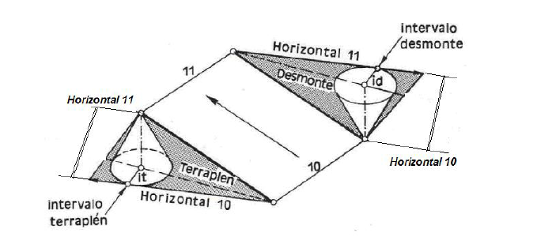

## Índice

::: {.texto-azul style="font-size:0.78em; margin-top:0.8em;"}
-   El problema: apoyar una **plataforma** en un terreno
-   **Desmonte**, **terraplén** y **línea de paso**
-   **Plataforma horizontal** a una cota dada: el método
-   **Plataformas en pendiente**: el método de los conos
-   Un ejemplo desarrollado
:::

## El problema, visto en sección

:::: columns
::: {.column width="64%"}
<svg viewBox="0 0 640 300" xmlns="http://www.w3.org/2000/svg" style="width:92%; display:block; margin:0 auto;">
<g class="fragment" data-fragment-index="2">
<polygon points="181.5,121.5 240,180 240,139" fill="#e07a7a" stroke="none" stroke-width="2" stroke-linejoin="round" fill-opacity="0.5"/>
<line x1="181.5" y1="121.5" x2="240" y2="180" stroke="#d00000" stroke-width="2.6"/>
<text x="175.5" y="109.5" font-size="12.5" fill="#d00000" font-weight="700">talud de desmonte (1:1)</text>
</g>
<g class="fragment" data-fragment-index="3">
<polygon points="420,180 496,230.7 420,212.7" fill="#7ac07a" stroke="none" stroke-width="2" stroke-linejoin="round" fill-opacity="0.5"/>
<line x1="420" y1="180" x2="496" y2="230.7" stroke="#1a7a1a" stroke-width="2.6"/>
<text x="450" y="250.7" font-size="12.5" fill="#1a7a1a" font-weight="700">talud de terraplén (2:3)</text>
</g>
<path d="M 0,102.6 L 61.6,105.5 L 112.5,110.1 L 155.3,116.4 L 195.5,125.3 L 227.6,134.7 L 259.7,146.4 L 289.2,158.7 L 358.8,189.8 L 393.6,203.7 L 428.5,215.3 L 465.9,224.9 L 500.8,231.3 L 540.9,236.4 L 586.4,240 L 640,242.4" fill="none" stroke="#8a5a2a" stroke-width="2.8" stroke-linejoin="round"/>
<text x="30" y="92" font-size="13" fill="#8a5a2a" font-weight="700">terreno</text>
<g class="fragment" data-fragment-index="1">
<line x1="240" y1="180" x2="420" y2="180" stroke="#1a1a1a" stroke-width="3.4"/>
<text x="330" y="170" font-size="13" fill="#1a1a1a" font-weight="700" text-anchor="middle">plataforma</text>
</g>
<g class="fragment" data-fragment-index="4">
<text x="320" y="282" font-size="12" fill="#555" text-anchor="middle">desmonte: quito tierra · terraplén: aporto tierra · el perfil ayuda a verlo</text>
</g>
</svg>
:::

::: {.column width="36%"}
::: {.texto-azul style="font-size:0.6em; margin-top:0.6em;"}
Queremos apoyar una **plataforma** (una explanada, una pista, una caseta…) en un terreno natural.

::: {.fragment fragment-index="2"}
Donde el terreno está **por encima**, excavo: **desmonte**, con su talud (aquí 1:1).
:::

::: {.fragment fragment-index="3"}
Donde está **por debajo**, relleno: **terraplén**, con un talud más tendido (aquí 2:3), porque la tierra aportada es menos estable.
:::

::: {.fragment fragment-index="4"}
Los puntos del borde donde el terreno está **justo a la cota** de la plataforma forman la **línea de paso** de desmonte a terraplén.
:::
:::
:::
::::

## Plataforma horizontal a una cota dada

:::: columns
::: {.column width="58%"}
<svg viewBox="150 70 290 240" xmlns="http://www.w3.org/2000/svg" style="width:94%; display:block; margin:0 auto;">
<rect x="150" y="70" width="290" height="240" fill="#fdfbf7"/>
<path d="M 461.4,360.0 L 480.0,346.6" fill="none" stroke="#8a5a2a" stroke-width="1.8" stroke-linejoin="round"/>
<path d="M 0.0,271.3 C 3.5,275.6 13.7,289.8 21.0,296.9 C 28.3,304.0 35.8,309.6 44.0,313.9 C 52.2,318.2 61.2,321.2 70.0,322.6 C 78.8,324.0 89.0,323.4 97.0,322.2 C 105.0,321.0 111.2,318.6 118.0,315.2 C 124.8,311.8 132.2,306.5 138.0,301.8 C 143.8,297.1 145.7,295.1 152.7,286.8 C 159.7,278.5 172.9,260.2 180.0,252.2 C 187.1,244.2 189.5,242.4 195.0,238.6 C 200.5,234.8 207.3,231.0 213.0,229.3 C 218.7,227.6 225.2,227.8 229.0,228.2 C 232.8,228.6 233.8,230.0 235.8,231.6 C 237.8,233.2 236.1,228.5 241.0,237.5 C 245.9,246.5 257.2,272.7 265.0,285.8 C 272.8,298.9 279.0,306.6 288.0,315.9 C 297.0,325.2 307.9,334.3 319.0,341.7 C 330.1,349.1 348.5,356.9 354.4,360.0" fill="none" stroke="#8a5a2a" stroke-width="1.8" stroke-linejoin="round"/>
<path d="M 480.0,235.0 C 478.0,232.4 472.5,224.7 468.0,219.6 C 463.5,214.5 458.3,209.3 453.0,204.6 C 447.7,199.9 441.8,195.4 436.0,191.3 C 430.2,187.2 427.3,184.8 418.0,180.3 C 408.7,175.9 396.0,169.4 380.0,164.6 C 364.0,159.8 333.8,154.7 322.0,151.2 C 310.2,147.7 312.0,145.9 309.2,143.4 C 306.4,140.9 306.3,139.1 305.4,136.4 C 304.5,133.7 303.8,137.1 303.9,127.4 C 304.0,117.7 306.1,91.1 305.9,78.2 C 305.7,65.3 304.9,59.3 302.6,50.1 C 300.3,40.9 296.7,31.5 292.2,23.1 C 287.7,14.8 278.2,3.9 275.4,0.0" fill="none" stroke="#8a5a2a" stroke-width="1.8" stroke-linejoin="round"/>
<path d="M 7.9,0.0 L 0.0,5.9" fill="none" stroke="#8a5a2a" stroke-width="1.8" stroke-linejoin="round"/>
<path d="M 0.0,193.8 C 4.9,202.6 22.0,234.5 29.4,246.7 C 36.8,258.8 40.3,261.9 44.6,266.7 C 48.9,271.5 51.4,273.1 55.0,275.5 C 58.6,277.9 62.3,279.9 66.0,281.3 C 69.7,282.8 73.2,283.7 77.0,284.2 C 80.8,284.7 84.5,285.1 89.0,284.5 C 93.5,283.9 99.2,282.6 104.0,280.5 C 108.8,278.4 113.9,275.1 118.1,271.8 C 122.3,268.5 123.7,267.4 129.4,260.7 C 135.1,254.0 146.2,238.8 152.3,231.6 C 158.4,224.4 152.9,227.9 165.7,217.6 C 178.5,207.2 215.7,180.9 229.1,169.5 C 242.5,158.1 241.4,156.8 246.3,149.4 C 251.2,142.0 255.4,133.8 258.6,125.3 C 261.8,116.8 264.3,107.1 265.5,98.3 C 266.7,89.5 266.8,80.4 265.7,72.2 C 264.6,64.0 262.3,56.3 259.2,49.1 C 256.1,41.9 251.8,35.2 246.8,29.1 C 241.8,23.0 235.8,17.4 229.0,12.6 C 222.2,7.7 209.9,2.1 206.1,0.0" fill="none" stroke="#8a5a2a" stroke-width="0.9" stroke-linejoin="round"/>
<path d="M 88.0,0.0 C 83.7,1.8 70.4,6.7 62.0,11.1 C 53.6,15.4 45.2,20.6 37.7,26.1 C 30.2,31.6 23.0,37.8 16.7,44.1 C 10.4,50.4 2.8,60.8 0.0,64.1" fill="none" stroke="#8a5a2a" stroke-width="0.9" stroke-linejoin="round"/>
<path d="M 390.0,343.0 C 393.5,343.1 404.3,344.2 411.0,343.7 C 417.7,343.2 424.2,342.0 430.0,340.1 C 435.8,338.2 441.3,335.6 446.0,332.4 C 450.7,329.2 455.1,325.1 458.4,320.9 C 461.7,316.6 464.2,312.1 466.0,306.9 C 467.8,301.7 468.9,295.6 469.0,289.8 C 469.1,284.0 468.3,277.8 466.7,271.8 C 465.1,265.8 462.6,259.6 459.5,253.7 C 456.4,247.8 452.6,242.1 448.0,236.6 C 443.4,231.1 437.9,225.4 432.2,220.6 C 426.5,215.8 420.5,211.5 414.0,207.7 C 407.5,203.9 400.2,200.3 393.0,197.6 C 385.8,194.9 378.2,192.8 371.0,191.4 C 363.8,190.0 356.8,189.3 350.0,189.3 C 343.2,189.3 336.3,189.9 330.0,191.3 C 323.7,192.7 316.5,195.6 312.0,197.7 C 307.5,199.8 305.7,201.5 303.0,203.8 C 300.3,206.1 298.3,207.1 295.7,211.6 C 293.1,216.1 288.9,223.4 287.6,230.6 C 286.3,237.8 286.2,246.5 287.7,254.7 C 289.2,262.9 292.5,271.9 296.7,279.8 C 300.9,287.8 306.6,295.5 313.0,302.4 C 319.4,309.3 326.8,315.8 335.0,321.3 C 343.2,326.8 352.8,332.0 362.0,335.6 C 371.2,339.2 385.3,341.8 390.0,343.0" fill="none" stroke="#8a5a2a" stroke-width="0.9" stroke-linejoin="round"/>
<path d="M 388.0,322.9 C 390.5,323.0 398.2,323.8 403.0,323.4 C 407.8,323.0 412.7,322.0 417.0,320.6 C 421.3,319.2 425.3,317.2 428.7,314.9 C 432.1,312.6 434.9,309.9 437.3,306.9 C 439.7,303.9 441.6,300.5 442.9,296.8 C 444.2,293.1 445.0,289.0 445.1,284.8 C 445.2,280.6 444.8,276.2 443.7,271.8 C 442.6,267.4 441.1,263.1 438.8,258.7 C 436.6,254.3 433.4,249.7 430.2,245.7 C 427.0,241.7 423.6,238.2 419.6,234.7 C 415.6,231.2 410.8,227.6 406.0,224.7 C 401.2,221.8 396.2,219.2 391.0,217.2 C 385.8,215.2 380.2,213.6 375.0,212.5 C 369.8,211.4 364.8,210.9 360.0,210.9 C 355.2,210.9 350.5,211.3 346.0,212.3 C 341.5,213.3 337.3,214.3 333.0,216.8 C 328.7,219.3 323.3,223.3 320.0,227.5 C 316.7,231.7 314.5,236.5 313.4,241.7 C 312.2,246.9 312.2,253.0 313.1,258.7 C 314.0,264.4 315.9,270.1 318.9,275.8 C 321.9,281.5 326.2,287.6 330.9,292.8 C 335.6,298.0 341.0,302.8 347.0,306.9 C 353.0,311.0 360.2,314.8 367.0,317.5 C 373.8,320.2 384.5,322.0 388.0,322.9" fill="none" stroke="#8a5a2a" stroke-width="0.9" stroke-linejoin="round"/>
<path d="M 82.0,250.7 C 84.2,250.4 90.5,250.7 95.0,249.1 C 99.5,247.5 100.5,248.2 109.0,240.9 C 117.5,233.7 129.7,219.0 145.8,205.6 C 162.0,192.2 193.5,170.4 205.9,160.4 C 218.3,150.4 215.8,150.7 220.0,145.4 C 224.2,140.1 228.2,133.8 231.1,128.4 C 234.0,123.1 235.8,118.5 237.4,113.3 C 239.1,108.1 240.3,102.5 241.0,97.3 C 241.7,92.1 241.8,87.2 241.4,82.2 C 241.0,77.2 240.1,72.0 238.7,67.2 C 237.2,62.4 235.1,57.5 232.7,53.1 C 230.3,48.8 227.4,44.8 224.1,41.1 C 220.8,37.4 217.0,33.9 213.0,30.8 C 209.0,27.7 206.0,25.3 200.0,22.5 C 194.0,19.7 185.2,15.9 177.0,13.9 C 168.8,11.9 159.8,10.7 151.0,10.3 C 142.2,10.0 133.0,10.5 124.0,11.8 C 115.0,13.1 105.8,15.4 97.0,18.3 C 88.2,21.2 79.2,25.1 71.0,29.5 C 62.8,33.9 55.0,39.2 48.0,44.8 C 41.0,50.4 34.7,56.6 29.2,63.2 C 23.7,69.8 18.8,77.5 15.2,84.2 C 11.7,90.9 9.6,97.0 7.9,103.3 C 6.2,109.6 5.2,115.9 5.0,122.3 C 4.8,128.7 5.4,135.1 6.6,141.4 C 7.8,147.8 9.1,152.7 12.3,160.4 C 15.5,168.1 19.1,175.6 26.0,187.5 C 32.9,199.4 46.7,222.0 53.5,231.6 C 60.3,241.2 62.2,241.8 67.0,245.0 C 71.8,248.2 79.5,249.8 82.0,250.7" fill="none" stroke="#8a5a2a" stroke-width="0.9" stroke-linejoin="round"/>
<path d="M 387.0,302.9 C 390.0,302.5 400.0,302.5 405.0,300.6 C 410.0,298.7 414.5,294.0 417.0,291.4 C 419.5,288.8 419.4,287.2 420.1,284.8 C 420.8,282.4 421.7,280.8 421.1,276.8 C 420.5,272.8 419.3,265.9 416.4,260.7 C 413.5,255.5 408.7,249.9 403.6,245.7 C 398.5,241.5 392.1,237.8 386.0,235.5 C 379.9,233.2 373.0,231.8 367.0,231.9 C 361.0,232.0 354.2,234.0 350.0,235.8 C 345.8,237.6 343.9,240.0 341.9,242.7 C 339.9,245.3 338.5,248.4 337.8,251.7 C 337.1,255.0 337.1,259.0 337.7,262.7 C 338.3,266.4 339.7,270.1 341.7,273.8 C 343.7,277.5 346.7,281.5 349.9,284.8 C 353.1,288.1 357.0,291.2 361.0,293.8 C 365.0,296.4 369.7,298.6 374.0,300.1 C 378.3,301.6 384.8,302.4 387.0,302.9" fill="none" stroke="#8a5a2a" stroke-width="0.9" stroke-linejoin="round"/>
<path d="M 83.0,210.7 C 84.8,210.7 90.2,211.6 94.0,210.9 C 97.8,210.2 95.0,212.9 106.0,206.8 C 117.0,200.7 146.0,183.6 160.0,174.5 C 174.0,165.4 181.7,159.8 189.8,152.4 C 197.9,145.1 203.8,138.2 208.8,130.4 C 213.8,122.6 217.6,111.7 219.7,105.3 C 221.8,98.9 221.3,96.5 221.4,92.3 C 221.5,88.1 221.2,84.0 220.5,80.2 C 219.8,76.4 218.9,72.9 217.4,69.2 C 215.9,65.5 213.9,61.7 211.5,58.2 C 209.1,54.7 206.1,51.2 203.0,48.2 C 199.9,45.2 197.7,43.1 193.0,40.4 C 188.3,37.7 181.3,34.0 175.0,31.9 C 168.7,29.8 162.0,28.3 155.0,27.5 C 148.0,26.7 140.3,26.6 133.0,27.2 C 125.7,27.8 118.3,28.9 111.0,30.8 C 103.7,32.7 96.0,35.4 89.0,38.6 C 82.0,41.8 75.2,45.6 69.0,49.8 C 62.8,54.0 57.0,58.9 52.0,64.0 C 47.0,69.1 42.5,74.8 38.9,80.2 C 35.3,85.6 32.7,90.8 30.6,96.3 C 28.5,101.8 27.1,107.6 26.3,113.3 C 25.5,119.0 25.4,124.7 26.0,130.4 C 26.6,136.1 27.6,141.2 29.8,147.4 C 32.0,153.6 35.1,160.5 39.3,167.5 C 43.5,174.5 49.9,183.4 55.0,189.5 C 60.1,195.6 65.3,200.8 70.0,204.3 C 74.7,207.8 80.8,209.6 83.0,210.7" fill="none" stroke="#8a5a2a" stroke-width="0.9" stroke-linejoin="round"/>
<path d="M 94.0,181.5 C 97.8,180.9 108.0,180.9 117.0,178.0 C 126.0,175.1 138.5,169.4 148.0,164.1 C 157.5,158.8 166.7,152.5 173.9,146.4 C 181.1,140.3 186.8,133.9 191.3,127.4 C 195.8,120.9 199.0,114.2 200.8,107.3 C 202.6,100.4 203.2,92.7 202.3,86.2 C 201.4,79.7 199.1,73.6 195.5,68.2 C 191.9,62.8 185.8,57.2 181.0,53.6 C 176.2,50.0 172.0,48.4 167.0,46.6 C 162.0,44.8 156.7,43.5 151.0,42.7 C 145.3,42.0 139.0,41.8 133.0,42.1 C 127.0,42.5 121.0,43.3 115.0,44.8 C 109.0,46.3 102.7,48.4 97.0,50.9 C 91.3,53.4 86.0,56.4 81.0,59.7 C 76.0,63.1 71.2,66.9 67.0,71.0 C 62.8,75.1 59.1,79.5 56.0,84.1 C 52.9,88.6 50.5,93.4 48.6,98.3 C 46.7,103.2 45.4,108.3 44.8,113.3 C 44.2,118.3 44.3,123.6 44.9,128.4 C 45.5,133.2 46.6,137.6 48.6,142.4 C 50.6,147.2 53.6,152.8 56.8,157.4 C 60.0,162.0 64.0,166.3 68.0,169.8 C 72.0,173.3 76.7,176.4 81.0,178.3 C 85.3,180.2 91.8,181.0 94.0,181.5" fill="none" stroke="#8a5a2a" stroke-width="0.9" stroke-linejoin="round"/>
<path d="M 100.0,159.5 C 103.0,159.3 111.5,159.9 118.0,158.5 C 124.5,157.1 132.2,154.5 139.0,151.3 C 145.8,148.1 152.8,143.9 158.6,139.4 C 164.3,134.9 169.7,129.3 173.5,124.3 C 177.3,119.3 179.8,114.5 181.5,109.3 C 183.2,104.1 184.0,98.3 183.7,93.3 C 183.4,88.3 181.9,83.5 179.5,79.2 C 177.1,74.9 172.4,70.3 169.0,67.4 C 165.6,64.5 162.7,63.2 159.0,61.7 C 155.3,60.2 151.2,59.0 147.0,58.3 C 142.8,57.6 138.5,57.2 134.0,57.3 C 129.5,57.4 124.7,57.9 120.0,58.9 C 115.3,59.9 110.3,61.5 106.0,63.2 C 101.7,64.9 97.8,66.8 94.0,69.2 C 90.2,71.6 86.3,74.4 83.0,77.4 C 79.7,80.4 76.6,83.7 74.0,87.2 C 71.4,90.7 69.2,94.6 67.5,98.3 C 65.8,102.0 64.8,105.5 64.1,109.3 C 63.4,113.1 63.3,117.5 63.6,121.3 C 63.9,125.1 64.7,128.5 66.0,132.0 C 67.3,135.5 69.3,139.3 71.5,142.4 C 73.7,145.5 76.1,148.1 79.0,150.5 C 81.9,152.9 85.5,155.1 89.0,156.6 C 92.5,158.1 98.2,159.0 100.0,159.5" fill="none" stroke="#8a5a2a" stroke-width="1.8" stroke-linejoin="round"/>
<path d="M 107.0,137.6 C 109.0,137.7 114.8,138.4 119.0,137.9 C 123.2,137.4 127.8,136.2 132.0,134.5 C 136.2,132.8 140.5,130.4 144.0,127.9 C 147.5,125.4 150.7,122.4 153.2,119.3 C 155.7,116.2 157.9,112.6 159.2,109.3 C 160.5,106.0 161.1,102.5 161.1,99.3 C 161.1,96.1 160.2,93.1 158.9,90.3 C 157.6,87.5 156.2,85.0 153.0,82.7 C 149.8,80.4 144.8,77.7 140.0,76.6 C 135.2,75.5 129.3,75.4 124.0,76.2 C 118.7,77.0 112.9,78.9 108.0,81.6 C 103.1,84.3 98.0,88.2 94.5,92.3 C 91.0,96.4 88.2,101.7 87.0,106.3 C 85.8,110.9 85.8,115.7 87.0,119.9 C 88.2,124.1 90.9,128.5 94.2,131.4 C 97.5,134.3 104.9,136.6 107.0,137.6" fill="none" stroke="#8a5a2a" stroke-width="0.9" stroke-linejoin="round"/>
<text x="380" y="168.6" font-size="11" fill="#8a5a2a" font-weight="700" text-anchor="middle" stroke="#ffffff" stroke-width="3.5" stroke-linejoin="round" opacity="0.9">100</text>
<text x="380" y="168.6" font-size="11" fill="#8a5a2a" font-weight="700" text-anchor="middle">100</text>
<text x="265.5" y="102.3" font-size="11" fill="#8a5a2a" font-weight="700" text-anchor="middle" stroke="#ffffff" stroke-width="3.5" stroke-linejoin="round" opacity="0.9">110</text>
<text x="265.5" y="102.3" font-size="11" fill="#8a5a2a" font-weight="700" text-anchor="middle">110</text>
<text x="419.6" y="238.7" font-size="11" fill="#8a5a2a" font-weight="700" text-anchor="middle" stroke="#ffffff" stroke-width="3.5" stroke-linejoin="round" opacity="0.9">120</text>
<text x="419.6" y="238.7" font-size="11" fill="#8a5a2a" font-weight="700" text-anchor="middle">120</text>
<text x="416.4" y="264.7" font-size="11" fill="#8a5a2a" font-weight="700" text-anchor="middle" stroke="#ffffff" stroke-width="3.5" stroke-linejoin="round" opacity="0.9">130</text>
<text x="416.4" y="264.7" font-size="11" fill="#8a5a2a" font-weight="700" text-anchor="middle">130</text>
<g class="fragment" data-fragment-index="1">
<polygon points="235,220 315,220 315,145 235,145" fill="#d9d9d9" stroke="#1a1a1a" stroke-width="2.6" stroke-linejoin="round" fill-opacity="0.75"/>
<text x="275" y="178.5" font-size="12" fill="#1a1a1a" font-weight="700" text-anchor="middle">plataforma</text>
<text x="275" y="194.5" font-size="12" fill="#1a1a1a" font-weight="700" text-anchor="middle">(cota 108)</text>
<circle cx="315" cy="191.7" r="3.2" fill="#2d6fd0" stroke="#123a70" stroke-width="1.4"/>
<circle cx="315" cy="190" r="3.2" fill="#2d6fd0" stroke="#123a70" stroke-width="1.4"/>
<circle cx="315" cy="188.3" r="3.2" fill="#2d6fd0" stroke="#123a70" stroke-width="1.4"/>
<circle cx="315" cy="186.7" r="3.2" fill="#2d6fd0" stroke="#123a70" stroke-width="1.4"/>
<circle cx="259.9" cy="145" r="3.2" fill="#2d6fd0" stroke="#123a70" stroke-width="1.4"/>
<circle cx="258.1" cy="145" r="3.2" fill="#2d6fd0" stroke="#123a70" stroke-width="1.4"/>
<circle cx="256.3" cy="145" r="3.2" fill="#2d6fd0" stroke="#123a70" stroke-width="1.4"/>
<circle cx="254.6" cy="145" r="3.2" fill="#2d6fd0" stroke="#123a70" stroke-width="1.4"/>
<circle cx="252.8" cy="145" r="3.2" fill="#2d6fd0" stroke="#123a70" stroke-width="1.4"/>
<circle cx="235" cy="170" r="3.2" fill="#2d6fd0" stroke="#123a70" stroke-width="1.4"/>
<circle cx="235" cy="171.7" r="3.2" fill="#2d6fd0" stroke="#123a70" stroke-width="1.4"/>
<circle cx="235" cy="173.3" r="3.2" fill="#2d6fd0" stroke="#123a70" stroke-width="1.4"/>
<circle cx="235" cy="175" r="3.2" fill="#2d6fd0" stroke="#123a70" stroke-width="1.4"/>
<circle cx="235" cy="176.7" r="3.2" fill="#2d6fd0" stroke="#123a70" stroke-width="1.4"/>
<circle cx="281.2" cy="220" r="3.2" fill="#2d6fd0" stroke="#123a70" stroke-width="1.4"/>
<circle cx="283" cy="220" r="3.2" fill="#2d6fd0" stroke="#123a70" stroke-width="1.4"/>
<circle cx="284.8" cy="220" r="3.2" fill="#2d6fd0" stroke="#123a70" stroke-width="1.4"/>
<circle cx="286.6" cy="220" r="3.2" fill="#2d6fd0" stroke="#123a70" stroke-width="1.4"/>
<text x="265" y="240" font-size="11.5" fill="#2d6fd0" font-weight="700" stroke="#ffffff" stroke-width="3.5" stroke-linejoin="round" opacity="0.9">línea de paso</text>
<text x="265" y="240" font-size="11.5" fill="#2d6fd0" font-weight="700">línea de paso</text>
</g>
<g class="fragment" data-fragment-index="2">
<polyline points="320,220 320,218.3 320,216.7 320,215 320,213.3 320,211.7 320,210 320,208.3 320,206.7 320,205" fill="none" stroke="#d06060" stroke-width="1.1" stroke-linejoin="round"/>
<polyline points="242.1,140 240.3,140 238.6,140 236.8,140 235,140 234.3,140 233.7,140.2 233.1,140.4 232.5,140.7 232,141 231.5,141.5 231,142 230.7,142.5 230.4,143.1 230.2,143.7 230,144.3 230,145 230,146.7 230,148.3 230,150 230,151.7 230,153.3 230,155 230,156.7" fill="none" stroke="#d06060" stroke-width="1.1" stroke-linejoin="round"/>
<polyline points="300.8,225 302.6,225 304.3,225 306.1,225 307.9,225 309.7,225 311.4,225 313.2,225 315,225 315.7,225 316.3,224.8 316.9,224.6 317.5,224.3 318,224 318.5,223.5 319,223 319.3,222.5 319.6,221.9 319.8,221.3 320,220.7" fill="none" stroke="#d06060" stroke-width="1.1" stroke-linejoin="round"/>
<polyline points="325,220 325,218.3 325,216.7" fill="none" stroke="#d06060" stroke-width="1.1" stroke-linejoin="round"/>
<polyline points="231.2,135.8 230,136.3 228.9,137.1 227.9,137.9 227.1,138.9 226.3,140 225.8,141.2 225.3,142.4 225.1,143.7 225,145" fill="none" stroke="#d06060" stroke-width="1.1" stroke-linejoin="round"/>
<polyline points="313.2,230 315,230 316.3,229.9 317.6,229.7 318.8,229.2 320,228.7 321.1,227.9 322.1,227.1 322.9,226.1 323.7,225 324.2,223.8 324.7,222.6 324.9,221.3" fill="none" stroke="#d06060" stroke-width="1.1" stroke-linejoin="round"/>
</g>
<g class="fragment" data-fragment-index="3">
<polyline points="322.5,166.7 322.5,165 322.5,163.3 322.5,161.7 322.5,160 322.5,158.3 322.5,156.7 322.5,155 322.5,153.3 322.5,151.7 322.5,150 322.5,148.3 322.5,146.7 322.5,145 322.4,144 322.2,143.1 321.9,142.1 321.5,141.2 321,140.4 320.3,139.7 319.6,139 318.8,138.5 317.9,138.1 316.9,137.8 316,137.6 315,137.5 313.2,137.5 311.4,137.5 309.7,137.5 307.9,137.5 306.1,137.5 304.3,137.5 302.6,137.5 300.8,137.5 299,137.5 297.2,137.5 295.4,137.5 293.7,137.5 291.9,137.5 290.1,137.5 288.3,137.5 286.6,137.5 284.8,137.5" fill="none" stroke="#3f9e3f" stroke-width="1.1" stroke-linejoin="round"/>
<polyline points="227.5,205 227.5,206.7 227.5,208.3 227.5,210 227.5,211.7 227.5,213.3 227.5,215 227.5,216.7 227.5,218.3 227.5,220 227.6,221 227.8,221.9 228.1,222.9 228.5,223.8 229,224.6 229.7,225.3 230.4,226 231.2,226.5 232.1,226.9 233.1,227.2 234,227.4 235,227.5 236.8,227.5 238.6,227.5 240.3,227.5 242.1,227.5 243.9,227.5 245.7,227.5 247.4,227.5 249.2,227.5 251,227.5 252.8,227.5 254.6,227.5 256.3,227.5 258.1,227.5" fill="none" stroke="#3f9e3f" stroke-width="1.1" stroke-linejoin="round"/>
</g>
<g class="fragment" data-fragment-index="4">
<polyline points="326.7,220 326.1,218.3 325.4,216.7 324.7,215 324,213.3 323.3,211.7 322.6,210 321.9,208.3 321.2,206.7 320.6,205 319.9,203.3 319.3,201.7 318.7,200 318.1,198.3 317.5,196.7 316.9,195 316.3,193.3" fill="none" stroke="#d00000" stroke-width="2.6" stroke-linejoin="round"/>
<polyline points="251,143.3 249.2,142.6 247.4,142 245.7,141.3 243.9,140.6 242.1,139.8 240.3,139.1 238.6,138.3 236.8,137.4 235,136.5 233.8,136 232.5,135.7 231.1,135.5 229.5,135.6 228,135.9 226.6,136.6 225.4,137.6 224.5,139 224.1,140.5 224,142 224.3,143.6 224.8,145 225.6,146.7 226.4,148.3 227.1,150 227.8,151.7 228.5,153.3 229.2,155 229.9,156.7 230.5,158.3 231.1,160 231.7,161.7 232.2,163.3 232.8,165 233.3,166.7 233.8,168.3" fill="none" stroke="#d00000" stroke-width="2.6" stroke-linejoin="round"/>
<polyline points="288.3,221.5 290.1,222 291.9,222.6 293.7,223.2 295.4,223.7 297.2,224.4 299,225 300.8,225.6 302.6,226.3 304.3,226.9 306.1,227.6 307.9,228.3 309.7,229 311.4,229.7 313.2,230.4 315,231.2 316.5,231.7 318.2,232 320,232 321.7,231.7 323.4,231 325,230 326.2,228.6 327,227 327.5,225.2 327.6,223.4 327.3,221.6" fill="none" stroke="#d00000" stroke-width="2.6" stroke-linejoin="round"/>
<polyline points="316.5,185 317.2,183.3 317.8,181.7 318.4,180 319,178.3 319.6,176.7 320.2,175 320.8,173.3 321.4,171.7 321.9,170 322.5,168.3 323,166.7 323.6,165 324.1,163.3 324.6,161.7 325.1,160 325.5,158.3 326,156.7 326.4,155 326.8,153.3 327.2,151.7 327.6,150 328,148.3 328.3,146.7 328.6,145 328.9,143.2 328.8,141.3 328.4,139.5 327.7,137.7 326.7,136 325.4,134.6 324,133.3 322.3,132.3 320.5,131.6 318.7,131.2 316.8,131.1 315,131.3 313.2,131.5 311.4,131.8 309.7,132.1 307.9,132.4 306.1,132.7 304.3,133 302.6,133.4 300.8,133.7 299,134.1 297.2,134.4 295.4,134.8 293.7,135.1 291.9,135.5 290.1,135.9 288.3,136.3 286.6,136.7 284.8,137.2 283,137.6 281.2,138 279.4,138.5 277.7,138.9 275.9,139.4 274.1,139.9 272.3,140.4 270.6,140.9 268.8,141.4 267,141.9 265.2,142.4 263.4,142.9 261.7,143.4" fill="none" stroke="#1a7a1a" stroke-width="2.6" stroke-linejoin="round"/>
<polyline points="233.6,178.3 233.2,180 232.8,181.7 232.4,183.3 232,185 231.6,186.7 231.2,188.3 230.8,190 230.4,191.7 230.1,193.3 229.7,195 229.3,196.7 228.9,198.3 228.5,200 228.2,201.7 227.8,203.3 227.4,205 227.1,206.7 226.7,208.3 226.4,210 226,211.7 225.7,213.3 225.3,215 225,216.7 224.7,218.3 224.4,220 224.2,221.4 224.2,222.9 224.4,224.4 224.9,225.9 225.5,227.3 226.4,228.6 227.5,229.8 228.8,230.7 230.2,231.5 231.8,232 233.4,232.2 235,232.1 236.8,231.9 238.6,231.7 240.3,231.4 242.1,231.2 243.9,230.9 245.7,230.6 247.4,230.2 249.2,229.8 251,229.5 252.8,229.1 254.6,228.6 256.3,228.2 258.1,227.7 259.9,227.2 261.7,226.8 263.4,226.2 265.2,225.7 267,225.2 268.8,224.6 270.6,224.1 272.3,223.5 274.1,223 275.9,222.4 277.7,221.8 279.4,221.2" fill="none" stroke="#1a7a1a" stroke-width="2.6" stroke-linejoin="round"/>
<text x="213" y="128" font-size="12" fill="#d00000" font-weight="700" text-anchor="middle" stroke="#ffffff" stroke-width="3.5" stroke-linejoin="round" opacity="0.9">encuentro del</text>
<text x="213" y="128" font-size="12" fill="#d00000" font-weight="700" text-anchor="middle">encuentro del</text>
<text x="213" y="143" font-size="12" fill="#d00000" font-weight="700" text-anchor="middle" stroke="#ffffff" stroke-width="3.5" stroke-linejoin="round" opacity="0.9">desmonte (1:1)</text>
<text x="213" y="143" font-size="12" fill="#d00000" font-weight="700" text-anchor="middle">desmonte (1:1)</text>
<text x="370" y="253" font-size="12" fill="#1a7a1a" font-weight="700" text-anchor="middle" stroke="#ffffff" stroke-width="3.5" stroke-linejoin="round" opacity="0.9">encuentro del</text>
<text x="370" y="253" font-size="12" fill="#1a7a1a" font-weight="700" text-anchor="middle">encuentro del</text>
<text x="370" y="268" font-size="12" fill="#1a7a1a" font-weight="700" text-anchor="middle" stroke="#ffffff" stroke-width="3.5" stroke-linejoin="round" opacity="0.9">terraplén (2:3)</text>
<text x="370" y="268" font-size="12" fill="#1a7a1a" font-weight="700" text-anchor="middle">terraplén (2:3)</text>
</g>
<text x="158" y="304" font-size="11" fill="#555">Plataforma a cota 108 · líneas de talud cada 5 m</text>
</svg>
:::

::: {.column width="42%"}
::: {.texto-azul style="font-size:0.54em; margin-top:0.3em;"}
Plataforma a **cota 108** en el collado de nuestro terreno.

::: {.fragment fragment-index="1"}
1.  Determinar las zonas de **desmonte y terraplén** = línea de paso (borde donde terreno y plataforma tienen la misma cota).
:::

::: {.fragment fragment-index="2"}
2.  Por cada borde, hacer pasar un **plano de talud**: el de **desmonte** sube (1:1)… — sus líneas de nivel son paralelas al borde, separadas el **intervalo** del talud.
:::

::: {.fragment fragment-index="3"}
3.  …y el de **terraplén** baja (2:3). En las **esquinas**, el talud es un **cono** (líneas de nivel: arcos).
:::

::: {.fragment fragment-index="4"}
4.  Calcular la **intersección de cada plano con el terreno** (unir los cruces de líneas de nivel de igual cota) y el **cierre entre taludes**: las líneas de encuentro.
:::
:::
:::
::::

## Plataformas en pendiente

:::: columns
::: {.column width="58%"}
<svg viewBox="0 0 640 380" xmlns="http://www.w3.org/2000/svg" style="width:88%; display:block; margin:0 auto;">
<line x1="92.6" y1="312.3" x2="547.4" y2="107.7" stroke="#1a1a1a" stroke-width="3"/>
<circle cx="180" cy="273" r="3.6" fill="#fff" stroke="#1a1a1a" stroke-width="1.6"/>
<text x="188" y="291" font-size="12.5" fill="#2d2d8a" font-weight="700">(10)</text>
<circle cx="320" cy="210" r="3.6" fill="#fff" stroke="#1a1a1a" stroke-width="1.6"/>
<text x="328" y="228" font-size="12.5" fill="#2d2d8a" font-weight="700">(10.5)</text>
<circle cx="460" cy="147" r="3.6" fill="#fff" stroke="#1a1a1a" stroke-width="1.6"/>
<text x="468" y="165" font-size="12.5" fill="#2d2d8a" font-weight="700">(11)</text>
<text x="96" y="326" font-size="12" fill="#444" font-style="italic">borde de la plataforma (graduado)</text>
<g class="fragment" data-fragment-index="1">
<circle cx="320" cy="210" r="62.0" fill="none" stroke="#e8862c" stroke-width="2"/>
<line x1="320" y1="210" x2="363.8" y2="253.8" stroke="#e8862c" stroke-width="1.4" stroke-dasharray="5,3"/>
<text x="366.5" y="274.5" font-size="11.5" fill="#e8862c" font-weight="700">radio = intervalo del talud</text>
<text x="248" y="172.8" font-size="11.5" fill="#e8862c" font-weight="700" text-anchor="end">cono de talud</text>
<text x="248" y="187.8" font-size="11.5" fill="#e8862c" font-weight="700" text-anchor="end">con vértice en (10,5)</text>
</g>
<g class="fragment" data-fragment-index="2">
<line x1="180" y1="273" x2="450.4" y2="271.1" stroke="#3f9e3f" stroke-width="2.6"/>
<text x="330" y="317" font-size="12" fill="#3f9e3f" font-weight="700">línea de nivel 10 del talud:</text>
<text x="330" y="333" font-size="12" fill="#3f9e3f" font-weight="700">tangente a la base del cono</text>
</g>
<g class="fragment" data-fragment-index="3">
<line x1="280" y1="210.3" x2="550" y2="208.4" stroke="#3f9e3f" stroke-width="1.6"/>
<text x="556" y="212.3" font-size="11.5" fill="#3f9e3f" font-weight="700">10.5</text>
<line x1="420" y1="147.3" x2="690" y2="145.4" stroke="#3f9e3f" stroke-width="1.6" stroke-dasharray="7,4"/>
<text x="696" y="149.3" font-size="11.5" fill="#3f9e3f" font-weight="700">11</text>
<text x="30" y="360" font-size="11.5" fill="#555">El talud del borde en pendiente es la superficie tangente a los conos: sus líneas</text>
<text x="30" y="375" font-size="11.5" fill="#555">de nivel son las tangentes comunes a las circunferencias de igual cota</text>
</g>
</svg>
:::

::: {.column width="42%"}
::: {.texto-azul style="font-size:0.56em; margin-top:0.4em;"}
Si el borde de la plataforma **tiene pendiente** (una pista, un camino), sus puntos ya no están a una cota única: el borde es una **recta graduada**.

::: {.fragment fragment-index="1"}
El talud que se apoya en él es la superficie **tangente a los conos de talud** con vértice en los puntos del borde y radio su intervalo.
:::

::: {.fragment fragment-index="2"}
Cada **línea de nivel del talud** es la **tangente** desde un punto del borde a la circunferencia base del cono del punto contiguo.
:::

::: {.fragment fragment-index="3"}
Las demás son **paralelas** por los puntos graduados. El intervalo del desmonte y el del terraplén son **distintos**: cada talud tiene su pendiente.
:::
:::
:::
::::

## La misma idea, en perspectiva

::: {.texto-azul style="font-size:0.58em; text-align:center; margin-top:0.4em;"}
La figura clásica: entre las horizontales 10 y 11 del borde en pendiente, el talud de **desmonte** abre hacia arriba con su intervalo id y el de **terraplén** hacia abajo con it, ambos tangentes a los conos.
:::

## Un ejemplo desarrollado

:::: columns
::: {.column width="46%"}

:::

::: {.column width="54%"}
::: {.texto-azul style="font-size:0.54em; margin-top:0.4em;"}
Plataforma **en pendiente** (rasante A→B) resuelta en AutoCAD sobre un terreno real:

1.  **Línea de paso**: intersección del plano de la plataforma con el terreno (azul, a trazos).
2.  Plano de **desmonte/terraplén** por cada borde. Si el borde es **horizontal**, como en la plataforma horizontal; si **tiene pendiente**, con el **cono**: desde el punto contiguo del borde, tangente a la base (rojo desmonte, morado terraplén).
3.  **Líneas de nivel de los planos** de talud, paralelas a la tangente hallada.
4.  **Intersección de cada plano con el terreno** y de los planos entre sí.
5.  **Cierre de los taludes**: la intersección de tres planos es un único punto.
:::
:::
::::

## Para explorar en 3D

::: {.texto-azul style="font-size:0.75em; margin-top:1.2em;"}
Dos escenas interactivas (Storyteller) para girar y entender las explanaciones:

-   [Explicación teórica de la explanada **horizontal**](https://datos1.geoso2.es/geo-player/index.html?scene=scenes/00-ejemplo-basico)
-   [Explicación teórica de la explanada **en pendiente**](https://datos1.geoso2.es/geo-player/index.html?scene=scenes/00-ejemplo-basico-pendiente)
-   [Ejemplo de explanada horizontal con terreno](https://webserver02.leftcape.com/08_TEST/MJ/)
:::
