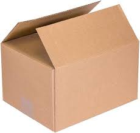
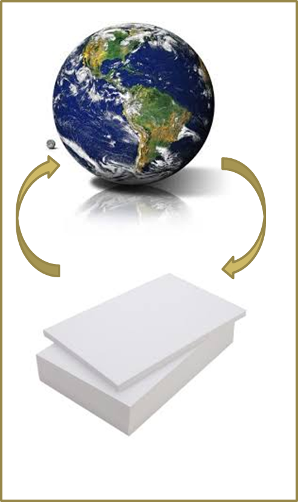
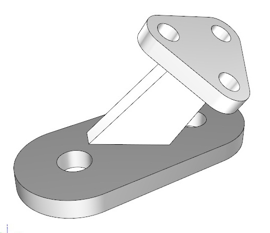
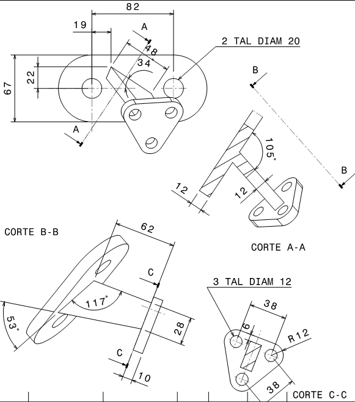
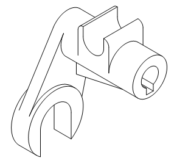
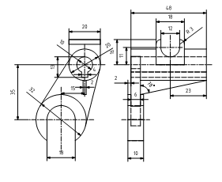
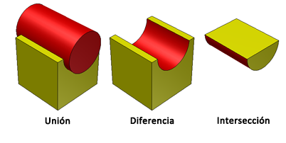
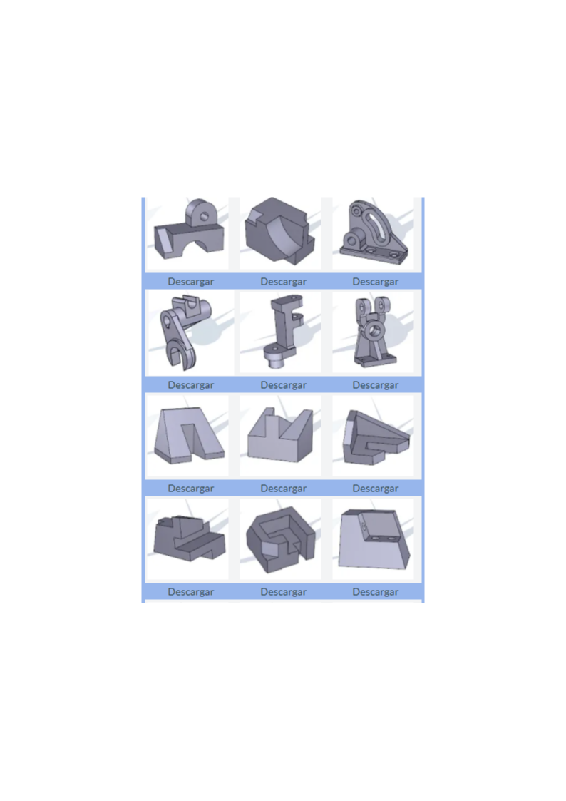
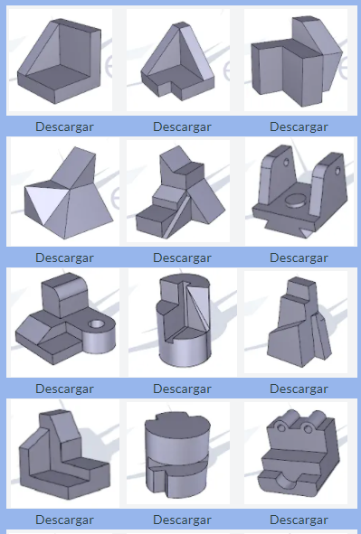

## Representar el mundo en planos

*Las características del dibujo técnico: que sea **gráfico**, **universal** y **preciso**.*

:::: columns
::: {.column width="32%"}

<svg viewBox="0 0 200 60" style="width:55%; display:block; margin:0 auto;">
<defs>
<marker id="fgold" markerWidth="7" markerHeight="7" refX="5" refY="3.5" orient="auto-start-reverse"><path d="M0,0 L7,3.5 L0,7 Z" fill="#c9a227"/></marker>
</defs>
<path d="M 55,8 C 25,20 25,40 55,52" stroke="#c9a227" stroke-width="7" fill="none" marker-end="url(#fgold)"/>
<path d="M 145,52 C 175,40 175,20 145,8" stroke="#c9a227" stroke-width="7" fill="none" marker-end="url(#fgold)"/>
</svg>

:::

::: {.column width="68%"}
::: {.fragment style="margin-left:0.6em;"}
**En INGENIERÍA es CLAVE:** mantener la **relación biunívoca**
:::

::: {.fragment style="margin-left:0.6em; margin-top:0.5em;"}
**DOS problemas:**

-   Mundo 3D --- plano 2D [Sistemas de Representación]{.etiqueta-roja}

:::

::: {.fragment style="margin-left:0.6em; margin-top:0.4em;"}
-   "Mundo" muy complejo [Geometría constructiva]{.etiqueta-roja}

:::
:::
::::

# "Mundo" muy complejo Geometría constructiva {.seccion-oscura}

## Geometría constructiva

correspondencia biunívoca

<svg viewBox="0 0 920 600" style="position:absolute; left:0; top:0; width:920px; height:600px;">
<defs>
<marker id="fazul4" markerWidth="6" markerHeight="6" refX="4.5" refY="3" orient="auto-start-reverse"><path d="M0,0 L6,3 L0,6 Z" fill="#4472c4"/></marker>
</defs>
<g class="fragment" data-fragment-index="1">
<path d="M 660,540 C 590,610 480,610 420,545" stroke="#4472c4" stroke-width="13" fill="none" marker-end="url(#fazul4)"/>
<text x="540" y="640" font-size="24" fill="#4472c4" text-anchor="middle" font-style="italic">de la pieza… al plano</text>
</g>
<g class="fragment" data-fragment-index="3">
<path d="M 420,140 C 480,75 590,75 655,135" stroke="#4472c4" stroke-width="13" fill="none" marker-end="url(#fazul4)"/>
<text x="540" y="80" font-size="24" fill="#4472c4" text-anchor="middle" font-style="italic">…y del plano, la pieza</text>
</g>
</svg>

## Correspondencia biunívoca

correspondencia biunívoca

<svg viewBox="0 0 920 600" style="position:absolute; left:0; top:0; width:920px; height:600px;">
<defs>
<marker id="fazul5" markerWidth="6" markerHeight="6" refX="4.5" refY="3" orient="auto-start-reverse"><path d="M0,0 L6,3 L0,6 Z" fill="#4472c4"/></marker>
</defs>
<g class="fragment" data-fragment-index="1">
<path d="M 400,130 C 450,80 540,80 590,125" stroke="#4472c4" stroke-width="12" fill="none" marker-end="url(#fazul5)"/>
</g>
<g class="fragment" data-fragment-index="3">
<path d="M 590,480 C 540,530 450,530 405,485" stroke="#4472c4" stroke-width="12" fill="none" marker-end="url(#fazul5)"/>
</g>
</svg>

¿Qué se puede hacer? Dividir los problemas en trozos más pequeños → SIMPLIFICAR

## Modelo de representación de geometría constructiva

::: {.texto-azul style="font-size:0.8em;"}
1.  Se genera el modelo por combinación de **sólidos elementales** o *primitivas sólidas*.
2.  Mediante **escalado y movimiento** se sitúan las primitivas en su posición, orientación y tamaño correctos.
3.  Se efectúan las **operaciones booleanas** de unión / intersección / diferencia.
:::

<svg viewBox="60 300 900 400" style="width:100%; max-height:390px; display:block; margin:0 auto;">
<defs>
<linearGradient id="cyl" x1="0" x2="1"><stop offset="0" stop-color="#9dbbe8"/><stop offset="0.5" stop-color="#7fa8dc"/><stop offset="1" stop-color="#5d86c4"/></linearGradient>
</defs>
<!-- 1: cilindro grande -->
<g>
<path d="M120,345 v110 a35,10 0 0 0 70,0 v-110" fill="url(#cyl)" stroke="#333" stroke-width="1.5"/>
<ellipse cx="155" cy="345" rx="35" ry="10" fill="#b6cdf0" stroke="#333" stroke-width="1.5"/>
<text x="95" y="405" font-size="30" fill="#1a1a1a">1</text>
</g>
<!-- 2: cilindro fino -->
<g>
<path d="M141,505 v85 a15,5 0 0 0 30,0 v-85" fill="url(#cyl)" stroke="#333" stroke-width="1.5"/>
<ellipse cx="156" cy="505" rx="15" ry="5" fill="#b6cdf0" stroke="#333" stroke-width="1.5"/>
<text x="112" y="555" font-size="30" fill="#1a1a1a">2</text>
</g>
<!-- (-) y 3: tubo -->
<g class="fragment" data-fragment-index="1">
<text x="250" y="465" font-size="40" font-weight="bold" fill="#d00000">(−)</text>
<path d="M320,400 v110 a35,10 0 0 0 70,0 v-110" fill="url(#cyl)" stroke="#333" stroke-width="1.5"/>
<ellipse cx="355" cy="400" rx="35" ry="10" fill="#b6cdf0" stroke="#333" stroke-width="1.5"/>
<ellipse cx="355" cy="400" rx="15" ry="5" fill="#ffffff" stroke="#333" stroke-width="1.5"/>
<text x="410" y="460" font-size="30" fill="#1a1a1a">3</text>
<text x="300" y="570" font-size="28" fill="#1a1a1a">3 = 1 − 2</text>
</g>
<!-- 4: placa -->
<g class="fragment" data-fragment-index="2">
<polygon points="280,600 460,600 460,660 280,660" fill="#7fa8dc" stroke="#333" stroke-width="1.5"/>
<polygon points="280,600 320,570 500,570 460,600" fill="#9dbbe8" stroke="#333" stroke-width="1.5"/>
<polygon points="460,600 500,570 500,630 460,660" fill="#5d86c4" stroke="#333" stroke-width="1.5"/>
<text x="360" y="640" font-size="30" fill="#1a1a1a">4</text>
</g>
<!-- (+) y 5: placa con tubo -->
<g class="fragment" data-fragment-index="3">
<text x="545" y="590" font-size="40" font-weight="bold" fill="#d00000">(+)</text>
<polygon points="640,600 820,600 820,660 640,660" fill="#7fa8dc" stroke="#333" stroke-width="1.5"/>
<polygon points="640,600 680,570 860,570 820,600" fill="#9dbbe8" stroke="#333" stroke-width="1.5"/>
<polygon points="820,600 860,570 860,630 820,660" fill="#5d86c4" stroke="#333" stroke-width="1.5"/>
<path d="M715,475 v108 a35,10 0 0 0 70,0 v-108" fill="url(#cyl)" stroke="#333" stroke-width="1.5"/>
<ellipse cx="750" cy="475" rx="35" ry="10" fill="#b6cdf0" stroke="#333" stroke-width="1.5"/>
<ellipse cx="750" cy="475" rx="15" ry="5" fill="#ffffff" stroke="#333" stroke-width="1.5"/>
<text x="875" y="640" font-size="28" fill="#1a1a1a">5 = 3 + 4</text>
</g>
</svg>

## Operaciones booleanas

::: {.texto-azul style="font-size:0.78em;"}
-   **Unión** ( ∪ o + ) → junta dos sólidos incluyendo la parte común y no común para crear un nuevo sólido.
-   **Intersección** ( ∩ ) → incluye solo la parte común de los dos sólidos, creando un sólido nuevo.
-   **Diferencia**, sustracción o resta ( − ) → incluye solo la parte no común del primer sólido.
:::

## Volúmenes básicos

::: {.texto-azul style="font-size:1.25em; font-weight:700; margin-left:2.5em; line-height:1.7;"}
-   Ortoedro
-   Cilindro
-   Cono
-   Esfera
:::

 

[*Dimensiones necesarias para definirlos*]{.texto-azul style="font-size:0.8em; margin-left:2em;"}

## Ejemplos: ortoedro (I) {.smaller}

<svg viewBox="30 100 930 600" style="width:100%; max-height:600px; display:block;">
<defs>
<marker id="d9" markerWidth="10" markerHeight="8" refX="9" refY="4" orient="auto-start-reverse"><path d="M0,0 L10,4 L0,8 Z" fill="#1a1a1a"/></marker>
</defs>
<!-- banda ORTOEDRO -->
<text x="48" y="160" font-size="26" font-weight="bold" fill="#2d2d8a">ORTOEDRO</text>
<!-- flecha bajada (fragmento 1) -->
<g class="fragment" data-fragment-index="1">
<path d="M232,175 v55 l-14,0 l22,30 l22,-30 l-14,0 v-55 Z" fill="#7fa8dc" stroke="#333" stroke-width="1"/>
</g>
<!-- caja 3D pequeña con z -->
<polygon points="384,241 482,241 515,208 417,208" fill="#9dbbe8" stroke="#333" stroke-width="1.5"/>
<polygon points="384,241 482,241 482,306 384,306" fill="#7fa8dc" stroke="#333" stroke-width="1.5"/>
<polygon points="482,241 515,208 515,273 482,306" fill="#5d86c4" stroke="#333" stroke-width="1.5"/>
<line x1="417" y1="208" x2="345" y2="208" stroke="#333" stroke-width="1"/>
<line x1="384" y1="306" x2="345" y2="306" stroke="#333" stroke-width="1"/>
<line x1="355" y1="208" x2="355" y2="306" stroke="#333" stroke-width="1.5" marker-start="url(#d9)" marker-end="url(#d9)"/>
<text x="330" y="265" font-size="26" font-style="italic">z</text>
<!-- base en perspectiva (planta 3D) -->
<polygon points="102,505 279,505 338,446 161,446" fill="#c7d7f7" stroke="#333" stroke-width="1.5"/>
<line x1="102" y1="505" x2="102" y2="564" stroke="#333" stroke-width="1"/>
<line x1="279" y1="505" x2="279" y2="564" stroke="#333" stroke-width="1"/>
<line x1="102" y1="556" x2="279" y2="556" stroke="#333" stroke-width="1.5" marker-start="url(#d9)" marker-end="url(#d9)"/>
<text x="182" y="590" font-size="26" font-style="italic">x</text>
<line x1="279" y1="505" x2="338" y2="505" stroke="#333" stroke-width="1"/>
<line x1="338" y1="446" x2="397" y2="446" stroke="#333" stroke-width="1"/>
<line x1="338" y1="505" x2="397" y2="446" stroke="#333" stroke-width="1.5" marker-start="url(#d9)" marker-end="url(#d9)"/>
<text x="385" y="495" font-size="26" font-style="italic" transform="rotate(-45 385 495)">y</text>
<!-- vista 2D de la base -->
<rect x="574" y="514" width="148" height="89" fill="none" stroke="#1a1a1a" stroke-width="4"/>
<line x1="574" y1="603" x2="574" y2="662" stroke="#333" stroke-width="1"/>
<line x1="722" y1="603" x2="722" y2="662" stroke="#333" stroke-width="1"/>
<line x1="574" y1="648" x2="722" y2="648" stroke="#333" stroke-width="1.5" marker-start="url(#d9)" marker-end="url(#d9)"/>
<text x="640" y="640" font-size="26" font-style="italic">x</text>
<line x1="574" y1="514" x2="515" y2="514" stroke="#333" stroke-width="1"/>
<line x1="574" y1="603" x2="515" y2="603" stroke="#333" stroke-width="1"/>
<line x1="530" y1="514" x2="530" y2="603" stroke="#333" stroke-width="1.5" marker-start="url(#d9)" marker-end="url(#d9)"/>
<text x="497" y="568" font-size="26" font-style="italic">y</text>
<!-- nota (fragmento 2) -->
<g class="fragment" data-fragment-index="2">
<rect x="512" y="173" width="390" height="130" rx="6" fill="#fff9c4" stroke="#e0d890"/>
<text x="530" y="207" font-size="22" fill="#0070c0">Las VISTAS surgen a raíz del</text>
<text x="530" y="234" font-size="22" fill="#0070c0">análisis dimensional de la pieza.</text>
<text x="530" y="264" font-size="22" fill="#0070c0"><tspan font-weight="bold">Necesidad</tspan> de la segunda vista:</text>
<text x="530" y="291" font-size="22" fill="#0070c0">poder poner la dimensión en <tspan font-style="italic">z</tspan>.</text>
</g>
<!-- ¿z? (fragmento 3) -->
<g class="fragment" data-fragment-index="3">
<text x="740" y="480" font-size="76" font-weight="bold" fill="#2d6cc0">¿z?</text>
</g>
</svg>

## Ejemplos: ortoedro (II) {.smaller}

<svg viewBox="30 90 930 610" style="width:100%; max-height:600px; display:block;">
<defs>
<marker id="d10" markerWidth="10" markerHeight="8" refX="9" refY="4" orient="auto-start-reverse"><path d="M0,0 L10,4 L0,8 Z" fill="#1a1a1a"/></marker>
</defs>
<text x="66" y="150" font-size="42" fill="#1a1a1a">Ortoedro</text>
<!-- perspectiva: tres caras -->
<polygon points="102,284 328,284 404,208 178,208" fill="#9dbbe8" stroke="#333" stroke-width="1.5"/>
<polygon points="102,284 328,284 328,435 102,435" fill="#7fa8dc" stroke="#333" stroke-width="1.5"/>
<polygon points="328,284 404,208 404,360 328,435" fill="#5d86c4" stroke="#333" stroke-width="1.5"/>
<!-- cota x -->
<line x1="102" y1="435" x2="102" y2="511" stroke="#333" stroke-width="1"/>
<line x1="328" y1="435" x2="328" y2="511" stroke="#333" stroke-width="1"/>
<line x1="102" y1="503" x2="328" y2="503" stroke="#333" stroke-width="1.5" marker-start="url(#d10)" marker-end="url(#d10)"/>
<text x="207" y="537" font-size="26" font-style="italic">x</text>
<!-- cota y (diagonal) -->
<line x1="328" y1="435" x2="404" y2="435" stroke="#333" stroke-width="1"/>
<line x1="404" y1="360" x2="479" y2="360" stroke="#333" stroke-width="1"/>
<line x1="404" y1="435" x2="479" y2="360" stroke="#333" stroke-width="1.5" marker-start="url(#d10)" marker-end="url(#d10)"/>
<text x="452" y="418" font-size="26" font-style="italic">y</text>
<!-- cota z -->
<line x1="404" y1="208" x2="479" y2="208" stroke="#333" stroke-width="1"/>
<line x1="472" y1="208" x2="472" y2="360" stroke="#333" stroke-width="1.5" marker-start="url(#d10)" marker-end="url(#d10)"/>
<text x="483" y="292" font-size="26" font-style="italic">z</text>
<!-- alzado -->
<rect x="706" y="133" width="189" height="151" fill="none" stroke="#1a1a1a" stroke-width="4"/>
<line x1="706" y1="133" x2="631" y2="133" stroke="#333" stroke-width="1"/>
<line x1="706" y1="284" x2="631" y2="284" stroke="#333" stroke-width="1"/>
<line x1="650" y1="133" x2="650" y2="284" stroke="#333" stroke-width="1.5" marker-start="url(#d10)" marker-end="url(#d10)"/>
<text x="618" y="215" font-size="26" font-style="italic">z</text>
<line x1="706" y1="284" x2="706" y2="359" stroke="#333" stroke-width="1"/>
<line x1="895" y1="284" x2="895" y2="359" stroke="#333" stroke-width="1"/>
<line x1="706" y1="341" x2="895" y2="341" stroke="#333" stroke-width="1.5" marker-start="url(#d10)" marker-end="url(#d10)"/>
<rect x="782" y="303" width="38" height="43" fill="none" stroke="#d00000" stroke-width="1.5"/>
<text x="793" y="335" font-size="26" font-style="italic">x</text>
<!-- planta -->
<rect x="706" y="473" width="189" height="113" fill="none" stroke="#1a1a1a" stroke-width="4"/>
<line x1="706" y1="473" x2="631" y2="473" stroke="#333" stroke-width="1"/>
<line x1="706" y1="586" x2="631" y2="586" stroke="#333" stroke-width="1"/>
<line x1="650" y1="473" x2="650" y2="586" stroke="#333" stroke-width="1.5" marker-start="url(#d10)" marker-end="url(#d10)"/>
<text x="618" y="537" font-size="26" font-style="italic">y</text>
<line x1="706" y1="586" x2="706" y2="662" stroke="#333" stroke-width="1"/>
<line x1="895" y1="586" x2="895" y2="662" stroke="#333" stroke-width="1"/>
<line x1="706" y1="643" x2="895" y2="643" stroke="#333" stroke-width="1.5" marker-start="url(#d10)" marker-end="url(#d10)"/>
<text x="793" y="635" font-size="26" font-style="italic">x</text>
<!-- leyenda -->
<rect x="102" y="587" width="38" height="43" fill="none" stroke="#d00000" stroke-width="1.5"/>
<text x="178" y="617" font-size="26" fill="#1a1a1a">Información repetida</text>
</svg>

## Ejemplos: cilindro {.smaller}

<svg viewBox="30 90 930 610" style="width:100%; max-height:600px; display:block;">
<defs>
<marker id="d11" markerWidth="10" markerHeight="8" refX="9" refY="4" orient="auto-start-reverse"><path d="M0,0 L10,4 L0,8 Z" fill="#1a1a1a"/></marker>
<linearGradient id="cyl11" x1="0" x2="1"><stop offset="0" stop-color="#9dbbe8"/><stop offset="0.5" stop-color="#7fa8dc"/><stop offset="1" stop-color="#5d86c4"/></linearGradient>
</defs>
<text x="66" y="150" font-size="42" fill="#1a1a1a">Cilindro</text>
<!-- perspectiva -->
<path d="M140,245 v190 a94,28 0 0 0 188,0 v-190" fill="url(#cyl11)" stroke="#333" stroke-width="1.5"/>
<ellipse cx="234" cy="245" rx="94" ry="28" fill="#b6cdf0" stroke="#333" stroke-width="1.5"/>
<!-- cota diámetro -->
<line x1="140" y1="463" x2="140" y2="518" stroke="#333" stroke-width="1"/>
<line x1="328" y1="463" x2="328" y2="518" stroke="#333" stroke-width="1"/>
<line x1="140" y1="510" x2="328" y2="510" stroke="#333" stroke-width="1.5" marker-start="url(#d11)" marker-end="url(#d11)"/>
<text x="222" y="545" font-size="26" font-style="italic">Ø</text>
<!-- cota z -->
<line x1="328" y1="245" x2="404" y2="245" stroke="#333" stroke-width="1"/>
<line x1="328" y1="435" x2="404" y2="435" stroke="#333" stroke-width="1"/>
<line x1="397" y1="245" x2="397" y2="435" stroke="#333" stroke-width="1.5" marker-start="url(#d11)" marker-end="url(#d11)"/>
<text x="408" y="348" font-size="26" font-style="italic">z</text>
<!-- alzado -->
<rect x="706" y="133" width="189" height="151" fill="none" stroke="#1a1a1a" stroke-width="4"/>
<line x1="801" y1="114" x2="801" y2="303" stroke="#333" stroke-width="1.5" stroke-dasharray="18 5 4 5"/>
<line x1="706" y1="133" x2="631" y2="133" stroke="#333" stroke-width="1"/>
<line x1="706" y1="284" x2="631" y2="284" stroke="#333" stroke-width="1"/>
<line x1="650" y1="133" x2="650" y2="284" stroke="#333" stroke-width="1.5" marker-start="url(#d11)" marker-end="url(#d11)"/>
<text x="618" y="215" font-size="26" font-style="italic">z</text>
<line x1="706" y1="284" x2="706" y2="359" stroke="#333" stroke-width="1"/>
<line x1="895" y1="284" x2="895" y2="359" stroke="#333" stroke-width="1"/>
<line x1="706" y1="341" x2="895" y2="341" stroke="#333" stroke-width="1.5" marker-start="url(#d11)" marker-end="url(#d11)"/>
<rect x="782" y="303" width="38" height="43" fill="none" stroke="#d00000" stroke-width="1.5"/>
<text x="791" y="335" font-size="26" font-style="italic">Ø</text>
<!-- planta -->
<circle cx="801" cy="530" r="94" fill="none" stroke="#1a1a1a" stroke-width="4"/>
<line x1="688" y1="530" x2="914" y2="530" stroke="#333" stroke-width="1.5" stroke-dasharray="18 5 4 5"/>
<line x1="801" y1="417" x2="801" y2="643" stroke="#333" stroke-width="1.5" stroke-dasharray="18 5 4 5"/>
<line x1="734" y1="596" x2="868" y2="464" stroke="#333" stroke-width="1.5" marker-start="url(#d11)" marker-end="url(#d11)"/>
<text x="828" y="504" font-size="26" font-style="italic" transform="rotate(-44 828 504)">Ø</text>
<!-- leyenda -->
<rect x="102" y="587" width="38" height="43" fill="none" stroke="#d00000" stroke-width="1.5"/>
<text x="178" y="617" font-size="26" fill="#1a1a1a">Información repetida</text>
</svg>

## Ejemplos: cono {.smaller}

<svg viewBox="30 90 930 610" style="width:100%; max-height:600px; display:block;">
<defs>
<marker id="d12" markerWidth="10" markerHeight="8" refX="9" refY="4" orient="auto-start-reverse"><path d="M0,0 L10,4 L0,8 Z" fill="#1a1a1a"/></marker>
</defs>
<text x="66" y="150" font-size="42" fill="#1a1a1a">Cono</text>
<!-- perspectiva: cono con base elíptica -->
<path d="M140,444 A94,28 0 0 0 328,444 L234,209 Z" fill="#7fa8dc" stroke="none"/>
<path d="M140,444 A94,28 0 0 0 328,444 A94,28 0 0 0 140,444 Z" fill="#9dbbe8" stroke="#333" stroke-width="1.5"/>
<line x1="140" y1="444" x2="234" y2="209" stroke="#333" stroke-width="1.5"/>
<line x1="328" y1="444" x2="234" y2="209" stroke="#333" stroke-width="1.5"/>
<!-- cota z -->
<line x1="234" y1="209" x2="404" y2="209" stroke="#333" stroke-width="1"/>
<line x1="328" y1="444" x2="404" y2="444" stroke="#333" stroke-width="1"/>
<line x1="397" y1="209" x2="397" y2="444" stroke="#333" stroke-width="1.5" marker-start="url(#d12)" marker-end="url(#d12)"/>
<text x="408" y="335" font-size="26" font-style="italic">z</text>
<!-- cota diámetro -->
<line x1="140" y1="463" x2="140" y2="518" stroke="#333" stroke-width="1"/>
<line x1="328" y1="463" x2="328" y2="518" stroke="#333" stroke-width="1"/>
<line x1="140" y1="510" x2="328" y2="510" stroke="#333" stroke-width="1.5" marker-start="url(#d12)" marker-end="url(#d12)"/>
<text x="222" y="545" font-size="26" font-style="italic">Ø</text>
<!-- alzado: triángulo -->
<polygon points="801,133 706,284 895,284" fill="none" stroke="#1a1a1a" stroke-width="3"/>
<line x1="801" y1="114" x2="801" y2="303" stroke="#333" stroke-width="1.5" stroke-dasharray="18 5 4 5"/>
<line x1="706" y1="284" x2="706" y2="359" stroke="#333" stroke-width="1"/>
<line x1="895" y1="284" x2="895" y2="359" stroke="#333" stroke-width="1"/>
<line x1="706" y1="341" x2="895" y2="341" stroke="#333" stroke-width="1.5" marker-start="url(#d12)" marker-end="url(#d12)"/>
<rect x="782" y="303" width="38" height="43" fill="none" stroke="#d00000" stroke-width="1.5"/>
<text x="791" y="335" font-size="26" font-style="italic">Ø</text>
<!-- planta -->
<circle cx="801" cy="530" r="94" fill="none" stroke="#1a1a1a" stroke-width="4"/>
<circle cx="801" cy="530" r="3" fill="#333"/>
<line x1="688" y1="530" x2="914" y2="530" stroke="#333" stroke-width="1.5" stroke-dasharray="18 5 4 5"/>
<line x1="801" y1="417" x2="801" y2="643" stroke="#333" stroke-width="1.5" stroke-dasharray="18 5 4 5"/>
<line x1="734" y1="596" x2="868" y2="464" stroke="#333" stroke-width="1.5" marker-start="url(#d12)" marker-end="url(#d12)"/>
<text x="828" y="504" font-size="26" font-style="italic" transform="rotate(-44 828 504)">Ø</text>
<!-- leyenda -->
<rect x="102" y="587" width="38" height="43" fill="none" stroke="#d00000" stroke-width="1.5"/>
<text x="178" y="617" font-size="26" fill="#1a1a1a">Información repetida</text>
</svg>

## Ejemplos: esfera {.smaller}

<svg viewBox="30 90 930 610" style="width:100%; max-height:600px; display:block;">
<defs>
<marker id="d13" markerWidth="10" markerHeight="8" refX="9" refY="4" orient="auto-start-reverse"><path d="M0,0 L10,4 L0,8 Z" fill="#1a1a1a"/></marker>
<radialGradient id="esf" cx="0.35" cy="0.3" r="0.9"><stop offset="0" stop-color="#c3d6f2"/><stop offset="1" stop-color="#5d86c4"/></radialGradient>
</defs>
<text x="66" y="150" font-size="42" fill="#1a1a1a">Esfera</text>
<!-- perspectiva -->
<circle cx="234" cy="341" r="94" fill="url(#esf)" stroke="#333" stroke-width="1.5"/>
<!-- cota diámetro -->
<line x1="140" y1="341" x2="140" y2="518" stroke="#333" stroke-width="1"/>
<line x1="328" y1="341" x2="328" y2="518" stroke="#333" stroke-width="1"/>
<line x1="140" y1="510" x2="328" y2="510" stroke="#333" stroke-width="1.5" marker-start="url(#d13)" marker-end="url(#d13)"/>
<text x="222" y="545" font-size="26" font-style="italic">Ø</text>
<!-- alzado -->
<circle cx="801" cy="208" r="94" fill="none" stroke="#1a1a1a" stroke-width="4"/>
<line x1="688" y1="208" x2="914" y2="208" stroke="#333" stroke-width="1.5" stroke-dasharray="18 5 4 5"/>
<line x1="801" y1="95" x2="801" y2="322" stroke="#333" stroke-width="1.5" stroke-dasharray="18 5 4 5"/>
<!-- planta -->
<circle cx="801" cy="530" r="94" fill="none" stroke="#1a1a1a" stroke-width="4"/>
<line x1="688" y1="530" x2="914" y2="530" stroke="#333" stroke-width="1.5" stroke-dasharray="18 5 4 5"/>
<line x1="801" y1="417" x2="801" y2="643" stroke="#333" stroke-width="1.5" stroke-dasharray="18 5 4 5"/>
<line x1="734" y1="596" x2="868" y2="464" stroke="#333" stroke-width="1.5" marker-start="url(#d13)" marker-end="url(#d13)"/>
<rect x="806" y="482" width="70" height="40" fill="none" stroke="#d00000" stroke-width="1.5"/>
<text x="812" y="512" font-size="26" font-style="italic">SØ</text>
<!-- leyenda -->
<rect x="102" y="587" width="38" height="43" fill="none" stroke="#d00000" stroke-width="1.5"/>
<text x="178" y="617" font-size="26" fill="#1a1a1a">Información repetida</text>
</svg>

## Análisis de una pieza

::: {.texto-azul style="font-size:0.72em;"}
Análisis de una pieza en base a su **descomposición en modelos geométricos elementales** aplicando el *Método Lógico Geométrico*. Aplicación de las operaciones booleanas.
:::

<svg viewBox="60 250 840 400" style="width:100%; max-height:380px; display:block; margin:0 auto;">
<defs>
<marker id="d14" markerWidth="8" markerHeight="8" refX="6" refY="4" orient="auto"><path d="M0,0 L8,4 L0,8 Z" fill="#2d2d8a"/></marker>
</defs>
<!-- primitivas: dos ortoedros -->
<g>
<polygon points="140,380 246,380 246,486 140,486" fill="#c7d7f7" stroke="#333" stroke-width="1.5"/>
<polygon points="140,380 175,345 281,345 246,380" fill="#dde8fa" stroke="#333" stroke-width="1.5"/>
<polygon points="246,380 281,345 281,451 246,486" fill="#aec4ec" stroke="#333" stroke-width="1.5"/>
</g>
<g>
<polygon points="120,520 300,520 300,580 120,580" fill="#c7d7f7" stroke="#333" stroke-width="1.5"/>
<polygon points="120,520 155,485 335,485 300,520" fill="#dde8fa" stroke="#333" stroke-width="1.5"/>
<polygon points="300,520 335,485 335,545 300,580" fill="#aec4ec" stroke="#333" stroke-width="1.5"/>
</g>
<text x="150" y="620" font-size="24" fill="#2d2d8a" font-style="italic">primitivas</text>
<!-- flecha composición -->
<line x1="380" y1="460" x2="480" y2="460" stroke="#2d2d8a" stroke-width="5" marker-end="url(#d14)"/>
<!-- pieza compuesta: base + bloque vertical -->
<g>
<polygon points="530,520 760,520 760,580 530,580" fill="#c7d7f7" stroke="#333" stroke-width="1.5"/>
<polygon points="530,520 575,475 805,475 760,520" fill="#dde8fa" stroke="#333" stroke-width="1.5"/>
<polygon points="760,520 805,475 805,535 760,580" fill="#aec4ec" stroke="#333" stroke-width="1.5"/>
<polygon points="560,380 666,380 666,520 560,520" fill="#c7d7f7" stroke="#333" stroke-width="1.5"/>
<polygon points="560,380 595,345 701,345 666,380" fill="#dde8fa" stroke="#333" stroke-width="1.5"/>
<polygon points="666,380 701,345 701,485 666,520" fill="#aec4ec" stroke="#333" stroke-width="1.5"/>
</g>
<text x="600" y="620" font-size="24" fill="#2d2d8a" font-style="italic">pieza compuesta</text>
</svg>

::: {.banda-cierre .fragment}
Por otra parte, para DEFINIRLA… ¿cuántas cotas necesita? → *lo vemos el próximo día*
:::

::: notes
Análisis de una pieza en base a su descomposición en modelos geométricos elementales aplicando el Método Lógico Geométrico. Aplicación de las operaciones booleanas.
:::

## Materiales auxiliares: croquización

::: recursos
-   [Página web con conceptos básicos de croquización](https://ibiguridt.wordpress.com/temas/principios-de-representacion/croquizacion/)
-   [Vídeo: dibujar un prisma sencillo en perspectiva caballera (\<1')](https://www.youtube.com/shorts/YPJicwgb4fQ)
-   [Vídeo: dibujar varios prismas sencillos en caballera (4', con explicación verbal)](https://www.youtube.com/watch?app=desktop&v=8BciV_kZQi4)
-   [Vídeo: dibujar elipses y cilindros en perspectiva (9', con reglas útiles)](https://www.youtube.com/watch?v=htyQlm2p7j4)
-   [Vídeo: 8 bocetos de 8 objetos a partir de cilindros (11', para el diseño del Proyecto)](https://www.youtube.com/watch?v=vHut4yk6rFw)
:::

## Cómo practicar

[Piezas reales sencillas → **en clase**]{style="background:#fff9c4; padding:0.1em 0.6em; color:#d00000; font-size:0.8em;"}

[Otros ejemplos → [web Piziadas](http://piziadas.com/dibujo/dibujo-tecnico/piezas)]{style="background:#fff9c4; padding:0.1em 0.6em; color:#d00000; font-size:0.8em;"}

Para <u>visualizar y girar</u> las piezas, descargarlas y guardarlas en pdf.  
Abrirlas con un lector de pdf (no en el navegador) para poder girarlas.

