## ¿Qué es un descriptor?

::: {.texto-azul style="font-size:0.9em;"}
Un **descriptor** es una definición global de la forma del objeto o pieza representada, mediante una **descomposición** de dicho objeto o pieza en formas más elementales y simples, con el nombre que requiera.
:::

::: {.fragment .texto-azul style="font-size:0.9em; margin-top:0.8em;"}
Puede haber **muchas soluciones**, y una mejor que otra.
:::

::: {.fragment .texto-azul style="font-size:0.9em; margin-top:0.8em;"}
La forma de efectuar la descripción depende del **procedimiento de fabricación** a emplear para su construcción: operaciones booleanas, extrusión, revolución, barrido…
:::

## ¿Dónde se usa?

La descomposición en primitivas y operaciones booleanas es la base de la **geometría constructiva de sólidos** (CSG, *Constructive Solid Geometry*), presente en:

::: incremental
-   **Gráficos por ordenador** y videojuegos
-   **CAD**: diseño asistido por ordenador
-   **Impresión 3D**
-   **Modelado paramétrico** — programas como [OpenSCAD](https://openscad.org) usan CSG de forma directa: se escribe código que describe operaciones booleanas entre sólidos
:::

## Ejemplo de descriptor

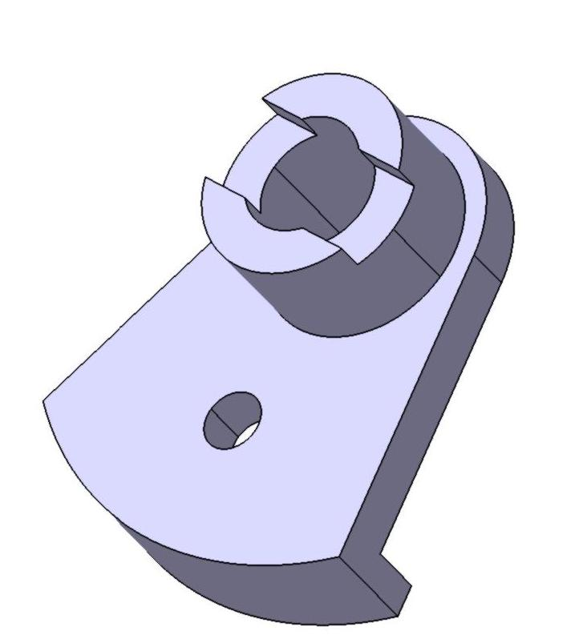

=
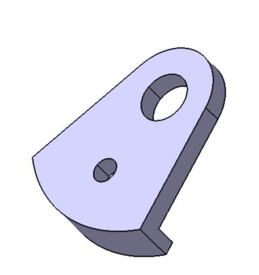
+
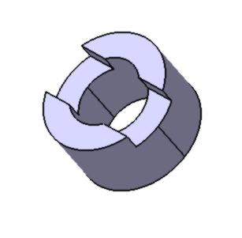

::: {.fragment .texto-azul style="text-align:center; font-size:0.75em;"}
La pieza se divide en dos subpiezas: la placa y el anillo partido.
:::

## Descomposición de la placa

=
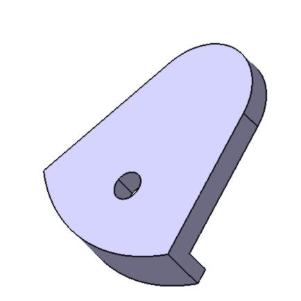
−
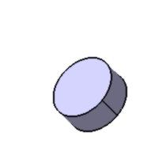

::: fragment

=
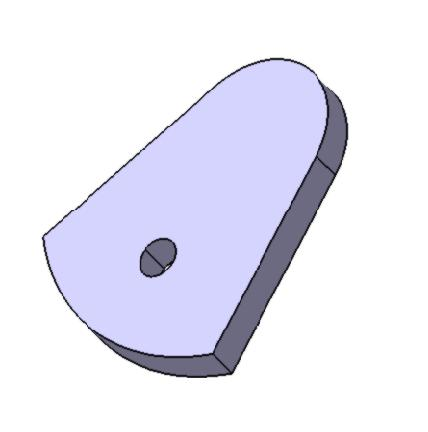
+
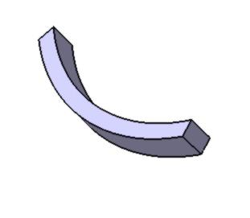

:::

::: fragment

=
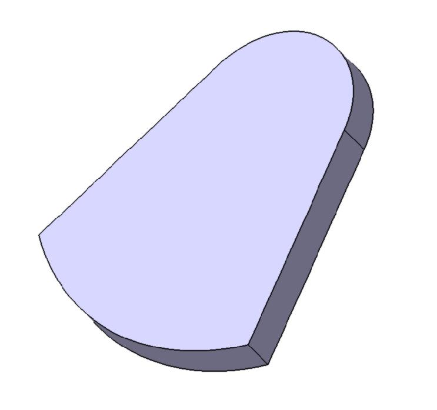
−
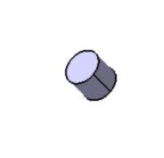

:::

## Descomposición del anillo

=
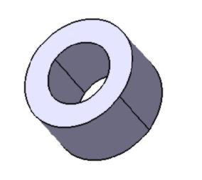
−
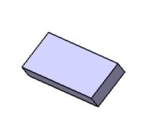

::: fragment

=
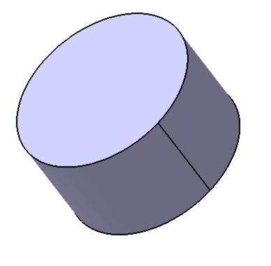
−
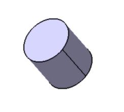

:::

## El descriptor completo

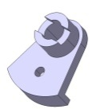

pieza

→

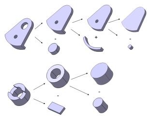

descomposición y operaciones booleanas

## Ejemplo clásico de descriptor

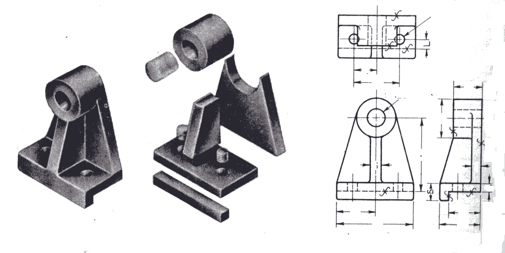

## Cómo practicar

[Piezas reales sencillas → **en clase, 20'**]{style="background:#fff9c4; padding:0.1em 0.6em; color:#d00000; font-size:0.85em;"}

 

::: {.texto-azul style="font-size:0.85em; margin-top:0.8em;"}
Cada persona tiene que hacer un **DESCRIPTOR** con la descomposición de su pieza real sencilla.
:::

## ¿Para qué sirve?

::: {style="background:#fff9c4; border-radius:6px; padding:0.6em 1em; font-size:0.8em; margin-top:0.5em;"}
**ENTREGABLE EVALUABLE I4:** 
Descriptor (foto) + modelar en 3D cada pieza. 
[Si descriptor + modelado de una parte → ampliar al jueves 2 de octubre, 23:55 h.]{style="font-size:0.85em;"}
:::

::: {.fragment style="background:#fff9c4; border-radius:6px; padding:0.6em 1em; font-size:0.8em; margin-top:1em;"}
***ENTREGABLE Participación I4-bis:*** 
Descriptor + modelar cada pieza del compañero. 
[Entregar antes del martes 7 de octubre, 23:55 h.]{style="font-size:0.85em;"}
:::
