# "Mundo 3D" → Plano 2D Sistemas de representación {.seccion-oscura}

## Sistemas de representación: proyecciones

::: {.texto-azul style="font-size:0.85em;"}
**Proyectar** es llevar los puntos, líneas y planos de un OBJETO (3D) en dirección rectilínea sobre un PLANO (2D).
:::

:::: columns
::: {.column width="55%"}
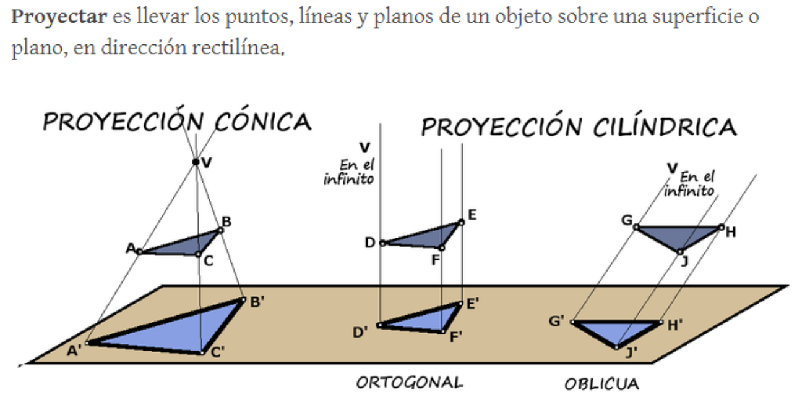
:::

::: {.column width="45%"}
::: {.fragment .texto-azul style="font-size:0.75em; margin-left:0.8em;"}
Elementos de una proyección:

-   Objeto
-   Punto de vista
-   Plano de proyección o plano del cuadro
-   Haz de rayos proyectantes
:::
:::
::::

## Tipos de proyección

:::: columns
::: {.column width="55%"}
::: {style="font-size:0.75em;"}
-   **Cónica o central** — punto de vista a distancia finita
    -   Perspectiva cónica
-   **Cilíndrica** — punto de vista en el infinito
    -   **Ortogonal**
        -   Sistema diédrico
        -   Axonométrico: isométrica, dimétrica, trimétrica
    -   **Oblicua**
        -   Caballera
        -   Militar
:::

::: {.fragment style="background:#1a6e1a; color:#fff; padding:0.2em 0.7em; font-size:0.7em; border-radius:4px; width:fit-content;"}
**Representar 3D en 2D** 
Una sola vista = se ve bien, se mide mal 
Muchas vistas = se ve mal, se mide bien
:::
:::

::: {.column width="45%"}

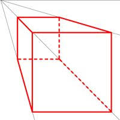
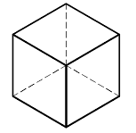
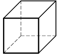

:::
::::

## Las ventajas de la proyección cónica: representación realista

La última cena. Leonardo da Vinci.

«Light After Light». Antonio Rojas.

::: {.fragment .texto-azul style="text-align:center; font-weight:700; margin-top:0.5em;"}
Se **ve** bien, se **mide** mal
:::

## La ventaja de las proyecciones cilíndricas: conservación de la razón simple

:::: columns
::: {.column width="52%"}
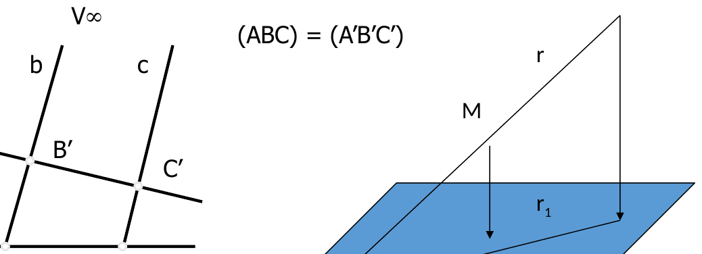
:::

::: {.column width="48%"}
::: {.texto-azul style="font-size:0.62em; margin-left:0.8em;"}
El dibujo técnico permite representar objetos tridimensionales en un formato bidimensional (papel) mediante las técnicas de proyección que se estudian en los sistemas de representación, en particular el Sistema Diédrico.

::: fragment
La utilización de **un sistema de proyección de tipo cilíndrico** (el centro de proyección se encuentra en el infinito) aporta interesantes ventajas desde el punto de vista métrico, ya que **se conserva la denominada razón simple** (derivada del **teorema de Thales**) en este tipo de proyecciones.
:::
:::
:::
::::

## Proyección cilíndrica sobre planos ortogonales. Sistema diédrico

:::: columns
::: {.column width="55%"}
::: {.texto-azul style="font-size:0.62em;"}
Los **puntos del espacio** necesitan de **tres coordenadas** (x, y, z) para su completa determinación, por lo que al **proyectar** sobre un único plano (dos coordenadas) **perderemos información** espacial. Esto hace que sean **necesarias al menos dos proyecciones** sobre un mismo plano para determinar inequívocamente cada punto.

::: fragment
El modelo de representación que usamos en dibujo técnico se apoya en **dos proyecciones (o tres) sobre planos ortogonales** entre sí.
:::
:::
:::

::: {.column width="45%"}
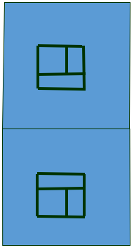

::: {style="text-align:center; font-size:0.7em; color:#2d2d8a;"}
Se **ve** mal, se **mide** bien
:::
:::
::::

## La proyección y el abatimiento, paso a paso

::: r-stack
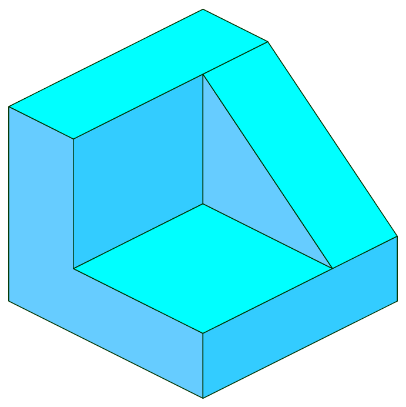

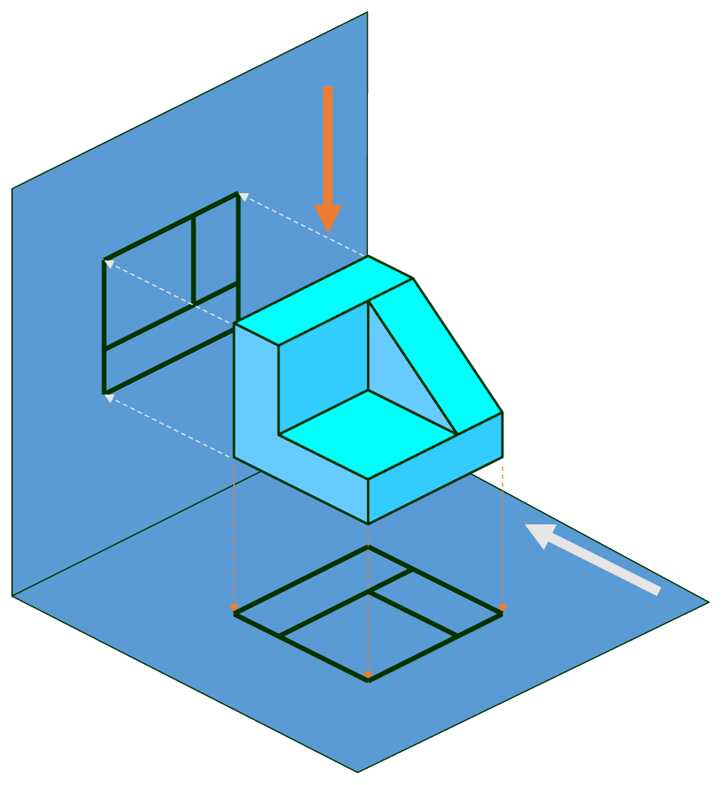

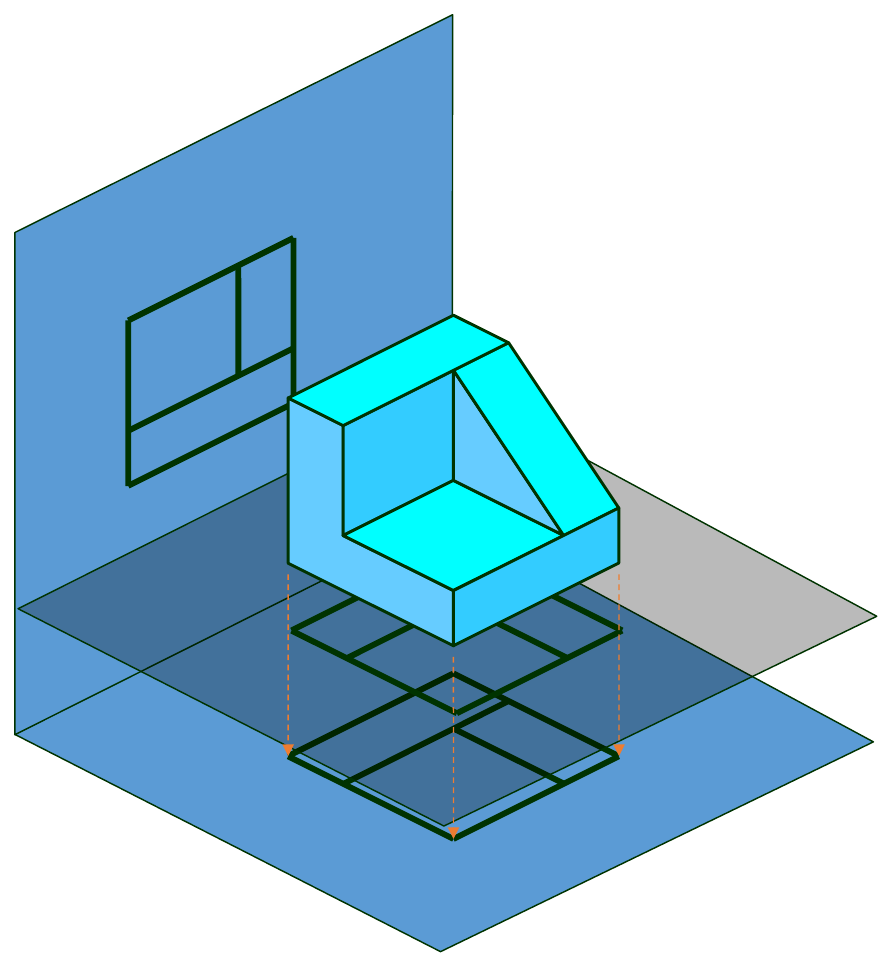

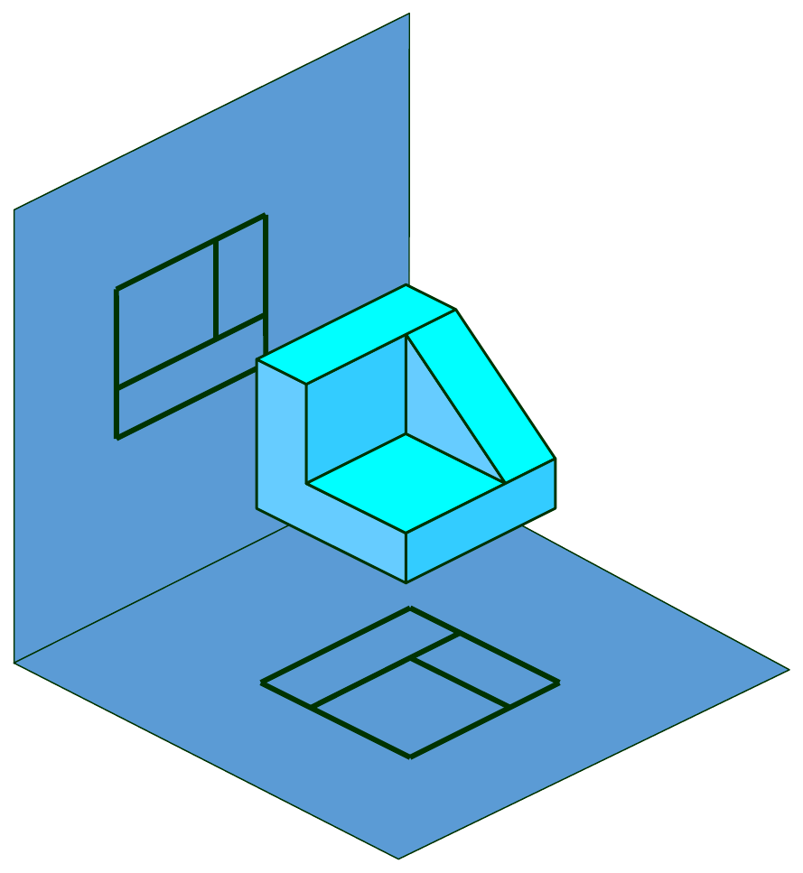

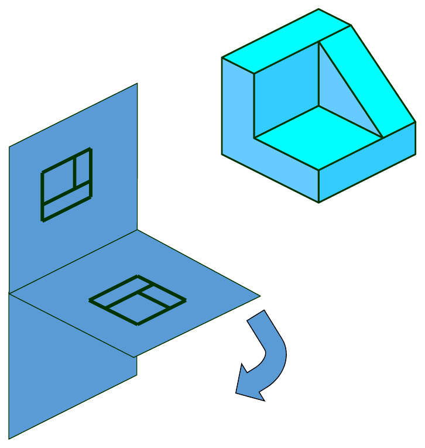

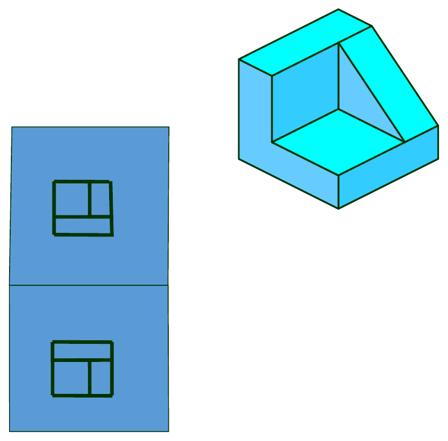

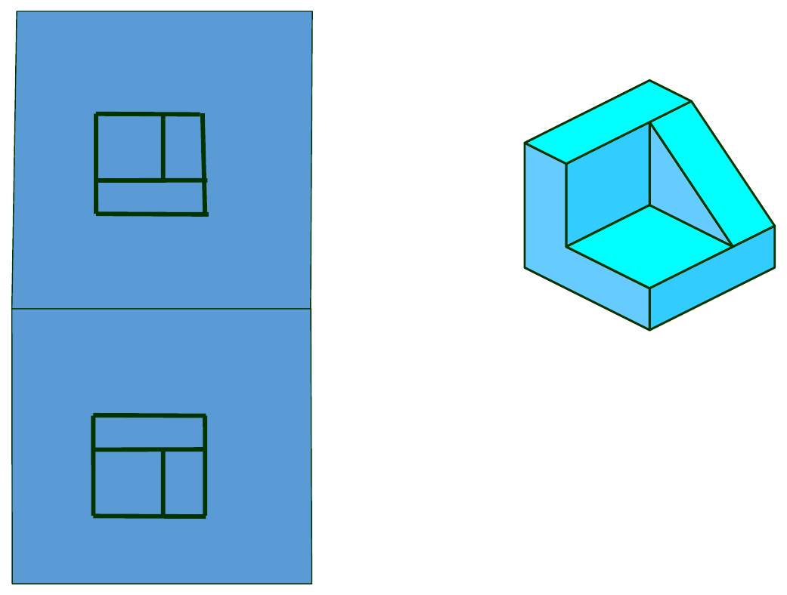
:::

::: notes
Secuencia: la pieza → se proyecta sobre el plano vertical → sobre los dos planos → el diedro con ambas proyecciones → el abatimiento del plano horizontal → las dos vistas en el plano del dibujo.
:::

## El resultado: dos vistas en correspondencia

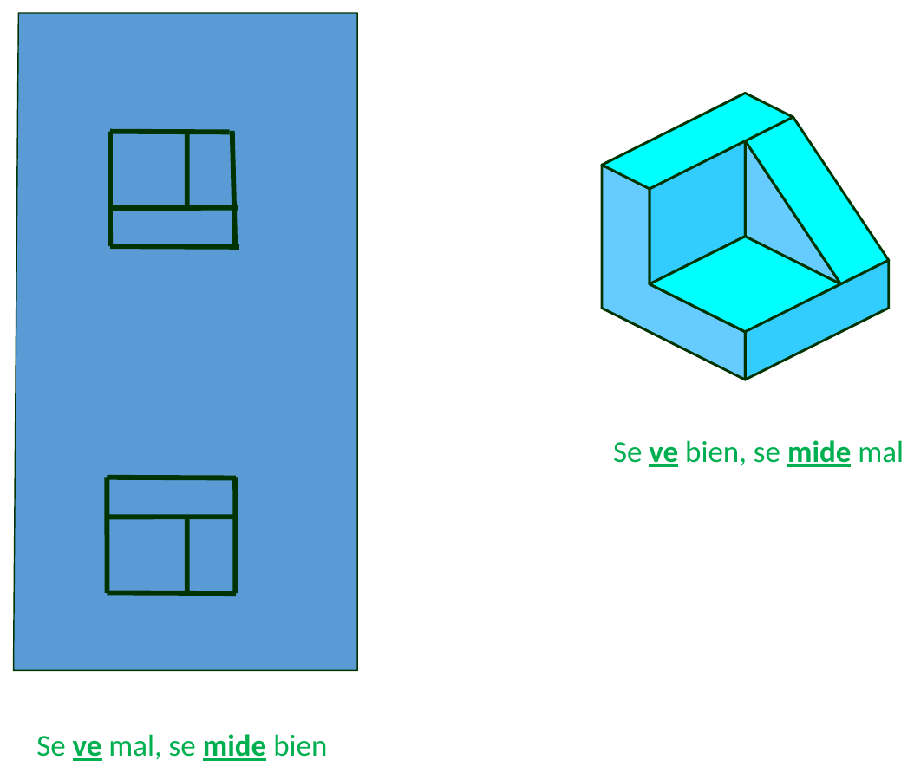

::: {.texto-azul style="text-align:center; font-size:0.8em;"}
Cada vista por separado *se ve mal*… pero el conjunto **se mide bien**.
:::

## Sistema diédrico directo

::: {.texto-azul style="font-size:0.8em;"}
**Sistema Europeo**: el objeto se sitúa en el **1º cuadrante** → planta superior **ABAJO**
:::

::: {.fragment .texto-azul style="font-size:0.8em;"}
**Sistema Americano**: el objeto se sitúa en el **3º cuadrante** → planta superior **ARRIBA**
:::

## 1º cuadrante: sistema europeo — "empujo"

## 3º cuadrante: sistema americano — "tiro"

## Empezamos…: vistas

:::: columns
::: {.column width="55%"}
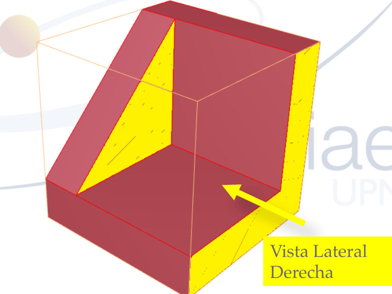
:::

::: {.column width="45%"}
::: {.texto-azul style="font-size:0.6em; margin-left:0.8em;"}
Tomaremos como **alzado** siempre la **vista más representativa** de la pieza: la que más información contiene, o con la que mejor se ve la geometría de la pieza en su conjunto.

::: fragment
*¿Qué otras vistas dibujo?* Una vez fijado el alzado, en el sistema europeo PUEDO representar hasta 5 vistas más. **¿Cuáles?** …DEPENDE
:::

::: fragment
*¿De qué depende?* De que el objeto quede **COMPLETAMENTE DEFINIDO** → geometría constructiva
:::
:::
:::
::::

## Correspondencia entre vistas

:::: columns
::: {.column width="62%"}
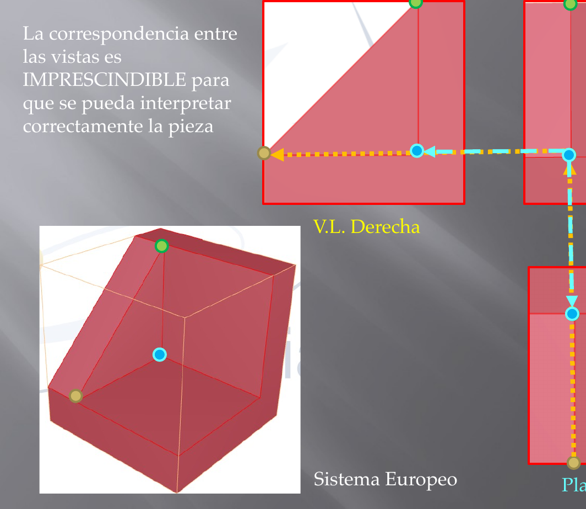
:::

::: {.column width="38%"}
::: {.texto-azul style="font-size:0.65em; margin-left:0.8em; margin-top:2em;"}
La correspondencia entre las vistas es **IMPRESCINDIBLE** para que se pueda interpretar correctamente la pieza.
:::
:::
::::

## Entonces… ¿cuántas vistas o proyecciones necesito?

¿?

::: {.fragment .texto-azul style="text-align:center; font-size:0.8em;"}
Las necesarias para que el objeto quede **completamente definido** — y ni una más.
:::
