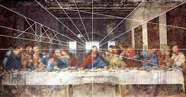
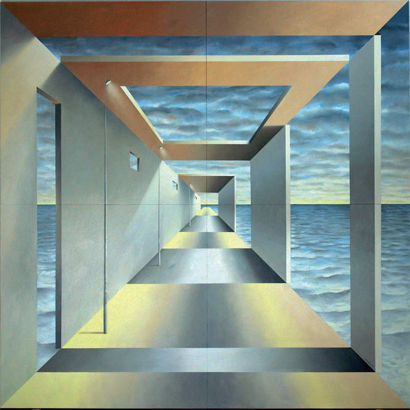
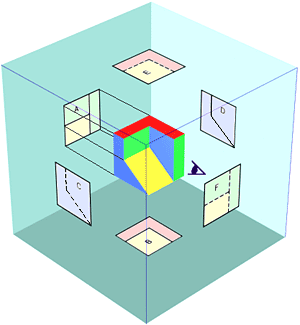
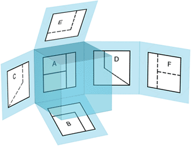
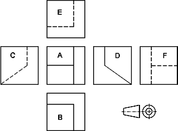
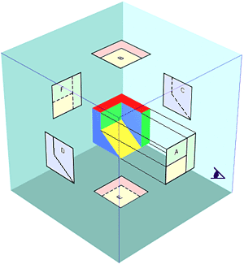
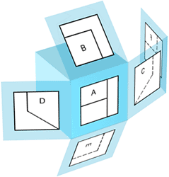
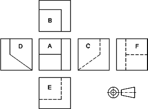

# "Mundo 3D" → Plano 2D Sistemas de representación {.seccion-oscura}

## Sistemas de representación: proyecciones

::: {.texto-azul style="font-size:0.85em;"}
**Proyectar** es llevar los puntos, líneas y planos de un OBJETO (3D) en dirección rectilínea sobre un PLANO (2D).
:::

<!-- Los tres tipos de proyección, contados de uno en uno -->

PROYECCIÓN CÓNICA

<svg viewBox="0 0 300 285" xmlns="http://www.w3.org/2000/svg" style="width:100%;">
<polygon points="8,258 78,208 292,208 222,258" fill="#d2b077" stroke="#1a1a1a" stroke-width="2"/>
<!-- rayos proyectantes -->
<line x1="155" y1="35" x2="38" y2="246" stroke="#909090" stroke-width="1.2"/>
<line x1="155" y1="35" x2="258" y2="226" stroke="#909090" stroke-width="1.2"/>
<line x1="155" y1="35" x2="155" y2="250" stroke="#909090" stroke-width="1.2"/>
<!-- proyección sobre el plano -->
<polygon points="44,235 252,215 155,240" fill="#7d9ce0" stroke="#1a1a1a" stroke-width="2.5"/>
<!-- objeto -->
<polygon points="105,125 190,100 155,135" fill="#4a6096" stroke="#1a1a1a" stroke-width="2"/>
<!-- punto de vista -->
<circle cx="155" cy="35" r="3.5" fill="#1a1a1a"/>
<text x="164" y="38" font-size="14" font-weight="700" fill="#1a1a1a">V</text>
<circle cx="105" cy="125" r="2.5" fill="#fff" stroke="#1a1a1a" stroke-width="1.2"/>
<circle cx="190" cy="100" r="2.5" fill="#fff" stroke="#1a1a1a" stroke-width="1.2"/>
<circle cx="155" cy="135" r="2.5" fill="#fff" stroke="#1a1a1a" stroke-width="1.2"/>
<text x="88" y="123" font-size="13" font-weight="700" fill="#1a1a1a">A</text>
<text x="197" y="97" font-size="13" font-weight="700" fill="#1a1a1a">B</text>
<text x="160" y="150" font-size="13" font-weight="700" fill="#1a1a1a">C</text>
<circle cx="44" cy="235" r="2.5" fill="#fff" stroke="#1a1a1a" stroke-width="1.2"/>
<circle cx="252" cy="215" r="2.5" fill="#fff" stroke="#1a1a1a" stroke-width="1.2"/>
<circle cx="155" cy="240" r="2.5" fill="#fff" stroke="#1a1a1a" stroke-width="1.2"/>
<text x="22" y="240" font-size="13" font-weight="700" fill="#1a1a1a">A'</text>
<text x="258" y="212" font-size="13" font-weight="700" fill="#1a1a1a">B'</text>
<text x="160" y="256" font-size="13" font-weight="700" fill="#1a1a1a">C'</text>
</svg>

Punto de vista V a distancia finita

<!-- Cubo proyectado en cónica: las aristas convergen hacia V -->
<svg viewBox="0 0 130 112" xmlns="http://www.w3.org/2000/svg" style="width:42%; margin-top:4px;">
<line x1="8" y1="6" x2="45" y2="35" stroke="#b8b8b8" stroke-width="1"/>
<line x1="8" y1="6" x2="115" y2="35" stroke="#b8b8b8" stroke-width="1"/>
<line x1="8" y1="6" x2="45" y2="105" stroke="#b8b8b8" stroke-width="1"/>
<line x1="8" y1="6" x2="115" y2="105" stroke="#b8b8b8" stroke-width="1"/>
<line x1="77" y1="25" x2="77" y2="70" stroke="#1a1a1a" stroke-width="1.5" stroke-dasharray="4,3"/>
<line x1="32" y1="70" x2="77" y2="70" stroke="#1a1a1a" stroke-width="1.5" stroke-dasharray="4,3"/>
<line x1="115" y1="105" x2="77" y2="70" stroke="#1a1a1a" stroke-width="1.5" stroke-dasharray="4,3"/>
<polyline points="32,70 32,25 77,25" fill="none" stroke="#1a1a1a" stroke-width="2"/>
<line x1="45" y1="35" x2="32" y2="25" stroke="#1a1a1a" stroke-width="2"/>
<line x1="115" y1="35" x2="77" y2="25" stroke="#1a1a1a" stroke-width="2"/>
<line x1="45" y1="105" x2="32" y2="70" stroke="#1a1a1a" stroke-width="2"/>
<rect x="45" y="35" width="70" height="70" fill="none" stroke="#1a1a1a" stroke-width="2.5"/>
</svg>

Perspectiva cónica: se deforma

CILÍNDRICA ORTOGONAL

<svg viewBox="0 0 300 285" xmlns="http://www.w3.org/2000/svg" style="width:100%;">
<polygon points="8,258 78,208 292,208 222,258" fill="#d2b077" stroke="#1a1a1a" stroke-width="2"/>
<!-- rayos paralelos verticales -->
<line x1="70" y1="45" x2="70" y2="252" stroke="#909090" stroke-width="1.2"/>
<line x1="205" y1="45" x2="205" y2="230" stroke="#909090" stroke-width="1.2"/>
<line x1="148" y1="45" x2="148" y2="256" stroke="#909090" stroke-width="1.2"/>
<!-- proyección sobre el plano -->
<polygon points="70,246 205,224 148,250" fill="#7d9ce0" stroke="#1a1a1a" stroke-width="2.5"/>
<!-- objeto -->
<polygon points="70,135 205,105 148,155" fill="#4a6096" stroke="#1a1a1a" stroke-width="2"/>
<text x="45" y="62" font-size="14" font-weight="700" fill="#1a1a1a">V</text>
<text x="14" y="78" font-size="10" fill="#1a1a1a">En el</text>
<text x="14" y="90" font-size="10" fill="#1a1a1a">infinito</text>
<circle cx="70" cy="135" r="2.5" fill="#fff" stroke="#1a1a1a" stroke-width="1.2"/>
<circle cx="205" cy="105" r="2.5" fill="#fff" stroke="#1a1a1a" stroke-width="1.2"/>
<circle cx="148" cy="155" r="2.5" fill="#fff" stroke="#1a1a1a" stroke-width="1.2"/>
<text x="53" y="133" font-size="13" font-weight="700" fill="#1a1a1a">D</text>
<text x="212" y="103" font-size="13" font-weight="700" fill="#1a1a1a">E</text>
<text x="153" y="170" font-size="13" font-weight="700" fill="#1a1a1a">F</text>
<circle cx="70" cy="246" r="2.5" fill="#fff" stroke="#1a1a1a" stroke-width="1.2"/>
<circle cx="205" cy="224" r="2.5" fill="#fff" stroke="#1a1a1a" stroke-width="1.2"/>
<circle cx="148" cy="250" r="2.5" fill="#fff" stroke="#1a1a1a" stroke-width="1.2"/>
<text x="46" y="250" font-size="13" font-weight="700" fill="#1a1a1a">D'</text>
<text x="212" y="221" font-size="13" font-weight="700" fill="#1a1a1a">E'</text>
<text x="153" y="266" font-size="13" font-weight="700" fill="#1a1a1a">F'</text>
</svg>

Rayos paralelos, perpendiculares al plano

<!-- Cubo en proyección ortogonal (isométrica): aristas paralelas, sin deformación -->
<svg viewBox="0 0 120 112" xmlns="http://www.w3.org/2000/svg" style="width:40%; margin-top:4px;">
<line x1="60" y1="54" x2="60" y2="10" stroke="#1a1a1a" stroke-width="1.5" stroke-dasharray="4,3"/>
<line x1="60" y1="54" x2="20" y2="76" stroke="#1a1a1a" stroke-width="1.5" stroke-dasharray="4,3"/>
<line x1="60" y1="54" x2="100" y2="76" stroke="#1a1a1a" stroke-width="1.5" stroke-dasharray="4,3"/>
<line x1="60" y1="54" x2="20" y2="32" stroke="#1a1a1a" stroke-width="2"/>
<line x1="60" y1="54" x2="100" y2="32" stroke="#1a1a1a" stroke-width="2"/>
<line x1="60" y1="54" x2="60" y2="98" stroke="#1a1a1a" stroke-width="2"/>
<polygon points="60,10 100,32 100,76 60,98 20,76 20,32" fill="none" stroke="#1a1a1a" stroke-width="2.5"/>
</svg>

Axonométrica (isométrica)

CILÍNDRICA OBLICUA

<svg viewBox="0 0 300 285" xmlns="http://www.w3.org/2000/svg" style="width:100%;">
<polygon points="8,258 78,208 292,208 222,258" fill="#d2b077" stroke="#1a1a1a" stroke-width="2"/>
<!-- rayos paralelos oblicuos -->
<line x1="179" y1="52" x2="84" y2="235" stroke="#909090" stroke-width="1.2"/>
<line x1="287" y1="56" x2="192" y2="239" stroke="#909090" stroke-width="1.2"/>
<line x1="241" y1="86" x2="147" y2="267" stroke="#909090" stroke-width="1.2"/>
<!-- proyección sobre el plano -->
<polygon points="92,220 200,224 154,254" fill="#7d9ce0" stroke="#1a1a1a" stroke-width="2.5"/>
<!-- objeto -->
<polygon points="150,108 258,112 212,142" fill="#4a6096" stroke="#1a1a1a" stroke-width="2"/>
<text x="255" y="48" font-size="14" font-weight="700" fill="#1a1a1a">V</text>
<text x="296" y="60" font-size="10" fill="#1a1a1a" text-anchor="end">En el</text>
<text x="296" y="72" font-size="10" fill="#1a1a1a" text-anchor="end">infinito</text>
<circle cx="150" cy="108" r="2.5" fill="#fff" stroke="#1a1a1a" stroke-width="1.2"/>
<circle cx="258" cy="112" r="2.5" fill="#fff" stroke="#1a1a1a" stroke-width="1.2"/>
<circle cx="212" cy="142" r="2.5" fill="#fff" stroke="#1a1a1a" stroke-width="1.2"/>
<text x="134" y="106" font-size="13" font-weight="700" fill="#1a1a1a">G</text>
<text x="265" y="110" font-size="13" font-weight="700" fill="#1a1a1a">H</text>
<text x="217" y="157" font-size="13" font-weight="700" fill="#1a1a1a">J</text>
<circle cx="92" cy="220" r="2.5" fill="#fff" stroke="#1a1a1a" stroke-width="1.2"/>
<circle cx="200" cy="224" r="2.5" fill="#fff" stroke="#1a1a1a" stroke-width="1.2"/>
<circle cx="154" cy="254" r="2.5" fill="#fff" stroke="#1a1a1a" stroke-width="1.2"/>
<text x="68" y="222" font-size="13" font-weight="700" fill="#1a1a1a">G'</text>
<text x="206" y="221" font-size="13" font-weight="700" fill="#1a1a1a">H'</text>
<text x="158" y="270" font-size="13" font-weight="700" fill="#1a1a1a">J'</text>
</svg>

Rayos paralelos, inclinados respecto al plano

<!-- Cubo en caballera: cara frontal en verdadera magnitud, fuga a 45° -->
<svg viewBox="0 0 130 112" xmlns="http://www.w3.org/2000/svg" style="width:42%; margin-top:4px;">
<line x1="53" y1="13" x2="53" y2="78" stroke="#1a1a1a" stroke-width="1.5" stroke-dasharray="4,3"/>
<line x1="53" y1="78" x2="118" y2="78" stroke="#1a1a1a" stroke-width="1.5" stroke-dasharray="4,3"/>
<line x1="15" y1="100" x2="53" y2="78" stroke="#1a1a1a" stroke-width="1.5" stroke-dasharray="4,3"/>
<polyline points="53,13 118,13 118,78" fill="none" stroke="#1a1a1a" stroke-width="2"/>
<line x1="15" y1="35" x2="53" y2="13" stroke="#1a1a1a" stroke-width="2"/>
<line x1="80" y1="35" x2="118" y2="13" stroke="#1a1a1a" stroke-width="2"/>
<line x1="80" y1="100" x2="118" y2="78" stroke="#1a1a1a" stroke-width="2"/>
<rect x="15" y="35" width="65" height="65" fill="none" stroke="#1a1a1a" stroke-width="2.5"/>
</svg>

Perspectiva caballera

::: {.fragment .texto-azul style="font-size:0.65em; text-align:center; margin-top:0.3em;"}
Elementos de una proyección: **objeto** · **punto de vista** (V) · **plano de proyección o del cuadro** · **haz de rayos proyectantes**
:::

## Proyección cilíndrica: ortogonal y oblicua

::: {.texto-azul style="font-size:0.7em; margin-bottom:0.3em;"}
**Cilíndrica**: V en el infinito, rayos paralelos. Dos familias según el ángulo con el plano del cuadro:
:::

<!-- Rama ORTOGONAL con sus dos sistemas -->

ORTOGONAL — rayos perpendiculares al plano

Axonométrico

<svg viewBox="0 0 120 112" xmlns="http://www.w3.org/2000/svg" style="width:58%; margin-top:6px;">
<line x1="60" y1="54" x2="60" y2="10" stroke="#1a1a1a" stroke-width="1.5" stroke-dasharray="4,3"/>
<line x1="60" y1="54" x2="20" y2="76" stroke="#1a1a1a" stroke-width="1.5" stroke-dasharray="4,3"/>
<line x1="60" y1="54" x2="100" y2="76" stroke="#1a1a1a" stroke-width="1.5" stroke-dasharray="4,3"/>
<line x1="60" y1="54" x2="20" y2="32" stroke="#1a1a1a" stroke-width="2"/>
<line x1="60" y1="54" x2="100" y2="32" stroke="#1a1a1a" stroke-width="2"/>
<line x1="60" y1="54" x2="60" y2="98" stroke="#1a1a1a" stroke-width="2"/>
<polygon points="60,10 100,32 100,76 60,98 20,76 20,32" fill="none" stroke="#1a1a1a" stroke-width="2.5"/>
</svg>

Una sola vista que «se parece» al objeto isométrica · dimétrica · trimétrica

Sistema diédrico

<svg viewBox="0 0 200 200" xmlns="http://www.w3.org/2000/svg" style="width:62%; margin-top:6px;">
<rect x="0" y="0" width="200" height="200" fill="#dbe8c9" stroke="#2d5a8a" stroke-width="2"/>
<rect x="20" y="18" width="66" height="66" fill="#fff" stroke="#1a1a1a" stroke-width="2.5"/>
<rect x="114" y="18" width="66" height="66" fill="#fff" stroke="#1a1a1a" stroke-width="2.5"/>
<rect x="20" y="112" width="66" height="66" fill="#fff" stroke="#1a1a1a" stroke-width="2.5"/>
<text x="53" y="97" text-anchor="middle" font-size="12" fill="#2d2d8a">Alzado</text>
<text x="147" y="97" text-anchor="middle" font-size="12" fill="#2d2d8a">Perfil</text>
<text x="53" y="191" text-anchor="middle" font-size="12" fill="#2d2d8a">Planta</text>
</svg>

Varias vistas planas en correspondencia (el cubo: tres vistas cuadradas)

<!-- Rama OBLICUA -->

OBLICUA — rayos inclinados

Perspectiva caballera

<svg viewBox="0 0 130 112" xmlns="http://www.w3.org/2000/svg" style="width:62%; margin-top:6px;">
<line x1="53" y1="13" x2="53" y2="78" stroke="#1a1a1a" stroke-width="1.5" stroke-dasharray="4,3"/>
<line x1="53" y1="78" x2="118" y2="78" stroke="#1a1a1a" stroke-width="1.5" stroke-dasharray="4,3"/>
<line x1="15" y1="100" x2="53" y2="78" stroke="#1a1a1a" stroke-width="1.5" stroke-dasharray="4,3"/>
<polyline points="53,13 118,13 118,78" fill="none" stroke="#1a1a1a" stroke-width="2"/>
<line x1="15" y1="35" x2="53" y2="13" stroke="#1a1a1a" stroke-width="2"/>
<line x1="80" y1="35" x2="118" y2="13" stroke="#1a1a1a" stroke-width="2"/>
<line x1="80" y1="100" x2="118" y2="78" stroke="#1a1a1a" stroke-width="2"/>
<rect x="15" y="35" width="65" height="65" fill="none" stroke="#1a1a1a" stroke-width="2.5"/>
</svg>

Cara frontal en verdadera magnitud, fuga inclinada (también: militar)

::: {.fragment style="background:#1a6e1a; color:#fff; padding:0.3em 0.9em; font-size:0.7em; border-radius:4px; width:fit-content; margin:0.5em auto 0 auto; text-align:center;"}
**Representar 3D en 2D** 
Una sola vista = se ve bien, se mide mal 
Muchas vistas = se ve mal, se mide bien
:::

## Las ventajas de la proyección cónica: representación realista

La última cena. Leonardo da Vinci.

«Light After Light». Antonio Rojas.

::: {.fragment .texto-azul style="text-align:center; font-weight:700; margin-top:0.5em;"}
Se **ve** bien, se **mide** mal
:::

## La ventaja de las proyecciones cilíndricas: conservación de la razón simple

:::: columns
::: {.column width="58%"}
<!-- Thales animado: recta con A,B,C → rayos paralelos → proyección con las mismas proporciones -->
<svg viewBox="0 0 520 390" xmlns="http://www.w3.org/2000/svg" style="width:100%; margin-top:8px;">
<!-- estado inicial: la recta r con A, B, C y sus segmentos medidos -->
<line x1="30" y1="134.6" x2="470" y2="67.4" stroke="#1a1a1a" stroke-width="2"/>
<text x="478" y="70" font-size="17" font-style="italic" fill="#1a1a1a">r</text>
<line x1="60" y1="130" x2="300" y2="93.3" stroke="#d97706" stroke-width="5"/>
<line x1="300" y1="93.3" x2="420" y2="75" stroke="#0f766e" stroke-width="5"/>
<text x="180" y="98" font-size="16" font-weight="700" fill="#d97706" text-anchor="middle">2·d</text>
<text x="360" y="72" font-size="16" font-weight="700" fill="#0f766e" text-anchor="middle">d</text>
<circle cx="60" cy="130" r="4" fill="#fff" stroke="#1a1a1a" stroke-width="1.8"/>
<circle cx="300" cy="93.3" r="4" fill="#fff" stroke="#1a1a1a" stroke-width="1.8"/>
<circle cx="420" cy="75" r="4" fill="#fff" stroke="#1a1a1a" stroke-width="1.8"/>
<text x="52" y="158" font-size="17" font-weight="700" fill="#1a1a1a">A</text>
<text x="294" y="121" font-size="17" font-weight="700" fill="#1a1a1a">B</text>
<text x="415" y="103" font-size="17" font-weight="700" fill="#1a1a1a">C</text>
<!-- fragmento 2 (pintado debajo): el plano de proyección en perspectiva -->
<g class="fragment" data-fragment-index="2">
<polygon points="70,284 510,306 448,362 8,340" fill="#d2b077" stroke="#1a1a1a" stroke-width="2"/>
<text x="30" y="336" font-size="12" font-style="italic" fill="#6d5324">plano de proyección</text>
</g>
<!-- fragmento 1: el haz de rayos paralelos, con flecha en el sentido de proyección -->
<defs>
<marker id="flecha-proy" viewBox="0 0 10 10" refX="8" refY="5" markerWidth="7" markerHeight="7" orient="auto-start-reverse">
<path d="M 0 0 L 10 5 L 0 10 z" fill="#909090"/>
</marker>
</defs>
<g class="fragment" data-fragment-index="1">
<text x="452" y="26" font-size="17" font-weight="700" fill="#1a1a1a">V∞</text>
<line x1="43.3" y1="30" x2="90.4" y2="312.4" stroke="#909090" stroke-width="1.2" marker-end="url(#flecha-proy)"/>
<line x1="289.4" y1="30" x2="339" y2="327.2" stroke="#909090" stroke-width="1.2" marker-end="url(#flecha-proy)"/>
<line x1="412.5" y1="30" x2="463.3" y2="334.6" stroke="#909090" stroke-width="1.2" marker-end="url(#flecha-proy)"/>
</g>
<!-- fragmento 2: la recta proyectada r' con A', B', C' -->
<g class="fragment" data-fragment-index="2">
<line x1="50" y1="310" x2="490" y2="336.2" stroke="#1a1a1a" stroke-width="2"/>
<text x="496" y="342" font-size="17" font-style="italic" fill="#1a1a1a">r'</text>
<line x1="90.4" y1="312.4" x2="339" y2="327.2" stroke="#d97706" stroke-width="5"/>
<line x1="339" y1="327.2" x2="463.3" y2="334.6" stroke="#0f766e" stroke-width="5"/>
<text x="214" y="348" font-size="16" font-weight="700" fill="#d97706" text-anchor="middle">2·d'</text>
<text x="401" y="356" font-size="16" font-weight="700" fill="#0f766e" text-anchor="middle">d'</text>
<circle cx="90.4" cy="312.4" r="4" fill="#fff" stroke="#1a1a1a" stroke-width="1.8"/>
<circle cx="339" cy="327.2" r="4" fill="#fff" stroke="#1a1a1a" stroke-width="1.8"/>
<circle cx="463.3" cy="334.6" r="4" fill="#fff" stroke="#1a1a1a" stroke-width="1.8"/>
<text x="74" y="299" font-size="17" font-weight="700" fill="#1a1a1a">A'</text>
<text x="330" y="314" font-size="17" font-weight="700" fill="#1a1a1a">B'</text>
<text x="458" y="321" font-size="17" font-weight="700" fill="#1a1a1a">C'</text>
</g>
</svg>
:::

::: {.column width="42%"}
::: {.texto-azul style="font-size:0.62em; margin-left:0.8em; margin-top:1em;"}
Tres puntos alineados A, B, C: **B divide al segmento AC en una proporción** (aquí, 2 a 1). Es la **razón simple** (ABC).

::: {.fragment fragment-index="1"}
Al proyectar con **rayos paralelos** (V en el infinito)…
:::

::: {.fragment fragment-index="2"}
…las **distancias cambian** (d' ≠ d), pero la **proporción se conserva**: A'B' sigue siendo el doble de B'C'.
:::
:::

::: {.fragment fragment-index="3" style="background:#2d2d8a; color:#fff; padding:0.4em 0.8em; font-size:0.7em; border-radius:4px; margin:0.6em 0 0 0.8em; text-align:center;"}
**(ABC) = (A'B'C')** 
La razón simple se conserva — teorema de Thales
:::

::: {.fragment fragment-index="4" .texto-azul style="font-size:0.62em; margin-left:0.8em; margin-top:0.6em;"}
Por eso en las proyecciones cilíndricas **se puede medir**: son la base del dibujo técnico y del sistema diédrico.
:::
:::
::::

## Proyección cilíndrica sobre planos ortogonales. Sistema diédrico

:::: columns
::: {.column width="55%"}
<!-- Diedro isométrico: PV + PH + pieza; frag1 alzado, frag2 planta -->
<svg viewBox="0 0 460 375" xmlns="http://www.w3.org/2000/svg" style="width:100%;">
<defs>
<marker id="fl-ray" viewBox="0 0 10 10" refX="8" refY="5" markerWidth="6" markerHeight="6" orient="auto-start-reverse">
<path d="M 0 0 L 10 5 L 0 10 z" fill="#d97706"/>
</marker>
<marker id="fl-fat" viewBox="0 0 10 10" refX="7" refY="5" markerWidth="3.2" markerHeight="3.2" orient="auto-start-reverse">
<path d="M 0 0 L 10 5 L 0 10 z" fill="#e8862c"/>
</marker>
</defs>
<polygon points="192.2,180.5 363.7,279.5 363.7,105.5 192.2,6.5" fill="#6f9fd8" stroke="#24537a" stroke-width="2"/>
<polygon points="192.2,180.5 363.7,279.5 218.2,363.5 46.7,264.5" fill="#6f9fd8" stroke="#24537a" stroke-width="2"/>
<text x="340" y="230" font-size="14" font-weight="700" fill="#eaf3ff">PV</text>
<text x="334" y="284" font-size="14" font-weight="700" fill="#eaf3ff">PH</text>
<g class="fragment" data-fragment-index="1">
<polygon points="241.6,131.0 345.5,191.0 345.5,149.0 283.1,113.0 283.1,71.0 241.6,47.0" fill="none" stroke="#14532d" stroke-width="3"/>
<text x="306" y="90" font-size="12" font-style="italic" fill="#eaf3ff">alzado</text>
</g>
<g class="fragment" data-fragment-index="2">
<polygon points="218.2,222.5 322.1,282.5 259.8,318.5 155.8,258.5" fill="none" stroke="#14532d" stroke-width="3"/>
<line x1="259.8" y1="246.5" x2="197.4" y2="282.5" stroke="#14532d" stroke-width="3"/>
<text x="100" y="296" font-size="12" font-style="italic" fill="#eaf3ff">planta</text>
</g>
<polygon points="218.2,60.5 259.8,84.5 197.4,120.5 155.8,96.5" fill="#c9f2f7" stroke="#075985" stroke-width="2"/>
<polygon points="259.8,126.5 322.1,162.5 259.8,198.5 197.4,162.5" fill="#c9f2f7" stroke="#075985" stroke-width="2"/>
<polygon points="259.8,126.5 197.4,162.5 197.4,120.5 259.8,84.5" fill="#55c4d6" stroke="#075985" stroke-width="2"/>
<polygon points="322.1,204.5 259.8,240.5 259.8,198.5 322.1,162.5" fill="#55c4d6" stroke="#075985" stroke-width="2"/>
<polygon points="155.8,180.5 259.8,240.5 259.8,198.5 197.4,162.5 197.4,120.5 155.8,96.5" fill="#8fe3ef" stroke="#075985" stroke-width="2"/>
<g class="fragment" data-fragment-index="1">
<line x1="218.2" y1="60.5" x2="240.0" y2="47.9" stroke="#d97706" stroke-width="1.6" stroke-dasharray="5,4" marker-end="url(#fl-ray)"/>
<line x1="259.8" y1="126.5" x2="281.6" y2="113.9" stroke="#d97706" stroke-width="1.6" stroke-dasharray="5,4" marker-end="url(#fl-ray)"/>
<line x1="322.1" y1="162.5" x2="343.9" y2="149.9" stroke="#d97706" stroke-width="1.6" stroke-dasharray="5,4" marker-end="url(#fl-ray)"/>
<line x1="322.1" y1="204.5" x2="343.9" y2="191.9" stroke="#d97706" stroke-width="1.6" stroke-dasharray="5,4" marker-end="url(#fl-ray)"/>
<line x1="176.6" y1="96.5" x2="231.2" y2="65.0" stroke="#e8862c" stroke-width="7" marker-end="url(#fl-fat)"/>
</g>
<g class="fragment" data-fragment-index="2">
<line x1="155.8" y1="180.5" x2="155.8" y2="256.7" stroke="#d97706" stroke-width="1.6" stroke-dasharray="5,4" marker-end="url(#fl-ray)"/>
<line x1="259.8" y1="240.5" x2="259.8" y2="316.7" stroke="#d97706" stroke-width="1.6" stroke-dasharray="5,4" marker-end="url(#fl-ray)"/>
<line x1="322.1" y1="204.5" x2="322.1" y2="280.7" stroke="#d97706" stroke-width="1.6" stroke-dasharray="5,4" marker-end="url(#fl-ray)"/>
<line x1="122.1" y1="155.0" x2="122.1" y2="227.0" stroke="#e8862c" stroke-width="7" marker-end="url(#fl-fat)"/>
</g>
</svg>
:::

::: {.column width="45%"}
::: {.texto-azul style="font-size:0.62em; margin-left:0.8em; margin-top:0.8em;"}
Un punto del espacio necesita **tres coordenadas** (x, y, z). Al proyectar sobre un único plano quedan **dos**: se **pierde información**.

::: {.fragment fragment-index="1"}
Primera proyección: el **alzado**, sobre el plano vertical (PV). Se pierde la profundidad…
:::

::: {.fragment fragment-index="2"}
…segunda proyección sobre un plano **ortogonal** al primero: la **planta**, sobre el plano horizontal (PH).
:::
:::

::: {.fragment fragment-index="3" style="background:#2d2d8a; color:#fff; padding:0.4em 0.8em; font-size:0.68em; border-radius:4px; margin:0.7em 0 0 0.8em; text-align:center;"}
Con **dos proyecciones (o tres)** sobre planos ortogonales, cada punto queda determinado **sin ambigüedad**
:::
:::
::::

## La proyección no depende de la posición del plano

:::: columns
::: {.column width="55%"}
<!-- Mismo diedro con las dos vistas; frag1: plano paralelo gris con la misma planta -->
<svg viewBox="0 0 460 375" xmlns="http://www.w3.org/2000/svg" style="width:100%;">
<polygon points="192.2,180.5 363.7,279.5 363.7,105.5 192.2,6.5" fill="#6f9fd8" stroke="#24537a" stroke-width="2"/>
<polygon points="192.2,180.5 363.7,279.5 218.2,363.5 46.7,264.5" fill="#6f9fd8" stroke="#24537a" stroke-width="2"/>
<polygon points="241.6,131.0 345.5,191.0 345.5,149.0 283.1,113.0 283.1,71.0 241.6,47.0" fill="none" stroke="#14532d" stroke-width="3"/>
<polygon points="218.2,222.5 322.1,282.5 259.8,318.5 155.8,258.5" fill="none" stroke="#14532d" stroke-width="3"/>
<line x1="259.8" y1="246.5" x2="197.4" y2="282.5" stroke="#14532d" stroke-width="3"/>
<polygon points="218.2,60.5 259.8,84.5 197.4,120.5 155.8,96.5" fill="#c9f2f7" stroke="#075985" stroke-width="2"/>
<polygon points="259.8,126.5 322.1,162.5 259.8,198.5 197.4,162.5" fill="#c9f2f7" stroke="#075985" stroke-width="2"/>
<polygon points="259.8,126.5 197.4,162.5 197.4,120.5 259.8,84.5" fill="#55c4d6" stroke="#075985" stroke-width="2"/>
<polygon points="322.1,204.5 259.8,240.5 259.8,198.5 322.1,162.5" fill="#55c4d6" stroke="#075985" stroke-width="2"/>
<polygon points="155.8,180.5 259.8,240.5 259.8,198.5 197.4,162.5 197.4,120.5 155.8,96.5" fill="#8fe3ef" stroke="#075985" stroke-width="2"/>
<g class="fragment" data-fragment-index="1">
<polygon points="218.2,222.5 322.1,282.5 259.8,318.5 155.8,258.5" fill="#facc15" fill-opacity="0.4" stroke="#d97706" stroke-width="4.5"/>
<line x1="259.8" y1="246.5" x2="197.4" y2="282.5" stroke="#d97706" stroke-width="4.5"/>
</g>
</svg>
:::

::: {.column width="45%"}
::: {.texto-azul style="font-size:0.62em; margin-left:0.8em; margin-top:0.8em;"}
Mismo diedro, misma pieza: ya tenemos **alzado** y **planta**.

::: {.fragment fragment-index="1"}
Si proyectamos sobre **otro plano paralelo**, la forma proyectada **no cambia** (los rayos son paralelos). Los planos sólo influyen por su **orientación** espacial, no por su posición concreta respecto del objeto.
:::

::: {.fragment fragment-index="2"}
Queda un último paso para llevarlo al papel: **girar o abatir** el conjunto sobre uno de los planos, para obtener una **única representación plana**.
:::
:::
:::
::::

## Abatir: las dos proyecciones sobre un mismo plano

:::: columns
::: {.column width="58%"}

<!-- Diedro con las dos vistas + giro de abatimiento -->
<svg viewBox="0 0 300 330" xmlns="http://www.w3.org/2000/svg" style="width:56%;">
<defs>
<marker id="fl-abat" viewBox="0 0 10 10" refX="7" refY="5" markerWidth="4" markerHeight="4" orient="auto-start-reverse">
<path d="M 0 0 L 10 5 L 0 10 z" fill="#2d6cc0"/>
</marker>
</defs>
<polygon points="144.3,136.7 270.0,209.3 270.0,81.7 144.3,9.1" fill="#6f9fd8" stroke="#24537a" stroke-width="2"/>
<polygon points="144.3,136.7 270.0,209.3 163.3,270.9 37.6,198.3" fill="#6f9fd8" stroke="#24537a" stroke-width="2"/>
<polygon points="180.5,100.4 256.7,144.4 256.7,113.6 211.0,87.2 211.0,56.4 180.5,38.8" fill="none" stroke="#14532d" stroke-width="2.5"/>
<polygon points="163.3,167.5 239.5,211.5 193.8,237.9 117.6,193.9" fill="none" stroke="#14532d" stroke-width="2.5"/>
<line x1="193.8" y1="185.1" x2="148.1" y2="211.5" stroke="#14532d" stroke-width="2.5"/>
<g class="fragment" data-fragment-index="1">
<line x1="144.3" y1="136.7" x2="270.0" y2="209.3" stroke="#e8862c" stroke-width="4"/>
<path d="M 85 235 Q 135 310 235 285" fill="none" stroke="#2d6cc0" stroke-width="5" marker-end="url(#fl-abat)"/>
<text x="96" y="305" font-size="13" font-weight="700" fill="#2d6cc0">abatir 90°</text>
</g>
</svg>
<!-- Resultado abatido: las dos vistas sobre un único plano -->
<svg viewBox="0 0 200 320" xmlns="http://www.w3.org/2000/svg" style="width:36%;" class="fragment" data-fragment-index="2">
<rect x="20" y="10" width="150" height="290" fill="#6f9fd8" stroke="#24537a" stroke-width="2"/>
<polygon points="45,92.8 133,92.8 133,62 80.2,62 80.2,31.2 45,31.2" fill="none" stroke="#14532d" stroke-width="3"/>
<g class="fragment" data-fragment-index="3">
<line x1="45" y1="92.8" x2="45" y2="169.8" stroke="#e8e8e8" stroke-width="1.4" stroke-dasharray="4,4"/>
<line x1="80.2" y1="92.8" x2="80.2" y2="169.8" stroke="#e8e8e8" stroke-width="1.4" stroke-dasharray="4,4"/>
<line x1="133" y1="92.8" x2="133" y2="169.8" stroke="#e8e8e8" stroke-width="1.4" stroke-dasharray="4,4"/>
</g>
<line x1="20" y1="150" x2="170" y2="150" stroke="#24537a" stroke-width="1.6" stroke-dasharray="8,5"/>
<rect x="45" y="169.8" width="88" height="52.8" fill="none" stroke="#14532d" stroke-width="3"/>
<line x1="80.2" y1="169.8" x2="80.2" y2="222.6" stroke="#14532d" stroke-width="3"/>
<text x="88" y="52" font-size="12" font-style="italic" fill="#eaf3ff">alzado</text>
<text x="70" y="248" font-size="12" font-style="italic" fill="#eaf3ff">planta</text>
</svg>

:::

::: {.column width="42%"}
::: {.texto-azul style="font-size:0.62em; margin-left:0.8em; margin-top:0.8em;"}
::: {.fragment fragment-index="1"}
**Abatimos**: giramos el plano horizontal alrededor de la **arista común** hasta dejarlo coplanario con el vertical.
:::

::: {.fragment fragment-index="2"}
Resultado: **las dos proyecciones sobre un mismo plano** — el papel. Este sistema de representación se llama **sistema diédrico**.
:::

::: {.fragment fragment-index="3"}
Las vistas quedan **en correspondencia**: alineadas verticalmente, comparten medidas línea a línea.
:::
:::

::: {.fragment fragment-index="4" style="background:#1a6e1a; color:#fff; padding:0.4em 0.8em; font-size:0.68em; border-radius:4px; margin:0.7em 0 0 0.8em; text-align:center;"}
Cada vista por separado *se ve mal*… pero el conjunto **se mide bien**
:::

::: {.fragment fragment-index="4" .texto-azul style="font-size:0.55em; margin-left:0.8em; margin-top:0.5em;"}
Es el sistema usado en ingeniería para definir los objetos, regulado por las normas de representación (UNE, AENOR).
:::
:::
::::

## Sistema diédrico directo: europeo y americano

::: {.texto-azul style="font-size:0.65em; margin-bottom:0.2em;"}
La misma pieza, dos convenios: ¿dónde se colocan los planos respecto del **observador**?
:::

<!-- EUROPEO: el objeto entre el observador y los planos -->

SISTEMA EUROPEO — 1er cuadrante

<svg viewBox="0 0 240 252" xmlns="http://www.w3.org/2000/svg" style="width:66%;">
<polygon points="109.8,122.0 224.1,188.0 224.1,72.0 109.8,6.0" fill="#6f9fd8" stroke="#24537a" stroke-width="1.6"/>
<polygon points="109.8,122.0 224.1,188.0 127.1,244.0 12.8,178.0" fill="#6f9fd8" stroke="#24537a" stroke-width="1.6"/>
<polygon points="142.7,89.0 212.0,129.0 212.0,101.0 170.4,77.0 170.4,49.0 142.7,33.0" fill="none" stroke="#14532d" stroke-width="2.5"/>
<polygon points="127.1,150.0 196.4,190.0 154.8,214.0 85.6,174.0" fill="none" stroke="#14532d" stroke-width="2.5"/>
<line x1="154.8" y1="166.0" x2="113.3" y2="190.0" stroke="#14532d" stroke-width="2.5"/>
<polygon points="127.1,42.0 154.8,58.0 113.3,82.0 85.6,66.0" fill="#c9f2f7" stroke="#075985" stroke-width="1.6"/>
<polygon points="154.8,86.0 196.4,110.0 154.8,134.0 113.3,110.0" fill="#c9f2f7" stroke="#075985" stroke-width="1.6"/>
<polygon points="154.8,86.0 113.3,110.0 113.3,82.0 154.8,58.0" fill="#55c4d6" stroke="#075985" stroke-width="1.6"/>
<polygon points="196.4,138.0 154.8,162.0 154.8,134.0 196.4,110.0" fill="#55c4d6" stroke="#075985" stroke-width="1.6"/>
<polygon points="85.6,122.0 154.8,162.0 154.8,134.0 113.3,110.0 113.3,82.0 85.6,66.0" fill="#8fe3ef" stroke="#075985" stroke-width="1.6"/>
<line x1="127.1" y1="42.0" x2="141.3" y2="33.8" stroke="#d97706" stroke-width="1.4" stroke-dasharray="4,3" marker-end="url(#fl-ray)"/>
<line x1="196.4" y1="138.0" x2="210.6" y2="129.8" stroke="#d97706" stroke-width="1.4" stroke-dasharray="4,3" marker-end="url(#fl-ray)"/>
<line x1="85.6" y1="122.0" x2="85.6" y2="172.0" stroke="#d97706" stroke-width="1.4" stroke-dasharray="4,3" marker-end="url(#fl-ray)"/>
<line x1="196.4" y1="138.0" x2="196.4" y2="188.0" stroke="#d97706" stroke-width="1.4" stroke-dasharray="4,3" marker-end="url(#fl-ray)"/>
<line x1="206" y1="222" x2="168" y2="150" stroke="#666" stroke-width="1" stroke-dasharray="3,3"/>
<ellipse cx="212" cy="229" rx="11" ry="6.5" fill="#fff" stroke="#1a1a1a" stroke-width="1.5"/>
<circle cx="212" cy="229" r="2.8" fill="#1a1a1a"/>
</svg>
<svg viewBox="0 0 110 120" xmlns="http://www.w3.org/2000/svg" style="width:26%;">
<rect x="8" y="4" width="94" height="112" fill="#fff" stroke="#c5c5c5" stroke-width="1"/>
<polygon points="37,58 73,58 73,45.4 51.4,45.4 51.4,32.8 37,32.8" fill="none" stroke="#14532d" stroke-width="2"/>
<line x1="20" y1="62" x2="90" y2="62" stroke="#24537a" stroke-width="1.2" stroke-dasharray="5,3"/>
<rect x="37" y="66" width="36" height="21.6" fill="none" stroke="#14532d" stroke-width="2"/>
<line x1="51.4" y1="66" x2="51.4" y2="87.6" stroke="#14532d" stroke-width="2"/>
</svg>

El objeto <b>entre el observador y los planos</b>: «<b>empujo</b>» la imagen → planta superior <b>ABAJO</b>

<!-- AMERICANO: los planos (transparentes) entre el observador y el objeto -->

SISTEMA AMERICANO — 3er cuadrante

<svg viewBox="0 0 240 252" xmlns="http://www.w3.org/2000/svg" style="width:66%;">
<polygon points="127.1,42.0 154.8,58.0 113.3,82.0 85.6,66.0" fill="#c9f2f7" stroke="#075985" stroke-width="1.6"/>
<polygon points="154.8,86.0 196.4,110.0 154.8,134.0 113.3,110.0" fill="#c9f2f7" stroke="#075985" stroke-width="1.6"/>
<polygon points="154.8,86.0 113.3,110.0 113.3,82.0 154.8,58.0" fill="#55c4d6" stroke="#075985" stroke-width="1.6"/>
<polygon points="196.4,138.0 154.8,162.0 154.8,134.0 196.4,110.0" fill="#55c4d6" stroke="#075985" stroke-width="1.6"/>
<polygon points="85.6,122.0 154.8,162.0 154.8,134.0 113.3,110.0 113.3,82.0 85.6,66.0" fill="#8fe3ef" stroke="#075985" stroke-width="1.6"/>
<line x1="85.6" y1="66.0" x2="67.9" y2="76.2" stroke="#d97706" stroke-width="1.4" stroke-dasharray="4,3" marker-end="url(#fl-ray)"/>
<line x1="154.8" y1="162.0" x2="137.2" y2="172.2" stroke="#d97706" stroke-width="1.4" stroke-dasharray="4,3" marker-end="url(#fl-ray)"/>
<line x1="127.1" y1="42.0" x2="127.1" y2="36.0" stroke="#d97706" stroke-width="1.4" stroke-dasharray="4,3" marker-end="url(#fl-ray)"/>
<line x1="154.8" y1="162.0" x2="154.8" y2="100.0" stroke="#d97706" stroke-width="1.4" stroke-dasharray="4,3" marker-end="url(#fl-ray)"/>
<polygon points="33.6,166.0 147.9,232.0 147.9,116.0 33.6,50.0" fill="#6f9fd8" fill-opacity="0.32" stroke="#24537a" stroke-width="1.6"/>
<polygon points="109.8,6.0 224.1,72.0 147.9,116.0 33.6,50.0" fill="#6f9fd8" fill-opacity="0.32" stroke="#24537a" stroke-width="1.6"/>
<line x1="33.6" y1="50.0" x2="147.9" y2="116.0" stroke="#24537a" stroke-width="2"/>
<polygon points="66.5,133.0 135.8,173.0 135.8,145.0 94.2,121.0 94.2,93.0 66.5,77.0" fill="none" stroke="#14532d" stroke-width="2.5"/>
<polygon points="127.1,34.0 196.4,74.0 154.8,98.0 85.6,58.0" fill="none" stroke="#14532d" stroke-width="2.5"/>
<line x1="154.8" y1="50.0" x2="113.3" y2="74.0" stroke="#14532d" stroke-width="2.5"/>
<line x1="30" y1="218" x2="80" y2="160" stroke="#666" stroke-width="1" stroke-dasharray="3,3"/>
<ellipse cx="24" cy="225" rx="11" ry="6.5" fill="#fff" stroke="#1a1a1a" stroke-width="1.5"/>
<circle cx="24" cy="225" r="2.8" fill="#1a1a1a"/>
</svg>
<svg viewBox="0 0 110 120" xmlns="http://www.w3.org/2000/svg" style="width:26%;">
<rect x="8" y="4" width="94" height="112" fill="#fff" stroke="#c5c5c5" stroke-width="1"/>
<rect x="37" y="32.4" width="36" height="21.6" fill="none" stroke="#14532d" stroke-width="2"/>
<line x1="51.4" y1="32.4" x2="51.4" y2="54" stroke="#14532d" stroke-width="2"/>
<line x1="20" y1="58" x2="90" y2="58" stroke="#24537a" stroke-width="1.2" stroke-dasharray="5,3"/>
<polygon points="37,87.4 73,87.4 73,74.8 51.4,74.8 51.4,62.2 37,62.2" fill="none" stroke="#14532d" stroke-width="2"/>
</svg>

Los planos, <b>transparentes, entre el observador y el objeto</b>: «<b>tiro</b>» de la imagen → planta superior <b>ARRIBA</b>

::: {.fragment fragment-index="3" style="background:#2d2d8a; color:#fff; padding:0.3em 0.9em; font-size:0.62em; border-radius:4px; width:fit-content; margin:0.5em auto 0 auto; text-align:center;"}
En Europa se usa el **sistema europeo** (normas ISO/UNE) · el americano es propio de EE. UU. (ASME)
:::

## 1º cuadrante: sistema europeo — "empujo"

## 3º cuadrante: sistema americano — "tiro"

## Empezamos…: vistas

:::: columns
::: {.column width="55%"}
<!-- La pieza sola; el ALZADO (cara frontal en L) resaltado desde el principio -->
<svg viewBox="0 0 360 290" xmlns="http://www.w3.org/2000/svg" style="width:100%; margin-top:10px;">
<polygon points="175.0,59.8 222.1,87.0 151.4,127.8 104.3,100.6" fill="#c9f2f7" stroke="#075985" stroke-width="2"/>
<polygon points="222.1,134.6 292.8,175.4 222.1,216.2 151.4,175.4" fill="#c9f2f7" stroke="#075985" stroke-width="2"/>
<polygon points="222.1,134.6 151.4,175.4 151.4,127.8 222.1,87.0" fill="#55c4d6" stroke="#075985" stroke-width="2"/>
<polygon points="292.8,223.0 222.1,263.8 222.1,216.2 292.8,175.4" fill="#55c4d6" stroke="#075985" stroke-width="2"/>
<polygon points="104.3,195.8 222.1,263.8 222.1,216.2 151.4,175.4 151.4,127.8 104.3,100.6" fill="#8fe3ef" stroke="#075985" stroke-width="2"/>
<!-- resaltado del alzado -->
<polygon points="104.3,195.8 222.1,263.8 222.1,216.2 151.4,175.4 151.4,127.8 104.3,100.6" fill="#d97706" fill-opacity="0.22" stroke="#d97706" stroke-width="4.5"/>
<line x1="60.2" y1="224.7" x2="136.7" y2="180.5" stroke="#d97706" stroke-width="7" marker-end="url(#fl-fat)"/>
<text x="14" y="250" font-size="14" font-weight="700" fill="#d97706">ALZADO</text>
<text x="14" y="266" font-size="11" fill="#b45309">la vista más representativa</text>
<g class="fragment" data-fragment-index="1">
<line x1="175.0" y1="25.8" x2="175.0" y2="70.0" stroke="#8a8a8a" stroke-width="4" marker-end="url(#fl-gris)"/>
<text x="184" y="24" font-size="11" fill="#666">planta</text>
<line x1="334.0" y1="246.8" x2="275.1" y2="212.8" stroke="#8a8a8a" stroke-width="4" marker-end="url(#fl-gris)"/>
<text x="354" y="268" font-size="11" fill="#666" text-anchor="end">…y hasta 5 vistas más</text>
</g>
<defs>
<marker id="fl-gris" viewBox="0 0 10 10" refX="7" refY="5" markerWidth="3.4" markerHeight="3.4" orient="auto-start-reverse">
<path d="M 0 0 L 10 5 L 0 10 z" fill="#8a8a8a"/>
</marker>
</defs>
</svg>
:::

::: {.column width="45%"}
::: {.texto-azul style="font-size:0.6em; margin-left:0.8em;"}
Tomaremos como **alzado** siempre la **vista más representativa** de la pieza: la que más información contiene, o con la que mejor se ve la geometría de la pieza en su conjunto. Aquí, la cara que enseña la **forma en L**.

::: {.fragment fragment-index="1"}
*¿Qué otras vistas dibujo?* Una vez fijado el alzado, en el sistema europeo PUEDO representar hasta 5 vistas más. **¿Cuáles?** …DEPENDE
:::

::: {.fragment fragment-index="2"}
*¿De qué depende?* De que el objeto quede **COMPLETAMENTE DEFINIDO** → geometría constructiva
:::
:::
:::
::::

## Correspondencia entre vistas

:::: columns
::: {.column width="58%"}
<!-- Tres vistas de la pieza en disposición europea, con correspondencias -->
<svg viewBox="0 0 420 330" xmlns="http://www.w3.org/2000/svg" style="width:100%; margin-top:6px;">
<text x="102" y="28" font-size="13" font-weight="700" fill="#2d2d8a">Alzado</text>
<text x="218" y="28" font-size="13" font-weight="700" fill="#2d2d8a">Perfil (V.L. izquierda)</text>
<text x="102" y="252" font-size="13" font-weight="700" fill="#2d2d8a">Planta</text>
<polygon points="70,124 190,124 190,82 118,82 118,40 70,40" fill="none" stroke="#14532d" stroke-width="3"/>
<rect x="70" y="154" width="120" height="72" fill="none" stroke="#14532d" stroke-width="3"/>
<line x1="118" y1="154" x2="118" y2="226" stroke="#14532d" stroke-width="3"/>
<rect x="220" y="40" width="72" height="84" fill="none" stroke="#14532d" stroke-width="3"/>
<line x1="220" y1="82" x2="292" y2="82" stroke="#14532d" stroke-width="2" stroke-dasharray="7,5"/>
<g class="fragment" data-fragment-index="1">
<line x1="70" y1="124" x2="70" y2="154" stroke="#7a8aa0" stroke-width="1.4" stroke-dasharray="4,4"/>
<line x1="118" y1="124" x2="118" y2="154" stroke="#7a8aa0" stroke-width="1.4" stroke-dasharray="4,4"/>
<line x1="190" y1="124" x2="190" y2="154" stroke="#7a8aa0" stroke-width="1.4" stroke-dasharray="4,4"/>
<line x1="190" y1="40" x2="220" y2="40" stroke="#7a8aa0" stroke-width="1.4" stroke-dasharray="4,4"/>
<line x1="190" y1="82" x2="220" y2="82" stroke="#7a8aa0" stroke-width="1.4" stroke-dasharray="4,4"/>
<line x1="190" y1="124" x2="220" y2="124" stroke="#7a8aa0" stroke-width="1.4" stroke-dasharray="4,4"/>
</g>
<g class="fragment" data-fragment-index="2">
<line x1="118" y1="82" x2="118" y2="226" stroke="#d97706" stroke-width="2" stroke-dasharray="7,4"/>
<line x1="118" y1="82" x2="220" y2="82" stroke="#d97706" stroke-width="2" stroke-dasharray="7,4"/>
<circle cx="118" cy="82" r="5" fill="#0ea5e9" stroke="#fff" stroke-width="1.8"/>
<circle cx="118" cy="226" r="5" fill="#0ea5e9" stroke="#fff" stroke-width="1.8"/>
<circle cx="220" cy="82" r="5" fill="#0ea5e9" stroke="#fff" stroke-width="1.8"/>
</g>
</svg>
:::

::: {.column width="42%"}
::: {.texto-azul style="font-size:0.62em; margin-left:0.8em; margin-top:0.8em;"}
La correspondencia entre las vistas es **IMPRESCINDIBLE** para que se pueda interpretar correctamente la pieza.

::: {.fragment fragment-index="1"}
Las vistas **comparten medidas** y por eso se dibujan **alineadas**: anchuras entre alzado y planta, alturas entre alzado y perfil.
:::

::: {.fragment fragment-index="2"}
Un **mismo punto** de la pieza aparece alineado en todas las vistas. (La línea de trazos del perfil es una **arista oculta**.)
:::
:::
:::
::::

## Entonces… ¿cuántas vistas o proyecciones necesito?

¿?

::: {.fragment .texto-azul style="text-align:center; font-size:0.8em;"}
Las necesarias para que el objeto quede **completamente definido** — y ni una más.
:::
