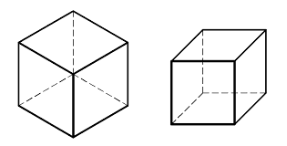
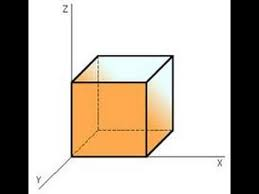
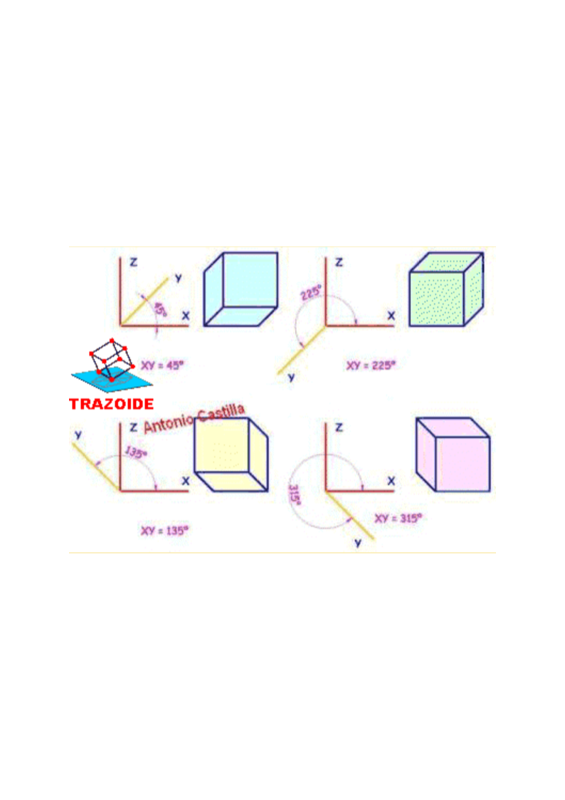
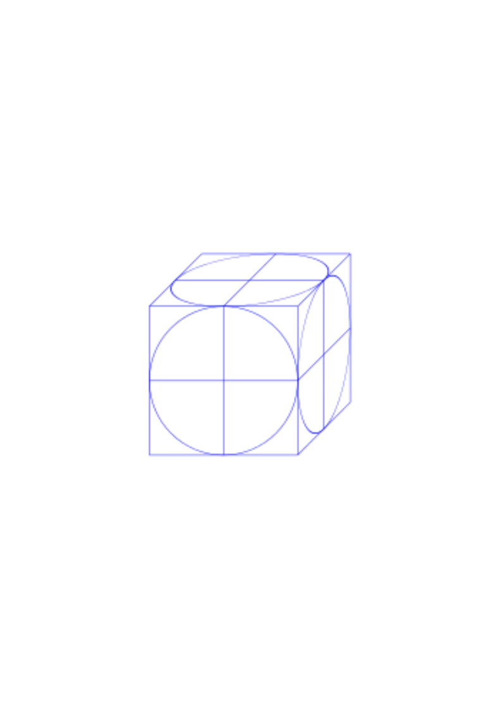

## Comparativa isométrica – caballera

::: {.texto-azul style="text-align:center; font-size:0.7em;"}
[isométrica]{style="margin-right:6em;"} [caballera]{}
:::

## En el infinito = artificio

::: {.texto-azul style="text-align:center; font-size:0.68em; margin-top:0.5em;"}
En ambas el punto de vista está en el infinito; cambia la **orientación del plano del cuadro** y la **incidencia de los rayos** (ortogonal en isométrica, oblicua en caballera).
:::

## Características de la caballera

:::: columns
::: {.column width="45%"}

:::

::: {.column width="55%"}
::: {.texto-azul style="font-size:0.6em;"}
**¿Hay deformación en las magnitudes?**

Sí, pero **solo en el eje Y'**. En el plano formado por ZX no existe deformación.

::: fragment
**¿Hay deformación en los ángulos?**

Sí, entre los ejes ZY' y XY'. **No entre ZX, que forman 90°.**
:::

::: fragment
Todo lo que ocurre en el **plano ZX** está en **verdadera magnitud** porque está sobre el plano del cuadro: no existe deformación de magnitudes ni de ángulos.
:::
:::
:::
::::

## Resumen de características

::: {.texto-azul style="font-size:0.62em;"}
::: incremental
-   Los ejes **ZX forman 90°** y no hay deformación de magnitudes ni de ángulos: están en el plano del cuadro.
-   El eje **Y'** forma un ángulo **φ** que hay que definir (dato; por convenio se mide desde el eje X en sentido horario).
-   Sobre el eje Y' hay una deformación dada por el **coeficiente de reducción**: también es dato, y puede ser de reducción o de ampliación.
-   Por todo ello, el **ALZADO en caballera es SIEMPRE el plano ZX**.
:::
:::

## Posiciones de los ejes en caballera

::: {.texto-azul style="font-size:0.55em; text-align:center;"}
En esta figura los ángulos se miden en sentido trigonométrico (positivo antihorario). Nosotros los medimos al revés: partiendo de X, positivo en el sentido de las agujas del reloj.
:::

## La circunferencia en caballera

:::: columns
::: {.column width="45%"}

:::

::: {.column width="55%"}
::: {.texto-azul style="font-size:0.65em; margin-top:1.5em;"}
Es una **circunferencia** cuando está en el plano ZX, y puedo medir directamente.

::: fragment
Es una **elipse** cuando está en el plano ZY' o XY', y tengo que llevar puntos como en isométrica.
:::
:::
:::
::::

## Medir en perspectiva caballera

::: {.texto-azul style="font-size:0.6em;"}
**¿Puedo medir en caballera?**

-   En el **plano ZX puedo medir todo**: está en verdadera magnitud y sin deformación de ángulos.
-   En los planos ZY' o XY' debo medir **llevando magnitudes sobre los ejes**, como en isométrica. Sobre Z y sobre X no hay deformación.

::: fragment
**¿Cómo mido el segmento AB?** IGUAL QUE EN ISOMÉTRICA: descomponiéndolo en sus proyecciones sobre los ejes X e Y', midiendo las magnitudes m y n, y uniendo sus extremos.
:::

::: fragment
**¿Cómo mido el segmento PQ (contenido en ZX)?** Directamente: tanto magnitud como ángulo.
:::
:::

## Evaluable — Sacapuntas

:::: columns
::: {.column width="45%"}

:::

::: {.column width="55%"}
::: {.texto-azul style="font-size:0.65em; margin-top:1.5em;"}
**¿Tengo que medir?**

Sí: todo lo necesario para definir la pieza.

::: fragment
**Atención a la escala del plano**: se pide un plano con varias escalas, pero se da un plano a otra escala.
:::
:::
:::
::::
