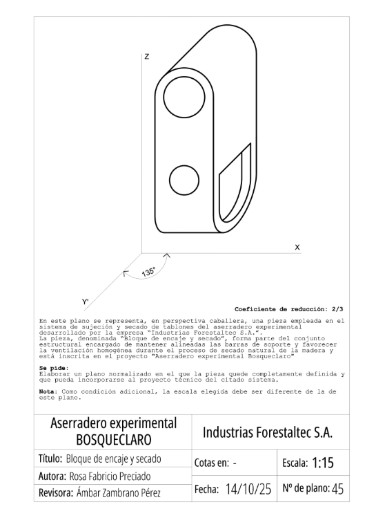

## Comparativa isométrica – caballera

:::: columns
::: {.column width="50%"}
::: {.fragment fragment-index="1"}
<svg viewBox="-18 -24 156 162" xmlns="http://www.w3.org/2000/svg" style="width:66%; display:block; margin:0 auto;">
<line x1="60" y1="54" x2="60" y2="-14.2" stroke="#d00000" stroke-width="2.2" stroke-opacity="0.85"/>
<line x1="60" y1="54" x2="130" y2="92.5" stroke="#d00000" stroke-width="2.2" stroke-opacity="0.85"/>
<line x1="60" y1="54" x2="-10" y2="92.5" stroke="#d00000" stroke-width="2.2" stroke-opacity="0.85"/>
<text x="65" y="-8" font-size="11" font-weight="700" fill="#d00000">Z'</text>
<text x="121" y="103" font-size="11" font-weight="700" fill="#d00000">X'</text>
<text x="-14" y="103" font-size="11" font-weight="700" fill="#d00000">Y'</text>
<line x1="60" y1="54" x2="60" y2="10" stroke="#1a1a1a" stroke-width="1.5" stroke-dasharray="4,3"/>
<line x1="60" y1="54" x2="20" y2="76" stroke="#1a1a1a" stroke-width="1.5" stroke-dasharray="4,3"/>
<line x1="60" y1="54" x2="100" y2="76" stroke="#1a1a1a" stroke-width="1.5" stroke-dasharray="4,3"/>
<line x1="60" y1="54" x2="20" y2="32" stroke="#1a1a1a" stroke-width="2"/>
<line x1="60" y1="54" x2="100" y2="32" stroke="#1a1a1a" stroke-width="2"/>
<line x1="60" y1="54" x2="60" y2="98" stroke="#1a1a1a" stroke-width="2"/>
<polygon points="60,10 100,32 100,76 60,98 20,76 20,32" fill="none" stroke="#1a1a1a" stroke-width="2.5"/>
</svg>

ISOMÉTRICA

Proyección <b>ortogonal</b>: los tres ejes a 120°, misma reducción (0,816) en los tres

:::
:::

::: {.column width="50%"}
::: {.fragment fragment-index="2"}
<svg viewBox="-28 -8 172 140" xmlns="http://www.w3.org/2000/svg" style="width:70%; display:block; margin:0 auto;">
<line x1="15" y1="100" x2="15" y2="2" stroke="#d00000" stroke-width="2.2" stroke-opacity="0.85"/>
<line x1="15" y1="100" x2="132" y2="100" stroke="#d00000" stroke-width="2.2" stroke-opacity="0.85"/>
<line x1="15" y1="100" x2="-20" y2="120" stroke="#d00000" stroke-width="2.2" stroke-opacity="0.85"/>
<text x="20" y="8" font-size="11" font-weight="700" fill="#d00000">Z</text>
<text x="124" y="95" font-size="11" font-weight="700" fill="#d00000">X</text>
<text x="-26" y="130" font-size="11" font-weight="700" fill="#d00000">Y'</text>
<line x1="53" y1="13" x2="53" y2="78" stroke="#1a1a1a" stroke-width="1.5" stroke-dasharray="4,3"/>
<line x1="53" y1="78" x2="118" y2="78" stroke="#1a1a1a" stroke-width="1.5" stroke-dasharray="4,3"/>
<line x1="15" y1="100" x2="53" y2="78" stroke="#1a1a1a" stroke-width="1.5" stroke-dasharray="4,3"/>
<polyline points="53,13 118,13 118,78" fill="none" stroke="#1a1a1a" stroke-width="2"/>
<line x1="15" y1="35" x2="53" y2="13" stroke="#1a1a1a" stroke-width="2"/>
<line x1="80" y1="35" x2="118" y2="13" stroke="#1a1a1a" stroke-width="2"/>
<line x1="80" y1="100" x2="118" y2="78" stroke="#1a1a1a" stroke-width="2"/>
<rect x="15" y="35" width="65" height="65" fill="none" stroke="#1a1a1a" stroke-width="2.5"/>
</svg>

CABALLERA

Proyección <b>oblicua</b>: la cara frontal (plano ZX) en verdadera magnitud; el eje Y' con ángulo y coeficiente propios

:::
:::
::::

## En el infinito = artificio

<svg viewBox="0 0 300 285" xmlns="http://www.w3.org/2000/svg" style="width:100%;">
<polygon points="8,258 78,208 292,208 222,258" fill="#d2b077" stroke="#1a1a1a" stroke-width="2"/>
<line x1="70" y1="45" x2="70" y2="252" stroke="#909090" stroke-width="1.2"/>
<line x1="205" y1="45" x2="205" y2="230" stroke="#909090" stroke-width="1.2"/>
<line x1="148" y1="45" x2="148" y2="256" stroke="#909090" stroke-width="1.2"/>
<polygon points="70,246 205,224 148,250" fill="#7d9ce0" stroke="#1a1a1a" stroke-width="2.5"/>
<polygon points="70,135 205,105 148,155" fill="#4a6096" stroke="#1a1a1a" stroke-width="2"/>
<text x="45" y="62" font-size="14" font-weight="700" fill="#1a1a1a">V</text>
<text x="14" y="78" font-size="10" fill="#1a1a1a">En el</text>
<text x="14" y="90" font-size="10" fill="#1a1a1a">infinito</text>
</svg>

Rayos <b>perpendiculares</b> al plano → <b>isométrica</b>

<svg viewBox="0 0 300 285" xmlns="http://www.w3.org/2000/svg" style="width:100%;">
<polygon points="8,258 78,208 292,208 222,258" fill="#d2b077" stroke="#1a1a1a" stroke-width="2"/>
<line x1="179" y1="52" x2="84" y2="235" stroke="#909090" stroke-width="1.2"/>
<line x1="287" y1="56" x2="192" y2="239" stroke="#909090" stroke-width="1.2"/>
<line x1="241" y1="86" x2="147" y2="267" stroke="#909090" stroke-width="1.2"/>
<polygon points="92,220 200,224 154,254" fill="#7d9ce0" stroke="#1a1a1a" stroke-width="2.5"/>
<polygon points="150,108 258,112 212,142" fill="#4a6096" stroke="#1a1a1a" stroke-width="2"/>
<text x="255" y="48" font-size="14" font-weight="700" fill="#1a1a1a">V</text>
<text x="296" y="60" font-size="10" fill="#1a1a1a" text-anchor="end">En el</text>
<text x="296" y="72" font-size="10" fill="#1a1a1a" text-anchor="end">infinito</text>
</svg>

Rayos <b>inclinados</b> respecto al plano → <b>caballera</b>

::: {.texto-azul style="text-align:center; font-size:0.68em; margin-top:0.5em;"}
En ambas el punto de vista está **en el infinito**; cambia la **orientación del plano del cuadro** y la **incidencia de los rayos** (ortogonal en isométrica, oblicua en caballera).
:::

## Características de la caballera

:::: columns
::: {.column width="46%"}
<svg viewBox="0 30 345 310" xmlns="http://www.w3.org/2000/svg" style="width:96%; display:block; margin:0 auto;">
<line x1="70" y1="250" x2="70" y2="55" stroke="#d00000" stroke-width="3"/>
<line x1="70" y1="250" x2="325" y2="250" stroke="#d00000" stroke-width="3"/>
<line x1="70" y1="250" x2="2.8" y2="317.2" stroke="#d00000" stroke-width="3"/>
<text x="54" y="66" font-size="16" font-weight="700" fill="#d00000">Z</text>
<text x="328" y="245" font-size="16" font-weight="700" fill="#d00000">X</text>
<text x="4" y="334" font-size="16" font-weight="700" fill="#d00000">Y'</text>
<line x1="120.9" y1="199.1" x2="120.9" y2="79.1" stroke="#075985" stroke-width="1.5" stroke-dasharray="4,3"/>
<line x1="120.9" y1="199.1" x2="240.9" y2="199.1" stroke="#075985" stroke-width="1.5" stroke-dasharray="4,3"/>
<line x1="70" y1="250" x2="120.9" y2="199.1" stroke="#075985" stroke-width="1.5" stroke-dasharray="4,3"/>
<polygon points="70,130 190,130 240.9,79.1 120.9,79.1" fill="#c9f2f7" stroke="#075985" stroke-width="2"/>
<polygon points="190,250 240.9,199.1 240.9,79.1 190,130" fill="#55c4d6" stroke="#075985" stroke-width="2"/>
<polygon points="70,250 190,250 190,130 70,130" fill="#8fe3ef" stroke="#075985" stroke-width="2"/>
<g class="fragment" data-fragment-index="2">
<polygon points="70,250 190,250 190,130 70,130" fill="#facc15" fill-opacity="0.3" stroke="#d97706" stroke-width="4"/>
<text x="130" y="196" font-size="14" font-weight="700" fill="#b45309" text-anchor="middle">plano ZX</text>
<text x="130" y="214" font-size="12" fill="#b45309" text-anchor="middle">verdadera magnitud</text>
</g>
</svg>
:::

::: {.column width="54%"}
::: {.texto-azul style="font-size:0.6em; margin-left:0.8em;"}
**¿Hay deformación en las magnitudes?**

Sí, pero **solo en el eje Y'**. En el plano formado por ZX no existe deformación.

::: {.fragment fragment-index="1"}
**¿Hay deformación en los ángulos?**

Sí, entre los ejes ZY' y XY'. **No entre ZX, que forman 90°.**
:::

::: {.fragment fragment-index="2"}
Todo lo que ocurre en el **plano ZX** está en **verdadera magnitud** porque está sobre el plano del cuadro: no existe deformación de magnitudes ni de ángulos.
:::
:::
:::
::::

## Resumen de características

:::: columns
::: {.column width="46%"}
<svg viewBox="0 30 345 310" xmlns="http://www.w3.org/2000/svg" style="width:96%; display:block; margin:0 auto;">
<line x1="70" y1="250" x2="70" y2="55" stroke="#d00000" stroke-width="3"/>
<line x1="70" y1="250" x2="325" y2="250" stroke="#d00000" stroke-width="3"/>
<line x1="70" y1="250" x2="2.8" y2="317.2" stroke="#d00000" stroke-width="3"/>
<text x="54" y="66" font-size="16" font-weight="700" fill="#d00000">Z</text>
<text x="328" y="245" font-size="16" font-weight="700" fill="#d00000">X</text>
<text x="4" y="334" font-size="16" font-weight="700" fill="#d00000">Y'</text>
<line x1="120.9" y1="199.1" x2="120.9" y2="79.1" stroke="#075985" stroke-width="1.5" stroke-dasharray="4,3"/>
<line x1="120.9" y1="199.1" x2="240.9" y2="199.1" stroke="#075985" stroke-width="1.5" stroke-dasharray="4,3"/>
<line x1="70" y1="250" x2="120.9" y2="199.1" stroke="#075985" stroke-width="1.5" stroke-dasharray="4,3"/>
<polygon points="70,130 190,130 240.9,79.1 120.9,79.1" fill="#c9f2f7" stroke="#075985" stroke-width="2"/>
<polygon points="190,250 240.9,199.1 240.9,79.1 190,130" fill="#55c4d6" stroke="#075985" stroke-width="2"/>
<polygon points="70,250 190,250 190,130 70,130" fill="#8fe3ef" stroke="#075985" stroke-width="2"/>
<path d="M 70 232 L 88 232 L 88 250" fill="none" stroke="#1a1a1a" stroke-width="1.6"/>
<text x="94" y="228" font-size="13" font-weight="700" fill="#1a1a1a">90°</text>
<path d="M 112.0 250.0 A 42 42 0 0 1 40.3 279.7" fill="none" stroke="#e8862c" stroke-width="2.5"/>
<text x="92" y="299" font-size="18" font-weight="700" fill="#e8862c" font-style="italic">φ</text>
</svg>
:::

::: {.column width="54%"}
::: {.texto-azul style="font-size:0.6em; margin-left:0.8em;"}
::: incremental
-   Los ejes **ZX forman 90°** y no hay deformación de magnitudes ni de ángulos: están en el plano del cuadro.
-   El eje **Y'** forma un ángulo **φ** que hay que definir (dato; por convenio se mide desde el eje X en sentido horario).
-   Sobre el eje Y' hay una deformación dada por el **coeficiente de reducción**: también es dato, y puede ser de reducción o de ampliación.
-   Por todo ello, el **ALZADO en caballera es SIEMPRE el plano ZX**.
:::
:::
:::
::::

## Posiciones de los ejes en caballera

<svg viewBox="-20 -15 185 185" xmlns="http://www.w3.org/2000/svg" style="width:88%;">
<line x1="45" y1="105" x2="45" y2="0" stroke="#d00000" stroke-width="2"/>
<line x1="45" y1="105" x2="160" y2="105" stroke="#d00000" stroke-width="2"/>
<line x1="45" y1="105" x2="17.5" y2="152.6" stroke="#d00000" stroke-width="2"/>
<text x="49" y="8" font-size="11" font-weight="700" fill="#d00000">Z</text>
<text x="152" y="100" font-size="11" font-weight="700" fill="#d00000">X</text>
<text x="4" y="160" font-size="11" font-weight="700" fill="#d00000">Y'</text>
<line x1="66" y1="-1.4" x2="66" y2="68.6" stroke="#1a1a1a" stroke-width="1.2" stroke-dasharray="4,3"/>
<line x1="66" y1="68.6" x2="136" y2="68.6" stroke="#1a1a1a" stroke-width="1.2" stroke-dasharray="4,3"/>
<line x1="45" y1="105" x2="66" y2="68.6" stroke="#1a1a1a" stroke-width="1.2" stroke-dasharray="4,3"/>
<rect x="45" y="35" width="70" height="70" fill="#8fe3ef" fill-opacity="0.7" stroke="#075985" stroke-width="2"/>
<line x1="66" y1="-1.4" x2="136" y2="-1.4" stroke="#1a1a1a" stroke-width="1.4"/>
<line x1="136" y1="-1.4" x2="136" y2="68.6" stroke="#1a1a1a" stroke-width="1.4"/>
<line x1="45" y1="35" x2="66" y2="-1.4" stroke="#1a1a1a" stroke-width="1.4"/>
<line x1="115" y1="35" x2="136" y2="-1.4" stroke="#1a1a1a" stroke-width="1.4"/>
<line x1="115" y1="105" x2="136" y2="68.6" stroke="#1a1a1a" stroke-width="1.4"/>
</svg>

X^Y' = <b>120°</b>

<svg viewBox="-20 -15 185 185" xmlns="http://www.w3.org/2000/svg" style="width:88%;">
<line x1="45" y1="105" x2="45" y2="0" stroke="#d00000" stroke-width="2"/>
<line x1="45" y1="105" x2="160" y2="105" stroke="#d00000" stroke-width="2"/>
<line x1="45" y1="105" x2="6.1" y2="143.9" stroke="#d00000" stroke-width="2"/>
<text x="49" y="8" font-size="11" font-weight="700" fill="#d00000">Z</text>
<text x="152" y="100" font-size="11" font-weight="700" fill="#d00000">X</text>
<text x="-8" y="152" font-size="11" font-weight="700" fill="#d00000">Y'</text>
<line x1="74.7" y1="5.3" x2="74.7" y2="75.3" stroke="#1a1a1a" stroke-width="1.2" stroke-dasharray="4,3"/>
<line x1="74.7" y1="75.3" x2="144.7" y2="75.3" stroke="#1a1a1a" stroke-width="1.2" stroke-dasharray="4,3"/>
<line x1="45" y1="105" x2="74.7" y2="75.3" stroke="#1a1a1a" stroke-width="1.2" stroke-dasharray="4,3"/>
<rect x="45" y="35" width="70" height="70" fill="#8fe3ef" fill-opacity="0.7" stroke="#075985" stroke-width="2"/>
<line x1="74.7" y1="5.3" x2="144.7" y2="5.3" stroke="#1a1a1a" stroke-width="1.4"/>
<line x1="144.7" y1="5.3" x2="144.7" y2="75.3" stroke="#1a1a1a" stroke-width="1.4"/>
<line x1="45" y1="35" x2="74.7" y2="5.3" stroke="#1a1a1a" stroke-width="1.4"/>
<line x1="115" y1="35" x2="144.7" y2="5.3" stroke="#1a1a1a" stroke-width="1.4"/>
<line x1="115" y1="105" x2="144.7" y2="75.3" stroke="#1a1a1a" stroke-width="1.4"/>
</svg>

X^Y' = <b>135°</b>

<svg viewBox="-20 -15 185 185" xmlns="http://www.w3.org/2000/svg" style="width:88%;">
<line x1="45" y1="105" x2="45" y2="0" stroke="#d00000" stroke-width="2"/>
<line x1="45" y1="105" x2="160" y2="105" stroke="#d00000" stroke-width="2"/>
<line x1="45" y1="105" x2="-2.6" y2="132.5" stroke="#d00000" stroke-width="2"/>
<text x="49" y="8" font-size="11" font-weight="700" fill="#d00000">Z</text>
<text x="152" y="100" font-size="11" font-weight="700" fill="#d00000">X</text>
<text x="-16" y="141" font-size="11" font-weight="700" fill="#d00000">Y'</text>
<line x1="81.4" y1="14" x2="81.4" y2="84" stroke="#1a1a1a" stroke-width="1.2" stroke-dasharray="4,3"/>
<line x1="81.4" y1="84" x2="151.4" y2="84" stroke="#1a1a1a" stroke-width="1.2" stroke-dasharray="4,3"/>
<line x1="45" y1="105" x2="81.4" y2="84" stroke="#1a1a1a" stroke-width="1.2" stroke-dasharray="4,3"/>
<rect x="45" y="35" width="70" height="70" fill="#8fe3ef" fill-opacity="0.7" stroke="#075985" stroke-width="2"/>
<line x1="81.4" y1="14" x2="151.4" y2="14" stroke="#1a1a1a" stroke-width="1.4"/>
<line x1="151.4" y1="14" x2="151.4" y2="84" stroke="#1a1a1a" stroke-width="1.4"/>
<line x1="45" y1="35" x2="81.4" y2="14" stroke="#1a1a1a" stroke-width="1.4"/>
<line x1="115" y1="35" x2="151.4" y2="14" stroke="#1a1a1a" stroke-width="1.4"/>
<line x1="115" y1="105" x2="151.4" y2="84" stroke="#1a1a1a" stroke-width="1.4"/>
</svg>

X^Y' = <b>150°</b>

::: {.texto-azul style="font-size:0.62em; text-align:center; margin-top:0.6em;"}
El mismo cubo con distintas posiciones del eje Y': cambia **cuánto se ve** de las caras laterales y superior.
:::

::: {.fragment .texto-azul style="font-size:0.55em; text-align:center;"}
Ojo: en muchos libros los ángulos se miden en sentido trigonométrico (antihorario). **Nosotros medimos φ partiendo de X, positivo en el sentido de las agujas del reloj.**
:::

## La circunferencia en caballera

:::: columns
::: {.column width="46%"}
<svg viewBox="0 30 345 310" xmlns="http://www.w3.org/2000/svg" style="width:96%; display:block; margin:0 auto;">
<line x1="70" y1="250" x2="70" y2="55" stroke="#d00000" stroke-width="2"/>
<line x1="70" y1="250" x2="325" y2="250" stroke="#d00000" stroke-width="2"/>
<line x1="70" y1="250" x2="2.8" y2="317.2" stroke="#d00000" stroke-width="2"/>
<text x="54" y="66" font-size="15" font-weight="700" fill="#d00000">Z</text>
<text x="328" y="245" font-size="15" font-weight="700" fill="#d00000">X</text>
<text x="4" y="334" font-size="15" font-weight="700" fill="#d00000">Y'</text>
<polygon points="70,130 190,130 240.9,79.1 120.9,79.1" fill="#c9f2f7" stroke="#075985" stroke-width="2"/>
<polygon points="190,250 240.9,199.1 240.9,79.1 190,130" fill="#55c4d6" stroke="#075985" stroke-width="2"/>
<polygon points="70,250 190,250 190,130 70,130" fill="#8fe3ef" stroke="#075985" stroke-width="2"/>
<g class="fragment" data-fragment-index="1">
<circle cx="130" cy="190" r="54" fill="none" stroke="#7a1fa2" stroke-width="3"/>
<line x1="76" y1="190" x2="184" y2="190" stroke="#7a1fa2" stroke-width="1.2" stroke-dasharray="4,3"/>
<line x1="130" y1="136" x2="130" y2="244" stroke="#7a1fa2" stroke-width="1.2" stroke-dasharray="4,3"/>
</g>
<g class="fragment" data-fragment-index="2">
<circle cx="0" cy="0" r="0.45" transform="matrix(120,0,50.9,-50.9,155.5,104.6)" fill="none" stroke="#c026d3" stroke-width="2.5" vector-effect="non-scaling-stroke"/>
<circle cx="0" cy="0" r="0.45" transform="matrix(50.9,-50.9,0,-120,215.5,164.6)" fill="none" stroke="#c026d3" stroke-width="2.5" vector-effect="non-scaling-stroke"/>
</g>
</svg>
:::

::: {.column width="54%"}
::: {.texto-azul style="font-size:0.65em; margin-top:1.2em;"}
::: {.fragment fragment-index="1"}
Es una **circunferencia** cuando está en el plano ZX (o en uno paralelo), y puedo medir directamente.
:::

::: {.fragment fragment-index="2"}
Es una **elipse** cuando está en el plano ZY' o XY', y tengo que llevar puntos como en isométrica.
:::
:::
:::
::::

## Medir en perspectiva caballera

:::: columns
::: {.column width="46%"}
<svg viewBox="0 30 345 310" xmlns="http://www.w3.org/2000/svg" style="width:96%; display:block; margin:0 auto;">
<line x1="70" y1="250" x2="70" y2="55" stroke="#d00000" stroke-width="2"/>
<line x1="70" y1="250" x2="325" y2="250" stroke="#d00000" stroke-width="2"/>
<line x1="70" y1="250" x2="2.8" y2="317.2" stroke="#d00000" stroke-width="2"/>
<text x="54" y="66" font-size="15" font-weight="700" fill="#d00000">Z</text>
<text x="328" y="245" font-size="15" font-weight="700" fill="#d00000">X</text>
<text x="4" y="334" font-size="15" font-weight="700" fill="#d00000">Y'</text>
<polygon points="70,130 190,130 240.9,79.1 120.9,79.1" fill="#c9f2f7" stroke="#075985" stroke-width="2"/>
<polygon points="190,250 240.9,199.1 240.9,79.1 190,130" fill="#55c4d6" stroke="#075985" stroke-width="2"/>
<polygon points="70,250 190,250 190,130 70,130" fill="#8fe3ef" stroke="#075985" stroke-width="2"/>
<g class="fragment" data-fragment-index="1">
<line x1="100" y1="130" x2="160" y2="130" stroke="#d00000" stroke-width="2" stroke-dasharray="6,4"/>
<line x1="160" y1="130" x2="210.9" y2="79.1" stroke="#0f766e" stroke-width="2" stroke-dasharray="6,4"/>
<line x1="100" y1="130" x2="210.9" y2="79.1" stroke="#1a1a1a" stroke-width="3"/>
<circle cx="100" cy="130" r="3.6" fill="#fff" stroke="#1a1a1a" stroke-width="1.6"/>
<circle cx="210.9" cy="79.1" r="3.6" fill="#fff" stroke="#1a1a1a" stroke-width="1.6"/>
<text x="86" y="124" font-size="15" font-weight="700">A</text>
<text x="217" y="76" font-size="15" font-weight="700">B</text>
<text x="124" y="146" font-size="14" font-weight="700" fill="#d00000" font-style="italic">m</text>
<text x="194" y="106" font-size="14" font-weight="700" fill="#0f766e" font-style="italic">n</text>
</g>
<g class="fragment" data-fragment-index="2">
<line x1="95" y1="225" x2="165" y2="155" stroke="#c026d3" stroke-width="3"/>
<circle cx="95" cy="225" r="3.6" fill="#fff" stroke="#1a1a1a" stroke-width="1.6"/>
<circle cx="165" cy="155" r="3.6" fill="#fff" stroke="#1a1a1a" stroke-width="1.6"/>
<text x="80" y="238" font-size="15" font-weight="700">P</text>
<text x="171" y="152" font-size="15" font-weight="700">Q</text>
</g>
</svg>
:::

::: {.column width="54%"}
::: {.texto-azul style="font-size:0.58em; margin-left:0.8em;"}
**¿Puedo medir en caballera?**

-   En el **plano ZX puedo medir todo**: está en verdadera magnitud y sin deformación de ángulos.
-   En los planos ZY' o XY' debo medir **llevando magnitudes sobre los ejes**, como en isométrica. Sobre Z y sobre X no hay deformación.

::: {.fragment fragment-index="1"}
**¿Cómo mido el segmento AB?** IGUAL QUE EN ISOMÉTRICA: descomponiéndolo en sus proyecciones **m** (paralela a X, sin deformación) y **n** (paralela a Y', con su coeficiente), y uniendo los extremos.
:::

::: {.fragment fragment-index="2"}
**¿Cómo mido el segmento PQ (contenido en ZX)?** **Directamente**: tanto magnitud como ángulo.
:::
:::
:::
::::

## Evaluable — Sacapuntas

:::: columns
::: {.column width="45%"}

:::

::: {.column width="55%"}
::: {.texto-azul style="font-size:0.65em; margin-top:1.5em;"}
**¿Tengo que medir?**

Sí: todo lo necesario para definir la pieza.

::: fragment
**Atención a la escala del plano**: se pide un plano con varias escalas, pero se da un plano a otra escala.
:::
:::
:::
::::
