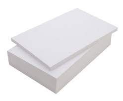
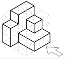
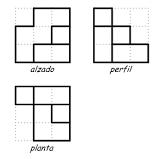
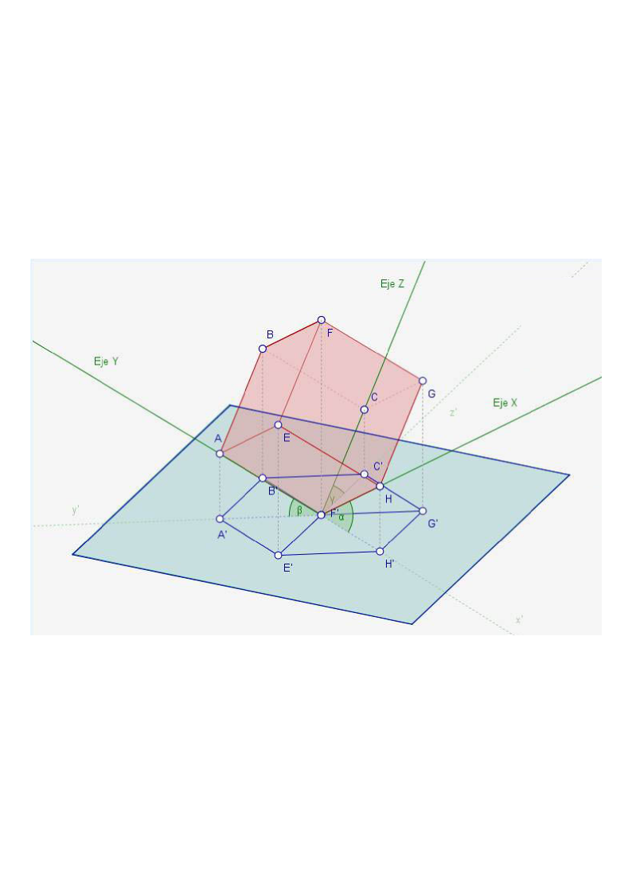
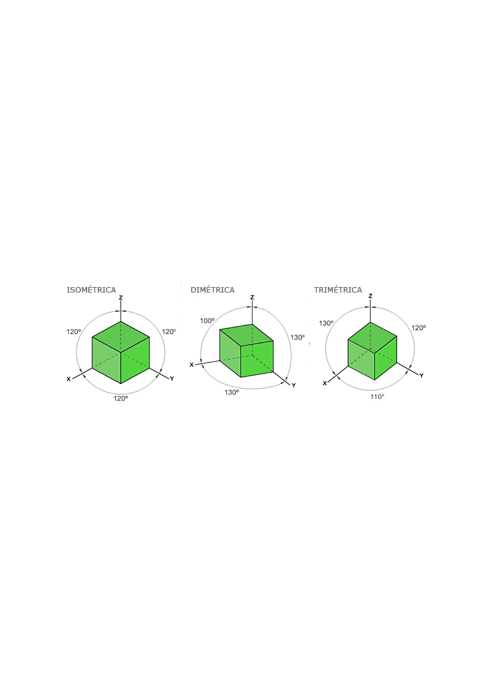
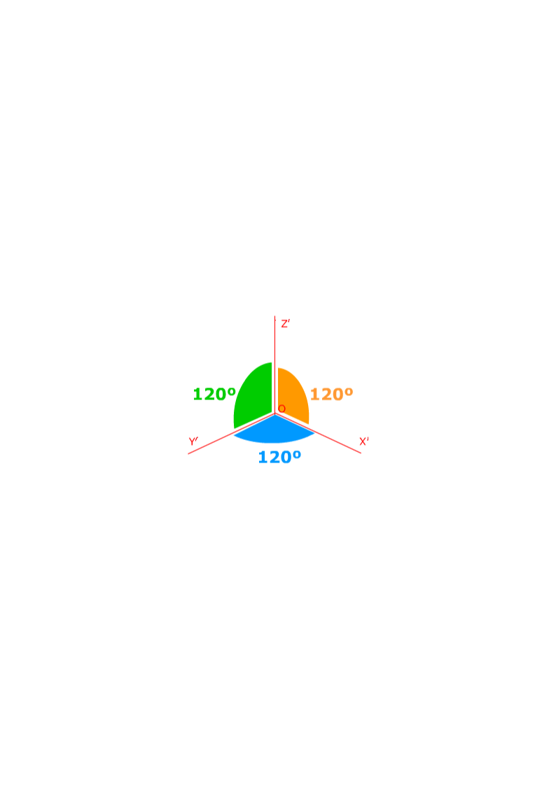
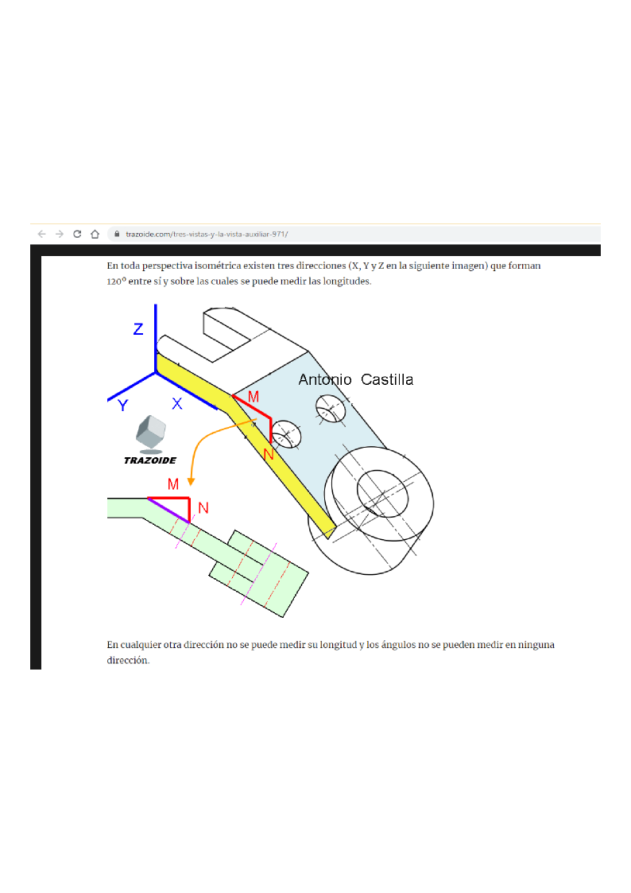
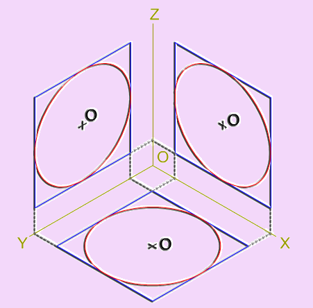
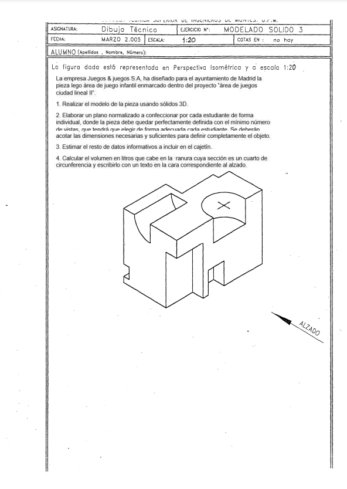

## Representar el mundo en papel

::: {.texto-azul style="font-size:0.8em;"}
-   **1 vista deformada** = perspectivas
-   **Muchas vistas en verdadera magnitud** = diédrico
:::

## El sistema axonométrico

## La deformación

:::: columns
::: {.column width="55%"}

:::

::: {.column width="45%"}
::: {.texto-azul style="font-size:0.72em; margin-left:0.8em; margin-top:1.5em;"}
Al proyectar el triedro de ejes sobre el plano del cuadro:

::: incremental
-   Hay **deformación en las magnitudes**
-   Hay **deformación en los ángulos**
:::
:::
:::
::::

## El sistema axonométrico — Isométrico

:::: columns
::: {.column width="50%"}

:::

::: {.column width="50%"}
::: {.texto-azul style="font-size:0.62em; margin-left:0.8em;"}
::: incremental
-   Los 3 ángulos son **iguales entre sí** y por tanto iguales a **120°**
-   Los ángulos de 120° **representan ángulos de 90°** (los tres ejes son perpendiculares entre sí)
-   La deformación en los tres ejes X', Y', Z' **es la misma = 0,816**
-   **Se conserva el paralelismo**: dos rectas paralelas en la realidad son paralelas en la perspectiva
:::
:::
:::
::::

## Medir en perspectiva isométrica

:::: columns
::: {.column width="45%"}
<svg viewBox="0 0 400 320" style="width:95%; display:block; margin:10px auto;">
<defs>
<marker id="ejeiso" markerWidth="8" markerHeight="8" refX="6" refY="4" orient="auto"><path d="M0,0 L8,4 L0,8 Z" fill="#2d2d8a"/></marker>
</defs>
<!-- ejes isométricos -->
<line x1="200" y1="160" x2="200" y2="30" stroke="#2d2d8a" stroke-width="2" marker-end="url(#ejeiso)"/>
<line x1="200" y1="160" x2="340" y2="241" stroke="#2d2d8a" stroke-width="2" marker-end="url(#ejeiso)"/>
<line x1="200" y1="160" x2="60" y2="241" stroke="#2d2d8a" stroke-width="2" marker-end="url(#ejeiso)"/>
<text x="205" y="28" font-size="20" fill="#2d2d8a" font-style="italic">Z'</text>
<text x="344" y="250" font-size="20" fill="#2d2d8a" font-style="italic">X'</text>
<text x="48" y="250" font-size="20" fill="#2d2d8a" font-style="italic">Y'</text>
<!-- rombo del plano X'Y' -->
<polygon points="200,160 321,230 200,300 79,230" fill="#eef4fb" stroke="#9db8d8" stroke-width="1"/>
<!-- segmento AB y componentes -->
<line x1="224" y1="174" x2="284" y2="209" stroke="#d00000" stroke-width="1.5" stroke-dasharray="6 4"/>
<line x1="284" y1="209" x2="212" y2="251" stroke="#d00000" stroke-width="1.5" stroke-dasharray="6 4"/>
<line x1="224" y1="174" x2="212" y2="251" stroke="#1a1a1a" stroke-width="2.5"/>
<circle cx="224" cy="174" r="4" fill="#1a1a1a"/>
<circle cx="212" cy="251" r="4" fill="#1a1a1a"/>
<text x="230" y="168" font-size="20" font-weight="bold">A</text>
<text x="216" y="274" font-size="20" font-weight="bold">B</text>
<text x="262" y="182" font-size="19" fill="#d00000" font-style="italic">m</text>
<text x="258" y="242" font-size="19" fill="#d00000" font-style="italic">n</text>
</svg>
:::

::: {.column width="55%"}
::: {.texto-azul style="font-size:0.62em;"}
**¿Puedo medir en isométrica?**

Solo en direcciones **paralelas a los ejes** X' Y' Z', y sabiendo que lo que mido está reducido por 0,816.

::: fragment
**¿Cómo mido el segmento AB?**

Descomponiéndolo en sus proyecciones sobre el eje X' e Y' y midiendo las magnitudes **m** y **n**. Luego uniré los extremos de m y n para obtener el segmento AB.
:::
:::
:::
::::

## Medir en perspectiva isométrica — Ejemplo

[Para saber más: [trazoide.com — tres vistas y la vista auxiliar](https://trazoide.com/tres-vistas-y-la-vista-auxiliar-971/)]{style="font-size:0.55em;"}

## Medir en perspectiva isométrica — Curvas

:::: columns
::: {.column width="45%"}

:::

::: {.column width="55%"}
::: {.texto-azul style="font-size:0.6em;"}
Las circunferencias, al ser proyectadas, **se transforman en elipses**.

::: fragment
**¿Por qué sé que es una circunferencia?** Porque a = b (está inscrita en la proyección de un cuadrado).
:::

::: fragment
**¿Cómo encuentro el centro?** En el cruce de las dos diagonales.
:::

::: fragment
**¿Cómo mido el radio?** No mido radio sino **diámetro**.
:::
:::
:::
::::

## Práctica 4.1-1 — Pieza Lego

:::: columns
::: {.column width="45%"}

:::

::: {.column width="55%"}
::: {.texto-azul style="font-size:0.62em;"}
**¿Tengo que medir?**

SÍ. Efectivamente, puedo medir sobre los ejes aplicando el coeficiente de reducción. Considero que la hoja en blanco es un A4.

::: fragment
**¿A qué escala está?**

Tengo un plano con un cajetín: la escala a la que está ese dibujo está indicada en el plano.
:::
:::
:::
::::
